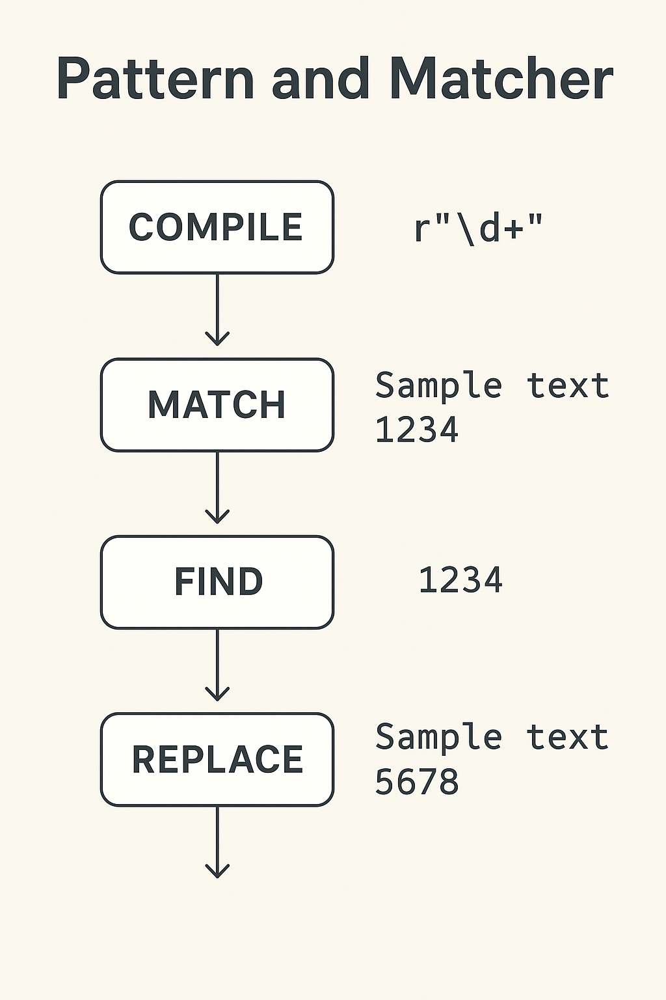

---

# **Lesson Notes: Java Regular Expressions — `Pattern` and `Matcher` Classes**

---

## **1. Introduction to Regular Expressions**

A **Regular Expression (regex)** is a sequence of characters that defines a search pattern.
In Java, regex operations are handled primarily by two classes in the `java.util.regex` package:

* **`Pattern`** — Compiles a regular expression into a reusable object.
* **`Matcher`** — Applies the compiled pattern to a text input to search, match, or replace.

---

## **2. The `Pattern` Class**

### **Definition**

`Pattern` is a **final** class that represents a compiled form of a regular expression.
You use it to define the pattern that will be matched against a given text.

### **Key Features**

* Immutable and thread-safe.
* Compiled once and can be reused.
* Part of `java.util.regex` package.
* Implements `Serializable`.

### **Class Declaration**

```java
public final class Pattern extends Object implements Serializable
```

---

## **3. Creating a Pattern**

### **Using `Pattern.compile()`**

```java
Pattern pattern = Pattern.compile("a*b");
```

This compiles the regex `"a*b"` into a `Pattern` object that matches:

* `b`
* `ab`
* `aab`
* `aaab`, etc.

### **Using Flags**

Flags modify regex behavior. You can combine multiple flags using `|`.

```java
Pattern pattern = Pattern.compile("java", Pattern.CASE_INSENSITIVE | Pattern.UNICODE_CASE);
```

This pattern will match `"java"`, `"Java"`, or `"JAVA"` (case-insensitive and Unicode-aware).

---

## **4. Common Pattern Flags**

| Constant                          | Description                                              |
| --------------------------------- | -------------------------------------------------------- |
| `Pattern.CASE_INSENSITIVE`        | Ignores case when matching.                              |
| `Pattern.MULTILINE`               | `^` and `$` match at line boundaries.                    |
| `Pattern.DOTALL`                  | Makes `.` match line terminators.                        |
| `Pattern.LITERAL`                 | Treats regex as literal text (no metacharacter meaning). |
| `Pattern.UNICODE_CASE`            | Enables Unicode-aware case folding.                      |
| `Pattern.UNIX_LINES`              | Only `\n` is treated as a line terminator.               |
| `Pattern.COMMENTS`                | Allows comments and whitespace in regex.                 |
| `Pattern.UNICODE_CHARACTER_CLASS` | Uses Unicode character classes (`\p{L}`, etc.).          |

---

## **5. Useful `Pattern` Methods**

| Method                                                     | Description                                    |
| ---------------------------------------------------------- | ---------------------------------------------- |
| `static Pattern compile(String regex)`                     | Compiles regex into a `Pattern`.               |
| `static Pattern compile(String regex, int flags)`          | Compiles with specific flags.                  |
| `Matcher matcher(CharSequence input)`                      | Creates a `Matcher` for this pattern.          |
| `static boolean matches(String regex, CharSequence input)` | Checks if input matches regex once (no reuse). |
| `String[] split(CharSequence input)`                       | Splits a string around pattern matches.        |
| `String pattern()`                                         | Returns regex as a string.                     |
| `int flags()`                                              | Returns numeric flag representation.           |

---

### **Example 1 — Using `Pattern` with `Matcher`**

```java
import java.util.regex.*;

public class PatternExample {
    public static void main(String[] args) {
        Pattern p = Pattern.compile("a*b");
        Matcher m = p.matcher("aaaaab");
        boolean result = m.matches();
        System.out.println(result);  // true
    }
}
```

---

### **Example 2 — One-liner `Pattern.matches()`**

```java
boolean result = Pattern.matches("a*b", "aaaaab");
System.out.println(result); // true
```

This is equivalent to compiling and matching in one step but is less efficient for repeated use.

---

### **Example 3 — Using `split()`**

```java
Pattern p = Pattern.compile("\\s");
String text = "John Mary Alex";
String[] names = p.split(text);

for (String name : names) {
    System.out.println(name);
}
```

**Output:**

```
John
Mary
Alex
```

---

## **6. The `Matcher` Class**

### **Definition**

A `Matcher` object interprets a compiled `Pattern` and applies it to a given text sequence.
It performs operations like **searching**, **matching**, and **replacing**.

### **Class Declaration**

```java
public final class Matcher extends Object implements MatchResult
```

---

### **Creating a Matcher**

```java
Pattern pattern = Pattern.compile("cat");
Matcher matcher = pattern.matcher("one cat two cats in the yard");
```

---

## **7. Common `Matcher` Methods**

| Method                                    | Description                                       |
| ----------------------------------------- | ------------------------------------------------- |
| `boolean matches()`                       | Tests if the *entire* input matches the pattern.  |
| `boolean lookingAt()`                     | Tests if the input *starts* with the pattern.     |
| `boolean find()`                          | Searches for the *next* subsequence that matches. |
| `String group()`                          | Returns the text that was matched.                |
| `int start()` / `int end()`               | Return start and end indexes of the match.        |
| `int groupCount()`                        | Returns number of capturing groups.               |
| `String replaceAll(String replacement)`   | Replaces all matches.                             |
| `String replaceFirst(String replacement)` | Replaces the first match only.                    |
| `Matcher reset()`                         | Resets matcher for new searches.                  |

---

### **Example 4 — Using `find()` and `group()`**

```java
import java.util.regex.*;

public class MatcherExample {
    public static void main(String[] args) {
        Pattern p = Pattern.compile("cat");
        Matcher m = p.matcher("one cat two cats in the yard");

        while (m.find()) {
            System.out.println("Found: " + m.group() +
                               " at index " + m.start());
        }
    }
}
```

**Output:**

```
Found: cat at index 4
Found: cat at index 12
```

---

### **Example 5 — `matches()` vs `lookingAt()`**

```java
Pattern p = Pattern.compile("java");
Matcher m1 = p.matcher("java programming");
Matcher m2 = p.matcher("I like java");

System.out.println(m1.lookingAt()); // true (starts with "java")
System.out.println(m1.matches());   // false (whole text not "java")
System.out.println(m2.lookingAt()); // false
```

---

### **Example 6 — Replacing Text**

```java
Pattern p = Pattern.compile("cat");
Matcher m = p.matcher("one cat two cats in the yard");
String replaced = m.replaceAll("dog");

System.out.println(replaced);
```

**Output:**

```
one dog two dogs in the yard
```

---

### **Example 7 — Capturing Groups**

```java
Pattern p = Pattern.compile("(\\d{3})-(\\d{2})-(\\d{4})");
Matcher m = p.matcher("My SSN is 123-45-6789");

if (m.find()) {
    System.out.println("Group 1: " + m.group(1)); // 123
    System.out.println("Group 2: " + m.group(2)); // 45
    System.out.println("Group 3: " + m.group(3)); // 6789
}
```

---

### **Example 8 — Using `replaceFirst()`**

```java
Pattern p = Pattern.compile("dog");
Matcher m = p.matcher("dog dog dog");
String result = m.replaceFirst("cat");
System.out.println(result);
```

**Output:**

```
cat dog dog
```

---

### **Example 9 — Using `appendReplacement()` and `appendTail()`**

```java
Pattern p = Pattern.compile("cat");
Matcher m = p.matcher("one cat two cats in the yard");
StringBuffer sb = new StringBuffer();

while (m.find()) {
    m.appendReplacement(sb, "dog");
}
m.appendTail(sb);

System.out.println(sb.toString());
```

**Output:**

```
one dog two dogs in the yard
```

---

## **8. `Pattern` vs. `Matcher` — Summary Table**

| Feature     | `Pattern`                      | `Matcher`                           |
| ----------- | ------------------------------ | ----------------------------------- |
| Purpose     | Defines regex syntax           | Applies regex to a string           |
| Created By  | `Pattern.compile()`            | `pattern.matcher(input)`            |
| Reusable    | Yes                            | No (bound to one input)             |
| Thread-safe | Yes                            | No                                  |
| Examples    | `Pattern.matches()`, `split()` | `find()`, `group()`, `replaceAll()` |

---

## **9. Best Practices**

- ✅ **Reuse `Pattern` objects** for efficiency when performing repeated matches.
- ✅ Use **`matches()`** for whole-text matches, and **`find()`** for substring searches.
- ✅ Prefer **`replaceAll()`** or **`replaceFirst()`** for text replacement tasks.
- ✅ Be careful with **escape sequences** — always double backslashes in Java strings.
- ✅ For complex replacements, use **`appendReplacement()`** and **`appendTail()`**.
- ✅ Combine **flags** using `|` to fine-tune regex behavior.

---

## **10. Example: Full Demonstration**

```java
import java.util.regex.*;

public class RegexLesson {
    public static void main(String[] args) {
        String text = "Java is fun. I love java and JAVA.";

        // Compile pattern with flags
        Pattern pattern = Pattern.compile("java", Pattern.CASE_INSENSITIVE);
        Matcher matcher = pattern.matcher(text);

        // Find occurrences
        while (matcher.find()) {
            System.out.println("Found: " + matcher.group() +
                               " at index " + matcher.start());
        }

        // Replace all matches
        String result = matcher.replaceAll("Python");
        System.out.println("After replacement: " + result);
    }
}
```

**Output:**

```
Found: Java at index 0
Found: java at index 17
Found: JAVA at index 27
After replacement: Python is fun. I love Python and Python.
```

---

## 🧭 **Summary**

| Concept        | Key Idea                                                        |
| -------------- | --------------------------------------------------------------- |
| `Pattern`      | Compiles regex into an object for reuse.                        |
| `Matcher`      | Applies pattern to an input string for search and manipulation. |
| Flags          | Modify regex behavior (e.g., case-insensitive, multiline).      |
| `find()`       | Finds next match in the input.                                  |
| `matches()`    | Checks if the entire input matches.                             |
| `replaceAll()` | Replaces all matches with new text.                             |
| `group()`      | Retrieves matched substring or capturing group.                 |

---

How `Pattern` and `Matcher` interact — e.g., “Compile → Match → Find → Replace” with examples of each method

