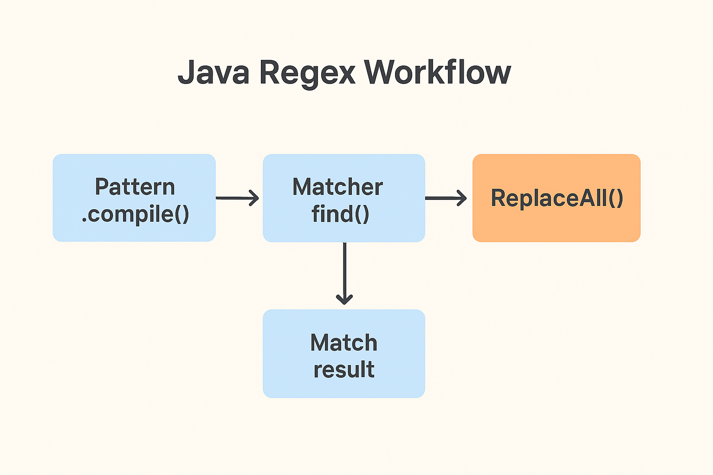

---

# **Lesson Notes: Regular Expressions (Regex) in Java**

---

## **1. Introduction**

A **Regular Expression** (or **Regex**) is a **sequence of characters** that defines a **search pattern** in text.
It is used for:

* **Finding and replacing** text
* **Validating input**
* **Extracting** specific patterns (like email addresses, phone numbers, or dates)

In Java, regex is supported through the **`java.util.regex`** package, which provides the classes:

* `Pattern` — compiles the regex
* `Matcher` — performs search and manipulation
* `PatternSyntaxException` — handles syntax errors in regex patterns

---

## **2. Historical Background**

The concept of regular expressions originated in the **1950s**, formalized by mathematician **Stephen Cole Kleene**.
It became widely used in **Unix** tools like `grep`, `sed`, and `awk`.
Today, almost all programming languages, including Java, Python, and JavaScript, support regular expressions.

---

## **3. Basic Structure of Regex in Java**

A regular expression in Java is represented as a **string literal**, for example:

```java
String regex = "java";
String regex = "\\d{3}"; // matches exactly three digits
```

---

### **Creating and Using Regex**

To use regex in Java:

1. **Write the regex pattern** as a string.
2. **Compile** it into a `Pattern` object.
3. **Create** a `Matcher` object to apply it to a text.

Example:

```java
import java.util.regex.*;

public class SimpleRegex {
    public static void main(String[] args) {
        Pattern pattern = Pattern.compile("java", Pattern.CASE_INSENSITIVE);
        Matcher matcher = pattern.matcher("I love Java programming!");
        boolean matchFound = matcher.find();
        System.out.println("Match found: " + matchFound);
    }
}
```

**Output:**

```
Match found: true
```

---

## **4. Regular Expression Syntax**

### **4.1. Boundary Matchers**

| Metacharacter | Description       |
| ------------- | ----------------- |
| `^`           | Start of line     |
| `$`           | End of line       |
| `\b`          | Word boundary     |
| `\B`          | Non-word boundary |
| `\A`          | Start of input    |
| `\Z` / `\z`   | End of input      |

---

### **4.2. Character Classes**

| Pattern | Description                                  |
| ------- | -------------------------------------------- |
| `\d`    | Digit (0–9)                                  |
| `\D`    | Non-digit                                    |
| `\s`    | Whitespace                                   |
| `\S`    | Non-whitespace                               |
| `\w`    | Word character (letters, digits, underscore) |
| `\W`    | Non-word character                           |
| `.`     | Any character except newline                 |

---

### **4.3. Character Sets**

| Pattern       | Description                             |
| ------------- | --------------------------------------- |
| `[abc]`       | Matches a, b, or c                      |
| `[^abc]`      | Matches any character except a, b, or c |
| `[a-z]`       | Matches lowercase letters a–z           |
| `[A-Za-z0-9]` | Matches alphanumeric characters         |

---

### **4.4. Quantifiers**

| Quantifier | Description           |
| ---------- | --------------------- |
| `?`        | Zero or one time      |
| `*`        | Zero or more times    |
| `+`        | One or more times     |
| `{n}`      | Exactly n times       |
| `{n,}`     | At least n times      |
| `{n,m}`    | Between n and m times |

---

## **5. Greedy, Reluctant, and Possessive Quantifiers**

Regular expressions can behave differently based on quantifier type.

### **Example:**

```java
String text = "Fred Anna Alexander";
Pattern pattern = Pattern.compile("A.+a");
Matcher matcher = pattern.matcher(text);

while (matcher.find()) {
    System.out.println(text.substring(matcher.start(), matcher.end()));
}
```

**Output (Greedy):**

```
Anna Alexa
```

---

### **Reluctant Quantifier (`+?`)**

Searches for the **shortest** possible match.

```java
Pattern pattern = Pattern.compile("A.+?a");
```

**Output:**

```
Anna
Alexa
```

---

### **Possessive Quantifier (`++`)**

Does not backtrack — tries to match as much as possible and stops.

```java
Pattern pattern = Pattern.compile("A.++a");
```

**Output:**

```
(no match)
```

---

## **6. Escaping in Regex**

In Java, backslashes (`\`) are **escape characters**.
Since regex also uses backslashes, they must be **doubled** in Java strings.

| To Match      | Write as |
| ------------- | -------- |
| Whitespace    | `"\\s"`  |
| A literal `?` | `"\\?"`  |
| A literal `"` | `"\\\""` |

Example:

```java
String regex = "How\\?";
Pattern pattern = Pattern.compile(regex);
Matcher matcher = pattern.matcher("How?");
System.out.println(matcher.find()); // true
```

---

## **7. Pattern Class Methods**

| Method                                      | Description                             |
| ------------------------------------------- | --------------------------------------- |
| `compile(String regex)`                     | Compiles the regex into a `Pattern`     |
| `compile(String regex, int flags)`          | Compiles with additional matching flags |
| `matcher(CharSequence input)`               | Creates a Matcher for this pattern      |
| `matches(String regex, CharSequence input)` | Tests if regex matches entire input     |
| `pattern()`                                 | Returns the original regex string       |
| `split(CharSequence input, int limit)`      | Splits text into array using regex      |

---

### **Example: Using `split()`**

```java
String text = "Fred Anna Alexa";
Pattern pattern = Pattern.compile("\\s");
String[] parts = pattern.split(text, 2);

for (String part : parts) {
    System.out.println(part);
}
```

**Output:**

```
Fred
Anna Alexa
```

---

## **8. Matcher Class Methods**

| Method                             | Description                      |
| ---------------------------------- | -------------------------------- |
| `matches()`                        | Checks if entire input matches   |
| `find()`                           | Finds next match                 |
| `find(int start)`                  | Finds match starting at position |
| `start()` / `end()`                | Return indices of match          |
| `group()`                          | Returns matched substring        |
| `replaceAll(String replacement)`   | Replaces all matches             |
| `replaceFirst(String replacement)` | Replaces first match             |

---

### **Example: Using `Matcher` Methods**

```java
String text = "Fred Anna Alexa";
Pattern pattern = Pattern.compile("A.+?a");
Matcher matcher = pattern.matcher(text);

while (matcher.find()) {
    System.out.println("Match: " + text.substring(matcher.start(), matcher.end()));
}

System.out.println(matcher.replaceFirst("Ira"));
System.out.println(matcher.replaceAll("Mary"));
```

**Output:**

```
Match: Anna
Match: Alexa
Fred Ira Alexa
Fred Mary Mary
```

---

## **9. Practical Regex Examples**

### **(1) Match Letters Only**

```java
String pattern = "^[A-Za-z]+$";
System.out.println(Pattern.matches(pattern, "HelloWorld")); // true
```

---

### **(2) Match Digits Only**

```java
String pattern = "^\\d+$";
System.out.println(Pattern.matches(pattern, "12345")); // true
```

---

### **(3) Match Email Format**

```java
String pattern = "^[A-Za-z0-9._%+-]+@[A-Za-z0-9.-]+\\.[A-Za-z]{2,}$";
System.out.println(Pattern.matches(pattern, "hello@example.com")); // true
```

---

### **(4) Match Words Containing "apple"**

```java
String regexPattern = "(.*)apple(.*)";
String text = "An apple a day keeps the doctor away.";
System.out.println(Pattern.matches(regexPattern, text)); // true
```

---

## **10. Common Regex Flags in Java**

| Flag                       | Description                          |
| -------------------------- | ------------------------------------ |
| `Pattern.CASE_INSENSITIVE` | Ignores case while matching          |
| `Pattern.MULTILINE`        | `^` and `$` match at line boundaries |
| `Pattern.DOTALL`           | Makes `.` match newline              |
| `Pattern.UNICODE_CASE`     | Unicode-aware case matching          |

Example:

```java
Pattern pattern = Pattern.compile("java", Pattern.CASE_INSENSITIVE);
```

---

## **11. Summary Table**

| Concept          | Class / Method      | Example                                |
| ---------------- | ------------------- | -------------------------------------- |
| Compile regex    | `Pattern.compile()` | `Pattern p = Pattern.compile("\\d+");` |
| Create matcher   | `pattern.matcher()` | `Matcher m = p.matcher("123");`        |
| Check full match | `m.matches()`       | `true`                                 |
| Search substring | `m.find()`          | Finds next occurrence                  |
| Replace          | `m.replaceAll("x")` | Replace all matches                    |

---

## **12. Conclusion**

* Regular expressions make text processing powerful and concise.
* In Java:

    * **`Pattern`** compiles the regex.
    * **`Matcher`** performs searching and replacing.
* Remember to **escape backslashes** in Java strings.
* Regex can validate, extract, and manipulate text efficiently.

> 🧠 **Tip:** Practice regex using online tools like [regex101.com](https://regex101.com/) to visualize matches before coding.

---

“Java Regex Workflow → Pattern.compile() → Matcher.find() → ReplaceAll()” for classroom presentation

