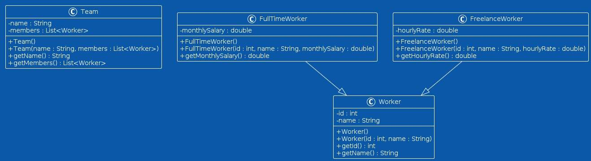

---

# **Managing Polymorphic Types (Jackson Databind)**

## **1. Overview**

In many applications, data models are not always simple, concrete classes. Instead, they often follow **object-oriented principles**, where:

* Classes share behavior through **inheritance**
* We interact with **abstract classes or interfaces**
* Concrete implementations vary but share a common structure

### 🚨 The Challenge

JSON:

* Does **not include type information by default**

Jackson:

* Cannot determine **which subclass to instantiate during deserialization**

✔ Result:

* Serialization works fine
* Deserialization **fails for polymorphic types**

---

## **2. Scenario: Work Management Hierarchy**

### 🧩 Class Structure

We model a system with:

* **Abstract class**: `Worker`
* **Subclasses**:

    * `FullTimeWorker` → `monthlySalary`
    * `FreelanceWorker` → `hourlyRate`
* **Container class**:

    * `Team` → `List<Worker> members`



### 💡 Real-world meaning

* A team can include **different types of workers**
* Code interacts with them via **abstraction (`Worker`)**
* This is **polymorphism**

---

## **3. Serialization of Polymorphic Types**

### ✅ Code Example

```java
@Test
void givenTeamWithMixedWorkers_whenSerializing_thenSuccessSerialization() throws Exception {
    FullTimeWorker fullTimeWorker = new FullTimeWorker(1, "John Doe", 5000.0);
    FreelanceWorker freelanceWorker = new FreelanceWorker(2, "Jane Smith", 50.0);
    
    Team team = new Team("Baeldung", List.of(fullTimeWorker, freelanceWorker));
    String json = objectMapper.writeValueAsString(team);
    System.out.println(json);
}
```

### 📌 JSON Output

```json
{
  "name": "Baeldung",
  "members": [
    {
      "id": 1,
      "name": "John Doe",
      "monthlySalary": 5000.0
    },
    {
      "id": 2,
      "name": "Jane Smith",
      "hourlyRate": 50.0
    }
  ]
}
```

### 🔍 Key Insight

* Jackson serializes correctly because:

    * It starts from **actual objects**
    * Each object already knows its **concrete type**

---

## **4. The Deserialization Problem**

### ❌ Code Example

```java
@Test
void givenJsonWithoutTypeInfo_whenDeserializingTeam_thenFails() {
    String json = "{\"name\":\"Baeldung\",\"members\":[{\"id\":1,\"name\":\"John Doe\",\"monthlySalary\":5000.0}]}";

    assertThrows(JsonMappingException.class, () -> {
        objectMapper.readValue(json, Team.class);
    });
}
```

### ❗ What Happens?

* Jackson sees:

  ```json
  { "id": 1, "name": "John Doe", ... }
  ```
* But needs to create:

  ```java
  Worker worker = ??? // unknown subtype
  ```

### 🚨 Error

* `InvalidDefinitionException`
* Cause:

    * `Worker` is **abstract**
    * No **type metadata** in JSON

---

## **5. Why This Happens**

### Serialization vs Deserialization

| Phase           | Behavior                         |
| --------------- | -------------------------------- |
| Serialization   | Uses real object → knows subtype |
| Deserialization | Only sees JSON → no subtype info |

### ⚠️ Problem

* JSON lacks **type indicators**
* Jackson cannot:

    * Infer subtype reliably
    * Instantiate abstract classes

---

# **6. Solution: Using `@JsonTypeInfo`**

To solve this, we must **embed type information in JSON**.

---

## **6.1 Base Class Configuration**

### ✅ Code

```java
@JsonTypeInfo(
    use = JsonTypeInfo.Id.NAME,
    include = JsonTypeInfo.As.PROPERTY,
    property = "@type"
)
@JsonSubTypes({
    @JsonSubTypes.Type(value = FreelanceWorker.class, name = "freelance"),
    @JsonSubTypes.Type(value = FullTimeWorker.class, name = "fulltime")
})
public abstract class Worker {
    ...
}
```

---

## **6.2 Understanding the Annotations**

### 🔹 `@JsonTypeInfo`

Defines how type info is handled:

* `use = JsonTypeInfo.Id.NAME`
  → Uses logical names (not class names)

* `include = JsonTypeInfo.As.PROPERTY`
  → Adds a field in JSON

* `property = "@type"`
  → Name of the type field

---

### 🔹 `@JsonSubTypes`

Maps subtype names to classes:

```java
@JsonSubTypes.Type(value = FreelanceWorker.class, name = "freelance")
```

✔ `"freelance"` → `FreelanceWorker`

---

## **6.3 Updated JSON Output**

```json
{
  "name": "Baeldung",
  "members": [
    {
      "@type": "fulltime",
      "id": 1,
      "name": "John Doe",
      "monthlySalary": 5000.0
    },
    {
      "@type": "freelance",
      "id": 2,
      "name": "Jane Smith",
      "hourlyRate": 50.0
    }
  ]
}
```

---

## **6.4 Successful Deserialization**

### ✅ Code

```java
@Test
void givenJsonWithTypeInfo_whenDeserializingTeam_thenSucceed() throws Exception {
    String json = "{\"name\":\"Baeldung\",\"members\":[{\"@type\":\"fulltime\",\"id\":1,\"name\":\"John Doe\",\"monthlySalary\":5000.0}," +
      "{\"@type\":\"freelance\",\"id\":2,\"name\":\"Jane Smith\",\"hourlyRate\":50.0}]}";
    
    Team deserialized = objectMapper.readValue(json, Team.class);
    assertInstanceOf(FullTimeWorker.class, deserialized.getMembers().get(0));
    assertInstanceOf(FreelanceWorker.class, deserialized.getMembers().get(1));
}
```

### 🔍 Result

* Jackson reads `@type`
* Instantiates correct subclass

---

# **7. Alternative Configuration Options**

## **7.1 Registering Subtypes Programmatically**

```java
objectMapper.registerSubtypes(FullTimeWorker.class, FreelanceWorker.class);
```

---

## **7.2 Using `@JsonTypeName`**

```java
@JsonTypeName("fulltime")
class FullTimeWorker { }
```

✔ Avoids defining names in base class

---

# **8. Inclusion Strategies**

Jackson provides multiple ways to include type information.

---

## **8.1 PROPERTY (Default & Most Common)**

```java
include = JsonTypeInfo.As.PROPERTY
```

✔ Adds field inside object:

```json
{ "@type": "fulltime", ... }
```

---

## **8.2 WRAPPER_OBJECT**

```java
include = JsonTypeInfo.As.WRAPPER_OBJECT
```

### JSON:

```json
{
  "fulltime": {
    "id": 1,
    "name": "John Doe",
    "monthlySalary": 5000.0
  }
}
```

---

## **8.3 WRAPPER_ARRAY**

Structure:

```json
["fulltime", { ... }]
```

---

## **8.4 EXISTING_PROPERTY**

Uses an existing field:

```java
@JsonTypeInfo(
    use = JsonTypeInfo.Id.NAME,
    include = JsonTypeInfo.As.EXISTING_PROPERTY,
    property = "type",
    visible = true
)
```

✔ No extra JSON field added

---

## **8.5 EXTERNAL_PROPERTY**

Type info is outside the object:

```java
include = JsonTypeInfo.As.EXTERNAL_PROPERTY
```

### JSON:

```json
{
  "admin": { ... },
  "@type": "fulltime"
}
```

⚠️ Not suitable for collections

---

## **8.6 Combining Strategies**

Different fields can use different strategies:

```java
public class Team {

    @JsonTypeInfo(... PROPERTY ...)
    private List<Worker> members;

    @JsonTypeInfo(... WRAPPER_OBJECT ...)
    private Worker admin;
}
```

---

# **9. Advanced Configuration Options**

## **9.1 Type Identifier Strategies (`use`)**

| Option          | Description                |
| --------------- | -------------------------- |
| `NAME`          | Logical name (recommended) |
| `SIMPLE_NAME`   | Class name only            |
| `CLASS`         | Fully qualified class name |
| `MINIMAL_CLASS` | Partial class name         |
| `DEDUCTION`     | Infers subtype from fields |
| `CUSTOM`        | Custom resolver            |

---

## **9.2 Additional Parameters**

* `visible = true`
  → Include type value in POJO field

* `defaultImpl`
  → Fallback class for unknown types

---

# **10. Key Takeaways**

### ✅ Problem

* JSON lacks type info
* Jackson cannot deserialize abstract types

---

### ✅ Solution

* Use:

    * `@JsonTypeInfo`
    * `@JsonSubTypes`

---

### ✅ Best Practices

* Use `Id.NAME` (clean and stable)
* Prefer `PROPERTY` inclusion
* Avoid exposing full class names (`CLASS`) for security reasons

---

### ✅ Important Insight

> Jackson can serialize polymorphic types easily, but **cannot deserialize them without explicit type metadata**

---

# **11. Conclusion**

In this lesson, we learned:

* Why polymorphic deserialization fails by default
* How to use `@JsonTypeInfo` and `@JsonSubTypes`
* How to include type metadata in JSON
* Different strategies for structuring polymorphic JSON
* Advanced customization options

✔ With proper configuration, Jackson can:

* Preserve **inheritance relationships**
* Correctly reconstruct **object hierarchies**
* Handle **real-world polymorphic data structures**

---

