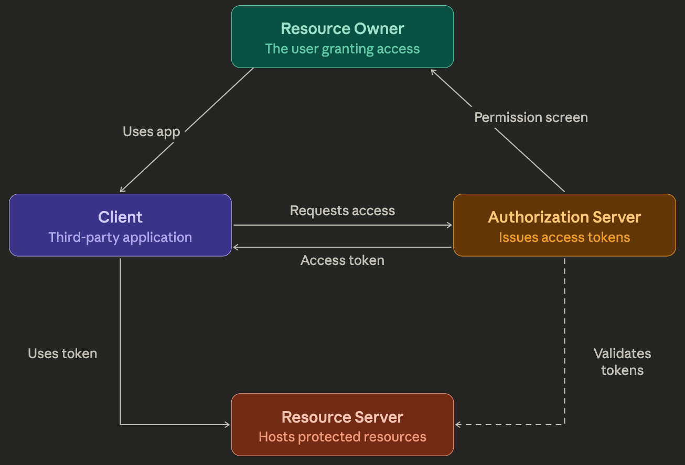

---

## Introduction to OAuth2 and the OAuth2 Roles

### 1. Goal

In this lesson, we take a high-level look at the OAuth2 framework. The focus here is on **core concepts** — the technical details of specific grant types and flows come later.

---

### 2. What is OAuth2?

OAuth2 is a standard for **authorization**, not authentication. Understanding this distinction is fundamental:

- **Authentication** — identifying who a user is
- **Authorization** — determining what a user (or application) has access to

OAuth2 allows applications to obtain **limited access** to a service or resource. Critically, it eliminates the need for users to provide their full credentials directly to third-party applications.

#### Why does this matter?

Without OAuth2, a third-party app needing access to your resources would require your full username and password. This creates serious security risks — the app would have unrestricted access to your entire account. OAuth2 solves this by granting only the minimum access needed, reducing the risk of credential compromise.

---

### 3. A Real-World Example

Imagine a planning website that wants to read and edit your **Google Calendar**.

| Approach | Risk |
|---|---|
| Share Google credentials directly | App gains access to your entire Google account |
| Use OAuth2 | App receives a limited, temporary key scoped only to Calendar |

With OAuth2, the website never sees your password. Google's Authorization Server acts as a trusted middleman.

---

### 4. The OAuth2 Flow (High-Level)

Here is how a typical OAuth2 interaction works:

1. The third-party app sends a request to the **Google Authorization Server** for access to the user's Calendar.
2. The Authorization Server presents the user with a **permissions screen** asking them to grant or deny access.
3. If granted, the app receives an **access token** — a key tied to the user and the specific permissions granted.
4. The app uses this token to interact with the Calendar API, without ever knowing the user's password.

Key properties of this flow:
- The user's password is **never shared** with the third-party app
- Access is **temporary** and **scoped** to specific resources
- The user can grant different levels of access to different apps from a **single account**

---

### 5. The Four OAuth2 Roles

OAuth2 formally defines four distinct roles. Separating these clearly is essential to understanding any OAuth flow.

#### 5.1 Resource Owner
- The entity that **owns** the protected resources
- Most commonly, this is the **end user** (e.g., the person whose Calendar is being accessed)
- Can also be another application
- Is the only party capable of **granting access** to protected resources

#### 5.2 Resource Server
- Hosts the **protected resources** (e.g., the Google Calendar API)
- Receives and responds to requests for protected resources
- Must be able to **validate tokens** issued by the Authorization Server before allowing access

#### 5.3 Authorization Server
- The **central authority** responsible for issuing access tokens to clients
- Authenticates the Resource Owner and obtains consent
- Issues tokens that encode the authorization semantics (what is allowed)
- Must have a **trust relationship** with the Resource Server

#### 5.4 Client
- The **application** requesting access to protected resources on behalf of the Resource Owner
- Can be a website, mobile app, desktop app, etc.
- Must **register** with the Authorization Server to receive tokens
- Never needs to know the user's credentials

---

### 6. Trust Relationships

For OAuth to function, trust must exist between specific actors:

- **Resource Server ↔ Authorization Server** — The Resource Server must trust and be able to validate tokens issued by the Authorization Server
- **Client ↔ Authorization Server** — The Client must register with the Authorization Server before it can receive tokens

---

### 7. Access Tokens

Instead of user credentials, OAuth2 uses **Access Tokens** as the mechanism for accessing protected resources.

- Issued by the **Authorization Server** to the **Client**
- Used by the Client to make requests to the **Resource Server**
- Can vary in format and structure depending on the security requirements of the Resource Server
- Access is **temporary** — tokens expire, limiting the window of potential misuse

---

### 8. Summary

| Concept | Description |
|---|---|
| OAuth2 | An authorization framework (not authentication) |
| Resource Owner | The user who owns the data |
| Resource Server | The API or service hosting the protected data |
| Authorization Server | Issues tokens; acts as the trusted middleman |
| Client | The app requesting access on the user's behalf |
| Access Token | A temporary, scoped key replacing user credentials |

The full OAuth2 flow can be implemented through multiple **grant types**, each suited to different application scenarios — these are covered in depth in subsequent lessons.

---

Here's a diagram of the OAuth2 flow to visualize how the four roles interact:

## The Resource Owner in OAuth2

The Resource Owner is the entity that has the **authority to grant access** to protected resources. Here's a deeper look:

---

### Who or What Is the Resource Owner?

In most practical scenarios, the Resource Owner is a **human user** — for example, the person whose Google Calendar another app wants to access. However, the spec is broader than that: the Resource Owner can also be **another application or automated process**, in cases where machine-to-machine authorization is involved.

---

### What the Resource Owner Does

The Resource Owner's primary role is to **consent or deny access** when an Authorization Server presents a permissions screen. They are deciding:

- *Which Client* gets access
- *Which specific resources* can be accessed (e.g., Calendar only, not Gmail)
- *For how long* (since tokens are temporary)

Importantly, the Resource Owner **never directly hands credentials to the Client**. Their interaction is with the Authorization Server — a trusted middleman — not with the app requesting access.

---

### What the Resource Owner Does NOT Do

This is often a point of confusion:

- The Resource Owner does **not** issue tokens — that's the Authorization Server's job
- The Resource Owner does **not** host the data — that's the Resource Server
- The Resource Owner does **not** make API calls — that's the Client

Their sole power is **consent**: granting or revoking access.

---

### Revoking Access

Because the Resource Owner's consent is the foundation of the entire flow, they can typically **revoke access at any time** — for example, through their Google account settings, where you can see which third-party apps have been granted access and remove them. This is one of the key security advantages of OAuth2 over simply sharing a password, which would be much harder to "take back."

---

### Summary

| Property | Detail |
|---|---|
| Who they are | A user (or sometimes an application) |
| Core responsibility | Granting or denying consent to a Client |
| Who they interact with | The Authorization Server (via the permissions screen) |
| What they never share | Their credentials — these stay between the user and the Authorization Server |
| Key power | Can revoke access at any time |

The Resource Owner is the anchor of trust in the entire OAuth2 model — without their explicit consent, no Client can obtain a token.

---

## The Client in OAuth2

The Client is the **application requesting access to protected resources** on behalf of the Resource Owner. Despite the name, it has nothing to do with "client-side" in the frontend/backend sense — it simply means the party making requests.

---

### What Kind of Application Can Be a Client?

Almost anything:

- A **web application** (e.g., a planning site wanting your Google Calendar)
- A **mobile app** (e.g., a fitness app requesting access to your health data)
- A **desktop application**
- A **server-side service** in a machine-to-machine flow

---

### What the Client Does

The Client's job is to orchestrate the OAuth2 flow on the user's behalf:

1. **Initiates the request** — sends an authorization request to the Authorization Server, specifying what resources it needs access to
2. **Redirects the user** — sends the Resource Owner to the Authorization Server's permissions screen
3. **Receives the token** — once consent is granted, the Client receives an Access Token from the Authorization Server
4. **Uses the token** — attaches the token to every request it makes to the Resource Server to access protected resources

---

### Client Registration

Before a Client can participate in any OAuth2 flow, it must **register with the Authorization Server**. During registration, it typically receives:

- A **Client ID** — a public identifier for the application
- A **Client Secret** — a confidential key used to authenticate the Client itself with the Authorization Server (for certain flow types)

This registration step is what allows the Authorization Server to recognize and trust the Client when it shows up requesting tokens.

---

### What the Client Never Does

This is critical to the security model:

- The Client **never sees the Resource Owner's password** — the user authenticates directly with the Authorization Server
- The Client **does not store or manage user credentials** — it only handles tokens
- The Client **cannot access resources beyond what the token permits** — scope is enforced by the Authorization Server and Resource Server

---

### Public vs. Confidential Clients

OAuth2 distinguishes between two types of clients based on their ability to keep secrets:

| Type | Description | Example |
|---|---|---|
| **Confidential** | Can securely store a Client Secret (runs on a server) | Server-side web app |
| **Public** | Cannot securely store secrets (code is exposed) | Mobile app, single-page app |

This distinction matters because it determines which **grant types** (flows) are appropriate and safe for that Client to use — something covered in detail in later lessons.

---

### Summary

| Property | Detail |
|---|---|
| What it is | The application requesting access to resources |
| Must register with | The Authorization Server |
| Receives | An Access Token (not the user's credentials) |
| Uses the token to | Make requests to the Resource Server |
| Never sees | The Resource Owner's password |
| Two types | Confidential (server-side) and Public (mobile/SPA) |

The Client is essentially the **actor that benefits** from the OAuth2 flow — it gets scoped, temporary access to do exactly what it needs, and nothing more.

---

## The Resource Server in OAuth2

The Resource Server is the component that **hosts and protects the resources** that the Client wants to access. It is the final destination in the OAuth2 flow — the place where the actual data or functionality lives.

---

### What Is the Resource Server?

In most real-world implementations, the Resource Server is an **API**. Some concrete examples:

| Scenario | Resource Server |
|---|---|
| App accessing your Google Calendar | Google Calendar API |
| App posting to your Twitter account | Twitter API |
| App reading your Spotify playlists | Spotify Web API |
| App accessing your company's data | Your internal REST API |

The Resource Server is entirely focused on **serving protected resources** — it is not involved in the consent or token-issuance steps of the flow.

---

### What the Resource Server Does

Its responsibilities are relatively focused:

1. **Receives requests** from the Client, which include an Access Token
2. **Validates the token** — checks that it was genuinely issued by a trusted Authorization Server, has not expired, and carries the right permissions (scope)
3. **Grants or denies access** based on the token's validity and scope
4. **Returns the requested resource** if everything checks out

---

### The Trust Relationship with the Authorization Server

This is a critical detail. The Resource Server must have a **pre-established trust relationship** with the Authorization Server. Without it, the Resource Server has no way to verify whether a token it receives is legitimate or forged.

In practice this means the Resource Server needs a way to validate tokens — either by:

- **Calling back** to the Authorization Server to verify the token (token introspection)
- **Verifying a cryptographic signature** on the token itself, if the token format (such as JWT) supports it

---

### What the Resource Server Does NOT Do

- It does **not** issue tokens — that is the Authorization Server's job
- It does **not** interact with the Resource Owner directly
- It does **not** know or care about the user's credentials — it only evaluates the token

---

### The Relationship Between Resource Server and Authorization Server

In simple implementations, the Resource Server and Authorization Server can be **the same application**. In larger, more complex systems they are almost always **separate services** — for example, Google has a dedicated Authorization Server (accounts.google.com) that is entirely separate from the many Resource Servers it operates (Calendar API, Gmail API, Drive API, etc.).

---

### Summary

| Property | Detail |
|---|---|
| What it is | The API or service hosting protected resources |
| What it receives | Requests from the Client carrying an Access Token |
| Core responsibility | Validate the token, then grant or deny access |
| Trust relationship | Must trust and be able to verify tokens from the Authorization Server |
| What it never does | Issue tokens or interact with the Resource Owner |
| Real-world examples | Google Calendar API, Twitter API, Spotify API |

The Resource Server is the **gatekeeper of the actual data**. The entire OAuth2 flow — the consent, the token issuance, the Client registration — all exists so that the Resource Server can confidently answer one question: *"Is this token valid, and does it permit what this Client is asking for?"*

---

## The Authorization Server in OAuth2

The Authorization Server is the **central authority and trust anchor** of the entire OAuth2 framework. Every other role — the Resource Owner, the Client, and the Resource Server — depends on it in some way.

---

### What Is the Authorization Server?

It is the dedicated service responsible for **managing consent and issuing tokens**. It sits between the Client (which wants access) and the Resource Owner (who controls access), acting as a trusted intermediary so that neither party ever has to deal directly with the other's credentials.

Real-world examples:

| Provider | Authorization Server |
|---|---|
| Google | accounts.google.com |
| Facebook | facebook.com/dialog/oauth |
| GitHub | github.com/login/oauth |
| Your own app | Your identity/auth service (e.g. Auth0, Okta, Keycloak) |

---

### What the Authorization Server Does

Its responsibilities span the entire OAuth2 interaction:

#### 1. Authenticates the Resource Owner
When a Client initiates a flow, the Authorization Server presents a login screen to the Resource Owner. It verifies the user's identity — this is the one place in OAuth2 where actual **authentication** happens. The Client never sees this process.

#### 2. Obtains Consent
After authenticating the user, it presents the well-known **permissions screen** — "This app would like to access your Calendar. Allow or Deny?" The Authorization Server records what the user consented to, which becomes the basis for the token's scope.

#### 3. Issues Access Tokens
Once consent is granted, the Authorization Server **mints and issues an Access Token** to the Client. This token encodes:
- Who the Resource Owner is
- Which Client the token was issued to
- What resources and actions are permitted (**scope**)
- When the token expires

#### 4. Enforces Registration
The Authorization Server only issues tokens to **registered Clients**. During registration it assigns a Client ID and, for confidential clients, a Client Secret. This ensures rogue or unknown applications cannot participate in the flow.

#### 5. Acts as Trust Anchor for the Resource Server
The Resource Server needs a way to verify that tokens it receives are genuine. The Authorization Server makes this possible — either by providing a **token introspection endpoint** the Resource Server can query, or by **cryptographically signing tokens** (e.g. using JWTs) so the Resource Server can verify them independently.

---

### What the Authorization Server Does NOT Do

- It does **not** host the protected resources — that is the Resource Server's job
- It does **not** make API calls on anyone's behalf — that is the Client's job
- It does **not** permanently store the user's data — it manages identity and authorization metadata only

---

### Its Relationships with Every Other Role

| Other Role | Relationship |
|---|---|
| Resource Owner | Authenticates them, presents consent screen, records their decisions |
| Client | Registers it, validates its identity, issues tokens to it |
| Resource Server | Acts as the trust anchor — Resource Server validates tokens against it |

The Authorization Server is the **only role that has a direct relationship with all three other roles**, which is what makes it the linchpin of the entire framework.

---

### A Note on Separation of Concerns

In simple systems, the Authorization Server and Resource Server may be combined into a single application. In production systems at any scale they are almost always **separate services** — this separation allows one Authorization Server to protect many different Resource Servers, which is exactly how large identity providers like Google operate. A single Google account grants access to Calendar, Drive, Gmail, and dozens of other Resource Servers, all through the same Authorization Server.

---

### Summary

| Property | Detail |
|---|---|
| What it is | The central trust authority of the OAuth2 flow |
| Authenticates | The Resource Owner (via login screen) |
| Obtains | The Resource Owner's consent |
| Issues | Access Tokens to registered Clients |
| Enforces | Client registration before issuing any tokens |
| Enables | The Resource Server to validate tokens |
| Real-world examples | Google accounts, GitHub OAuth, Auth0, Okta |

If the Resource Owner is the *source of trust* and the Access Token is the *artifact of trust*, the Authorization Server is the **engine that converts one into the other** — taking a user's explicit consent and transforming it into a scoped, time-limited token that the rest of the system can rely on.

---