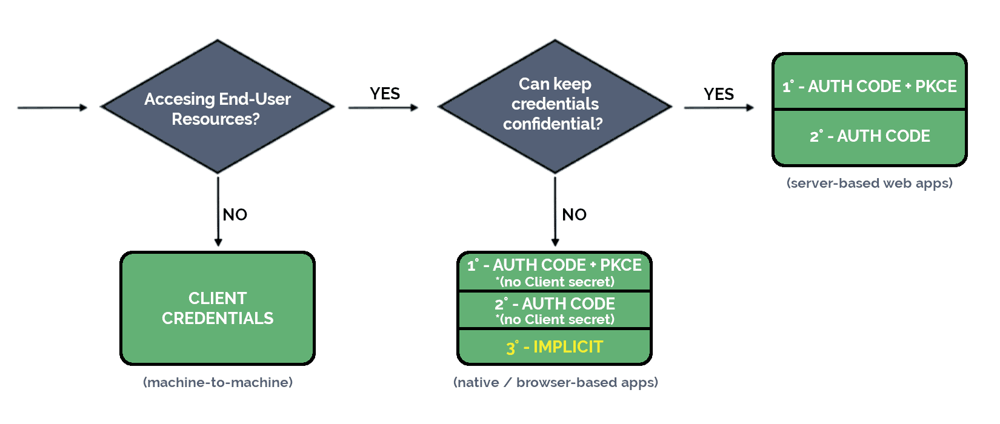

---

## Picking the Right OAuth Grant Type/Flow to Use

### 1. Goal

The goal of this lesson is to understand how to pick the correct OAuth 2 Grant Type depending on the type of application you're building and the scenario it operates in.

---

### 2. The OAuth Grant Types Landscape

OAuth 2 technically defines **four Grant Types**:

1. **Authorization Code** — the primary, recommended flow
2. **Client Credentials** — for machine-to-machine communication
3. **Implicit** — deprecated; heavily discouraged
4. **Resource Owner Password Credentials (ROPC)** — deprecated; disallowed

There is also an **extension** to the Authorization Code flow: **PKCE (Proof Key for Code Exchange)**, which adds a layer of security on top.

**Key update — OAuth 2.1:** The Implicit and ROPC flows have been completely omitted from the OAuth 2.1 draft specification due to security concerns. PKCE is now required by default. Going forward, the only two flows worth focusing on are **Authorization Code** and **Client Credentials**.

---

### 3. Two Determining Factors

When choosing a Grant Type, two questions drive the decision:

#### Factor 1: Client Confidentiality

This refers to whether the client application can securely keep credentials private.

| Client Type | Description | Examples |
|---|---|---|
| **Confidential** | Runs in a controlled environment; can store secrets safely | Server-side MVC web apps |
| **Public** | Runs in an uncontrolled environment; cannot safely store secrets | Browser-based SPAs, native mobile apps |

#### Factor 2: Who Is the Resource Owner?

- **An end user (a person):** The user owns the protected resources (e.g., their GitHub profile, repositories). They must explicitly grant the client access.
- **The client itself:** In automated processes with no human involvement, the client acts as the resource owner (e.g., a cron job that collects audit data across services).

---

### 4. The Two Primary Grant Types

#### A. Authorization Code Flow

- Best for scenarios where **an end user is involved**.
- Suitable for both **confidential** and **public** clients.
- The difference: public clients cannot use a Client Secret (it would be exposed), so they rely on PKCE instead.

**How it works (simplified):**
1. The user is redirected to the Authorization Server via a browser (User-Agent).
2. The user grants consent.
3. The client receives an **Authorization Code**.
4. The client exchanges that code for an **Access Token**.
5. The Access Token is used to access the protected resource.

#### B. PKCE Extension (Proof Key for Code Exchange)

- An extension **on top of** the Authorization Code flow.
- Originally designed for public clients to protect against Authorization Code interception attacks.
- **Best practice recommends using PKCE for all clients** (confidential and public alike) — it is a net security improvement with no downside.
- Requires the Authorization Server to support PKCE — this is a factor when choosing your OAuth provider.
- In OAuth 2.1, PKCE is **mandatory by default**.

**How it works (simplified):**
1. The client generates a one-time secret (code verifier) and a transformed version of it (code challenge).
2. The code challenge is sent with the authorization request.
3. The code verifier is sent when exchanging the code for a token.
4. The Authorization Server validates that they correspond — confirming the requestor is the same party that initiated the flow.

#### C. Client Credentials Flow

- Best for **machine-to-machine (M2M)** scenarios where there is no end user.
- Only suitable for **confidential clients** (a public client cannot safely hold credentials).
- Simpler than Authorization Code — the client directly presents its credentials to the Authorization Server and receives an Access Token.

**Example use case:** A scheduled cron job that pulls daily sales data from internal services and emails a report. No user is involved; the service itself is the resource owner.

---

### 5. Decision Flowchart

Here is a visual decision aid:---

### 6. Summary Table

| Scenario | Recommended Flow |
|---|---|
| End user present + confidential client | Authorization Code + PKCE |
| End user present + public client (SPA, mobile) | Authorization Code + PKCE (no client secret) |
| No end user, machine-to-machine | Client Credentials |
| Browser app, server doesn't support PKCE | Authorization Code (no PKCE) as fallback |
| Implicit / ROPC | **Do not use** — deprecated and removed in OAuth 2.1 |

---

### 7. Key Takeaways

- The two relevant flows today are **Authorization Code** (with PKCE) and **Client Credentials**.
- **PKCE is now the default** in OAuth 2.1 — treat it as mandatory for all Authorization Code implementations.
- **Client Credentials** is only for machine-to-machine scenarios and only works with confidential clients.
- Your choice of **Authorization Server / OAuth provider** matters — it must support PKCE for modern implementations.
- The Implicit and ROPC flows should be considered fully retired and should not be implemented in new systems.

---