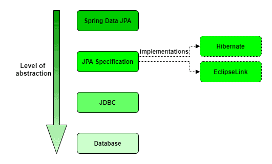

---

# **Lesson 1: The Java Persistence Ecosystem**

---

### **1.1 Overview of Application Persistence**

**Persistence** refers to the capability of an application to **store data permanently** — even after the program terminates.
In other words, persistence ensures that application data **outlives the runtime** of the application.

In Java applications, persistence can be implemented using different mechanisms such as:

* Text or binary **files**
* **Relational databases (SQL)**
* **NoSQL databases**
* **Object databases**

Among these, **relational databases** remain the **most widely used** for enterprise applications. They organize data in tables and use **SQL (Structured Query Language)** for manipulation and retrieval.

---

### **1.2 Java Persistence Solutions**

Over the years, multiple Java persistence technologies have emerged — each offering a different **level of abstraction** over the database.

The **level of abstraction** refers to how much of the database interaction (like writing SQL) is automated or hidden from the developer.

Let’s explore these main layers, from **low-level (manual control)** to **high-level (automation and abstraction)**.

---

### **(a) JDBC – Java Database Connectivity**

**JDBC** is the **oldest and lowest-level** API for database access in Java.
It provides direct communication between Java applications and relational databases using SQL statements.

With JDBC, developers manually manage:

* Database connections
* SQL queries and updates
* Result sets
* Exception handling

**Advantages:**

* Full control over SQL queries
* Fine-grained performance tuning possible

**Disadvantages:**

* Verbose and repetitive code
* High development effort
* Error-prone resource handling

**Example: Basic JDBC Code**

```java
import java.sql.*;

public class JdbcExample {
    public static void main(String[] args) {
        String url = "jdbc:mysql://localhost:3306/school";
        String username = "root";
        String password = "password";

        try (Connection connection = DriverManager.getConnection(url, username, password);
             Statement stmt = connection.createStatement()) {

            ResultSet rs = stmt.executeQuery("SELECT * FROM students");
            while (rs.next()) {
                System.out.println(rs.getString("name"));
            }
        } catch (SQLException e) {
            e.printStackTrace();
        }
    }
}
```

---

### **(b) JPA – Jakarta Persistence API**

The **Jakarta Persistence API (JPA)** (formerly known as *Java Persistence API*) introduced a **higher-level abstraction** over JDBC.
Instead of writing SQL, developers define **entities (Java classes)** that map to database tables — an approach known as **Object-Relational Mapping (ORM)**.

JPA allows us to:

* Interact with database records as Java objects.
* Automatically handle SQL generation.
* Use annotations for mapping fields to database columns.

**Advantages:**

* Simplified development through ORM.
* Database-agnostic design — switching databases requires minimal code change.
* Built-in support for caching and transactions.

**Disadvantages:**

* Less control over SQL.
* Slight overhead compared to direct JDBC.

**Example: JPA Entity and Repository**

```java
import javax.persistence.*;

@Entity
public class Student {
    @Id
    @GeneratedValue(strategy = GenerationType.IDENTITY)
    private Long id;
    private String name;
    private int age;

    // Getters and setters
}
```

```java
public interface StudentRepository extends JpaRepository<Student, Long> {
    List<Student> findByName(String name);
}
```

**Common JPA Implementations:**

* **Hibernate** (most popular)
* **EclipseLink** (reference implementation)
* **OpenJPA**

---

### **(c) Spring Data JPA**

**Spring Data JPA** builds on top of JPA to simplify database operations even further.
It automates the creation of repository classes and provides a **query generation mechanism** from method names — reducing boilerplate code significantly.

Internally, Spring Data JPA still uses a JPA implementation such as **Hibernate**.

**Advantages:**

* Minimal code for CRUD operations.
* Integrates seamlessly with Spring Boot.
* Supports custom queries using method names or JPQL.

**Example: Spring Data JPA Repository**

```java
@Repository
public interface StudentRepository extends JpaRepository<Student, Long> {
    // Derived query method
    List<Student> findByAgeGreaterThan(int age);
}
```

**Usage Example:**

```java
@Service
public class StudentService {

    @Autowired
    private StudentRepository studentRepository;

    public void registerStudent(Student student) {
        studentRepository.save(student);
    }

    public List<Student> getOlderStudents(int age) {
        return studentRepository.findByAgeGreaterThan(age);
    }
}
```

**Benefits:**

* Removes repetitive code for repository layers.
* Enables faster development and cleaner architecture.
* Offers integration with auditing, pagination, and sorting.

---

### **1.3 The Java Persistence Abstraction Levels**

Below is a visual representation of the Java persistence ecosystem and the levels of abstraction involved:

📘 *Diagram: Java Persistence Layers*

---

---

At each level, developers trade **control** for **convenience**:

* **JDBC** offers the most control but requires the most code.
* **JPA** abstracts SQL through object mapping.
* **Spring Data JPA** automates repository creation and query handling.

---

### **1.4 Working Together**

It’s important to understand that these layers are **not mutually exclusive**.
Spring Data JPA, for example, still relies on:

* JPA specification for ORM mapping.
* Hibernate (a JPA implementation) for database interaction.
* JDBC for the final connection to the database.

Thus, the flow can be summarized as:

```
Spring Data JPA → JPA → Hibernate → JDBC → Database
```

Each layer builds upon the other, providing more abstraction, flexibility, and productivity.

---

### **1.5 Summary**

| Layer               | Description                                 | Level of Abstraction | Example Technology     |
| ------------------- | ------------------------------------------- | -------------------- | ---------------------- |
| **Database**        | Physical data storage                       | Lowest               | MySQL, PostgreSQL      |
| **JDBC**            | Direct SQL execution via Java API           | Low                  | JDBC API               |
| **JPA**             | Object-Relational Mapping (ORM)             | Medium               | Hibernate, EclipseLink |
| **Spring Data JPA** | Auto repository generation, JPA integration | High                 | Spring Boot, Hibernate |

---

### **1.6 Key Takeaways**

* **Persistence** ensures that data survives beyond program execution.
* **JDBC** gives direct database access but requires manual SQL handling.
* **JPA** simplifies persistence through **entities and ORM mapping**.
* **Spring Data JPA** further automates database operations using repository interfaces.
* All these technologies **build upon one another**, with Spring Data JPA sitting at the **highest level of abstraction**.

---

