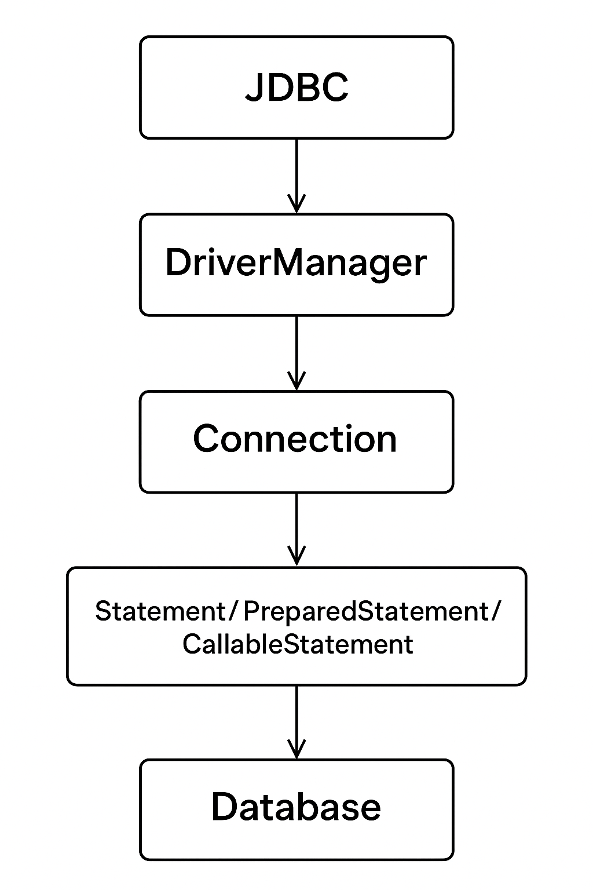

---

# **Introduction to JDBC**

---

### **1. Overview**

**JDBC (Java Database Connectivity)** is a Java API that enables Java applications to interact with a database. It provides methods for querying, updating, and managing data stored in relational databases.

* It allows Java programs to execute SQL statements.
* It can work with **any database**, provided that a proper **JDBC driver** is available.

**Key Point:**
JDBC is database-independent, but each database requires its own driver implementation.

---

### **2. JDBC Drivers**

A **JDBC driver** acts as a bridge between Java applications and the database.

| **Type**   | **Name**                | **Description**                                           | **Example**                    |
| ---------- | ----------------------- | --------------------------------------------------------- | ------------------------------ |
| **Type 1** | JDBC-ODBC Bridge        | Maps JDBC calls to ODBC                                   | `sun.jdbc.odbc.JdbcOdbcDriver` |
| **Type 2** | Native API Driver       | Uses client-side database libraries                       | Oracle OCI                     |
| **Type 3** | Network Protocol Driver | Uses middleware to communicate                            | DBAnywhere                     |
| **Type 4** | Thin Driver             | Directly converts JDBC calls into database-specific calls | MySQL Connector/J              |

💡 **Most commonly used:** **Type 4 driver** — platform-independent and connects directly to the database.

---

### **3. Connecting to a Database**

#### **3.1. Registering the Driver**

**Maven dependency for MySQL:**

```xml
<dependency>
    <groupId>mysql</groupId>
    <artifactId>mysql-connector-java</artifactId>
    <version>8.0.32</version>
</dependency>
```

**Registering the driver (older versions):**

```java
Class.forName("com.mysql.cj.jdbc.Driver");
```

✅ **Note:**
In **JDBC 4.0+**, drivers in the classpath load automatically — no need to call `Class.forName()` manually.

---

#### **3.2. Creating a Connection**

**Example:**

```java
try (Connection con = DriverManager
  .getConnection("jdbc:mysql://localhost:3306/myDb", "user1", "pass")) {
    System.out.println("Connection established!");
}
```

**Common connection URLs:**

```text
jdbc:mysql://localhost:3306/myDb
jdbc:postgresql://localhost/myDb
jdbc:hsqldb:mem:myDb
```

**Creating user and database in MySQL:**

```sql
CREATE DATABASE myDb;
CREATE USER 'user1' IDENTIFIED BY 'pass';
GRANT ALL ON myDb.* TO 'user1';
```

---

### **4. Executing SQL Statements**

JDBC provides three main interfaces for executing SQL commands:

* **Statement**
* **PreparedStatement**
* **CallableStatement**

---

#### **4.1. Using `Statement`**

```java
try (Statement stmt = con.createStatement()) {
    String sql = "CREATE TABLE IF NOT EXISTS employees "
      + "(emp_id int PRIMARY KEY AUTO_INCREMENT, "
      + "name varchar(30), position varchar(30), salary double)";
    stmt.execute(sql);
}
```

**Insert Example:**

```java
String insertSql = "INSERT INTO employees(name, position, salary) "
  + "VALUES('John', 'Developer', 2000)";
stmt.executeUpdate(insertSql);
```

**Retrieve Data:**

```java
String selectSql = "SELECT * FROM employees";
try (ResultSet rs = stmt.executeQuery(selectSql)) {
    while (rs.next()) {
        System.out.println(rs.getString("name"));
    }
}
```

---

#### **4.2. Using `PreparedStatement`**

Prepared statements are precompiled and prevent SQL injection.

```java
String updateSql = "UPDATE employees SET position=? WHERE emp_id=?";
try (PreparedStatement pstmt = con.prepareStatement(updateSql)) {
    pstmt.setString(1, "Lead Developer");
    pstmt.setInt(2, 1);
    int rows = pstmt.executeUpdate();
}
```

**Setting a query timeout:**

```java
pstmt.setQueryTimeout(5); // cancels after 5 seconds
```

---

#### **4.3. Using `CallableStatement`**

Used for executing **stored procedures**.

**Java code:**

```java
String sql = "{call insertEmployee(?,?,?,?)}";
try (CallableStatement cstmt = con.prepareCall(sql)) {
    cstmt.registerOutParameter(1, Types.INTEGER);
    cstmt.setString(2, "Ana");
    cstmt.setString(3, "Tester");
    cstmt.setDouble(4, 2000);
    cstmt.execute();
    int newId = cstmt.getInt(1);
}
```

**Stored procedure in MySQL:**

```sql
DELIMITER //
CREATE PROCEDURE insertEmployee(OUT emp_id INT, 
  IN emp_name VARCHAR(30), IN position VARCHAR(30), IN salary DOUBLE)
BEGIN
  INSERT INTO employees(name, position, salary)
  VALUES (emp_name, position, salary);
  SET emp_id = LAST_INSERT_ID();
END //
DELIMITER ;
```

---

### **5. Parsing Query Results**

After executing a query, JDBC returns a **ResultSet**.

**Example:**

```java
ResultSet rs = stmt.executeQuery("SELECT * FROM employees");
while (rs.next()) {
    int id = rs.getInt("emp_id");
    String name = rs.getString("name");
    double salary = rs.getDouble("salary");
}
```

---

### **6. Parsing Metadata**

**Database Metadata:**

```java
DatabaseMetaData meta = con.getMetaData();
ResultSet tables = meta.getTables(null, null, "%", null);
while (tables.next()) {
    System.out.println(tables.getString("TABLE_NAME"));
}
```

**ResultSet Metadata:**

```java
ResultSetMetaData rsmd = rs.getMetaData();
System.out.println("Column Count: " + rsmd.getColumnCount());
```

---

### **7. Handling Transactions**

By default, JDBC auto-commits after each statement.
To control transactions manually:

```java
con.setAutoCommit(false);
try {
    pstmt.executeUpdate();
    pstmt2.executeUpdate();
    con.commit();
} catch (SQLException e) {
    con.rollback();
}
```

---

### **8. Closing Resources**

All JDBC resources (`Connection`, `Statement`, `ResultSet`) must be closed after use.
Using **try-with-resources** ensures automatic closure.

```java
try (Connection con = DriverManager.getConnection(...);
     Statement stmt = con.createStatement();
     ResultSet rs = stmt.executeQuery("SELECT * FROM employees")) {
    // work with the data
}
```

---

### **9. Conclusion**

* JDBC provides a **standard API** for connecting Java programs to databases.
* It supports executing SQL statements, handling results, transactions, and metadata.
* Using **PreparedStatement** and **CallableStatement** enhances security and performance.

---

### **Diagram: JDBC Architecture**


---
**Explanation of the flow:**

1. **JDBC** provides the API layer for communication.
2. **DriverManager** manages available drivers and database connections.
3. **Connection** establishes the link with the database.
4. **Statement / PreparedStatement / CallableStatement** are used to send SQL commands.
5. **Database** executes the commands and returns the results.

---

