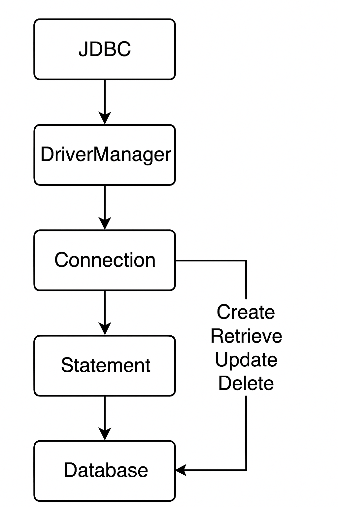

---

# **Java JDBC CRUD Tutorial**

---

## **Overview**

This lesson teaches how to perform **basic database operations (CRUD)** — Create, Retrieve, Update, and Delete — using **Java Database Connectivity (JDBC)** API.

These operations correspond to the SQL statements:

| CRUD Operation | SQL Equivalent |
| -------------- | -------------- |
| Create         | INSERT         |
| Retrieve       | SELECT         |
| Update         | UPDATE         |
| Delete         | DELETE         |

Although this tutorial uses **MySQL**, the same JDBC techniques can be applied to **any relational database** because JDBC is database-independent, and SQL is a standard language.

---

## **1. Prerequisites**

Before beginning, ensure you have installed the following software:

| Software                   | Version         | Purpose                          |
| -------------------------- | --------------- | -------------------------------- |
| **JDK**                    | 7 or later      | To compile and run Java programs |
| **MySQL Community Server** | 5.6.12 or later | Database management system       |
| **MySQL Workbench**        | (Optional)      | GUI for working with databases   |
| **MySQL Connector/J**      | 5.1.25          | JDBC driver for MySQL            |

After downloading **MySQL Connector/J**, extract the archive and place the `mysql-connector-java-<version>-bin.jar` file in your Java project’s classpath.

---

## **2. Creating a Sample MySQL Database**

We will create a database named **SampleDB** with a table called **Users**.
Execute the following SQL script in MySQL Workbench or the MySQL command line:

```sql
CREATE DATABASE SampleDB;

USE SampleDB;

CREATE TABLE users (
    user_id INT(11) NOT NULL AUTO_INCREMENT,
    username VARCHAR(45) NOT NULL,
    password VARCHAR(45) NOT NULL,
    fullname VARCHAR(45) NOT NULL,
    email VARCHAR(45) NOT NULL,
    PRIMARY KEY (user_id)
);
```

If using the MySQL command line, save the script as `SQLScript.sql` and run:

```bash
source Path\To\SQLScript.sql
```

---

## **3. Understanding Main JDBC Interfaces and Classes**

The **JDBC API** is located in the `java.sql` package.
Here are the primary interfaces and classes you will use:

| Class/Interface                   | Description                                                |
| --------------------------------- | ---------------------------------------------------------- |
| **DriverManager**                 | Manages JDBC drivers and establishes database connections. |
| **Connection**                    | Represents an active connection session with the database. |
| **Statement / PreparedStatement** | Used to execute SQL statements.                            |
| **ResultSet**                     | Holds data retrieved by a SELECT query.                    |
| **SQLException**                  | Handles database-related errors and exceptions.            |

### **Statement vs. PreparedStatement**

* **Statement** is used for static SQL queries.
* **PreparedStatement** is used for **parameterized queries** with placeholders (`?`) for dynamic values.

Example of parameterized SQL:

```sql
SELECT * FROM Users WHERE user_id = ?
```

The parameter value is set at runtime using:

```java
statement.setInt(1, 5);
```

---

## **4. Connecting to the Database**

To connect to MySQL (default port: 3306):

```java
import java.sql.Connection;
import java.sql.DriverManager;
import java.sql.SQLException;

public class DatabaseConnection {
    public static void main(String[] args) {
        String dbURL = "jdbc:mysql://localhost:3306/sampledb";
        String username = "root";
        String password = "secret";

        try (Connection conn = DriverManager.getConnection(dbURL, username, password)) {
            if (conn != null) {
                System.out.println("Connected to the database successfully!");
            }
        } catch (SQLException ex) {
            ex.printStackTrace();
        }
    }
}
```

✅ **Notes:**

* `DriverManager.getConnection()` establishes the connection.
* Using **try-with-resources** ensures the connection closes automatically.

---

## **5. Executing an INSERT Statement (Create)**

The following code inserts a new record into the **Users** table:

```java
String sql = "INSERT INTO Users (username, password, fullname, email) VALUES (?, ?, ?, ?)";

try (Connection conn = DriverManager.getConnection(dbURL, username, password);
     PreparedStatement statement = conn.prepareStatement(sql)) {

    statement.setString(1, "bill");
    statement.setString(2, "secretpass");
    statement.setString(3, "Bill Gates");
    statement.setString(4, "bill.gates@microsoft.com");

    int rowsInserted = statement.executeUpdate();
    if (rowsInserted > 0) {
        System.out.println("A new user was inserted successfully!");
    }
} catch (SQLException ex) {
    ex.printStackTrace();
}
```

🟢 **Key Points:**

* `executeUpdate()` executes INSERT, UPDATE, or DELETE statements.
* It returns the number of affected rows.
* Parameter indexes are **1-based** (first placeholder is index 1).

---

## **6. Executing a SELECT Statement (Retrieve)**

This example retrieves and displays all records from the **Users** table:

```java
String sql = "SELECT * FROM Users";

try (Connection conn = DriverManager.getConnection(dbURL, username, password);
     Statement statement = conn.createStatement();
     ResultSet result = statement.executeQuery(sql)) {

    int count = 0;

    while (result.next()) {
        String name = result.getString("username");
        String pass = result.getString("password");
        String fullname = result.getString("fullname");
        String email = result.getString("email");

        String output = "User #%d: %s - %s - %s - %s";
        System.out.println(String.format(output, ++count, name, pass, fullname, email));
    }
} catch (SQLException ex) {
    ex.printStackTrace();
}
```

🟢 **Key Points:**

* `executeQuery()` returns a `ResultSet`.
* Use `result.next()` to move through rows.
* Retrieve values using `getString()`, `getInt()`, etc.

---

## **7. Executing an UPDATE Statement (Update)**

This example updates a user’s details based on their username:

```java
String sql = "UPDATE Users SET password=?, fullname=?, email=? WHERE username=?";

try (Connection conn = DriverManager.getConnection(dbURL, username, password);
     PreparedStatement statement = conn.prepareStatement(sql)) {

    statement.setString(1, "123456789");
    statement.setString(2, "William Henry Bill Gates");
    statement.setString(3, "bill.gates@microsoft.com");
    statement.setString(4, "bill");

    int rowsUpdated = statement.executeUpdate();
    if (rowsUpdated > 0) {
        System.out.println("An existing user was updated successfully!");
    }
} catch (SQLException ex) {
    ex.printStackTrace();
}
```

🟢 **Key Points:**

* Use a `PreparedStatement` for parameterized updates.
* `executeUpdate()` returns how many rows were modified.

---

## **8. Executing a DELETE Statement (Delete)**

To delete a record whose username is `bill`:

```java
String sql = "DELETE FROM Users WHERE username=?";

try (Connection conn = DriverManager.getConnection(dbURL, username, password);
     PreparedStatement statement = conn.prepareStatement(sql)) {

    statement.setString(1, "bill");

    int rowsDeleted = statement.executeUpdate();
    if (rowsDeleted > 0) {
        System.out.println("A user was deleted successfully!");
    }
} catch (SQLException ex) {
    ex.printStackTrace();
}
```

🟢 **Key Points:**

* DELETE statements also use `executeUpdate()`.
* Always use **PreparedStatement** to avoid SQL injection vulnerabilities.

---

## **9. Summary**

| Operation    | SQL Command | JDBC Method     | Interface Used    |
| ------------ | ----------- | --------------- | ----------------- |
| **Create**   | INSERT      | executeUpdate() | PreparedStatement |
| **Retrieve** | SELECT      | executeQuery()  | Statement         |
| **Update**   | UPDATE      | executeUpdate() | PreparedStatement |
| **Delete**   | DELETE      | executeUpdate() | PreparedStatement |

---

## **10. Best Practices**

* Always use **PreparedStatement** for dynamic queries.
* Always close `Connection`, `Statement`, and `ResultSet` — use try-with-resources to simplify this.
* Handle **SQLException** properly for debugging and error tracing.
* Avoid hardcoding credentials in code; externalize them in configuration files.
* Use **parameterized queries** to prevent SQL injection.

---

## **11. Example Output**

```
Connected to the database successfully!
A new user was inserted successfully!
User #1: bill - secretpass - Bill Gates - bill.gates@microsoft.com
An existing user was updated successfully!
A user was deleted successfully!
```

---

## **12. Key Takeaways**

* JDBC provides a standard API for connecting and executing SQL on relational databases.
* The CRUD pattern is central to most database applications.
* Understanding how to map SQL statements to JDBC methods is essential for Java developers working with databases.

---

**JDBC flow diagram** 

