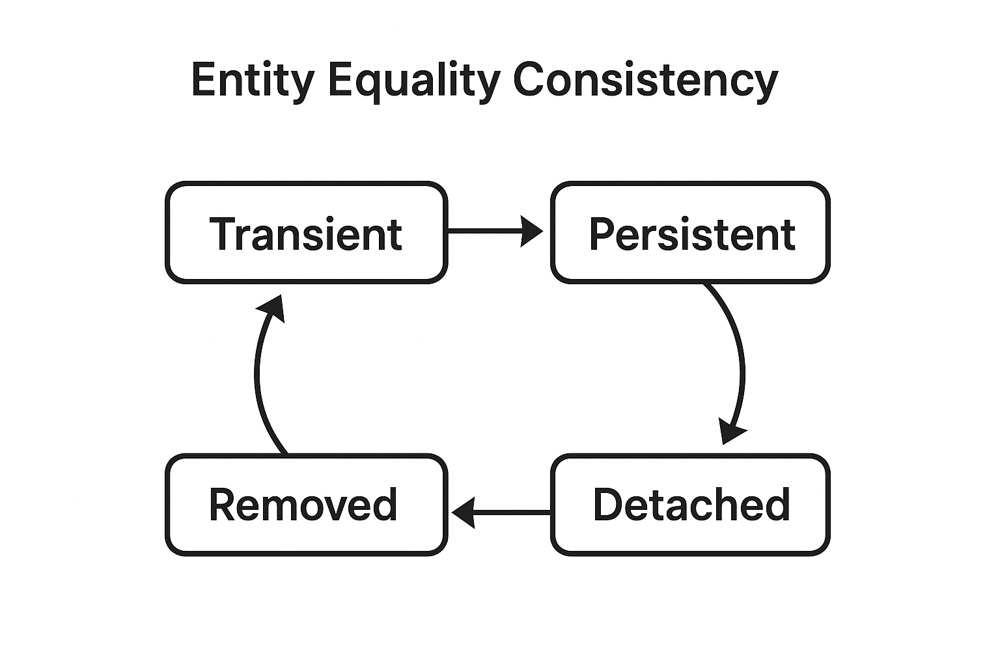

---

## 🧩 Lesson: Implementing `equals()` and `hashCode()` using JPA Entity Identifier

### 1. Introduction

In JPA entities, implementing `equals()` and `hashCode()` properly is **essential for entity identity consistency** across persistence states (transient, persistent, detached).

⚠️ **Key rule**:

> `equals()` and `hashCode()` must behave consistently across all entity state transitions.

This means that once an entity is placed in a collection (like a `Set`), its equality and hash code must remain stable, even after being persisted or merged.

---

### 2. Why Equality and Hash Code Matter

When JPA entities are added to a collection such as a `Set`, Java uses `equals()` and `hashCode()` to determine equality. If these methods change after persisting an entity (for example, due to ID generation), the entity may “disappear” from the collection because its hash changes.

That’s why careful implementation is necessary.

---

### 3. Equality Test Harness

A test method to validate equality consistency:

```java
protected <T extends Identifiable<Long>> void assertEqualityConsistency(Class<T> clazz, T entity) {

    Set<T> tuples = new HashSet<>();

    assertFalse(tuples.contains(entity));
    tuples.add(entity);
    assertTrue(tuples.contains(entity));

    doInJPA(entityManager -> {
        entityManager.persist(entity);
        entityManager.flush();
        assertTrue(tuples.contains(entity));
    });

    doInJPA(entityManager -> {
        T proxy = entityManager.getReference(clazz, entity.getId());
        assertTrue(proxy.equals(entity));
        assertTrue(entity.equals(proxy));
    });

    doInJPA(entityManager -> {
        T merged = entityManager.merge(entity);
        assertTrue(tuples.contains(merged));
    });

    doInJPA(entityManager -> {
        entityManager.unwrap(Session.class).update(entity);
        assertTrue(tuples.contains(entity));
    });

    doInJPA(entityManager -> {
        T found = entityManager.find(clazz, entity.getId());
        assertTrue(tuples.contains(found));
    });

    doInJPA(entityManager -> {
        T proxy = entityManager.getReference(clazz, entity.getId());
        assertTrue(tuples.contains(proxy));
    });

    T deletedEntity = doInJPA(entityManager -> {
        T ref = entityManager.getReference(clazz, entity.getId());
        entityManager.remove(ref);
        return ref;
    });

    assertTrue(tuples.contains(deletedEntity));
}
```

---

## 4. Case 1: Using a **Natural ID**

If your entity has a **natural key** (a unique, immutable business key), it’s best to use it for equality.

### ✅ Example

```java
@Entity
public class Book implements Identifiable<Long> {

    @Id
    @GeneratedValue
    private Long id;

    private String title;

    @NaturalId
    private String isbn; // Unique and immutable

    @Override
    public boolean equals(Object o) {
        if (this == o) return true;
        if (!(o instanceof Book)) return false;
        Book book = (Book) o;
        return Objects.equals(isbn, book.isbn);
    }

    @Override
    public int hashCode() {
        return Objects.hash(isbn);
    }

    // Getters and setters omitted
}
```

### 🧠 Notes

* `isbn` is annotated with `@NaturalId`, which tells Hibernate it’s a unique identifier.
* Works perfectly because the business key doesn’t change after persistence.

---

## 5. Case 2: Using Default `Object` Implementation

If we skip defining `equals()` and `hashCode()`, the default behavior uses **object references** — i.e., two different instances are always unequal, even if they represent the same database row.

### ❌ Example

```java
@Entity(name = "Book")
public class Book implements Identifiable<Long> {

    @Id
    @GeneratedValue
    private Long id;

    private String title;

    // No equals or hashCode defined
}
```

### ❗ Issue

When testing:

```java
Book book = new Book();
book.setTitle("High-Performance Java Persistence");
assertEqualityConsistency(Book.class, book);
```

You’ll get:

```
java.lang.AssertionError: The entity is not found after it's merged
```

👉 The merged entity is a new object, not equal to the original because of reference-based equality.

---

## 6. Case 3: Using the **Entity Identifier (Primary Key)** Directly

A common mistake is to implement equality using the entity ID directly, as generated by JPA.

### ❌ Example

```java
@Entity
public class Book implements Identifiable<Long> {

    @Id
    @GeneratedValue
    private Long id;

    private String title;

    @Override
    public boolean equals(Object o) {
        if (this == o) return true;
        if (!(o instanceof Book)) return false;
        Book book = (Book) o;
        return Objects.equals(id, book.id);
    }

    @Override
    public int hashCode() {
        return Objects.hash(id);
    }
}
```

### ❗ Problem

* Before persistence, `id` is `null`.
* After persistence, `id` changes.
* So `hashCode()` changes — violating the collection contract.

You’ll see:

```
java.lang.AssertionError: The entity is not found after it's persisted
```

---

## 7. Case 4: ✅ Correct Way — Stable Hash Code Using Identifier

To fix the issue, we must ensure the `hashCode()` **never changes** once the entity is in a collection.
The best practice is to use the class type for hash code and ID for equality only when it’s not `null`.

### ✅ Example

```java
@Entity
public class Book implements Identifiable<Long> {

    @Id
    @GeneratedValue
    private Long id;

    private String title;

    @Override
    public boolean equals(Object o) {
        if (this == o) return true;
        if (!(o instanceof Book)) return false;

        Book other = (Book) o;
        return id != null && id.equals(other.id);
    }

    @Override
    public int hashCode() {
        return getClass().hashCode();
    }

    // Getters and setters omitted
}
```

### 🧠 Why It Works

* As long as `id` is `null`, equality relies on object identity.
* Once persisted (and `id` assigned), equality relies on `id`.
* `hashCode()` always returns the same value (`getClass().hashCode()`), so it never changes while the entity lives in a collection.

---

## 8. ⚡ Performance Considerations

Some worry that a **constant hashCode** reduces hashing performance, but in practice:

| Collection size | Lookup time (ms) |
| --------------- | ---------------- |
| 250             | 0.006            |
| 1,000           | 0.069            |
| 10,000          | 0.25             |
| 50,000          | 0.862            |

Even with 50,000 entities in memory, the lookup penalty is under 1 millisecond — negligible compared to database query times.

👉 In OLTP systems, you’ll rarely hold more than a few hundred entities in memory anyway.

---

## 9. 🧾 Summary

| Case                         | Equality Key                          | Works? | Notes                      |
| ---------------------------- | ------------------------------------- | ------ | -------------------------- |
| Natural ID                   | Immutable business key (`@NaturalId`) | ✅      | Best option                |
| Default Object               | Reference equality                    | ❌      | Breaks after merge         |
| ID-based naive               | Primary key field                     | ❌      | Hash changes after persist |
| Fixed hashCode + ID equality | Primary key + constant hash           | ✅      | Correct and stable         |

---

## 10. ✅ Best Practice Summary

✔ Use a **business key** (like `@NaturalId`) whenever possible.
✔ If not, use **ID-based equality** with a **constant hashCode**.
✔ Never rely on auto-generated IDs before persistence.
✔ Never include mutable fields in `equals()` or `hashCode()`.

---

**Entity state transitions interactions with equality consistency**

