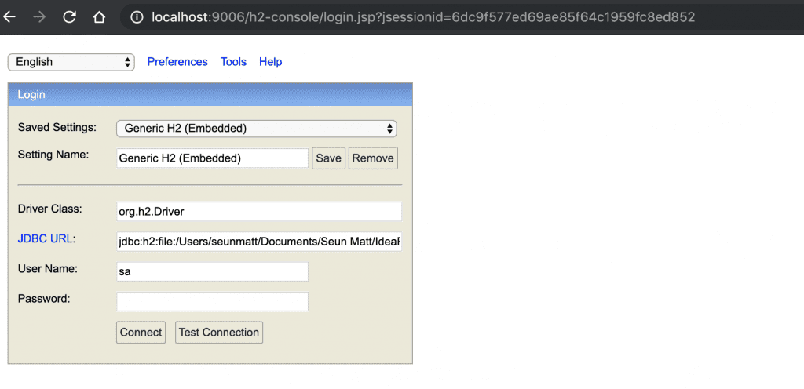
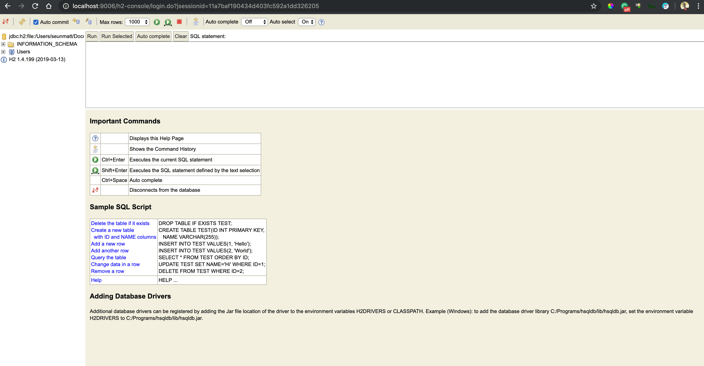
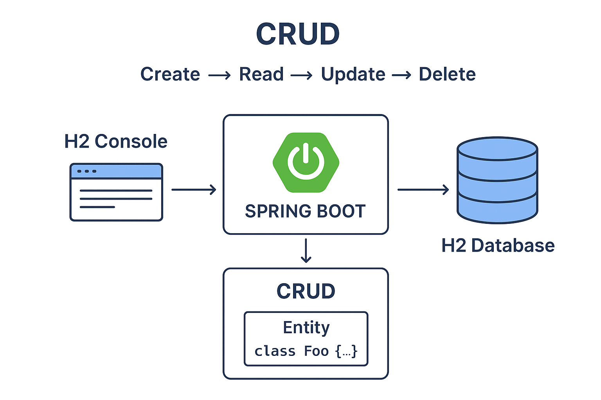

---

# 🧩 Lesson: Spring Boot with H2 Database and CRUD Operations

---

## 1. Introduction

Every kind of computing system works with data. Managing this data effectively is one of the most crucial parts of software operation.
Some data is **temporary** (used for processing and then discarded), while other data must be **stored and maintained** for long-term use.
To handle stored data, computing systems perform a set of fundamental operations known as **CRUD**.

---

## 2. What Is CRUD?

**CRUD** stands for the four basic operations used to manage data stored in a database:

| Letter | Operation  | Meaning                           |
| ------ | ---------- | --------------------------------- |
| **C**  | **Create** | Insert new data into the database |
| **R**  | **Read**   | Retrieve existing data            |
| **U**  | **Update** | Modify existing data              |
| **D**  | **Delete** | Remove data from the database     |

These four operations form the foundation of **data persistence** and represent the **data lifecycle** in most applications.

---

## 3. The Data Lifecycle

The typical data lifecycle follows the CRUD model:

1. **Create** → Data is inserted into the system.
2. **Read** → Data is retrieved for viewing or processing.
3. **Update** → Data is modified to reflect new information.
4. **Delete** → Data is removed when it is no longer needed.

🧭 **Lifecycle Flow**

```
Create → Read → Update → Delete
```

This cycle repeats continually as data evolves in the system.

---

## 4. Implementing CRUD with Spring Boot and H2

Spring Boot makes it easy to build CRUD applications using JPA and an embedded **H2 database**.

---

### 4.1. Step 1: Add Dependencies

Add the following to your `pom.xml`:

```xml
<dependency>
    <groupId>org.springframework.boot</groupId>
    <artifactId>spring-boot-starter-data-jpa</artifactId>
</dependency>

<dependency>
    <groupId>com.h2database</groupId>
    <artifactId>h2</artifactId>
    <scope>runtime</scope>
</dependency>
```

---

### 4.2. Step 2: Configure H2 Database

#### `Option 1: application.properties`

```properties
spring.datasource.url=jdbc:h2:mem:testdb
spring.datasource.driverClassName=org.h2.Driver
spring.datasource.username=sa
spring.datasource.password=
spring.jpa.database-platform=org.hibernate.dialect.H2Dialect
spring.jpa.hibernate.ddl-auto=update
spring.h2.console.enabled=true
```
#### `Option 2: application.yaml`
```yaml
spring:
  datasource:
    url: jdbc:h2:mem:testdb
    driverClassName: org.h2.Driver
    username: sa
    password:
  jpa:
    database-platform: org.hibernate.dialect.H2Dialect
    hibernate:
      ddl-auto: update
  h2:
    console:
      enabled: true
```
By default, in-memory mode is used, which means data is lost after each restart. To make it persistent, switch to file-based mode:
```properties
spring.datasource.url=jdbc:h2:file:/data/demo
```
Or in YAML:
```yaml
spring:
  datasource:
    url: jdbc:h2:file:/data/demo
```
---
### DataSource Initialization
You can pre-load test data using a data.sql file under src/main/resources:
```sql
INSERT INTO countries (id, name) VALUES (1, 'USA');
INSERT INTO countries (id, name) VALUES (2, 'France');
INSERT INTO countries (id, name) VALUES (3, 'Brazil');
INSERT INTO countries (id, name) VALUES (4, 'Italy');
INSERT INTO countries (id, name) VALUES (5, 'Canada');
```
Spring Boot automatically executes this script during startup. To ensure this runs after Hibernate generates the schema, add:
```properties
spring.jpa.defer-datasource-initialization=true
```
---
#### Access H2 console:
H2 database has an embedded GUI console for browsing the contents of a database and running SQL queries. By default, the H2 console is not enabled in Spring.
To enable it, we need to add the following property to application.properties:
```properties
spring.h2.console.enabled=true
```
If we’re using YAML configuration, we need to add the property to application.yaml:
```yaml
spring:
  h2:
    console:
      enabled: true
```
Then, after starting the application, we can navigate to http://localhost:8080/h2-console, which will present us with a login page.
On the login page, we’ll supply the same credentials that we used in the application.properties:


Once we connect, we’ll see a comprehensive webpage that lists all the tables on the left side of the page and a textbox for running SQL queries:

The web console has an auto-complete feature that suggests SQL keywords. The fact that the console is lightweight makes it handy for visually inspecting the database or executing raw SQL directly.
Moreover, we can further configure the console by specifying the following properties in the project’s application.properties with our desired values:
```properties
spring.h2.console.path=/h2-console
spring.h2.console.settings.trace=false
spring.h2.console.settings.web-allow-others=false
```
Likewise, when using YAML configuration, we can add the above properties as:
```yaml
spring:
  h2:
    console:
      path: /h2-console
      settings.trace: false
      settings.web-allow-others: false
```
In the snippets above, we set the console path to be /h2-console, which is relative to the address and port of our running application. Therefore, if our app is running at http://localhost:9001, the console will be available at http://localhost:9001/h2-console.
Furthermore, we set spring.h2.console.settings.trace to false to prevent trace output, and we can also disable remote access by setting spring.h2.console.settings.web-allow-others to false.

**Login example:**

* Driver Class: `org.h2.Driver`
* JDBC URL: `jdbc:h2:mem:testdb`
* Username: `sa`
* Password: *(leave empty)*

---

### 4.3. Step 3: Create an Entity

```java
@Entity
public class Country {

    @Id
    @GeneratedValue(strategy = GenerationType.IDENTITY)
    private Long id;

    private String name;

    public Country() {}

    public Country(String name) {
        this.name = name;
    }

    // Getters and setters
    public Long getId() { return id; }
    public void setId(Long id) { this.id = id; }
    public String getName() { return name; }
    public void setName(String name) { this.name = name; }
}
```

---

### 4.4. Step 4: Create a Repository

```java
public interface CountryRepository extends JpaRepository<Country, Long> {
}
```

---

### 4.5. Step 5: Create a REST Controller

```java
@RestController
@RequestMapping("/countries")
public class CountryController {

    @Autowired
    private CountryRepository repository;

    // CREATE
    @PostMapping
    public Country addCountry(@RequestBody Country country) {
        return repository.save(country);
    }

    // READ - all
    @GetMapping
    public List<Country> getAllCountries() {
        return repository.findAll();
    }

    // READ - by id
    @GetMapping("/{id}")
    public ResponseEntity<Country> getCountryById(@PathVariable Long id) {
        return repository.findById(id)
                .map(ResponseEntity::ok)
                .orElse(ResponseEntity.notFound().build());
    }

    // UPDATE
    @PutMapping("/{id}")
    public ResponseEntity<Country> updateCountry(@PathVariable Long id, @RequestBody Country updatedCountry) {
        return repository.findById(id)
                .map(country -> {
                    country.setName(updatedCountry.getName());
                    return ResponseEntity.ok(repository.save(country));
                })
                .orElse(ResponseEntity.notFound().build());
    }

    // DELETE
    @DeleteMapping("/{id}")
    public ResponseEntity<Void> deleteCountry(@PathVariable Long id) {
        return repository.findById(id)
                .map(country -> {
                    repository.delete(country);
                    return ResponseEntity.noContent().<Void>build();
                })
                .orElse(ResponseEntity.notFound().build());
    }
}
```

---

## 5. CRUD Operation Examples

Let’s demonstrate CRUD using the above REST API with H2 Database.

---

### 5.1. **C – Create**

**HTTP Method:** `POST`
**Endpoint:** `http://localhost:8080/countries`

**Request Body:**

```json
{
  "name": "Canada"
}
```

**Response:**

```json
{
  "id": 1,
  "name": "Canada"
}
```

💡 The new record is now created in the H2 database.

---

### 5.2. **R – Read**

#### a) Read All

**HTTP Method:** `GET`
**Endpoint:** `http://localhost:8080/countries`

**Response:**

```json
[
  {"id": 1, "name": "Canada"},
  {"id": 2, "name": "Brazil"}
]
```

#### b) Read by ID

**HTTP Method:** `GET`
**Endpoint:** `http://localhost:8080/countries/1`

**Response:**

```json
{"id": 1, "name": "Canada"}
```

---

### 5.3. **U – Update**

**HTTP Method:** `PUT`
**Endpoint:** `http://localhost:8080/countries/1`

**Request Body:**

```json
{
  "name": "Canada Updated"
}
```

**Response:**

```json
{
  "id": 1,
  "name": "Canada Updated"
}
```

---

### 5.4. **D – Delete**

**HTTP Method:** `DELETE`
**Endpoint:** `http://localhost:8080/countries/1`

**Response:**

```
204 No Content
```

✅ The record is deleted and no longer available in the database.

---

## 6. Database URL Options 
Let’s explore some URL options to customize the H2 database further:
* **DB_CLOSE_DELAY = -1**: This option ensures the database remains open as long as the Java Virtual Machine (JVM) is running. It prevents it from closing automatically when the last connection is closed. By default, the database closes when the last connection is terminated. The default value is zero. However, it’s essential to shut down the database with a shutdown command to avoid potential memory leaks.
* **DB_CLOSE_ON_EXIT = FALSE**: By default, H2 closes the database upon JVM shutdown. Setting this option to FALSE keeps the database open even after the JVM shuts down. This might be useful in a case where the database needs to remain open for post-shutdown processes, such as logging shutdown activities.
* **AUTO_RECONNECT = TRUE**: This enables the database to reconnect when a connection is lost automatically. The default value is FALSE. Enabling this option might be helpful in an environment where network issues can cause disconnections.
* **MODE=PostgreSQL**: This option sets the H2 database to emulate the behavior of a PostgreSQL database. It provides compatibility modes for different database systems, such as MySQL, ORACLE, etc.

Summary

| Option                   | Description                                     | Full Example URL                            |
| ------------------------ | ----------------------------------------------- | ------------------------------------------- |
| `DB_CLOSE_DELAY=-1`      | Keeps the database open as long as the JVM runs | `jdbc:h2:mem:testdb;DB_CLOSE_DELAY=-1`      |
| `DB_CLOSE_ON_EXIT=FALSE` | Prevents automatic closing when JVM stops       | `jdbc:h2:mem:testdb;DB_CLOSE_ON_EXIT=FALSE` |
| `AUTO_RECONNECT=TRUE`    | Reconnects automatically after disconnection    | `jdbc:h2:mem:testdb;AUTO_RECONNECT=TRUE`    |
| `MODE=PostgreSQL`        | Makes H2 behave like a PostgreSQL database      | `jdbc:h2:mem:testdb;MODE=PostgreSQL`        |

These parameters are helpful for testing behavior across different DB modes and ensuring your in-memory data persists as needed during runtime.
Example Configuration:
```sql
jdbc:h2:mem:testdb;DB_CLOSE_DELAY=-1;DB_CLOSE_ON_EXIT=FALSE;AUTO_RECONNECT=TRUE;MODE=PostgreSQL
```

---

## 7. CRUD Lifecycle Diagram (Conceptual)

```
 ┌────────────┐
 │   Create   │  → Insert data into database
 └──────┬─────┘
        ↓
 ┌────────────┐
 │    Read    │  → Retrieve and display data
 └──────┬─────┘
        ↓
 ┌────────────┐
 │   Update   │  → Modify existing data
 └──────┬─────┘
        ↓
 ┌────────────┐
 │   Delete   │  → Remove data permanently
 └────────────┘
```

This cycle represents how data flows through most persistent systems — from creation to deletion.

---

## 8. Conclusion

In this lesson, you learned:

* The meaning and purpose of **CRUD operations**
* How CRUD fits into the **data lifecycle**
* How to **implement CRUD** using **Spring Boot + H2 Database**
* How to use **H2 console** to visualize and test your data
* How to **customize H2 URL options** for advanced testing scenarios

---

## Visualizing the **CRUD data lifecycle** 

