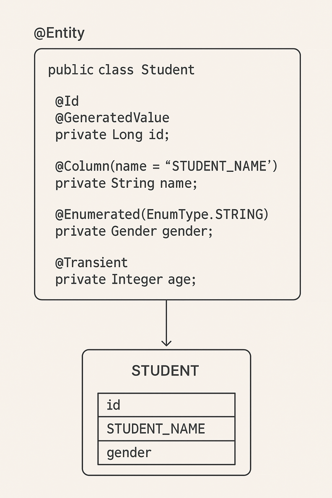

---

## **Module: Spring Persistence**

### **Lesson: Defining JPA Entities**

---

### **1. Introduction**

In this lesson, we’ll learn the fundamentals of **JPA entities**, including the annotations that define and customize them.
Entities are the core of Java Persistence API (JPA) — they represent data stored in a relational database.

---

### **2. Entity**

An **entity** in JPA is a **Plain Old Java Object (POJO)** that represents a **table** in the database.
Each instance of an entity corresponds to a **row** in that table.

```java
public class Student {
    // fields, getters and setters
}
```

To make JPA aware of this class, we mark it with the `@Entity` annotation.

---

### **2.1. The `@Entity` Annotation**

We apply `@Entity` at the class level.
It marks a class as a **persistent entity** that JPA will manage.

```java
import jakarta.persistence.Entity;

@Entity
public class Student {
    // fields, getters and setters
}
```

By default, the table name is the **same as the class name**, but we can rename it:

```java
@Entity(name = "student")
public class Student {
    // fields, getters and setters
}
```

✅ **Key Points**

* The entity class **must not be final**.
* It must include a **no-argument constructor**.
* It must define a **primary key** (`@Id`).

---

### **2.2. The `@Id` Annotation**

Each JPA entity needs a **primary key** to uniquely identify its instances.
Use the `@Id` annotation, optionally with `@GeneratedValue`, to define it.

```java
import jakarta.persistence.*;

@Entity
public class Student {

    @Id
    @GeneratedValue(strategy = GenerationType.AUTO)
    private Long id;

    private String name;

    // getters and setters
}
```

**Generation Strategies**:

* `AUTO` → JPA chooses the best strategy
* `IDENTITY` → Uses database identity columns
* `SEQUENCE` → Uses a database sequence
* `TABLE` → Uses a separate table to generate IDs

---

### **2.3. The `@Table` Annotation**

If the table name in the database is different from the entity name,
we can specify it with `@Table`.

```java
@Entity
@Table(name = "STUDENT")
public class Student {
    // fields, getters and setters
}
```

We can also include a schema name:

```java
@Entity
@Table(name = "STUDENT", schema = "SCHOOL")
public class Student {
    // fields, getters and setters
}
```

✅ **Key Points**

* Default table name = entity name.
* `schema` helps organize tables under different namespaces.

---

### **2.4. The `@Column` Annotation**

The `@Column` annotation customizes how a field maps to a database column.
We can specify name, length, nullability, and uniqueness.

```java
@Entity
@Table(name = "STUDENT")
public class Student {

    @Id
    @GeneratedValue(strategy = GenerationType.AUTO)
    private Long id;

    @Column(name = "STUDENT_NAME", length = 50, nullable = false, unique = false)
    private String name;

    // other fields, getters and setters
}
```

✅ **Common Attributes**

* `name` → column name
* `length` → column length (for `VARCHAR`)
* `nullable` → whether null is allowed
* `unique` → whether values must be unique

If `@Column` is not specified, the field name becomes the column name.

---

### **2.5. The `@Transient` Annotation**

Some fields shouldn’t be saved to the database — like calculated values.
We use `@Transient` to exclude them from persistence.

```java
@Entity
@Table(name = "STUDENT")
public class Student {
    @Id
    @GeneratedValue(strategy = GenerationType.AUTO)
    private Long id;

    @Column(name = "STUDENT_NAME", length = 50, nullable = false)
    private String name;

    @Transient
    private Integer age; // not persisted

    // other fields, getters and setters
}
```

✅ **Use Case**: derived or temporary fields that don’t belong in the database.

---

### **2.6. The `@Temporal` Annotation**

The `@Temporal` annotation defines how **java.util.Date** or **java.util.Calendar** fields
are mapped to SQL date/time columns.

```java
@Entity
@Table(name = "STUDENT")
public class Student {
    @Id
    @GeneratedValue(strategy = GenerationType.AUTO)
    private Long id;

    @Column(name = "STUDENT_NAME", length = 50, nullable = false)
    private String name;

    @Temporal(TemporalType.DATE)
    private Date birthDate;

    // other fields, getters and setters
}
```

**Temporal Types:**

* `TemporalType.DATE` → only date
* `TemporalType.TIME` → only time
* `TemporalType.TIMESTAMP` → both date and time

> ⚠️ Note: With JPA 3.1+, prefer `java.time` types such as `LocalDate`, `LocalDateTime`, etc., which don’t need `@Temporal`.

---

### **2.7. The `@Enumerated` Annotation**

To persist Java enums, use the `@Enumerated` annotation.

```java
public enum Gender {
    MALE,
    FEMALE
}
```

```java
@Entity
@Table(name = "STUDENT")
public class Student {

    @Id
    @GeneratedValue(strategy = GenerationType.AUTO)
    private Long id;

    @Column(name = "STUDENT_NAME", length = 50, nullable = false)
    private String name;

    @Enumerated(EnumType.STRING)
    private Gender gender;

    // other fields, getters and setters
}
```

✅ **Options**

* `EnumType.ORDINAL` → stores integer index (default)
* `EnumType.STRING` → stores enum name (recommended for readability)

---

### **3. Example – Complete Entity**

```java
package com.example.demo.entity;

import jakarta.persistence.*;
import java.util.Date;

@Entity
@Table(name = "STUDENT", schema = "SCHOOL")
public class Student {

    @Id
    @GeneratedValue(strategy = GenerationType.AUTO)
    private Long id;

    @Column(name = "STUDENT_NAME", length = 50, nullable = false)
    private String name;

    @Enumerated(EnumType.STRING)
    private Gender gender;

    @Temporal(TemporalType.DATE)
    private Date birthDate;

    @Transient
    private Integer age;

    public Student() {}

    // getters and setters
}
```

---

### **4. Testing the Entity with H2**

You can test this entity easily with an in-memory **H2 database**:

```properties
spring.datasource.url=jdbc:h2:mem:schooldb;DB_CLOSE_DELAY=-1
spring.datasource.driverClassName=org.h2.Driver
spring.datasource.username=sa
spring.datasource.password=
spring.jpa.hibernate.ddl-auto=update
spring.h2.console.enabled=true
```

Run the app and visit
👉 `http://localhost:8080/h2-console`
to see the generated **STUDENT** table.

---

### **5. Conclusion**

In this lesson, we learned:

* What JPA entities are and how they map to database tables.
* How to use core annotations like `@Entity`, `@Id`, `@Table`, and `@Column`.
* How to customize fields with `@Transient`, `@Temporal`, and `@Enumerated`.

These building blocks form the foundation of any **JPA-based persistence layer** in Spring applications.

---
**How a JPA entity maps to a database table**

