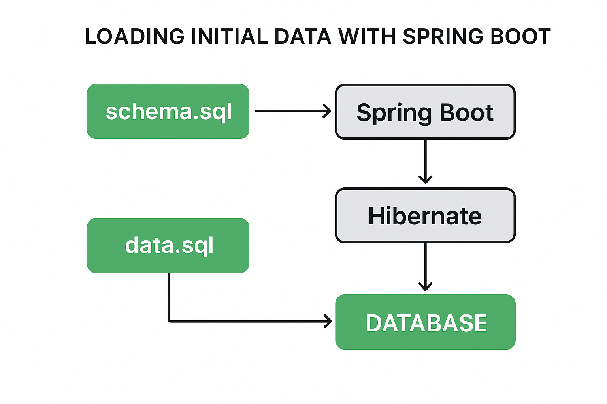

---

## **Module 4: Spring Boot Database Initialization**

### **Lesson: Quick Guide on Loading Initial Data with Spring Boot**

---

### **1. Overview**

Spring Boot makes database management seamless.
By default, Spring Boot:

* Detects JPA entities
* Automatically creates the necessary tables in the database

However, when we need more **control** over table creation or data insertion, we can use:

* `schema.sql` – to define the database schema
* `data.sql` – to preload initial data

These files can be automatically detected and executed by Spring Boot at startup.

---

### **2. The `data.sql` File**

Let’s define a simple **JPA entity** named `Country`:

```java
@Entity
public class Country {

    @Id
    @GeneratedValue(strategy = GenerationType.IDENTITY)
    private Integer id;
    
    @Column(nullable = false)
    private String name;

    // Getters and Setters
}
```

Running the application will create the `country` table, but it will be **empty**.
We can populate it with data using a `data.sql` file placed in the `src/main/resources` directory.

```sql
-- data.sql
INSERT INTO country (name) VALUES ('India');
INSERT INTO country (name) VALUES ('Brazil');
INSERT INTO country (name) VALUES ('USA');
INSERT INTO country (name) VALUES ('Italy');
```

By default, this script executes **before Hibernate initialization**, which can cause issues if the table doesn’t exist yet.
To ensure the schema is ready first, add the following property in `application.properties`:

```properties
spring.jpa.defer-datasource-initialization=true
spring.sql.init.mode=always
```

✅ `spring.jpa.defer-datasource-initialization=true`
→ Defers SQL script execution until after Hibernate has created tables.

✅ `spring.sql.init.mode=always`
→ Ensures Spring always runs `schema.sql` and `data.sql`, even for non-embedded databases.

---

### **3. The `schema.sql` File**

We can also explicitly define database schema using `schema.sql`.

```sql
-- schema.sql
CREATE TABLE USERS (
  ID INT NOT NULL AUTO_INCREMENT,
  NAME VARCHAR(100) NOT NULL,
  STATUS INT,
  PRIMARY KEY (ID)
);
```

When `schema.sql` is present, Spring Boot will **use it** instead of automatically generating the schema from entities.

If we use both Hibernate DDL and `schema.sql` together, conflicts can occur.
To avoid this, disable Hibernate DDL auto-creation:

```properties
spring.jpa.hibernate.ddl-auto=none
```

This ensures that **only** the SQL scripts handle schema creation.

If you still want both Hibernate schema generation and script-based initialization, keep both properties:

```properties
spring.jpa.defer-datasource-initialization=true
spring.sql.init.mode=always
```

---

### **4. Controlling Database Creation Using Hibernate**

The property `spring.jpa.hibernate.ddl-auto` controls how Hibernate manages the database schema.

| Value           | Description                                |
| --------------- | ------------------------------------------ |
| **create**      | Drops existing tables and creates new ones |
| **update**      | Updates the schema without deleting data   |
| **create-drop** | Drops schema at shutdown                   |
| **validate**    | Validates the schema without modifying it  |
| **none**        | Disables automatic schema management       |

Example:

```properties
spring.jpa.hibernate.ddl-auto=update
```

> 💡 **Tip:** Use `create-drop` or `create` for testing, and `update` for local development.

---

### **5. Customizing Database Schema Creation**

Spring Boot’s database initialization mode can be controlled with:

```properties
spring.sql.init.mode=always
```

Available options:

* **always** – always initialize the database (recommended for testing)
* **embedded** – only for embedded DBs like H2 or HSQL (default)
* **never** – disables initialization

If using MySQL or PostgreSQL, you’ll likely need:

```properties
spring.sql.init.mode=always
```

---

### **6. Using the `@Sql` Annotation**

Spring provides the `@Sql` annotation to initialize or clean up test data during integration testing.

---

#### **6.1. @Sql at the Class Level**

```java
@Sql({"/employees_schema.sql", "/import_employees.sql"})
public class SpringBootInitialLoadIntegrationTest {

    @Autowired
    private EmployeeRepository employeeRepository;

    @Test
    public void testLoadDataForTestClass() {
        assertEquals(3, employeeRepository.findAll().size());
    }
}
```

The scripts execute before the test class runs.
We can also define an explicit execution phase:

```java
@Sql(scripts = {"/employees_schema.sql", "/import_employees.sql"}, 
     executionPhase = BEFORE_TEST_CLASS)
public class SpringBootInitialLoadIntegrationTest { }
```

To clean up after tests:

```java
@Sql(scripts = {"/delete_employees_data.sql"}, executionPhase = AFTER_TEST_CLASS)
```

---

#### **6.2. @Sql at the Method Level**

Used for running scripts before or after individual test methods.

```java
@Test
@Sql(scripts = {"/import_senior_employees.sql"}, executionPhase = BEFORE_TEST_METHOD)
public void testLoadDataForTestCase() {
    assertEquals(5, employeeRepository.findAll().size());
}
```

By default, method-level annotations override class-level ones.
To merge them, use `@SqlMergeMode(MERGE)`.

---

### **7. The `@SqlConfig` Annotation**

We can configure how SQL scripts are parsed and executed:

```java
@Test
@Sql(
  scripts = {"/import_senior_employees.sql"}, 
  config = @SqlConfig(
      encoding = "utf-8", 
      transactionMode = TransactionMode.ISOLATED
  )
)
public void testLoadDataForTestCase() {
    assertEquals(5, employeeRepository.findAll().size());
}
```

**Common @SqlConfig Attributes:**

| Attribute       | Description                   |
| --------------- | ----------------------------- |
| encoding        | File encoding                 |
| separator       | SQL statement separator       |
| transactionMode | How transactions are handled  |
| dataSource      | Data source name              |
| commentPrefix   | Comment prefix in SQL scripts |
| errorMode       | How to handle errors          |

---

### **8. The `@SqlGroup` Annotation**

For Java 7 (without repeatable annotations), use `@SqlGroup` to run multiple `@Sql` annotations:

```java
@SqlGroup({
  @Sql(scripts = "/employees_schema.sql", config = @SqlConfig(transactionMode = TransactionMode.ISOLATED)),
  @Sql("/import_employees.sql")
})
public class SpringBootSqlGroupAnnotationIntegrationTest {

    @Autowired
    private EmployeeRepository employeeRepository;

    @Test
    public void testLoadDataForTestCase() {
        assertEquals(3, employeeRepository.findAll().size());
    }
}
```

---

### **9. Conclusion**

In this lesson, we explored different ways to **load initial data** in Spring Boot:

* Using `schema.sql` and `data.sql` for automatic startup initialization
* Managing schema generation via Hibernate (`spring.jpa.hibernate.ddl-auto`)
* Using annotations like `@Sql`, `@SqlConfig`, and `@SqlGroup` for **test data management**

✅ Best practice:

* Use `schema.sql` and `data.sql` for **simple setup and testing**
* Use **Liquibase** or **Flyway** for **production-grade schema migrations**

---

### Flow between `schema.sql`, `data.sql`, Hibernate, and the Spring Boot initialization process ###


