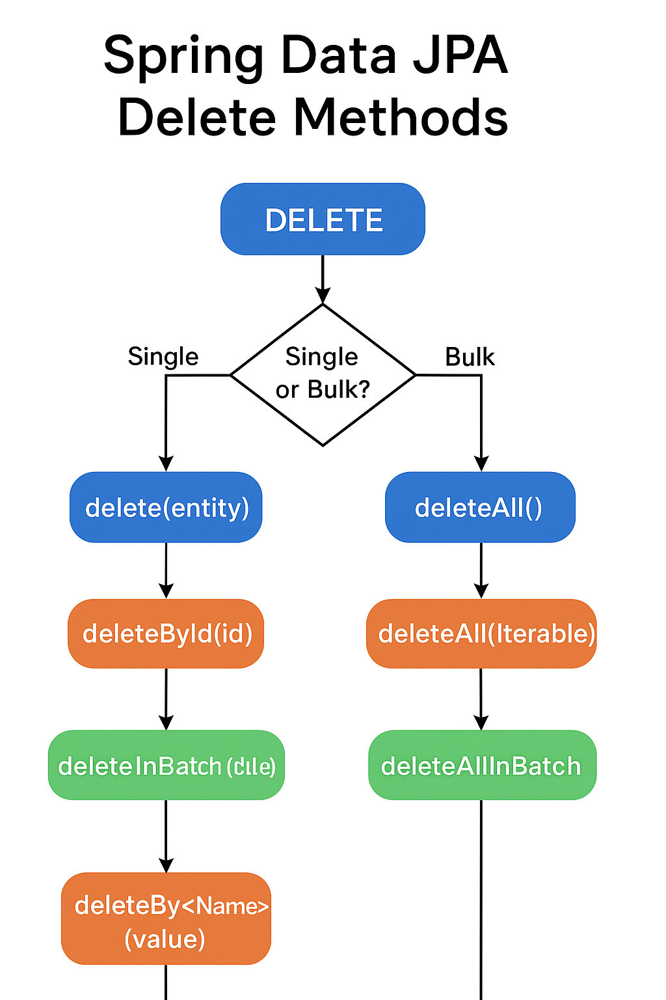

---

# **📘 Lesson Notes: Spring Data JPA Delete Methods**

## **1. Introduction**

Spring Data JPA provides a variety of ways to delete records from the database. These deletion mechanisms allow developers to remove:

* A single entity
* Multiple entities
* Entities that meet specific criteria
* Entities involved in relationships

Spring Data JPA supports:

* **Built-in delete methods** (from `CrudRepository`)
* **Derived delete queries** (e.g., `deleteByName`)
* **Custom JPQL delete queries** using `@Query` + `@Modifying`
* **Cascade deletes** when entities are related

---

# **2. Basic Delete Operations with CrudRepository**

Any repository that extends `CrudRepository`, `JpaRepository`, or `PagingAndSortingRepository` inherits essential delete functions:

### **CrudRepository Delete Methods**

```java
public interface CrudRepository<T, ID> extends Repository<T, ID> {

    <S extends T> S save(S entity);

    T findOne(ID id);

    Iterable<T> findAll();

    long count();

    void delete(T entity);

    void deleteById(ID id);

    void deleteAll();
}
```

### **2.1 Delete by Entity Instance**

```java
Campaign c1 = campaignRepository.findById(1L).get();
campaignRepository.delete(c1);
```

This deletes the entity **and cascades deletions** if relationships allow it (e.g., `cascade = CascadeType.ALL`).

---

### **2.2 Delete by ID**

```java
campaignRepository.deleteById(2L);
```

Deletes the row where the primary key = 2.

---

### **2.3 Delete All Entities**

```java
campaignRepository.deleteAll();
```

Removes all rows in the table.

---

### **2.4 Delete Multiple Entities at Once**

```java
Iterable<Campaign> toDelete =
    campaignRepository.findAllById(List.of(3L, 5L));

campaignRepository.deleteAll(toDelete);
```

Deletes all entities in the provided Iterable.

---

# **3. Derived Delete Queries**

Spring Data JPA supports **derived delete method names**, the same way it supports derived finder queries (`findBy…`).
The delete method begins with:

* `deleteBy...`
* `removeBy...`

### **Example Repository**

```java
public interface CampaignRepository extends CrudRepository<Campaign, Long> {

    @Transactional
    Long deleteByNameContaining(String name);

    @Transactional
    void removeByNameContaining(String name);
}
```

### Notes:

* Methods can return `void`, `Long`, or even `List<Entity>`.
* **MUST be annotated with `@Transactional`**, because delete operations modify data.
* The `remove` prefix behaves the same as `delete`.

---

### **3.1 Example: Delete by Name (Derived Method)**

```java
@Transactional
Long deleteByNameContaining(String name);
```

Usage:

```java
Long deletedCount = campaignRepository.deleteByNameContaining("Campaign 2");
LOG.info("Removed: " + deletedCount);
```

---

### **3.2 Example: Removing by Name (removeBy)**

```java
@Transactional
void removeByNameContaining(String name);
```

Equivalent behavior to `deleteBy`.

---

# **4. Behavior of Derived Delete Queries**

📌 **Important Behavior Rule**
Derived delete methods:

> First perform a **SELECT**, then delete the returned entities **one by one**, allowing lifecycle callbacks such as `@PreRemove` to run.

This means:

* **Slower for large datasets**
* **Entities are loaded into memory**
* **Callbacks are executed**

---

# **5. Custom JPQL Delete Queries (`@Query`)**

If you need:

* Better performance
* A more complex delete condition
* Joins
* Shorter method names

You can use a custom JPQL delete statement.

### **Example**

```java
@Modifying
@Query("delete from Book b where b.title = :title")
void deleteBooks(@Param("title") String title);
```

### Compared to derived delete:

| Derived Delete                      | Custom JPQL Delete           |
| ----------------------------------- | ---------------------------- |
| Loads entities first                | Executes 1 SQL DELETE query  |
| Triggers entity lifecycle callbacks | Does *not* trigger callbacks |
| Returns list of deleted entities    | Returns delete count         |
| Slower for large data sets          | Faster + more efficient      |

### Example Test

```java
@Test
@Transactional
public void whenDeleteFromCustomQuery_thenSuccessful() {
    repository.deleteBooks("The Hobbit");
    assertThat(repository.count()).isEqualTo(1);
}
```

---

# **6. Delete Methods for Entities with Relationships**

Consider:

### **Category → Book (OneToMany)**

```java
@Entity
public class Category {
    @OneToMany(mappedBy="category",
               cascade=CascadeType.ALL,
               orphanRemoval=true)
    private List<Book> books;
}
```

### **Deleting a Category Deletes Its Books**

```java
categoryRepository.deleteAll();
```

All books are deleted because of:

* `cascade = CascadeType.ALL`
* `orphanRemoval = true`

### **Deleting Books Does NOT Delete Categories**

```java
bookRepository.deleteAll();

assertThat(categoryRepository.count()).isEqualTo(2); // still present
```

---

# **7. Performance Considerations**

### Derived Delete Queries

* Load all matching entities into memory before deleting.
* Fire lifecycle events.
* Can cause **memory issues** with large datasets.

### Custom @Query Deletes

* Execute a **single DELETE query**.
* No callbacks.
* Best for bulk deletes.

---

# **8. Example with Fruit Entity (Derived Delete Methods)**

### **Entity**

```java
@Entity
public class Fruit {
    @Id
    private long id;
    private String name;
    private String color;
}
```

### **Repository**

```java
@Repository
public interface FruitRepository extends JpaRepository<Fruit, Long> {

    Long deleteByName(String name);

    List<Fruit> deleteByColor(String color);

    Long removeByName(String name);

    List<Fruit> removeByColor(String color);
}
```

### **Test Example**

```java
@Transactional
@Test
public void givenFruits_WhenDeletedByColor_ThenReturnDeleted() {

    List<Fruit> deleted = fruitRepository.deleteByColor("green");

    assertEquals(2, deleted.size());
}
```

---

# **9. Reserved Delete Methods**

These come from `CrudRepository` and cannot be overridden:

| Method          | Description          |
| --------------- | -------------------- |
| `deleteById`    | Delete by PK         |
| `deleteAllById` | Bulk delete by IDs   |
| `findById`      | Load by PK           |
| `existsById`    | Check existence      |
| `findAllById`   | Load multiple by IDs |

---

# **10. Keywords for Derived Delete Queries**

Derived delete queries support full predicate syntax:

Examples:

* `deleteByName`
* `deleteByNameContaining`
* `deleteByAgeGreaterThan`
* `deleteByCreatedDateBefore`
* `deleteByColorIgnoreCase`
* `deleteByStatusOrderByIdDesc`

Supports operators like:

* `Containing`, `Between`, `LessThan`, `GreaterThan`, `In`
* `IgnoreCase`
* `OrderBy`

---

# **11. Conclusion**

Spring Data JPA offers several flexible ways to delete data:

### ✔ Basic Repository Deletes

* `deleteById`
* `deleteAll`
* `delete(entity)`

### ✔ Derived Delete Queries

* `deleteByName(...)`
* `removeByColor(...)`
* Good for entity-level deletes with lifecycle events

### ✔ Custom `@Query` Deletes

* Best for bulk deletes
* More efficient
* No lifecycle callbacks

### ✔ Relationship Deletes

* Controlled via cascade rules
* Bi-directionality matters

Each approach is useful depending on your project needs, performance constraints, and domain model.

---

Below is a **clean, comprehensive summary table** comparing all major **Spring Data JPA Delete Methods**, their behavior, when to use them, and examples.

---

# **📘 Summary Table: Spring Data JPA Delete Methods**

| **Method Type**                          | **Example Method**               | **Triggers Lifecycle Callbacks?** (`@PreRemove`) | **Loads Entities Before Deleting?** | **Transactional Required?**                          | **Return Type Options**  | **Best Use Case**                               |
| ---------------------------------------- | -------------------------------- | ------------------------------------------------ | ----------------------------------- | ---------------------------------------------------- | ------------------------ | ----------------------------------------------- |
| **Built-in: delete(entity)**             | `repository.delete(campaign)`    | ✔ Yes                                            | ✔ Yes                               | Auto (built-in)                                      | void                     | Remove one loaded entity; cascade deletes apply |
| **Built-in: deleteById(id)**             | `repository.deleteById(1L)`      | ✔ Yes                                            | ✔ Yes (loads entity first)          | Auto                                                 | void                     | Delete single row by ID                         |
| **Built-in: deleteAll()**                | `repository.deleteAll()`         | ✔ Yes                                            | ✔ Yes                               | Auto                                                 | void                     | Delete all rows; cascade applies                |
| **Built-in: deleteAll(Iterable)**        | `repository.deleteAll(list)`     | ✔ Yes                                            | ✔ Yes                               | Auto                                                 | void                     | Delete multiple specified entities              |
| **Derived Delete Method**                | `deleteByName(String name)`      | ✔ Yes                                            | ✔ Yes (SELECT then DELETE)          | ✔ Must annotate with `@Transactional`                | void, Long, List<Entity> | Small/mid-size deletes with callback support    |
| **Derived Remove Method**                | `removeByColor(String color)`    | ✔ Yes                                            | ✔ Yes                               | ✔ Must annotate                                      | void, Long, List<Entity> | Same as deleteBy; alternative naming            |
| **Custom JPQL Delete (@Query)**          | `@Query("delete…")`              | ✘ No                                             | ✘ No (direct bulk delete)           | ✔ Must annotate with `@Transactional` + `@Modifying` | int (# deleted)          | Large-scale, high-performance deletions         |
| **deleteAllById(Iterable)**              | `repository.deleteAllById(ids)`  | ✔ Yes                                            | ✔ Yes                               | Auto                                                 | void                     | Bulk delete by IDs                              |
| **deleteInBatch(...)** *(JpaRepository)* | `repository.deleteInBatch(list)` | ✘ No                                             | ✘ No                                | ✔ Auto                                               | void                     | Batch delete without loading entities           |
| **deleteAllInBatch()** *(JpaRepository)* | `repository.deleteAllInBatch()`  | ✘ No                                             | ✘ No                                | ✔ Auto                                               | void                     | Fastest way to delete all records               |

---

# **📌 Quick Notes**

### **Lifecycle Callbacks**

* Only methods that **load entities first** trigger `@PreRemove`.
* Bulk delete queries (`@Query`, `deleteInBatch`, `deleteAllInBatch`) **skip callbacks**.

### **Performance**

* **Slowest**: Derived delete methods (load all entities first → delete one-by-one).
* **Fastest**: JPQL bulk deletes + batch deletion methods.

### **Transaction Requirement**

* Built-in methods = transaction handled automatically
* Custom & derived delete queries = **must use `@Transactional`**
* JPQL delete queries also require `@Modifying`

### **When to Use What**

* **Need callbacks?** → Use derived delete or delete(entity)
* **Need speed? Large datasets?** → Use JPQL delete or deleteInBatch()
* **Need list of deleted entities?** → Use derived delete returning `List<T>`
* **Need delete by ID?** → deleteById or deleteAllById

---


---

Below is a **clean, realistic Spring Boot project structure** demonstrating **ALL major delete methods in Spring Data JPA**, including:

* Built-in CRUD delete methods
* Derived delete queries
* removeBy queries
* JPQL custom delete queries
* Batch delete methods
* Relationship cascading deletes

---

# **📁 Example Spring Boot Project Structure (Delete Methods Complete Demo)**

```
spring-data-delete-demo/
│
├── src/main/java/com/example/deletedemo/
│   ├── DeleteDemoApplication.java
│   │
│   ├── config/
│   │   └── H2Config.java
│   │
│   ├── entity/
│   │   ├── Campaign.java
│   │   ├── Task.java
│   │   └── Fruit.java
│   │
│   ├── repository/
│   │   ├── CampaignRepository.java
│   │   ├── FruitRepository.java
│   │   └── BookRepository.java
│   │
│   ├── service/
│   │   ├── CampaignDeleteService.java
│   │   ├── FruitDeleteService.java
│   │   └── BookDeleteService.java
│   │
│   ├── runner/
│   │   └── DeleteRunner.java
│   │
│   └── util/
│       └── DataInitializer.java
│
├── src/main/resources/
│   ├── application.properties
│   ├── data.sql
│   └── test-fruit-data.sql
│
└── pom.xml
```

---

# **📌 Explanation of Each Part**

---

## **1. Entities (`entity/`)**

### **Campaign.java**

```java
@Entity
public class Campaign {
    @Id @GeneratedValue
    private Long id;

    private String name;

    @OneToMany(
        mappedBy = "campaign",
        cascade = CascadeType.ALL,
        orphanRemoval = true,
        fetch = FetchType.EAGER
    )
    private Set<Task> tasks;
}
```

### **Task.java**

```java
@Entity
public class Task {
    @Id @GeneratedValue
    private Long id;

    private String name;
    private String description;

    @ManyToOne
    private Campaign campaign;
}
```

### **Fruit.java**

```java
@Entity
public class Fruit {
    @Id
    private Long id;
    private String name;
    private String color;
}
```

---

## **2. Repositories (`repository/`)**

### **CampaignRepository.java**

Demonstrates ALL delete method types.

```java
@Repository
public interface CampaignRepository extends JpaRepository<Campaign, Long> {

    // Derived delete queries
    @Transactional
    Long deleteByNameContaining(String name);

    @Transactional
    void removeByNameContaining(String name);

    // Bulk JPQL delete
    @Modifying
    @Transactional
    @Query("delete from Campaign c where c.name = :name")
    int deleteByNameJPQL(@Param("name") String name);
}
```

---

### **FruitRepository.java**

```java
@Repository
public interface FruitRepository extends JpaRepository<Fruit, Long> {

    Long deleteByName(String name);

    List<Fruit> deleteByColor(String color);

    Long removeByName(String name);

    List<Fruit> removeByColor(String color);

    @Modifying
    @Transactional
    @Query("delete from Fruit f where f.name = :name or f.color = :color")
    int deleteFruits(@Param("name") String name, @Param("color") String color);
}
```

---

### **BookRepository.java**

```java
@Repository
public interface BookRepository extends CrudRepository<Book, Long> {

    long deleteByTitle(String title);

    @Modifying
    @Transactional
    @Query("delete from Book b where b.title = :title")
    void deleteBooks(@Param("title") String title);
}
```

---

## **3. Services (`service/`)**

Each service demonstrates different delete approaches.

### **CampaignDeleteService.java**

```java
@Service
public class CampaignDeleteService {

    @Autowired
    private CampaignRepository campaignRepository;

    public void deleteSingle(Long id) {
        campaignRepository.deleteById(id);
    }

    public void deleteMultiple(List<Long> ids) {
        campaignRepository.deleteAllById(ids);
    }

    public void deleteUsingDerived(String name) {
        campaignRepository.deleteByNameContaining(name);
    }

    public void deleteUsingJPQL(String name) {
        campaignRepository.deleteByNameJPQL(name);
    }

    public void deleteAllInBatch() {
        campaignRepository.deleteAllInBatch();
    }
}
```

---

### **FruitDeleteService.java**

```java
@Service
public class FruitDeleteService {

    @Autowired
    FruitRepository fruitRepository;

    @Transactional
    public List<Fruit> deleteGreenFruits() {
        return fruitRepository.deleteByColor("green");
    }

    public Long deleteByName(String name) {
        return fruitRepository.deleteByName(name);
    }

    @Transactional
    public int bulkDelete(String name, String color) {
        return fruitRepository.deleteFruits(name, color);
    }
}
```

---

## **4. Application Runner (executes on startup)**

### **DeleteRunner.java**

```java
@Component
public class DeleteRunner implements ApplicationRunner {

    @Autowired
    CampaignDeleteService campaignDeleteService;

    @Autowired
    FruitDeleteService fruitDeleteService;

    @Override
    public void run(ApplicationArguments args) {

        // Built-in deletes
        campaignDeleteService.deleteSingle(1L);

        // Derived deleteBy
        fruitDeleteService.deleteByName("apple");

        // removeBy
        fruitDeleteService.deleteGreenFruits();

        // JPQL bulk delete
        fruitDeleteService.bulkDelete("mango", "yellow");

        // Batch delete
        campaignDeleteService.deleteAllInBatch();
    }
}
```

---

## **5. Data Initialization (`util/DataInitializer.java`)**

Loads initial data.

```java
@Component
public class DataInitializer {

    @Bean
    CommandLineRunner init(CampaignRepository campaignRepository, FruitRepository fruitRepository) {
        return args -> {
            // seed fruits, campaigns, tasks
        };
    }
}
```

---

## **6. application.properties**

```properties
spring.h2.console.enabled=true
spring.datasource.url=jdbc:h2:mem:testdb
spring.jpa.show-sql=true
spring.jpa.hibernate.ddl-auto=create
```

---

# **📌 Summary: What This Project Demonstrates**

### ✔ Built-in delete methods

* `delete(entity)`
* `deleteById(id)`
* `deleteAll()`
* `deleteAllById(ids)`

### ✔ Derived delete queries

* `deleteByNameContaining()`
* `removeByColor()`

### ✔ Return types

* `Long`, `List<Entity>`, `void`, `int`

### ✔ JPQL delete queries

* `@Modifying @Query("delete…")`

### ✔ Batch deletes (JpaRepository)

* `deleteInBatch()`
* `deleteAllInBatch()`

### ✔ Cascade + orphan removal behavior

---


