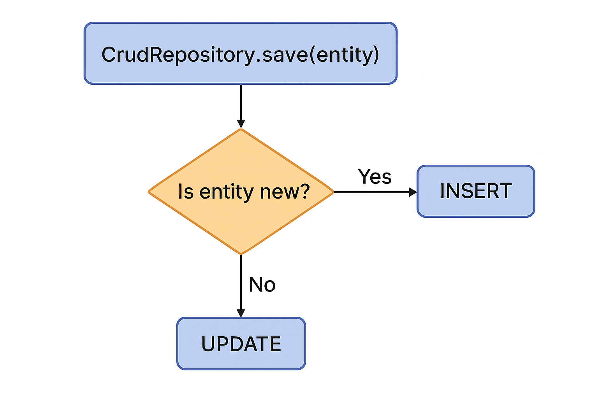

---

# **Spring Data JPA — `CrudRepository save()` Method**

## **1. Introduction**

`CrudRepository` is a foundational interface in Spring Data that provides generic CRUD operations for entity persistence. Among its methods, the most frequently used—and often misunderstood—is:

```java
<S extends T> S save(S entity)
```

This method performs both:

* **Insert** operations (persisting new entities)
* **Update** operations (modifying existing entities)

Which behavior is triggered depends entirely on how Spring Data determines whether an entity is *new* or *existing*.

Understanding the lifecycle of entities, how the persistence context works, and how transactions influence persistence behavior is essential for using `save()` correctly and efficiently.

---

# **2. Required Dependencies**

To use Spring Data JPA with an embedded H2 database, include:

```xml
<dependency>
    <groupId>org.springframework.boot</groupId>
    <artifactId>spring-boot-starter-data-jpa</artifactId>
</dependency>

<dependency>
    <groupId>com.h2database</groupId>
    <artifactId>h2</artifactId>
    <scope>runtime</scope>
</dependency>
```

`spring-boot-starter-data-jpa` automatically sets up:

* Hibernate (as the JPA provider)
* Transaction management
* JPA repositories
* EntityManager + persistence context

---

# **3. Application Setup**

## **3.1. Entity Definition**

```java
@Entity
public class MerchandiseEntity {

    @Id
    @GeneratedValue(strategy = GenerationType.AUTO)
    private Long id;

    private double price;
    private String brand;

    public MerchandiseEntity() {}

    public MerchandiseEntity(String brand, double price) {
        this.brand = brand;
        this.price = price;
    }

    // getters and setters...
}
```

### Key Notes:

* `id` uses an auto-generation strategy (`AUTO`) → database assigns the primary key.
* When `id == null`, Spring considers this entity **new**.
* When `id != null`, Spring considers this entity **existing**.

---

## **3.2. Repository Definition**

```java
@Repository
public interface InventoryRepository 
        extends CrudRepository<MerchandiseEntity, Long> {
}
```

This automatically provides:

### Built-in `CRUDRepository` methods:

* `save(S entity)`
* `saveAll(Iterable<S> entities)`
* `findById(ID id)`
* `existsById(ID id)`
* `findAll()`
* `deleteById(ID id)`
* `delete(T entity)`

No custom implementation is needed — Spring Data generates proxy classes at runtime.

---

# **4. Persisting New Entities With `save()` (INSERT)**

### Step-by-Step Behavior

1. You create a Java object with a **null ID**.
2. You pass it to `save()`.
3. Spring checks the ID → it is null → entity is considered **NEW**.
4. Hibernate generates an SQL `INSERT`.
5. The database generates the ID.
6. Hibernate updates the Java object with the new ID.

### Example

```java
MerchandiseEntity pants =
        new MerchandiseEntity("Pair of Pants", 34.99);

System.out.println(pants.getId()); // null

pants = repo.save(pants);

System.out.println(pants.getId()); // e.g. 1
```

### What Happens Under the Hood (Conceptually)

```
┌───────────────────────────────┐
│ new MerchandiseEntity()       │
│ id = null                     │
└───────────────────────────────┘
              │
              ▼
Spring Data JPA: entity is NEW (id == null)
              │
              ▼
      SQL: INSERT INTO merchandise ...
              │
              ▼
Database generates ID (e.g., 1)
              │
              ▼
Hibernate inserts ID into the Java object
```

---

# **5. Updating Existing Entities With `save()` (UPDATE)**

Updating works the same way—but Spring detects the entity as **existing** because its ID is not null.

### Example

```java
MerchandiseEntity pants =
        repo.save(new MerchandiseEntity("Pants", 34.99));

Long id = pants.getId();

// later...
MerchandiseEntity existing = repo.findById(id).get();
existing.setPrice(44.99);

repo.save(existing); // UPDATE performed
```

### How Spring Determines Update vs Insert

Spring uses one of these strategies:

### **Default Strategy (most common):**

> If `id == null` → INSERT
> If `id != null` → UPDATE

---

# **6. Updating Managed Entities Without Calling `save()`**

Inside a `@Transactional` method, entities retrieved using:

* `findById()`
* `findAll()`
* JPA relationships (lazy/eager)

are **managed** inside the persistence context.

This means:

* Any modifications you make are automatically detected ("dirty checking")
* Hibernate flushes changes automatically at transaction commit
* Calling `save()` is not necessary

### Example

```java
@Test
@Transactional
public void updateWithoutSave() {
    MerchandiseEntity item =
        repository.save(new MerchandiseEntity("Shirt", 10.0));

    Long id = item.getId();

    // Modify the managed entity
    item.setPrice(20.0);
    item.setBrand("Updated Brand");

    // No call to save()

    MerchandiseEntity fromDb = repository.findById(id).get();

    assertEquals(20.0, fromDb.getPrice());
    assertEquals("Updated Brand", fromDb.getBrand());
}
```

### Why it works:

Because the retrieved entity is **attached to the persistence context**, Hibernate automatically tracks modifications and writes them on flush/commit.

---

# **7. Persisting Child Entities & Using Returned Values**

When saving entities with child collections (e.g., `@OneToMany`), you MUST use the return value:

```java
newCampaign = campaignRepository.save(newCampaign);
```

Why?
Because:

* Hibernate might return a different proxy instance
* Child entities (Tasks) may get IDs only after flush
* Returned object reflects the final persisted state

---

# **8. Persisting Multiple Entities Using `saveAll()`**

### Example

```java
Iterable<Campaign> campaigns =
        Arrays.asList(c1, c2, c3);

campaignRepository.saveAll(campaigns);
```

### Behavior:

* Entities with `null` IDs → INSERT
* Entities with non-null IDs → UPDATE
* Uses **one single transaction**
* Better performance compared to repeated `save()` calls

---

# **9. Cascading and Orphan Removal**

If you define:

```java
@OneToMany(
    mappedBy = "campaign",
    cascade = CascadeType.ALL,
    orphanRemoval = true
)
private Set<Task> tasks;
```

Then when you:

* Replace the entire task list → old tasks are deleted
* Add new tasks → they are saved automatically
* Remove tasks → they are deleted from the DB

`save()` triggers cascading operations.

---

# **10. Transactional Behavior of `save()` and `saveAll()`**

All repository methods are:

```java
@Transactional
```

### What this means:

* If any insert/update fails → **entire transaction rolls back**
* Using `saveAll()` ensures **all-or-nothing**

### Example: Transaction Fails Because of Constraint Violation

```java
Campaign valid = newCampaign;
Campaign invalid = new Campaign("NEW2", "...", "...");

try {
    campaignRepository.saveAll(List.of(valid, invalid));
} catch (Exception ex) {
    log.info("Error saving multiple entities");
}
```

If `invalid` throws a unique constraint error →
**Nothing is saved**, including `valid`.

---

# **11. Performance Comparison: `save()` vs `saveAll()`**

### Test: Save 10,000 books

#### Using `save()` in a loop:

```java
for (int i = 0; i < bookCount; i++) {
    repository.save(new Book("Book "+i, "Author "+i));
}
```

⏱ ~2 seconds
(Because each call creates a new transaction)

---

#### Using `saveAll()` once:

```java
List<Book> books = ...
repository.saveAll(books);
```

⏱ ~0.3 seconds
(One transaction → much faster)

---

### With JPA Batch Inserts Enabled

* `save()` becomes slower (~10%)
* `saveAll()` becomes ~60% faster

Because batching happens at the transaction level.

---

# **12. Additional Notes on Entity State Lifecycle**

Hibernate entity states:

```
New (Transient)
Managed (Persistent)
Detached
Removed
```

### `save()` effect by state:

| State                    | Action                                   |
| ------------------------ | ---------------------------------------- |
| **Transient (new)**      | INSERT                                   |
| **Persistent (managed)** | UPDATE unnecessary (auto-dirty-checking) |
| **Detached**             | Merges into persistence context → UPDATE |
| **Removed**              | INSERT not possible → error              |

---

# **13. Best Practices**

### ✔ Use `save()` when:

* Saving a single new entity
* Updating a single detached entity

### ✔ Use `saveAll()` when:

* Saving a collection of entities
* Performance matters

### ✔ Inside `@Transactional` methods:

* Prefer modifying managed entities instead of re-saving
* Let Hibernate flush changes automatically

### ✔ Always use returned values from `save()` when:

* You rely on generated IDs
* You use cascading relationships
* You work with lazy-loaded associations

### ✔ Enable SQL logging during development:

```properties
spring.jpa.show-sql=true
spring.jpa.properties.hibernate.format_sql=true
```

---

# **14. Summary Table: INSERT vs UPDATE**

| Condition                                   | What Happens               | Why                     |
| ------------------------------------------- | -------------------------- | ----------------------- |
| `id == null`                                | **INSERT**                 | New entity              |
| `id != null` but not in persistence context | **UPDATE**                 | Treated as detached     |
| Entity retrieved inside `@Transactional`    | **No need to call save()** | Auto dirty checking     |
| `saveAll()`                                 | INSERT + UPDATE as needed  | Based on ID and newness |

---
## Decision flow of `save()`


