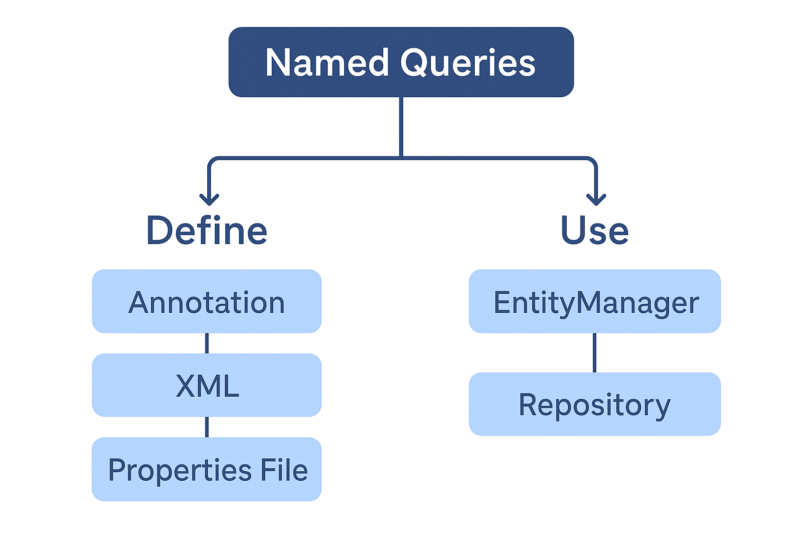

---

# 📘 **Lesson Notes: Named Queries in JPA, Hibernate & Spring Data JPA**

## **1. Introduction to Named Queries**

Named Queries are **predefined, statically compiled queries** identified by a unique name. They are part of the **JPA specification**, not Spring-specific, but are fully supported by Spring Data JPA.

### ✔ Why Named Queries?

* **Centralize query logic** → queries are not scattered across repository methods
* **Compile-time validation** → syntax checked at application startup
* **Better performance** → compiled and cached
* **Reusable** across repositories, services, and applications
* **Cleaner domain structure** → keeps SQL/JPQL close to entity definitions


### ✔ Where can we define them?

1. **Annotations on entity classes**

    * `@NamedQuery`
    * `@NamedQueries`
    * `@NamedNativeQuery`
    * `@NamedNativeQueries`

2. **XML (orm.xml)**

3. **Properties file (`META-INF/jpa-named-queries.properties`)**

### ✔ How can we execute them?

1. Using **EntityManager**
2. Referencing them in **Spring Data JPA repository method names**

---

# **2. Defining Named Queries with @NamedQuery**

## **2.1 Example: JPQL Named Query on Entity**

```java
@NamedQuery(
    name = "namedQueryCampaignsWithIdGreaterThan",
    query = "select c from Campaign c where c.id > :id"
)
@Entity
public class Campaign {

    @Id
    private Long id;
    private String code;
    private String name;
    private String description;
}
```

### Key points:

* Added directly to **entity class**
* Must have a **unique name**
* Uses **JPQL**
* Parsed and validated at application startup

---

# **3. Executing Named Queries using EntityManager**

```java
@Autowired
private EntityManager entityManager;

public void run(ApplicationArguments args) {

    List<Campaign> result = entityManager
        .createNamedQuery("namedQueryCampaignsWithIdGreaterThan", Campaign.class)
        .setParameter("id", 1L)
        .getResultList();

    System.out.println(result);
}
```

### ✔ Notes:

* `createNamedQuery()` retrieves the precompiled query
* Parameters are set by name or position
* No repository required

---

# **4. Using Named Queries in Spring Data JPA Repositories**

To bind a NamedQuery to a repository method, follow the convention:

```
EntityName.methodName
```

## **4.1 Example: Named Query + Repository Method**

### Step 1: Define NamedQuery

```java
@NamedQuery(
   name = "Campaign.findCampaignsWithIdLessThan",
   query = "select c from Campaign c where c.id < :id"
)
@Entity
public class Campaign { }
```

### Step 2: Reference in Repository

```java
public interface CampaignRepository extends CrudRepository<Campaign, Long> {

    List<Campaign> findCampaignsWithIdLessThan(@Param("id") Long id);
}
```

### Step 3: Call Repository Method

```java
List<Campaign> campaigns = campaignRepository.findCampaignsWithIdLessThan(3L);
```

✔ Spring Data automatically detects and uses the NamedQuery
✔ No need for @Query annotation

---

# **5. Modifying Queries using Named Queries**

You can write **UPDATE** queries and execute them using Spring Data JPA with `@Modifying`.

### Step 1: Define Named Update Query

```java
@NamedQuery(
    name = "Campaign.updateCampaignDescriptionById",
    query = "update Campaign set description = :newDescription where id = :id"
)
@Entity
public class Campaign { }
```

### Step 2: Reference in Repository

```java
public interface CampaignRepository extends CrudRepository<Campaign, Long> {

    @Modifying(clearAutomatically = true)
    int updateCampaignDescriptionById(
            @Param("id") Long id,
            @Param("newDescription") String newDescription
    );
}
```

### Step 3: Call Inside @Transactional

```java
@Transactional
public void run(ApplicationArguments args) {

    campaignRepository.updateCampaignDescriptionById(
        1L, "New description updated by named query"
    );
}
```

---

# **6. Named Native Queries**

Native SQL queries can also be defined.

### Step 1: Define Named Native Query

```java
@NamedNativeQuery(
    name = "Campaign.findCampaignsWithDescriptionShorterThan",
    query = "select * from Campaign c where LENGTH(c.description) < :length",
    resultClass = Campaign.class
)
@Entity
public class Campaign { }
```

### Step 2: Repository Binding

```java
List<Campaign> findCampaignsWithDescriptionShorterThan(@Param("length") int length);
```

### Step 3: Execute

```java
campaignRepository.findCampaignsWithDescriptionShorterThan(16);
```

---

# **7. Defining Named Queries in Properties File (Advanced)**

File:

```
src/main/resources/META-INF/jpa-named-queries.properties
```

Example content:

```
Campaign.findCampaignsWithDescriptionPrefix=
    select c from Campaign c where c.description like :prefix%
```

Spring automatically loads this file.

### Repository:

```java
List<Campaign> findCampaignsWithDescriptionPrefix(@Param("prefix") String prefix);
```

---

# **8. XML-Based Named Queries (JPA Standard)**

File: `META-INF/orm.xml`

```xml
<named-query name="User.findByLastname">
    <query>
        select u from User u where u.lastname = ?1
    </query>
</named-query>
```

---

# **9. Hibernate Extensions for Named Queries**

Hibernate provides extra attributes:

```java
@NamedQuery(
    name = "DeptEmployee_FindAllByDepartment",
    query = "from DeptEmployee where department = :department",
    timeout = 1,
    fetchSize = 10,
    cacheable = true,
    cacheRegion = "employeeRegion",
    comment = "Employee by department query"
)
```

---

# **10. Defining Multiple Named Queries**

```java
@NamedQueries({
    @NamedQuery(name = "DeptEmployee_FindByEmployeeNumber",
        query = "from DeptEmployee where employeeNumber = :employeeNo"),
    @NamedQuery(name = "DeptEmployee_FindAllByDesignation",
        query = "from DeptEmployee where designation = :designation")
})
@Entity
public class DeptEmployee { }
```

---

# **11. Calling Named Queries in Hibernate**

```java
Query<DeptEmployee> query = session.createNamedQuery(
    "DeptEmployee_FindByEmployeeNumber",
    DeptEmployee.class
);
query.setParameter("employeeNo", "001");
DeptEmployee emp = query.getSingleResult();
```

---

# **12. Using Named Native Queries for Stored Procedures**

```java
@NamedNativeQuery(
  name = "DeptEmployee_UpdateEmployeeDesignation",
  query = "call UPDATE_EMPLOYEE_DESIGNATION(:employeeNumber, :newDesignation)",
  resultClass = DeptEmployee.class
)
```

---

# **13. Advantages of Named Queries**

| Benefit                | Description                              |
| ---------------------- | ---------------------------------------- |
| ✔ Fail fast            | Validated at startup                     |
| ✔ Centralized          | Queries are grouped and easy to maintain |
| ✔ Performance          | Precompiled & cached                     |
| ✔ Cleaner repositories | Avoids long @Query annotations           |
| ✔ Reusability          | Shared across services                   |

---

# **14. When to Use Named Queries?**

Use them when:

* Queries are reused frequently
* You want early failure (syntax validation)
* You prefer ORMs to manage SQL more centrally
* Queries are long and would clutter repository methods
* You need native queries without embedding SQL in Java

---

# **15. Conclusion**

Named Queries provide a robust mechanism for defining reusable, validated, and performance-friendly queries across your JPA/Hibernate/Spring Data JPA application.

They enhance:

* Maintainability
* Readability
* Performance
* Consistency

And avoid scattering SQL/JPQL throughout the codebase.

---

