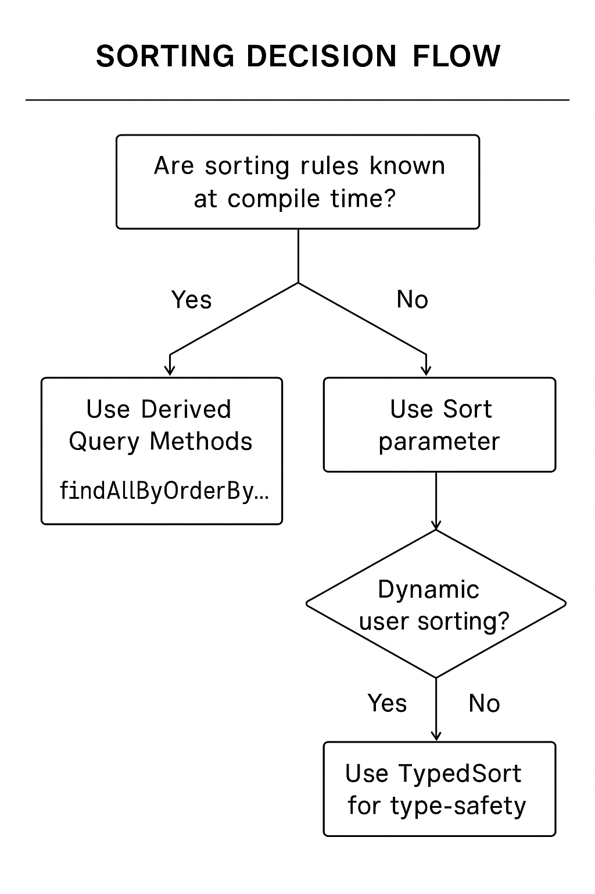

---

# **🔥 Deep Dive Into Spring Data Sorting**

**Mastering ORDER BY with Derived Queries, Sort Parameter, TypedSort & Paging**

---

# **1. Introduction**

Sorting is one of the most fundamental operations in data retrieval. Whether you're building an admin panel, analytics dashboard, list-based UI, or a reporting service—**users expect data to be sorted**.

Spring Data JPA provides **multiple mechanisms** to generate ORDER BY clauses **automatically**, without manually writing JPQL or SQL.

Sorting in Spring Data works **at the database level**, not in memory. This is important:

### ✔ Database-level sorting = faster, index-aware, optimized

### ✘ Java-side sorting = unnecessary CPU/memory usage

This lesson explains:

* How sorting works internally
* Sorting using derived method names
* Sorting using Sort objects (dynamic)
* Sorting using TypedSort (type-safe)
* Multi-field sorting (priority-based)
* Nested-property sorting (`assignee.lastName`)
* Paging + sorting together
* Null handling and DB differences
* Common mistakes and best practices

---

# **2. Understanding How Spring Data Sorting Works**

Spring Data JPA does *not* perform sorting on Java objects. Instead, it performs these steps:

```
(1) You call repository method ➜  
(2) Spring parses sorting instructions ➜  
(3) Spring appends ORDER BY to the JPQL/SQL ➜  
(4) Query runs on the database engine ➜  
(5) Results returned in sorted order
```

### Example transformation:

Method:

```java
findAllByOrderByDueDateDesc()
```

Generated JPQL:

```sql
SELECT t FROM Task t ORDER BY t.dueDate DESC
```

---

# **3. Key Sorting Concepts**

### **Direction**

* `ASC` (ascending) — default
* `DESC` (descending)

### **Sorting precedence**

If you sort by multiple fields:

```
ORDER BY dueDate DESC, lastName ASC
```

The database sorts by:

1. `dueDate` first
2. If equal → `lastName` next

### **Null value ordering**

Behavior varies by DB:

* PostgreSQL → NULLS FIRST by default
* Oracle → NULLS LAST by default
* MySQL → depends on engine

Spring Data supports specifying null handling, but we skip that here.

---

# **4. Repository Used in this Lesson**

```java
public interface TaskRepository 
    extends PagingAndSortingRepository<Task, Long> {}
```

> Everything in this lesson works the same for `JpaRepository`.

---

# **5. Sorting With Derived Query Methods (Static Sorting)**

Derived query sorting uses the **OrderBy** keyword inside the method name.

### **General pattern:**

```
findBy…OrderBy<Property><Direction>
```

### **5.1. Basic Example: Sort by due date descending**

```java
List<Task> findAllByOrderByDueDateDesc();
```

Breakdown:

* `OrderBy` → Sort trigger keyword
* `DueDate` → Field
* `Desc` → Direction

If direction is omitted:

```java
findAllByOrderByDueDate()
```

This means **ascending**.

### **Calling the method**

```java
List<Task> tasks = taskRepository.findAllByOrderByDueDateDesc();
tasks.forEach(System.out::println);
```

---

# **6. Multiple Sort Criteria in Derived Query**

You can chain multiple ordered fields.

### **Example:**

Sort tasks by due date **descending**, then assignee last name **ascending**:

```java
List<Task> findAllByOrderByDueDateDescAssigneeLastNameAsc();
```

### How Spring interprets it

```
ORDER BY due_date DESC,
         assignee.last_name ASC
```

### ⚠ Important Rule

Each field must explicitly include direction (`Asc`/`Desc`)
Otherwise Spring treats it as nested-property parsing and FAILS at startup.

For example, this will *not* work:

```java
// ❌ WRONG - missing direction after DueDate
findAllByOrderByDueDateAssigneeLastNameAsc()
```

---

# **7. Sorting With Sort Parameter (Dynamic Sorting)**

Static sorting is restrictive.
For dynamic sorting (UI-driven, API-driven, user-selectable), use the `Sort` parameter.

### **Example: custom query with Sort**

```java
List<Task> findByNameContaining(String keyword, Sort sort);
```

### **Build dynamic Sort**

```java
Sort sort = Sort.by(Direction.DESC, "dueDate")
                .and(Sort.by(Direction.ASC, "assignee.lastName"));
```

### **Call the repository**

```java
List<Task> results =
  taskRepository.findByNameContaining("Task", sort);
```

### Resulting SQL:

```sql
ORDER BY due_date DESC, assignee.last_name ASC
```

---

# **8. Sorting Nested Properties**

Spring Data supports nested paths using dot notation:

```java
Sort.by("assignee.lastName")
```

✔ Great for deep object graphs
✔ Matches JPA embedded/nested structure
✔ Must reflect actual entity path

---

# **9. TypedSort (Type-Safe Sorting)**

Eliminates “magic strings.”

### **Example**

```java
TypedSort<Task> typed = Sort.sort(Task.class);

Sort sortByDate =
    typed.by(Task::getDueDate).descending();

Sort sortByAssignee =
    typed.by(t -> t.getAssignee().getLastName()).ascending();

Sort finalSort =
    sortByDate.and(sortByAssignee);
```

### Benefits:

* Compiler-checked
* Works with method references
* No typos possible

---

# **10. Combining Sorting With Paging**

You can embed sorting inside pageable objects.

### Sort + Pagination

```java
Pageable pageable =
  PageRequest.of(0, 10,
      Sort.by("price").descending()
          .and(Sort.by("name"))
  );
```

### Call repository

```java
Page<Product> page = productRepository.findAll(pageable);
```

---

# **11. Unsorted Queries (Sort.unsorted())**

If a method requires Sort but you don’t want sorting:

```java
Sort noSort = Sort.unsorted();
repository.findByNameContaining("Test", noSort);
```

DB will not include ORDER BY.

---

# **12. Internal Sort API (Important Methods)**

### `Sort.by("field")`

Create sorting for a field

### `Sort.by(Direction, "field")`

Sorting with explicit direction

### `.ascending() / .descending()`

Change direction

### `.and(Sort)`

Chain multiple fields

### `.reverse()`

Flip existing sort (ASC → DESC)

### `Sort.sort(Class)`

TypedSort creation

### `Sort.unsorted()`

No sorting

---

# **13. Real-World Patterns**

### **Pattern 1: UI sort controls**

Frontend sends:

```
sortField = "dueDate"
sortDir   = "desc"
```

Backend:

```java
Sort sort = Sort.by(Direction.fromString(sortDir), sortField);
return repo.findAll(sort);
```

---

### **Pattern 2: Multiple optional sorts**

```java
Sort sort = Sort.unsorted();

if (sortByPriority) {
    sort = sort.and(Sort.by("priority"));
}

if (sortByDueDate) {
    sort = sort.and(Sort.by("dueDate"));
}
```

---

### **Pattern 3: API with arbitrary sort fields**

(A common REST pattern)

```
GET /tasks?sort=dueDate,desc&sort=priority,asc
```

```java
Sort sort = Sort.by(
    request.getSort()
           .stream()
           .map(order -> new Sort.Order(order.getDirection(), order.getProperty()))
           .toList()
);
```

---

### **Pattern 4: Overriding method-order precedence**

Avoid mixing:

```java
List<Task> findAllByOrderByDueDateDesc(String filter, Sort sort);
// 🚨 The ORDER BY in the method name wins — Sort parameter is ignored.
```

Spring warns but doesn’t error.

---

# **14. ASCII Diagram: Sorting Decision Flow**


---

# **15. Useful Code Snippets Reference**

### **Sort by one field**

```java
Sort.by("price")
```

### **Sort by multiple fields**

```java
Sort.by("price").descending()
    .and(Sort.by("name").ascending());
```

### **Nested sort**

```java
Sort.by("assignee.lastName")
```

### **TypedSort**

```java
Sort.sort(Task.class)
    .by(Task::getName)
    .ascending();
```

---

# **16. Common Pitfalls**

### ❌ Missing direction in multi-field derived methods

Spring assumes nested property.

### ❌ Typos in magic strings

Result: startup failure

### ❌ Assuming sorting is done in Java

It is always database-level.

### ❌ Mixing OrderBy + Sort argument

Method-based sorting always wins.

### ❌ Forgetting indexes

Sorting large tables without indexes → slow queries

---

# **17. Final Summary**

| Mechanism           | Static/Dynamic | Type-Safe     | Supports Multi-field | Best Use Case           |
| ------------------- | -------------- | ------------- | -------------------- | ----------------------- |
| **Derived Sorting** | Static         | Not type-safe | Yes                  | Simple fixed queries    |
| **Sort parameter**  | Dynamic        | Not type-safe | Yes                  | UI-driven sorting       |
| **TypedSort**       | Dynamic        | ✔ Type-safe   | Yes                  | Complex nested sorting  |
| **Paging + Sort**   | Dynamic        | No            | Yes                  | UI pagination + sorting |

---

