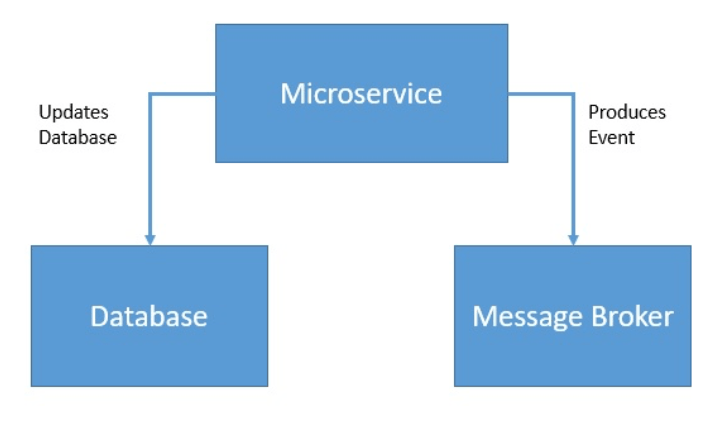
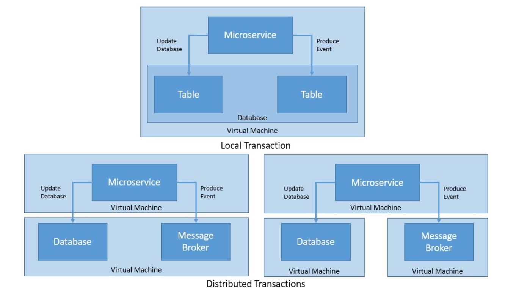
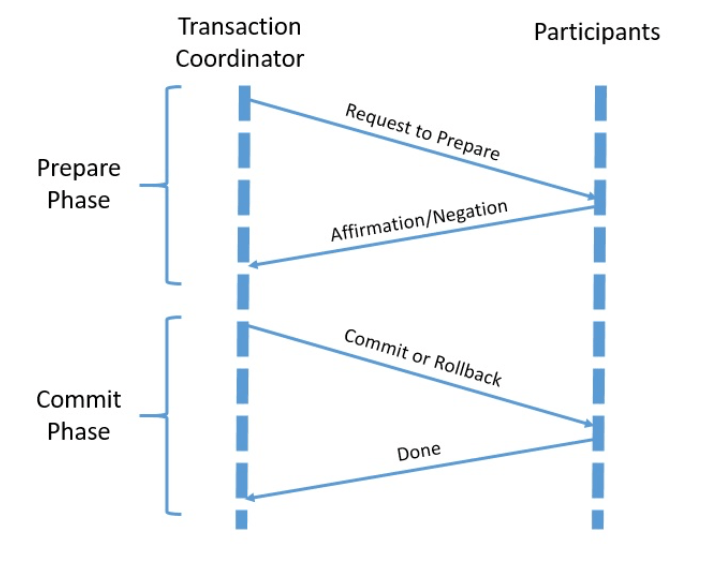
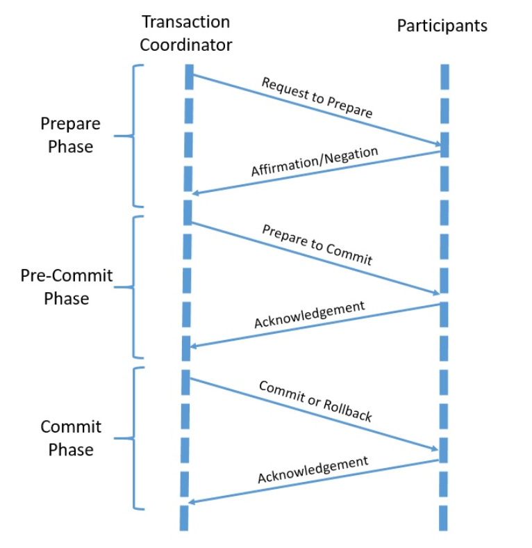
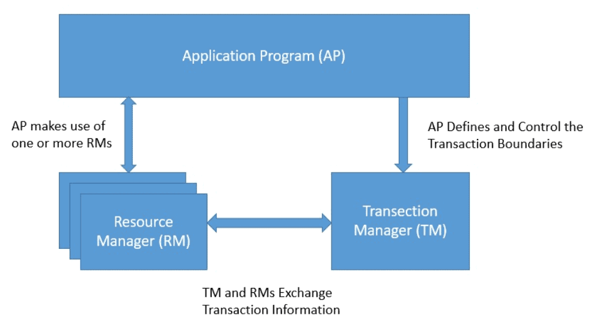
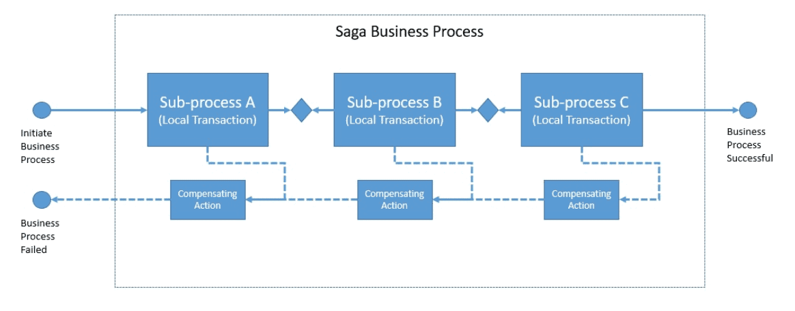
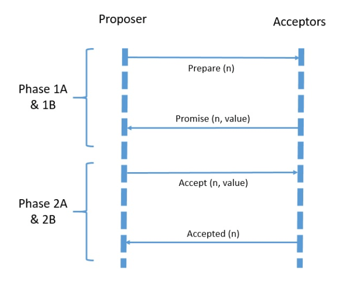
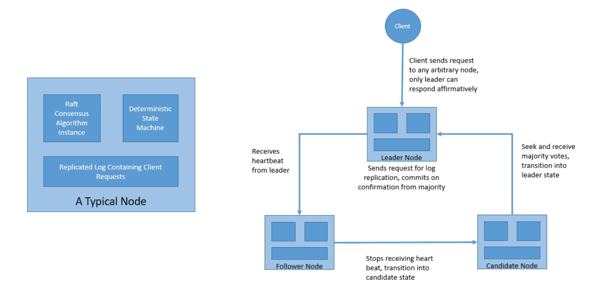

---

# # **1. Introduction to Transactions**

Transactions are a foundational concept in data-driven and distributed systems. A transaction represents a sequence of operations that must be treated as a single, indivisible unit of work. Either all operations complete successfully as one logical action, or none of them take effect. This principle helps ensure consistency, reliability, and integrity across systems.

Modern applications often interact with several components—databases, message queues, event systems, or external services. Ensuring consistent updates across such components requires well-designed transaction models, protocols, and guarantees.

This lesson explores:

* What a transaction is
* How transactions evolved
* Local and distributed transaction models
* ACID, CAP, and BASE guarantees
* Commit protocols such as 2PC and 3PC
* Industry specifications (XA, OTS)
* Long-running transactions (Sagas, WS-BA, BTP)
* Consensus protocols (Paxos, Raft)

---

# # **2. What Is a Transaction?**

>A **transaction** is a set of operations that must succeed or fail together. It is a single logical unit of work whose effects become visible only if the entire operation completes successfully.



### Example

A service may need to:

1. update a local database, and
2. publish an event to a message broker.

We want both actions to occur together:


```
BEGIN TRANSACTION
    update database
    publish event
COMMIT
```

If any action fails, the whole transaction is rolled back.

### Participating Resources

Systems involved in a transaction may include:

* Relational Databases
* Message Brokers
* File Systems
* External APIs

The more resources involved, the more complex the transaction management becomes.

---

# # **3. A Brief History of Transactions**

The concept of transactions evolved alongside relational databases. As multi-user, concurrent systems emerged, the need for structured consistency guarantees increased.

## 3.1. Early Transaction Models

Relational databases became widespread after Edgar F. Codd introduced the relational model in 1970. With this growth came concurrency issues—multiple users accessing and modifying data simultaneously. To handle this safely, the industry introduced **ACID guarantees**.

Early transaction systems were simple:

* They handled **short-lived**, **flat** transactions.
* There were **few concurrent users**.
* All operations touched **one local database**.

As systems grew, long-running and complex business processes emerged. This led to:

* **Sub-transactions**
* **Transaction groups**
* **More granular rollback handling**

These models added flexibility, especially for long-running processes where failures might occur after partial progress.

## 3.2. Advanced Transaction Models

As applications became distributed, the need for more complex transaction models grew.

### Distributed Transactions

Distributed transactions span multiple independent resources (databases, brokers). They ensure global consistency.

### Nested Transactions

A top-down model where a transaction contains sub-transactions, enabling hierarchical rollback.

### Chained Transactions

A long-running transaction is broken into sequential sub-transactions. Each sub-transaction commits immediately.

### Sagas

A Saga is a chain of transactions where each step has a **compensation action** instead of rollback. Sagas allow:

* relaxed consistency
* asynchronous event-driven execution
* long-running, distributed workflows

Sagas became especially useful in **microservice architectures**.

---

# # **4. Local vs. Distributed Transactions**

A transaction may involve operations performed on one resource or multiple independent resources. Based on this, transactions fall into two categories:



---

## **Local Transactions**

A **local transaction** involves operations executed on a **single resource**, such as:

* a single relational database
* a single message queue
* a single key-value store

The transaction manager is embedded within the resource itself (e.g., the database engine), allowing straightforward transaction control using APIs such as:

```sql
BEGIN;
UPDATE accounts SET balance = balance - 500 WHERE id = 1;
UPDATE accounts SET balance = balance + 500 WHERE id = 2;
COMMIT;
```

Characteristics:

* Fast
* Simplest to implement
* Managed entirely by one system
* ACID guarantees are easy to enforce

---

## **Distributed Transactions**

A **distributed transaction** spans **multiple resources**, which may be:

* Databases
* Message brokers
* File systems
* External services
* Microservices

These resources may be located:

* on the same machine
* on different machines in a cluster
* across data centers or cloud providers

Example:

```
BEGIN GLOBAL TRANSACTION
    update user database
    publish event to Kafka
    update analytics database
COMMIT
```

Distributed transactions require:

* A **Transaction Coordinator**
* All participating resources to support a protocol (usually **2PC**)

Distributed transactions complicate:

* Failure recovery
* Consistency
* Network reliability
* Latency

Their complexity drives the need for formal guarantees, protocols, and patterns.

---

# # **5. Transaction Guarantees**

Transactions exist largely to ensure **data integrity**. Distributed systems introduce challenges that force trade-offs between consistency, availability, and performance.

This section covers:

* ACID
* CAP
* BASE

Each defines different perspectives on consistency and reliability.

---

## **5.1. ACID Properties**

ACID defines the four guarantees that traditional (usually database-backed) transactions provide.

---

### **Atomicity**

“All-or-nothing.”
Either:

* all operations succeed, or
* none do.

Example:

If money is deducted from Account A but an error occurs before adding to Account B, the entire transaction rolls back.

---

### **Consistency**

A transaction must take the system from one valid state to another. All constraints (FK, UNIQUE, NOT NULL) remain satisfied.

Example:

You cannot insert a row violating a NOT NULL or FOREIGN KEY constraint.

---

### **Isolation**

Transactions must not see intermediate states of other transactions.
Isolation levels define how strictly this is enforced:

* READ UNCOMMITTED
* READ COMMITTED
* REPEATABLE READ
* SERIALIZABLE

Higher isolation = fewer anomalies = lower performance.

---

### **Durability**

After a commit:

* the result persists
* even if the system crashes

Durability often requires:

* Write-Ahead Logs (WAL)
* Disk flush
* Replication

---

ACID is the gold standard for **single-node transactional systems**.

---

## **5.2. CAP Theorem**

In distributed systems, providing ACID-like guarantees becomes harder.

CAP theorem states that a distributed system **cannot simultaneously guarantee**:

1. **Consistency**
2. **Availability**
3. **Partition Tolerance**

Because networks are unreliable, **partition tolerance must always be assumed**.

Thus, systems must choose:

| Guarantee      | Trade-off                                       |
| -------------- | ----------------------------------------------- |
| **CP systems** | Consistency over availability (e.g., Zookeeper) |
| **AP systems** | Availability over consistency (e.g., Cassandra) |

Important distinction:
**CAP’s “Consistency” ≠ ACID’s “Consistency.”**

CAP consistency = “all nodes see the same value.”

---

## **5.3. BASE Systems**

Because strong ACID-like consistency is often too expensive in distributed architectures, many modern systems adopt **BASE**, an alternative consistency model.

### BASE stands for:

* **Basically Available**
  System always responds (may be stale data).

* **Soft State**
  State may change even without input (due to replication).

* **Eventual Consistency**
  If no new updates arrive, all nodes will converge to the same state.

This makes BASE systems highly suitable for:

* distributed NoSQL databases
* cloud-scale architectures
* microservices

BASE trades strict correctness for performance and availability.

---

# # **6. Distributed Commit Protocols**

Local transactions are easy because a single database controls everything. Distributed transactions require a **coordination protocol** to ensure consistency across multiple independent resources.

This is where commit protocols come in.

---

## **6.1. Two-phase Commit (2PC)**



2PC is the most widely used algorithm for distributed ACID transactions.

It consists of:

---

### **Phase 1: Prepare Phase**

Coordinator → Participants:

```
“Can you commit?”
```

Participants respond:

* **YES** (prepared to commit)
* **NO** (cannot commit)

Participants that respond YES must:

* lock data
* write a prepare record
* be ready to commit even after a crash

---

### **Phase 2: Commit Phase**

If all participants responded YES:

```
Coordinator → “COMMIT”
```

If any participant responded NO:

```
Coordinator → “ROLLBACK”
```

---

**2PC Guarantees**:

* Atomic commit
* Works with heterogeneous resources
* Supported widely (e.g., XA, JTA)

**But has a major problem:**

🚨 **2PC is a blocking protocol.**
If the coordinator crashes at the wrong time, participants are stuck waiting (holding locks).

---

## **6.2. Three-phase Commit (3PC)**



3PC adds a third “Pre-Commit” phase to solve some 2PC failure scenarios.

Phases:

1. **CanCommit phase** → Ask if participants can commit
2. **PreCommit phase** → Prepare but not finalize
3. **DoCommit phase** → Final commit

The PreCommit phase allows recovery:

* If coordinator crashes
* Or participant crashes
* Or both crash

**Advantages over 2PC**:

* Non-blocking (under some assumptions)
* Better failure handling

**Downside**:

* Slower because of the extra round of messages
* Still fails in network partition scenarios

Thus 3PC is rare in practice.

---

# # **7. Industry Specifications**

Distributed transactions require multiple vendors and systems to interoperate. To avoid each vendor inventing their own incompatible protocol, the industry created several standards for distributed transactions.

The two major models are:

* **X/Open XA (Distributed Transaction Processing Model)**
* **OMG OTS (Object Transaction Service)**

These specifications formalize:

* transaction coordinators
* resource managers
* global transactions
* two-phase commit semantics

---

## **7.1. X/Open DTP Model (XA Transactions)**

**XA** stands for *eXtended Architecture*.
It is the **industry-standard model for distributed transactions** across heterogeneous systems.



It defines a system with the following components:

### **1. Application Program**

The program that starts, commits, or rolls back global transactions.
It makes calls like:

```java
tx.begin();
repository.save(...);
tx.commit();
```

### **2. Transaction Manager (TM)**

Coordinates the global transaction.

Responsibilities:

* Begin / commit / rollback global transactions
* Manage transaction boundaries
* Run 2PC
* Recover failures

Examples of TMs:

* JTA (Java Transaction API)
* Narayana
* Atomikos
* Bitronix

### **3. Resource Manager (RM)**

A participating resource that manages data, such as:

* Databases (MySQL, Oracle, PostgreSQL)
* Message brokers
* Other transactional systems

Each RM manages **one branch** of a global transaction.

---

### **XA Process Flow (Simplified)**

```text
Application → Transaction Manager → Resource Managers (DB, MQ, etc.)
```

Each resource must support XA protocol to participate.

XA uses **two-phase commit**, which gives strong ACID guarantees.

---

## **7.2. OMG OTS Model (Object Transaction Service)**

OTS is the distributed transaction specification for **CORBA-based systems**.


It defines:

### **Transactional Client**

The application invoking transactional operations.

### **Transactional Server**

Hosts objects that participate in transactions.

### **Recoverable Server**

Hosts objects whose state is affected by commit/rollback.

### **Transactional Object**

A CORBA object whose operations can run inside a transaction.

Like XA, OTS also supports distributed 2PC but implemented via CORBA IDL interfaces instead of XA interfaces.

OTS builds on the X/Open model.

---

# # **8. Long-Running Transactions**

Traditional ACID transactions work for short-lived operations, but many business workflows are:

* long-running
* involve human interaction
* span multiple services
* perform asynchronous work

Using 2PC here would:

* lock resources too long
* reduce scalability
* cause cascading failures

To fix this, long-running transaction models were created.

---

# **8.1. Saga Interaction Pattern**

Introduced in 1987 by Garcia-Molina & Salem.
A **Saga** breaks a long-running business process into a sequence of local transactions:



```
T1 → T2 → T3 → ... → Tn
```

Each local transaction has a **compensating transaction**:

```
C1, C2, C3, ..., Cn
```

If the Saga fails at step Ti:

* We run Ci-1, Ci-2, ..., C1 to undo previous steps
* This “undo” is best-effort, not guaranteed like rollback

---

### **Characteristics of Sagas**

* Non-blocking
* No locks
* Event-driven or orchestrated
* Compensating actions required
* Idempotency required

---

### **Example of a Saga**

Booking travel:

1. Book flight
2. Reserve hotel
3. Rent car

If car rental fails:

* Cancel hotel
* Cancel flight

This is Saga compensation.

---

# **8.2. OASIS WS-BA (Web Services – Business Activity)**

WS-BA is the SOAP-based implementation of Saga-like long-running business processes.

It defines two protocol styles:

### **1. Business Agreement with Coordinator Completion**

The coordinator decides when each participant must complete.

### **2. Business Agreement with Participant Completion**

Participants decide when they are ready to complete.

WS-BA also defines:

* **Atomic Outcome** → all complete or all compensate
* **Mixed Outcome** → different outcomes allowed per participant

This model is useful for:

* SOA
* SOAP services
* Distributed business workflows

---

# **8.3. OASIS BTP (Business Transaction Protocol)**

BTP models business transactions in loosely coupled distributed systems (cross-organizational).

Two models:

### **1. Atomic Transactions (Atoms)**

* Single coordinator
* Zero or more sub-coordinators
* All-or-none outcome

Like ACID but distributed.

### **2. Cohesive Transactions (Cohesions)**

* Participants may end with **different outcomes** (not purely atomic)
* Compensation-based
* Suitable for long-running workflows

BTP is an early model for modern Saga orchestration.

---

# # **9. Advanced Consensus Protocols**

The decision to **commit or rollback** a transaction is a special case of the *distributed consensus problem*:

> How do multiple unreliable nodes agree on the same state?

Commit protocols (2PC/3PC) are also consensus algorithms but fail under some conditions (e.g., network partition).

Modern distributed systems use more advanced consensus algorithms:

* **Paxos**
* **Raft**

---

## **9.1. Paxos**

Proposed by Leslie Lamport (1989).
Considered the first rigorously proven correct consensus protocol.



### **Paxos Roles**

* **Proposers**
* **Acceptors**
* **Learners**

### **Protocol (Simplified)**

#### **Phase 1: Prepare**

Proposer picks a new proposal number **n** and sends "prepare(n)" to acceptors.

#### **Phase 1B: Promise**

Acceptor promises not to accept proposals < n.

#### **Phase 2A: Accept Request**

Proposer sends: "accept(n, value)" to acceptors.

#### **Phase 2B: Accepted**

Acceptors accept unless they have already promised a higher number.

---

### Key Features

* Multiple proposers allowed
* Acceptors may accept multiple proposals
* Some rounds may fail

But ultimately:

> All acceptors converge on one agreed-upon value.

Paxos is:

* Highly fault tolerant
* Difficult to implement
* Foundation of many distributed systems (Google Chubby, Spanner, etc.)

---

## **9.2. Raft**

Raft was created to be:

> A more understandable alternative to Paxos.



It achieves the same fault tolerance but through simpler structure.

Roles:

* Leader
* Followers
* Candidates

---

### **Three Core Components**

#### **1. Leader Election**

Nodes start as followers.
If they do not hear a heartbeat from a leader → they become candidates → request votes.

#### **2. Log Replication**

Leader:

* Appends entries to its log
* Sends replication requests to followers
* Commits log entries once a majority acknowledge receipt

Followers:

* Apply log entries only when leader indicates commit

#### **3. Safety**

Raft enforces:

* Log matching
* Election restrictions (only candidates with up-to-date logs can become leaders)

Raft is widely implemented:

* etcd
* Consul
* Docker Swarm
* Kubernetes components

---

# # **10. Conclusion**

In this tutorial, we explored:

* What a transaction is
* Local vs. distributed transactions
* ACID, CAP, BASE guarantees
* 2PC and 3PC distributed commit protocols
* Industry standards (XA, OTS)
* Long-running transaction models (Sagas, WS-BA, BTP)
* Modern distributed consensus protocols (Paxos, Raft)

We learned that:

* ACID transactions excel in single-node systems
* Distributed systems must trade off consistency vs. availability
* Two-phase commit is foundational but blocking
* Long-running business processes need compensation, not rollbacks
* Consensus protocols like Raft and Paxos enable reliable state agreement in distributed clusters

Understanding these models helps in designing resilient, consistent, scalable systems in modern architectures such as microservices, cloud computing, and distributed databases.

---


