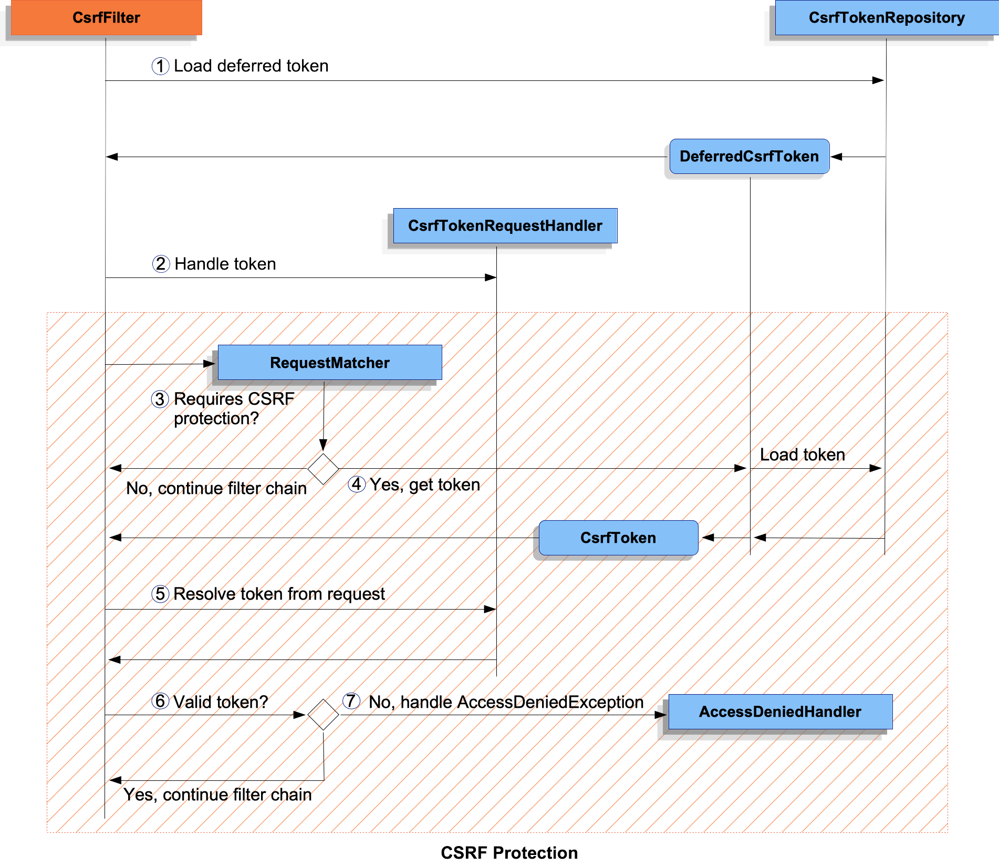

---

# **Spring Security 7 – CSRF Protection**

---

## **1. Introduction to CSRF**

**Cross-Site Request Forgery (CSRF)** is a common attack where a malicious site tricks an authenticated user’s browser into performing unwanted actions on another website.

When an application supports authentication (sessions, cookies, login), CSRF **must** be considered.

Spring Security **enables CSRF protection by default** for **unsafe HTTP methods** such as:

* `POST`, `PUT`, `PATCH`, `DELETE`

You can explicitly declare the default configuration:

```java
@Configuration
@EnableWebSecurity
public class SecurityConfig {

	@Bean
	public SecurityFilterChain securityFilterChain(HttpSecurity http) throws Exception {
		http
			// ...
			.csrf(Customizer.withDefaults());
		return http.build();
	}
}
```

---

# **2. Understanding the CSRF Architecture**

Spring Security’s CSRF protection is implemented inside **CsrfFilter**, composed of several cooperating components.

---

### **Figure 1: CsrfFilter Components**


---

Spring Security divides CSRF protection into two major responsibilities:

### **A. Making the CsrfToken Available**

Handled by the **CsrfTokenRequestHandler**, which exposes the token on the request.

### **B. Validating the Token**

Performed by the **CsrfFilter** using:

* Token repository
* Token loaded on demand
* AccessDeniedHandler for failures

---

## **3. How CSRF Processing Works**

---

### **Figure 2: CsrfFilter Processing Flow**



---

### **Step-by-Step Flow**

1. **DeferredCsrfToken loaded.**
   Holds a reference to the `CsrfTokenRepository`. Actual token not yet loaded.

2. **CsrfTokenRequestHandler receives a Supplier<CsrfToken>.**
   Used to publish `_csrf` as a request attribute.

3. **Check whether the current request requires CSRF protection.**
   If not, the filter chain continues.

4. **If protection required:**
   The persisted token is loaded from the repository.

5. **Resolve the actual incoming CSRF token** from request header or parameter.

6. **Compare actual token with persisted token.**
   If valid → request continues.

7. **Invalid or missing token → AccessDeniedException.**

---

# **4. Migrating from Spring Security 5 → 6/7**

Key changes:

* **Deferred loading** of the CsrfToken by default (better performance).
* Token now includes **randomness on each request** (BREACH protection).
* **SPA applications need additional configuration** for correct token refresh.

See *Spring Security Migration → Exploit Protection section* for full details.

---

# **5. Persisting the CsrfToken**

Tokens are persisted using a **CsrfTokenRepository**.

---

## **5.1 HttpSessionCsrfTokenRepository (Default)**

Stored in session (in-memory, Redis, DB-backed session, etc.).

```java
@Configuration
@EnableWebSecurity
public class SecurityConfig {

	@Bean
	public SecurityFilterChain securityFilterChain(HttpSecurity http) throws Exception {
		http
			.csrf((csrf) -> csrf
				.csrfTokenRepository(new HttpSessionCsrfTokenRepository())
			);
		return http.build();
	}
}
```

---

## **5.2 CookieCsrfTokenRepository**

Used primarily for **JavaScript frameworks** (Angular, React, Vue).

```java
@Configuration
@EnableWebSecurity
public class SecurityConfig {

	@Bean
	public SecurityFilterChain securityFilterChain(HttpSecurity http) throws Exception {
		http
			.csrf((csrf) -> csrf
				.csrfTokenRepository(CookieCsrfTokenRepository.withHttpOnlyFalse())
			);
		return http.build();
	}
}
```

Note:

* `HttpOnly=false` required if JS must read the cookie.
* If JS does **not** need direct access → leave HttpOnly **enabled** (more secure).

---

## **5.3 Custom CsrfTokenRepository**

```java
@Configuration
@EnableWebSecurity
public class SecurityConfig {

	@Bean
	public SecurityFilterChain securityFilterChain(HttpSecurity http) throws Exception {
		http
			.csrf((csrf) -> csrf
				.csrfTokenRepository(new CustomCsrfTokenRepository())
			);
		return http.build();
	}
}
```

---

# **6. Handling the CsrfToken – CsrfTokenRequestHandler**

Responsible for:

* Exposing the token on the request
* Resolving the incoming token

Two main options:

---

## **6.1 XorCsrfTokenRequestAttributeHandler (Default – BREACH Protection)**

Automatically:

* Encodes randomness into the token
* Exposes request attribute `_csrf`
* Decodes incoming header or parameter token

```java
.csrf((csrf) -> csrf
    .csrfTokenRequestHandler(new XorCsrfTokenRequestAttributeHandler())
)
```

---

## **6.2 CsrfTokenRequestAttributeHandler (No BREACH Protection)**

Used when disabling BREACH protection is required:

```java
.csrf((csrf) -> csrf
    .csrfTokenRequestHandler(new CsrfTokenRequestAttributeHandler())
)
```

---

## **6.3 Custom Handler**

For advanced needs (e.g., SPA cookie + header decoding):

```java
.csrf((csrf) -> csrf
    .csrfTokenRequestHandler(new CustomCsrfTokenRequestHandler())
)
```

---

# **7. Deferred Loading of CsrfToken**

Default: **Token is loaded only when needed** (lazy load).

To disable lazy loading:

```java
XorCsrfTokenRequestAttributeHandler handler = new XorCsrfTokenRequestAttributeHandler();
handler.setCsrfRequestAttributeName(null); // forces early load

http.csrf(csrf -> csrf.csrfTokenRequestHandler(handler));
```

---

# **8. Integrating CSRF with Different Clients**

---

## **8.1 HTML Forms**

Forms must include:

```html
<input type="hidden" name="_csrf" value="TOKEN_VALUE" />
```

Automatically added by:

* Spring form tags
* Thymeleaf
* Any view using `RequestDataValueProcessor`

---

## **8.2 JavaScript Applications**

Typical approach: send CSRF in **HTTP header**.

### Approaches:

1. **Cookie-based integration** (Angular default)
2. **Meta tags** (multi-page applications)
3. **Expose token in response headers**
4. **/csrf endpoint** for mobile apps

---

## **8.3 Single-Page Applications (SPA)**

SPAs need special handling because:

* BREACH encoding breaks client token reading
* Token is cleared on login/logout
* Token refresh must be pushed to the client

Spring’s built-in solution:

```java
.csrf((csrf) -> csrf.spa());
```

This handles:

* Cookie refresh
* Decoding for SPA request handlers
* Stateless navigation

---

## **8.4 Multi-Page Applications – Using Meta Tags**

Example:

```html
<meta name="_csrf" content="${_csrf.token}"/>
<meta name="_csrf_header" content="${_csrf.headerName}"/>
```

JS (jQuery):

```javascript
$(function () {
	var token = $("meta[name='_csrf']").attr("content");
	var header = $("meta[name='_csrf_header']").attr("content");

	$(document).ajaxSend(function(e, xhr) {
		xhr.setRequestHeader(header, token);
	});
});
```

---

## **8.5 Exposing Token in Response Headers**

Using `@ControllerAdvice`:

```java
@ControllerAdvice
public class CsrfControllerAdvice {

	@ModelAttribute
	public void exposeToken(HttpServletResponse response, CsrfToken token) {
		response.setHeader(token.getHeaderName(), token.getToken());
	}
}
```

---

## **8.6 Mobile Applications**

Expose a `/csrf` endpoint to fetch tokens on demand:

```java
@RestController
public class CsrfController {

    @GetMapping("/csrf")
    public CsrfToken csrf(CsrfToken csrfToken) {
        return csrfToken;
    }
}
```

Call this:

* At app start
* After login
* After logout

---

# **9. Handling CSRF Errors**

Use a custom AccessDeniedHandler:

```java
.exceptionHandling(e -> 
	e.accessDeniedPage("/access-denied")
)
```

---

# **10. Testing CSRF**

Spring Security’s MockMvc helpers:

```java
this.mockMvc.perform(post("/login").with(csrf()))
```

Invalid token:

```java
.with(csrf().useInvalidToken())
```

Missing token → expect `403 Forbidden`.

---

