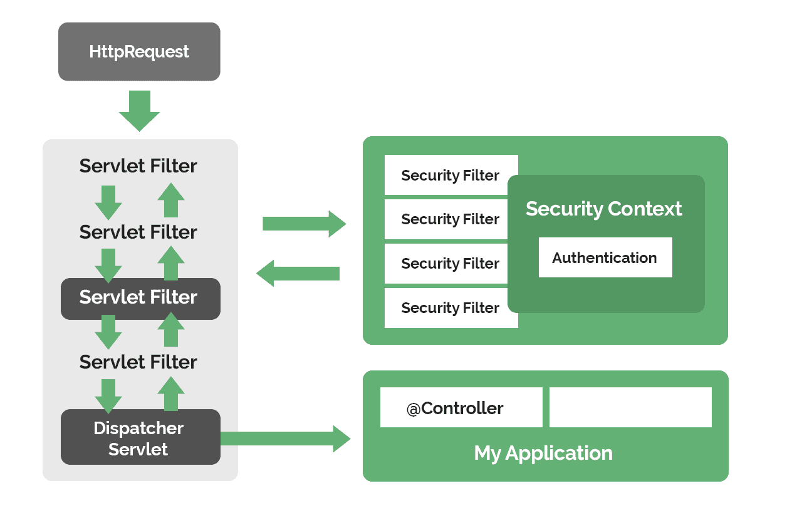
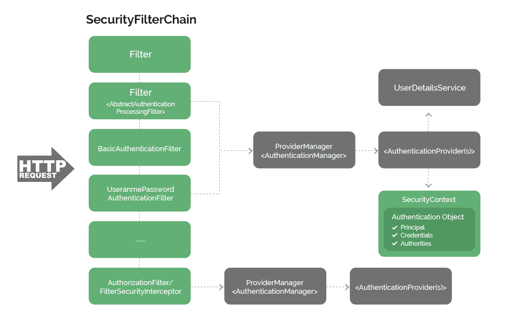

---

# 🌟 **Lesson Notes: Overview of Spring Security Objects**

Spring Security is a large framework with many components working together behind the scenes. As a beginner, it’s especially important to get a **high-level map** of how things fit together before diving into details.

This lesson explains:

1. The difference between **Authentication** and **Authorization**
2. How Spring Security’s **main objects** interact with each other
3. How requests flow through the **Security Filter Chain**
4. The role of the **AuthenticationManager**, **AuthenticationProvider**, and **SecurityContext**
5. Where **Authorization decisions** happen
6. Real code examples to help you understand the concepts

---

# 1. **Authentication vs Authorization (Simple Explanation)**

## ✅ Authentication = **“Who are you?”**

The process of verifying the identity of a user.

Examples:

* Entering username + password
* Using fingerprint or FaceID
* Logging in with Google

## 🛂 Authorization = **“What are you allowed to do?”**

The process of determining **what actions** an authenticated user can perform.

Examples:

* Admin can delete users
* Viewer can only read data
* Customer can access their profile but not others' profiles

---

## 🔁 *The Order Always Matters*

**Authentication happens first → then Authorization.**

Spring Security follows this exact order.

---

# 2. **Request Flow: Where Spring Security Fits**

When a user sends an HTTP request:

```
Client → Servlet Filters → SecurityFilterChain → DispatcherServlet → Controller
```

Spring Security inserts itself as a **Filter Chain before your controllers**.



So, every request goes through:

```
Security Filters → Authentication → Authorization → (Your application)
```

This ensures:

* Only legitimate users enter the app
* Only authorized actions are allowed

---

# 3. **The Internal Spring Security Flow**



Inside Spring Security, a request passes through **many filters**, such as:

* `UsernamePasswordAuthenticationFilter` (form login)
* `BasicAuthenticationFilter`
* `BearerTokenAuthenticationFilter` (JWT)
* `SessionManagementFilter`
* `AuthorizationFilter`
* `AnonymousAuthenticationFilter`

**Each filter handles a specific security task.**

---

# 4. **Authentication in Detail**

## 🔑 Step-by-Step

### **Step 1: Extract Authentication Data**

A filter (e.g., `UsernamePasswordAuthenticationFilter`) reads:

* username
* password
* JWT token
* OAuth credentials

It creates an `Authentication` object (usually empty or partially filled):

```java
new UsernamePasswordAuthenticationToken(username, password);
```

At this point:

* `isAuthenticated()` → false
* Authorities → null
* Principal → username only

---

### **Step 2: Pass Authentication to AuthenticationManager**

Spring Security hands this object to the:

```
AuthenticationManager (usually ProviderManager)
```

You rarely write your own manager—it’s built automatically.

---

### **Step 3: ProviderManager Delegates to AuthenticationProviders**

`ProviderManager` loops over registered authentication strategies:

* DaoAuthenticationProvider (for username/password)
* JwtAuthenticationProvider
* LdapAuthenticationProvider
* Custom providers if you write them

Each provider tries to authenticate the token.

If one succeeds:

* A fully populated `Authentication` object is returned
* Example: `UsernamePasswordAuthenticationToken` with roles included

---

### **Step 4: Successful Authentication Stored in SecurityContext**

After success:

```
SecurityContextHolder.getContext().setAuthentication(authentication)
```

This allows:

* Controllers
* Services
* Security annotations (`@PreAuthorize`)
* Auditing

to access the current user.

---

# 💡 Code Example: Basic Authentication Setup

```java
@Configuration
@EnableWebSecurity
public class SecurityConfig {

    @Bean
    public SecurityFilterChain filterChain(HttpSecurity http) throws Exception {
        http
            .formLogin()
            .and()
            .authorizeHttpRequests()
            .requestMatchers("/", "/public").permitAll()
            .anyRequest().authenticated();

        return http.build();
    }
}
```

---

# 5. **Authorization in Detail**

Authorization checks occur **after authentication**.

### Two common ways Spring Security performs authorization:

---

## **(A) AuthorizationFilter (Spring Security 5.6+)**

This filter uses **AuthorizationManager**, a modern component that:

* evaluates access rules (`hasRole()`, `authenticated()`)
* decides allow/deny

---

## **(B) FilterSecurityInterceptor (Older versions)**

Uses:

* `AccessDecisionManager`
* `AccessDecisionVoters`

This is more complex but still valid.

---

### 🔐 What Authorization Looks At

Authorization uses the **Authentication object** from SecurityContext:

```
principal → the user
authorities → roles, permissions
isAuthenticated() → true/false
```

Then it compares those with the requirements configured in your app:

```java
.antMatchers("/admin/**").hasRole("ADMIN")
```

If the user lacks the required roles:

* Access is denied
* Request never reaches your controller

---

# 💡 Code Example: Authorization Rules

```java
@Configuration
@EnableWebSecurity
public class SecurityConfig {

    @Bean
    public SecurityFilterChain chain(HttpSecurity http) throws Exception {
        http
            .authorizeHttpRequests()
                .requestMatchers("/", "/home").permitAll()
                .requestMatchers("/admin/**").hasRole("ADMIN")
                .anyRequest().authenticated()
            .and()
            .formLogin();

        return http.build();
    }
}
```

---

# 6. **Important Spring Security Objects (Summary)**

| Object                                           | Purpose                                                   |
| ------------------------------------------------ | --------------------------------------------------------- |
| **Authentication**                               | Represents the user (principal, credentials, authorities) |
| **AuthenticationManager**                        | Main entry point for authentication                       |
| **ProviderManager**                              | Default AuthenticationManager that delegates to providers |
| **AuthenticationProvider**                       | Performs actual authentication (password, JWT, etc.)      |
| **SecurityContext**                              | Holds the current Authentication                          |
| **SecurityContextHolder**                        | Global access point to SecurityContext                    |
| **AuthorizationManager / AccessDecisionManager** | Decide if user can access a resource                      |
| **GrantedAuthority**                             | User’s roles / permissions                                |
| **UserDetails**                                  | Represents user information retrieved from DB             |
| **UserDetailsService**                           | Loads a user for authentication                           |

---

# 7. **Code Example: Accessing Authentication in a Controller**

```java
@GetMapping("/profile")
public String userProfile(Authentication authentication) {
    String username = authentication.getName();
    Collection<? extends GrantedAuthority> roles = authentication.getAuthorities();

    return "Hello " + username + ", your roles: " + roles;
}
```

Alternatively:

```java
Authentication auth = SecurityContextHolder.getContext().getAuthentication();
```

---

# 8. **Putting It All Together (Big Picture)**

### When a request arrives:

1. Security Filters catch the request
2. Authentication filters extract credentials
3. AuthenticationManager delegates to Providers
4. Providers verify credentials
5. Successful Authentication stored in SecurityContext
6. AuthorizationFilter checks if user can access the endpoint
7. If allowed → request enters your Controller
8. If denied → Spring returns 403 automatically

This is the **entire Spring Security workflow**.

---

# 9. **Concluding Notes**

You now have a complete overview of:

* How Spring Security intercepts every request
* How authentication is performed step by step
* How authorization checks work
* The main components involved in the security flow
* How to read and access the Authentication object
* How everything fits into the bigger picture

As we continue, each of these concepts—filters, managers, providers, contexts—will be explored in greater detail.

---

