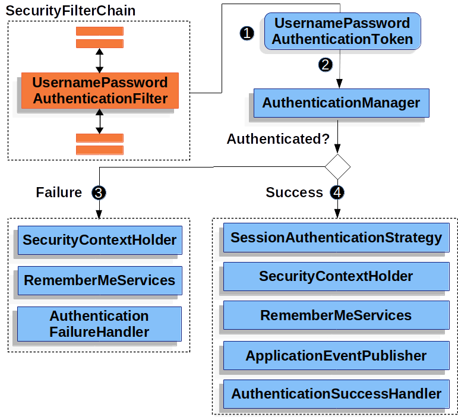

---

# **Lesson Notes: Building a Custom Spring Security Login Form**

---

## **1. Introduction**

In modern web applications, securing user access is essential. Spring Security provides built-in support for form-based authentication, allowing users to authenticate via an HTML login form.

In this lesson, we learn:

* How Spring Security redirects unauthenticated users to a login page
* How username/password authentication is processed internally
* How to override the default login page with a custom form
* How to configure login, logout, and access rules
* How to use your own controller and HTML template to create a fully customized login experience

We will also build a complete working example using Spring Boot, Spring MVC, Thymeleaf, and Spring Security.

---

## **2. How Form-Based Authentication Works in Spring Security**

Form login is the most common authentication mechanism in Spring Security. When a user tries to access a protected resource, Spring Security enters a specific flow:

---

## **3. Redirecting to the Login Page (High-Level Flow)**


---

### **Step-by-step explanation**

1. **User accesses a protected URL (e.g., `/private` or `/admin`).**
   The request is unauthenticated.

2. **AuthorizationFilter denies access.**
   An `AccessDeniedException` is thrown because the user is not logged in.

3. **ExceptionTranslationFilter handles the exception.**
   It triggers the **Start Authentication** process and redirects the user to the login page using `AuthenticationEntryPoint`
   (usually a `LoginUrlAuthenticationEntryPoint`).

4. **Browser requests the login page.**

5. **Application renders the login page.**
   This is your custom responsibility when you override the default login page.

---

## **4. How Username/Password Login Is Processed**



---

### **Step-by-step explanation**

1. **User submits credentials** via POST `/login` or a custom URL such as `/perform_login`.
   `UsernamePasswordAuthenticationFilter` reads `username` and `password` from the form and creates a `UsernamePasswordAuthenticationToken`.

2. **AuthenticationManager authenticates the token.**
   Internally, it uses a `UserDetailsService` (your `InMemoryUserDetailsManager` or a database-backed one).

3. **If authentication fails:**

    * `SecurityContextHolder` is cleared
    * `RememberMeServices.loginFail()` is called (no-op if disabled)
    * `AuthenticationFailureHandler` is invoked
    * User is redirected to something like `/login?error=true`

4. **If authentication succeeds:**

    * `SessionAuthenticationStrategy` performs session management
    * `SecurityContextHolder` is populated with the Authentication object
    * `RememberMeServices.loginSuccess()` is called
    * `InteractiveAuthenticationSuccessEvent` is published
    * `AuthenticationSuccessHandler` redirects to the saved request or defaultSuccessUrl

---

## **5. Default vs. Custom Login Page**

Spring Security **automatically enables a default login page** unless:

* You configure *any* servlet-based security → then you must explicitly enable `formLogin`
* You specify a custom login page → then **you must provide the HTML yourself**

Example minimal configuration:

```java
http.formLogin(withDefaults());
```

But in production, we usually customize everything:

```java
http.formLogin(form -> form
    .loginPage("/login")
    .permitAll()
);
```

When you specify `.loginPage("/login")`, Spring Security will **NOT** create the page for you — you must render it yourself.

---

# **6. Building a Custom Login Page (Your Example)**

### **Custom Spring Security Configuration**

Below is your Spring Security configuration, which illustrates a fully custom setup:

```java
@Configuration
public class SecurityConfiguration {

    @Bean
    public PasswordEncoder passwordEncoder() {
        return new BCryptPasswordEncoder();
    }

    @Bean
    public SecurityFilterChain securityFilterChain(HttpSecurity http) throws Exception {
        http
                .csrf(csrf -> csrf
                        .csrfTokenRepository(CookieCsrfTokenRepository.withHttpOnlyFalse())
                )
                .authorizeHttpRequests(auth -> auth
                        .requestMatchers("/admin/**").hasRole("ADMIN")
                        .requestMatchers("/anonymous*").permitAll()
                        .requestMatchers("/login*", "/static/**", "/css/**", "/js/**", "/webjars/**", "/error").permitAll()
                        .anyRequest().authenticated()
                )
                .formLogin(form -> form
                        .loginPage("/login")
                        .loginProcessingUrl("/perform_login")
                        .defaultSuccessUrl("/homepage", true)
                        .failureUrl("/login?error=true")
                        .permitAll()
                )
                .logout(logout -> logout
                        .logoutUrl("/logout")
                        .logoutSuccessUrl("/login?logout")
                        .deleteCookies("JSESSIONID")
                        .invalidateHttpSession(true)
                        .clearAuthentication(true)
                        .permitAll()
                )
                .exceptionHandling(exception -> exception
                        .accessDeniedPage("/accessDenied")
                );

        return http.build();
    }

    @Bean
    public UserDetailsService userDetailsService(PasswordEncoder passwordEncoder) {
        UserDetails user1 = User.withUsername("user1")
                .password(passwordEncoder().encode("user1Pass"))
                .roles("USER")
                .build();
        UserDetails user2 = User.withUsername("user2")
                .password(passwordEncoder().encode("user2Pass"))
                .roles("USER")
                .build();
        UserDetails admin = User.withUsername("admin")
                .password(passwordEncoder().encode("adminPass"))
                .roles("ADMIN")
                .build();
        return new InMemoryUserDetailsManager(user1, user2, admin);
    }
}
```

### Notes on this configuration:

* `loginPage("/login")` → your custom HTML page
* `loginProcessingUrl("/perform_login")` → form POST endpoint
* `defaultSuccessUrl("/homepage")` → landing page after success
* `failureUrl("/login?error=true")` → on bad credentials
* CSRF token is included via Thymeleaf automatically
* Custom URL permissions are set via `authorizeHttpRequests`

---

## **7. The Custom Login HTML Page**

Your template fully complies with Spring Security requirements:

```html
<!DOCTYPE html>
<html xmlns="http://www.w3.org/1999/xhtml" xmlns:th="https://www.thymeleaf.org">
<head>
    <title>Please Log In</title>
</head>
<body>
<h1>Please Log In</h1>

<div th:if="${param.error}">
    Invalid username and password.
</div>

<div th:if="${param.logout}">
    You have been logged out.
</div>

<form th:action="@{/perform_login}" method="post">
    <div>
        <input type="text" name="username" placeholder="Username"/>
    </div>
    <div>
        <input type="password" name="password" placeholder="Password"/>
    </div>

    <input type="submit" value="Log in"/>
</form>

</body>
</html>
```

### Important Requirements:

* Form **must POST** to Spring Security’s login-processing URL
* Must include:

    * `username` field
    * `password` field
* Should display:

    * `param.error` → login failed
    * `param.logout` → logout success
* Thymeleaf automatically adds CSRF token as a hidden field

---

## **8. Controller for the Login Page**

Spring MVC must return the login template when `/login` is accessed.

Your controller:

```java
@Controller
@RequestMapping("/")
public class SecurityController {

    @GetMapping("/anonymous")
    public String anonymous() {
        return "anonymous";
    }

    @GetMapping("/login")
    public String login() {
        return "login";
    }

    @GetMapping("/admin")
    @PreAuthorize("hasRole('ADMIN')")
    public String admin() {
        return "admin";
    }

    @GetMapping("/homepage")
    public String home() {
        return "homepage";
    }

    @GetMapping("/accessDenied")
    public String accessDenied() {
        return "accessDenied";
    }
}
```

---

## **9. Further Customizing Spring Login**

### 9.1 Overriding the Login Page

```java
http.formLogin().loginPage("/login.html");
```

### 9.2 Customizing POST Login URL

```java
http.formLogin().loginProcessingUrl("/perform_login");
```

### 9.3 Redirect After Successful Login

```java
http.formLogin().defaultSuccessUrl("/homepage.html", true);
```

### 9.4 Redirect After Failed Login

```java
http.formLogin().failureUrl("/login.html?error=true");
```

These match your current configuration.

---

## **10. Summary**

By building a custom login form, you take full control over:

* Look and feel of the login page
* Login and logout URLs
* Redirection behavior
* Failure handling
* User role access rules
* Authentication flow

Spring Security provides the infrastructure, while you provide the UI and custom logic.

Your example application now supports:

✔ Custom login page
✔ Custom login POST URL
✔ Role-based authorization
✔ CSRF protection
✔ Custom logout behavior
✔ In-memory user store

This is the complete standard modern setup for custom login with Spring Security.

---

