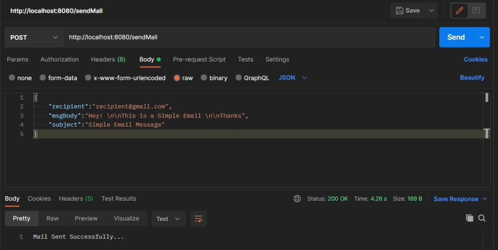
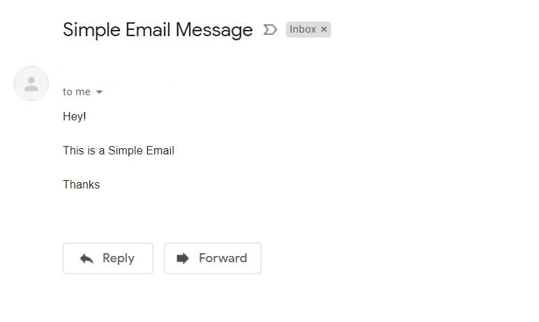
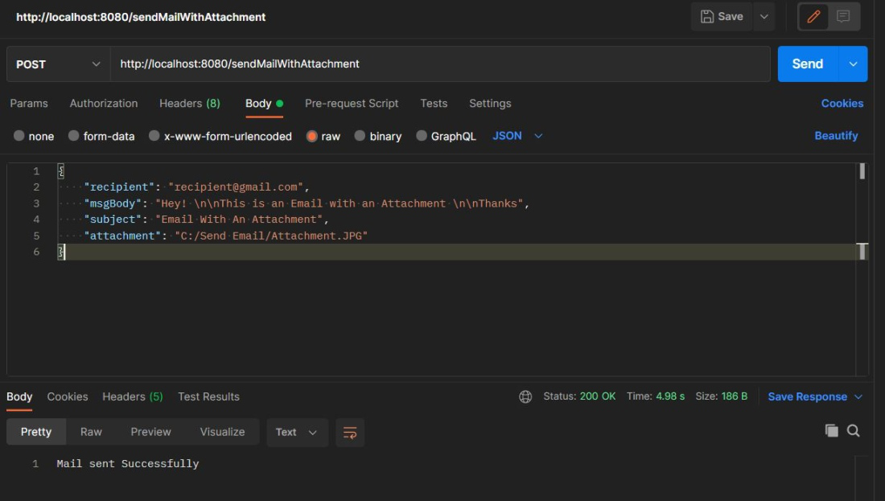
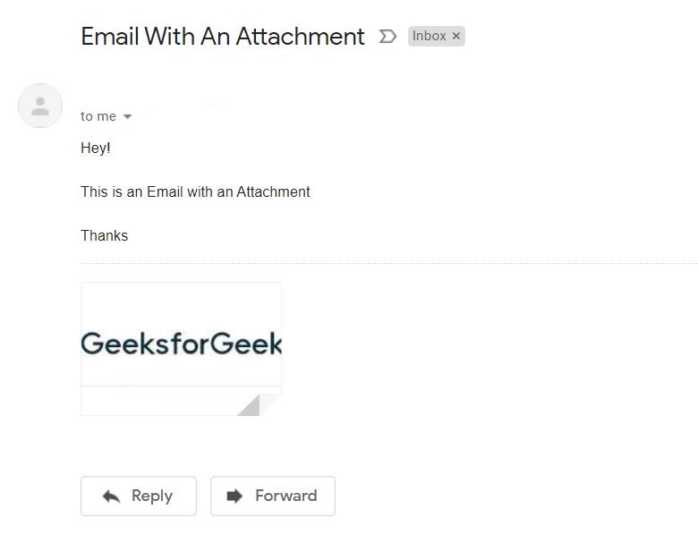

---

# Spring Boot – Sending Email via SMTP

**Last Updated : 23 Jul, 2025**

Spring Boot provides the ability to send emails via SMTP using the JavaMail Library. It simplifies email integration by offering built-in support through Spring’s mail abstraction and the JavaMail API.

---

## JavaMail Support in Spring Boot

Package:
**org.springframework.mail.javamail**

```
@NullMarked
package org.springframework.mail.javamail
```

JavaMail support for Spring's mail infrastructure. It provides an extended **JavaMailSender** interface and a **MimeMessageHelper** class for convenient population of a JavaMail **MimeMessage**.

---

## Related Packages

| Package                  | Description                          |
| ------------------------ | ------------------------------------ |
| org.springframework.mail | Spring's generic mail infrastructure |

---

## Classes and Interfaces

### All Classes and Interfaces

| Class                       | Description                                                                                                                                                                                           |
| --------------------------- | ----------------------------------------------------------------------------------------------------------------------------------------------------------------------------------------------------- |
| ConfigurableMimeFileTypeMap | Spring-configurable FileTypeMap implementation that will read MIME type to file extension mappings from a standard JavaMail MIME type mapping file, using a standard MimetypesFileTypeMap underneath. |
| InternetAddressEditor       | Editor for java.mail.internet.InternetAddress, to directly populate an InternetAddress property.                                                                                                      |
| JavaMailSender              | Extended MailSender interface for JavaMail, supporting MIME messages both as direct arguments and through preparation callbacks.                                                                      |
| JavaMailSenderImpl          | Production implementation of the JavaMailSender interface, supporting both JavaMail MimeMessages and Spring SimpleMailMessages.                                                                       |
| MimeMailMessage             | Implementation of the MailMessage interface for a JavaMail MIME message, to let message population code interact with a simple message or a MIME message through a common interface.                  |
| MimeMessageHelper           | Helper class for populating a MimeMessage.                                                                                                                                                            |
| MimeMessagePreparator       | Callback interface for the preparation of JavaMail MIME messages.                                                                                                                                     |

---

Here we will be illustrating **step-by-step guidelines** to develop **Restful web services** that can be used to **send emails with or without attachments**.

In order to begin with the steps, let us first create a **Spring Boot project using Spring Initializer**.

---

## Implementation

---

## Step 1: Adding the spring-boot-starter-mail dependency in pom.xml

```xml
<dependency>
    <groupId>org.springframework.boot</groupId>
    <artifactId>spring-boot-starter-mail</artifactId>
</dependency>
```

This dependency is a starter for using JavaMail and can be considered as **Spring Framework's email sending support**.

---

## Step 2: Setting up Application.properties file with configurations required for using Gmail SMTP server

```properties
spring.mail.host=smtp.gmail.com
spring.mail.port=587
spring.mail.username=<Login User to SMTP server>
spring.mail.password=<Login password to SMTP server>
spring.mail.properties.mail.smtp.auth=true
spring.mail.properties.mail.smtp.starttls.enable=true
```

The Gmail Id used to login into your Gmail account can be provided as the username.

For password generation, **2-step verification** needs to be enabled for your account as follows:

---

---

Following that, **AppPassword** needs to be created using the following path:

```
Login to Gmail 
    -> Manage your Google Account 
        -> Security 
            -> App Passwords 
                -> Provide your login password 
                    -> Select app with a custom name 
                        -> Click on Generate
```

**Note: For reference,**

If you don’t find the App Password option under Security even after enabling 2-step verification, you might be encountering an issue detailed in this **Google Support Thread on App Passwords**.

To generate an App Password, visit the **Google App Passwords page**. This page will guide you through the process of creating an App Password for your Gmail account.

---

## Step 3: Creating EmailDetails class

This class contains fields such as **recipient, msgBody, subject, and attachment**.

```java
// Java Program to Illustrate EmailDetails Class

package com.SpringBootEmail.Entity;

// Importing required classes
import lombok.AllArgsConstructor;
import lombok.Data;
import lombok.NoArgsConstructor;

// Annotations
@Data
@AllArgsConstructor
@NoArgsConstructor

// Class
public class EmailDetails {

    // Class data members
    private String recipient;
    private String msgBody;
    private String subject;
    private String attachment;
}
```

---

## Step 4: Creating EmailService interface and EmailServiceImpl class

The **EmailService** interface defines two methods:

* **String sendSimpleMail(EmailDetails details)**
  This method can be used to send a simple text email to the desired recipient.

* **String sendMailWithAttachment(EmailDetails details)**
  This method can be used to send an email along with an attachment to the desired recipient.

---

### File: EmailService.java

```java
// Java Program to Illustrate Creation Of
// Service Interface

package com.SpringBootEmail.service;

// Importing required classes
import com.SpringBootEmail.Entity.EmailDetails;

// Interface
public interface EmailService {

    // Method
    // To send a simple email
    String sendSimpleMail(EmailDetails details);

    // Method
    // To send an email with attachment
    String sendMailWithAttachment(EmailDetails details);
}
```

The **JavaMailSender interface of JavaMail API** is used here to send simple text email.

To send a more sophisticated email with an attachment, **MimeMessage** can be used.
**MimeMessageHelper** works as a helper class for MimeMessage to add the attachment and other details required to send the mail.

---

### File: EmailServiceImpl.java

```java
// Java Program to Illustrate Creation Of
// Service implementation class

package com.SpringBootEmail.service;

// Importing required classes
import com.SpringBootEmail.Entity.EmailDetails;
import java.io.File;
import javax.mail.MessagingException;
import javax.mail.internet.MimeMessage;
import org.springframework.beans.factory.annotation.Autowired;
import org.springframework.beans.factory.annotation.Value;
import org.springframework.core.io.FileSystemResource;
import org.springframework.mail.SimpleMailMessage;
import org.springframework.mail.javamail.JavaMailSender;
import org.springframework.mail.javamail.MimeMessageHelper;
import org.springframework.stereotype.Service;

// Annotation
@Service
// Class
// Implementing EmailService interface
public class EmailServiceImpl implements EmailService {

    @Autowired private JavaMailSender javaMailSender;

    @Value("${spring.mail.username}") private String sender;

    // Method 1
    // To send a simple email
    public String sendSimpleMail(EmailDetails details) {

        // Try block to check for exceptions
        try {

            // Creating a simple mail message
            SimpleMailMessage mailMessage = new SimpleMailMessage();

            // Setting up necessary details
            mailMessage.setFrom(sender);
            mailMessage.setTo(details.getRecipient());
            mailMessage.setText(details.getMsgBody());
            mailMessage.setSubject(details.getSubject());

            // Sending the mail
            javaMailSender.send(mailMessage);
            return "Mail Sent Successfully...";
        }

        // Catch block to handle the exceptions
        catch (Exception e) {
            return "Error while Sending Mail";
        }
    }

    // Method 2
    // To send an email with attachment
    public String sendMailWithAttachment(EmailDetails details) {
        // Creating a mime message
        MimeMessage mimeMessage
            = javaMailSender.createMimeMessage();
        MimeMessageHelper mimeMessageHelper;

        try {

            // Setting multipart as true for attachments to
            // be send
            mimeMessageHelper = new MimeMessageHelper(mimeMessage, true);
            mimeMessageHelper.setFrom(sender);
            mimeMessageHelper.setTo(details.getRecipient());
            mimeMessageHelper.setText(details.getMsgBody());
            mimeMessageHelper.setSubject(details.getSubject());

            // Adding the attachment
            FileSystemResource file = new FileSystemResource(new File(details.getAttachment()));

            mimeMessageHelper.addAttachment(file.getFilename(), file);

            // Sending the mail
            javaMailSender.send(mimeMessage);
            return "Mail sent Successfully";
        }

        // Catch block to handle MessagingException
        catch (MessagingException e) {

            // Display message when exception occurred
            return "Error while sending mail!!!";
        }
    }
}
```

---

## Step 5: Creating a Rest Controller EmailController

This controller defines various APIs for sending email.

```java
// Java Program to Create Rest Controller that
// Defines various API for Sending Mail

package com.SpringBootEmail.controller;

// Importing required classes
import com.SpringBootEmail.Entity.EmailDetails;
import com.SpringBootEmail.service.EmailService;
import org.springframework.beans.factory.annotation.Autowired;
import org.springframework.web.bind.annotation.PostMapping;
import org.springframework.web.bind.annotation.RequestBody;
import org.springframework.web.bind.annotation.RestController;

// Annotation
@RestController
// Class
public class EmailController {

    @Autowired private EmailService emailService;

    // Sending a simple Email
    @PostMapping("/sendMail")
    public String sendMail(@RequestBody EmailDetails details) {
        String status = emailService.sendSimpleMail(details);

        return status;
    }

    // Sending email with attachment
    @PostMapping("/sendMailWithAttachment")
    public String sendMailWithAttachment(@RequestBody EmailDetails details) {
        String status = emailService.sendMailWithAttachment(details);

        return status;
    }
}
```

---

## Step 6: Sending a Simple Email

Run the Spring Boot Application and hit:

---

---

```
http://localhost:8080/sendMail
```

Mail received on Gmail is as follows:

---



---

## Step 7: Sending an Email with Attachment

Run the Spring Boot Application and hit:

---

---

```
http://localhost:8080/sendMailWithAttachment
```

Mail received on Gmail is as follows:

---



---

