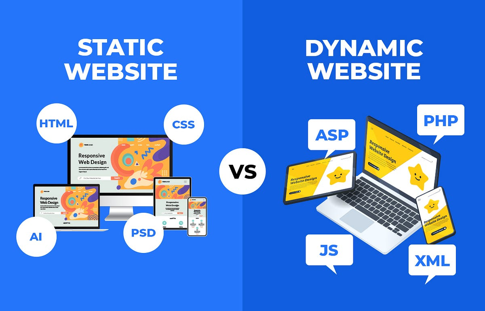
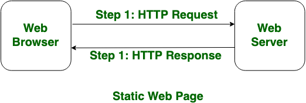
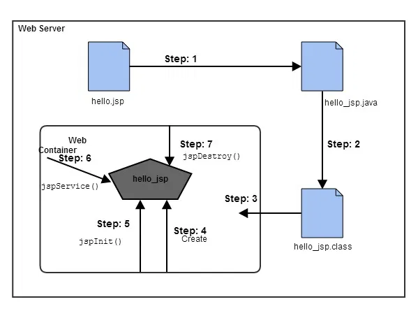

---

# Basics of JSP (JavaServer Pages)

---

**Last Updated: 11 Jul, 2025**

## 1. Introduction to JSP

JavaServer Pages (JSP) is a **server-side technology** used to create **dynamic web applications**. A dynamic web application is one where the content of the web page can change depending on user input, time, database values, or other conditions.

JSP is part of the **Java EE (Jakarta EE)** platform and is mainly used to generate **HTML content dynamically** using Java.

In simple terms:

* HTML alone can only create **static pages**
* JSP allows us to create **dynamic pages** using Java

---

# Difference Between Static and Dynamic Web Pages

---

When users access a website, the way content is generated and displayed depends on whether the page is static or dynamic.

* **Static web pages** display the **same content every time** they are viewed.
* **Dynamic web pages** generate content **instantly**, based on user input, time, location, or database values.

Understanding this difference is very important for beginners learning **web development**, **JSP**, or any **server-side technology**.

---

📌 **Overview of Static vs Dynamic Web Pages**



---

## What are Static Web Pages?

Static Web Pages are the **simplest type of web pages**.
They display **fixed content**, meaning the information shown to the user does **not change automatically**.

### Key Characteristics of Static Web Pages

* Written using:

    * HTML
    * CSS
    * JavaScript (basic usage)
* Content remains the **same for all users**
* No interaction with databases
* Changes must be done **manually** by editing the source code

### How Static Web Pages Work

1. A user sends a request using a web browser.
2. The server receives the request.
3. The server sends the **same stored HTML page** back to the browser.
4. No additional processing is done on the server.

---

📌 **Working of a Static Web Page**



---

### Examples of Static Web Pages

* Personal portfolio websites
* Company profile pages
* Informational websites
* Documentation pages

---

## What are Dynamic Web Pages?

Dynamic Web Pages are **more advanced** and **interactive**.
They generate content **at runtime**, depending on different factors.

### Key Characteristics of Dynamic Web Pages

* Written using:

    * CGI
    * AJAX
    * ASP
    * ASP.NET
    * JSP
    * PHP
* Content **changes for different users**
* Uses databases to store and retrieve data
* Requires server-side processing

### How Dynamic Web Pages Work

1. A user sends a request to the server.
2. The server executes application logic.
3. Data may be fetched from a database.
4. A customized HTML response is generated.
5. The response is sent back to the browser.

---

📌 **Working of a Dynamic Web Page**


---

### Examples of Dynamic Web Pages

* Online shopping websites
* Social media platforms
* Banking systems
* Weather forecast websites
* Stock market websites

---

## Comparison: Static vs Dynamic Web Pages

| **Static Web Page**                          | **Dynamic Web Page**                          |
| -------------------------------------------- | --------------------------------------------- |
| Pages remain the same until manually changed | Content changes for different users           |
| Simple in design and structure               | Complex in design and structure               |
| Information changes rarely                   | Information changes frequently                |
| Faster loading time                          | Slower loading time                           |
| Does not use a database                      | Uses database                                 |
| Written in HTML, CSS, JavaScript             | Written in CGI, AJAX, ASP, ASP.NET, JSP, etc. |
| No application program involved              | Contains application programs                 |
| Lower development cost                       | Higher development cost                       |
| Minimal server processing                    | Heavy server processing                       |

---

## Advantages of Static Web Pages

* Easy to create and maintain
* Fast loading speed
* Low hosting cost
* Secure (no database access)
* Suitable for small websites

---

## Advantages of Dynamic Web Pages

* Interactive and user-friendly
* Content can be updated automatically
* Supports user authentication and personalization
* Ideal for large and complex applications
* Supports real-time data

---

## When to Use Static Web Pages

Static web pages are suitable when:

* Content does not change frequently
* Website is small
* Budget is limited
* No user interaction is required

---

## When to Use Dynamic Web Pages

Dynamic web pages are suitable when:

* Content changes regularly
* User interaction is required
* Data is stored and retrieved from databases
* Personalization is needed
---

## 2. JSP vs Servlets (Understanding the Difference)

Before JSP, developers mainly used **Servlets** to build dynamic web applications.

### How Servlets Work

* Servlets are written **entirely in Java**
* HTML code is written **inside Java code**
* This makes Servlets difficult to read and maintain when the HTML becomes large

### How JSP Works

* JSP pages are written mainly in **HTML**
* Java code is embedded **inside HTML** using JSP tags
* This makes JSP easier to read, write, and maintain

### Key Difference

| Servlets                  | JSP                           |
| ------------------------- | ----------------------------- |
| HTML inside Java          | Java inside HTML              |
| Harder to design UI       | Easier for UI design          |
| Better for business logic | Better for presentation logic |

Everything that a Servlet can do, **a JSP page can also do**.

---

## 3. Why JSP is Used

JSP allows developers to easily separate **presentation logic** from **business logic**.

### Separation of Responsibilities

* **Web Designers**

    * Work on JSP pages
    * Focus on layout, colors, fonts, and UI
* **Java Developers**

    * Write backend logic
    * Handle databases, calculations, validations

Both layers communicate using **HTTP requests and responses**.

This separation makes large applications easier to develop and maintain.

---

### JSP Code Structure – Hello World Example

```jsp
<%@ page language="java" contentType="text/html; charset=UTF-8"
    pageEncoding="UTF-8"%>

<!DOCTYPE html>
<html>
<head>
    <title>Hello World JSP</title>
</head>
<body>

    <h1>Hello World</h1>

</body>
</html>
```

---

### Explanation of JSP Structure

1. **Page Directive**

```jsp
<%@ page language="java" contentType="text/html; charset=UTF-8"
    pageEncoding="UTF-8"%>
```

* Defines page settings such as language and encoding.
* Required for proper JSP configuration.

---

2. **HTML Structure**

```html
<!DOCTYPE html>
<html>
<head>
    <title>Hello World JSP</title>
</head>
<body>
```

* Standard HTML layout used inside JSP.

---

3. **Output Content**

```html
<h1>Hello World</h1>
```

* Displays **Hello World** in the browser.

---

### Using JSP Expression (Optional Example)

```jsp
<h1><%= "Hello World" %></h1>
```

* `<%= %>` is a **JSP Expression Tag** used to output content dynamically.

---

### File Name

```
hello.jsp
```

Deploy this file inside the **webapp** directory of your JSP project and access it via the browser.

---

Below is the **basic Servlet code structure** to print **"Hello World"**.

---

## Servlet Code Structure – Hello World Example

```java
import java.io.IOException;
import java.io.PrintWriter;

import jakarta.servlet.ServletException;
import jakarta.servlet.annotation.WebServlet;
import jakarta.servlet.http.HttpServlet;
import jakarta.servlet.http.HttpServletRequest;
import jakarta.servlet.http.HttpServletResponse;

@WebServlet("/hello")
public class HelloWorldServlet extends HttpServlet {

    @Override
    protected void doGet(HttpServletRequest request, HttpServletResponse response)
            throws ServletException, IOException {

        // Set response content type
        response.setContentType("text/html");

        // Get writer object
        PrintWriter out = response.getWriter();

        // Write response
        out.println("<html>");
        out.println("<head><title>Hello World</title></head>");
        out.println("<body>");
        out.println("<h1>Hello World</h1>");
        out.println("</body>");
        out.println("</html>");
    }
}
```

---

### Explanation of Servlet Structure

#### 1. Import Statements

```java
import jakarta.servlet.*;
import jakarta.servlet.http.*;
```

* Required servlet and HTTP classes.

---

#### 2. `@WebServlet` Annotation

```java
@WebServlet("/hello")
```

* Maps the servlet to a URL pattern.
* Access in browser:

  ```
  http://localhost:8080/project-name/hello
  ```

---

#### 3. Servlet Class

```java
public class HelloWorldServlet extends HttpServlet
```

* Every servlet must extend `HttpServlet`.

---

#### 4. `doGet()` Method

```java
protected void doGet(HttpServletRequest request, HttpServletResponse response)
```

* Handles HTTP GET requests.

---

#### 5. Writing Output

```java
PrintWriter out = response.getWriter();
out.println("<h1>Hello World</h1>");
```

* Sends output to the browser.

---

## 4. JSP Becomes a Servlet Internally

One of the most important concepts in JSP is:

> **A JSP page is eventually converted into a Servlet**

JSP files are **not executed directly** by the server. Instead:

1. The Web Container translates the JSP file into a Servlet
2. The Servlet is compiled into bytecode
3. The compiled Servlet handles client requests

This entire process is done **automatically** by the Web Container (e.g., Apache Tomcat).

---

## 5. JSP to Servlet Transformation

The transformation of a JSP page into a Servlet involves two main steps:

1. **Translation**

    * JSP code → Servlet source code (`.java`)
2. **Compilation**

    * Servlet source → Bytecode (`.class`)

This transformation occurs:

* When the JSP page is requested for the first time
* When the JSP page is modified

---

## 6. Why JSP is Preferred Over Servlets

JSP is preferred over Servlets for the following reasons:

* Easier to write and understand
* No need to manually create Java classes
* No need for `web.xml` mapping in most cases
* Automatic recompilation when JSP code changes
* JSP files can be accessed directly through the browser
* Faster development for dynamic web pages

---

## 7. Advantages of JSP

* Easy to develop and maintain
* High performance and scalability
* Platform independent (runs anywhere Java runs)
* Integrates easily with Servlets and JavaBeans
* Supports MVC architecture

---

## 8. Lifecycle of JSP

The **JSP Lifecycle** describes the steps followed by a JSP page from creation to destruction.

The lifecycle of JSP is **almost the same as Servlet lifecycle**, with one extra step at the beginning.

### JSP Lifecycle Steps

1. Translation of JSP to Servlet
2. Compilation of Servlet
3. Loading of Servlet class
4. Creation of Servlet instance
5. Initialization using `jspInit()`
6. Request handling using `_jspService()`
7. Destruction using `jspDestroy()`

---

📌 **JSP Lifecycle Diagram**



---

## 9. Explanation of Each Lifecycle Step

### 1. Translation

The Web Container converts JSP code into a Servlet `.java` file.

### 2. Compilation

The `.java` file is compiled into a `.class` file.

### 3. Class Loading

The class loader loads the compiled Servlet class into memory.

### 4. Instance Creation

The Web Container creates an object (instance) of the Servlet class.

### 5. Initialization (`jspInit()`)

* Called once
* Used for resource initialization (database connections, variables)

### 6. Request Processing (`_jspService()`)

* Called for every client request
* Generates the dynamic response

### 7. Destruction (`jspDestroy()`)

* Called before removing the Servlet from memory
* Used to clean up resources

---

## 10. What Happens Internally When JSP is Converted to Servlet

Consider the following JSP code.

### JSP Code Example (`hello.jsp`)

```html
<html>
<head>
    <title>My First JSP Page</title>
</head>
<%
    int count = 0;
%>
<body>
    Page Count is:
    <% out.println(++count); %>
</body>
</html>
```

* Code inside `<% %>` is Java code
* `out` is an implicit JSP object used to send output to the browser

---

### Equivalent Servlet Code (Conceptual)

```java
public class hello_jsp extends HttpServlet {

    public void _jspService(HttpServletRequest request,
                            HttpServletResponse response)
            throws IOException, ServletException {

        PrintWriter out = response.getWriter();
        response.setContentType("text/html");

        out.write("<html><body>");
        int count = 0;
        out.write("Page Count is: ");
        out.print(++count);
        out.write("</body></html>");
    }
}
```

This conversion is done automatically.
As a JSP developer, **you never write this Servlet code yourself**.

---

## 11. Creating a JSP Page

A JSP page:

* Looks like an HTML page
* Can contain Java code using JSP tags
* Is saved with `.jsp` extension

### JSP Scriptlet Syntax

```jsp
<%
    // Java code here
%>
```

JSP pages are mainly used to generate **dynamic HTML responses**.

---

## 12. Creating a JSP Page Using a Spring Boot Application (Step-by-Step)

---

Perfect! Let’s rewrite the **Spring Boot JSP creation steps** for **IntelliJ IDEA**, including the required dependencies. I’ll make it step-by-step for notes and diagram spaces.

---

## 12. Creating a JSP Page Using Spring Boot in IntelliJ IDEA (Step-by-Step)

---

### Step 1: Create a Spring Boot Project

* Open **IntelliJ IDEA**
* Click **File → New → Project**
* Select **Spring Initializr**
* Click **Next**

---

### Step 2: Configure Project Details

* Enter:

    * **Project Name**
    * **Group** and **Artifact**
    * **Packaging**: `War` (required for JSP)
    * **Java Version**
* Click **Next / Finish**

---

### Step 3: Add Dependencies

**Required Dependencies for JSP in Spring Boot:**

1. **Spring Web** – for controllers and HTTP endpoints
2. **Tomcat (embedded)** – default servlet container
3. **JSP Support**:

    * `tomcat-jasper` – JSP engine
    * `jstl` – JSP Standard Tag Library
4. **Spring Boot DevTools** (optional, for live reload)

> ⚠ Important: In Maven, `tomcat-jasper` is usually added with `<scope>provided</scope>` if using embedded Tomcat.

---

### Step 4: View Project Structure

* Project appears in **Project Explorer**
* Key folders:

    * `src/main/java` – for Java code
    * `src/main/resources` – for properties
    * `src/main/webapp` – for JSP files

---

### Step 5: Create JSP Folder Structure

* Right-click `src/main/webapp` → **New → Directory**
* Create folders:

```
/WEB-INF/views
```

---

### Step 6: Create JSP File

* Right-click **views** → **New → JSP File**
* Enter file name (e.g., `index.jsp`)
* Click **OK**
---

### Step 7: Write JSP Code

```jsp
<html>
<body>
    <h2>Welcome to JSP</h2>
    <%
        out.println("This is my first JSP page using Spring Boot");
    %>
</body>
</html>
```

---

### Step 8: Configure View Resolver (application.properties)

```properties
spring.mvc.view.prefix=/WEB-INF/views/
spring.mvc.view.suffix=.jsp
```

---

### Step 9: Create Controller Class

```java
@Controller
public class HomeController {

    @GetMapping("/")
    public String home() {
        return "index"; // points to index.jsp
    }
}
```

---

### Step 10: Run Spring Boot Application

* Right-click project → **Run 'Application'**

---

### Step 11: View Output in Browser

* Open browser:

```
http://localhost:8080/
```

* JSP page should display

---

### Key Notes

* JSP files go in **`WEB-INF/views`**
* Spring Boot + JSP requires **WAR packaging**
* **Controller + View Resolver** is mandatory
* Dependencies: `spring-boot-starter-web`, `tomcat-jasper`, `jstl`

---


