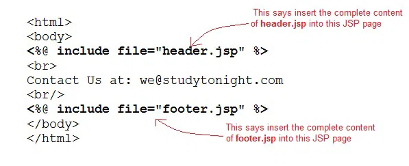
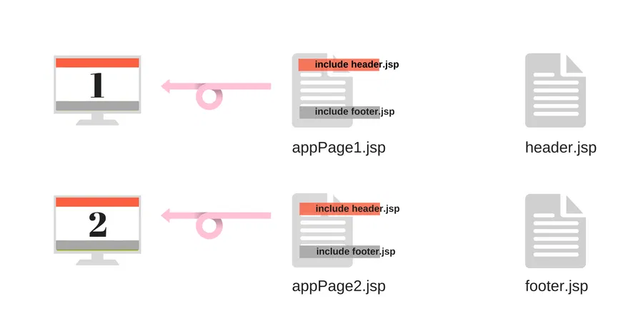
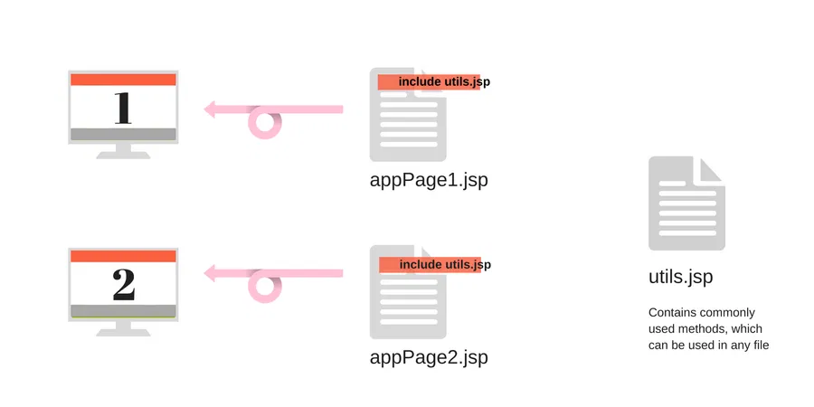
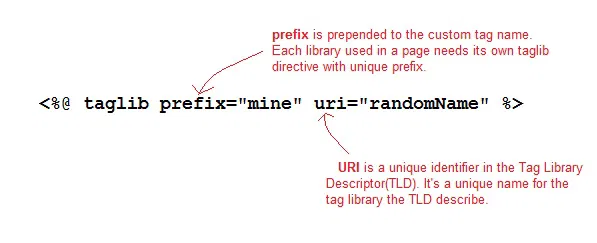

# JSP Include Directive

The include directive tells the Web Container to copy everything in the included file and paste it into current JSP file. Syntax of include directive is:

><%@ include file="filename.jsp" %>

---

---

## Example of include directive

welcome.jsp

```html
<html>
    <head>
        <title>Welcome Page</title>
    </head>

  <body>
        <%@ include file="header.jsp" %>
        Welcome, User
  </body>
</html>
```

header.jsp

```html
<html>
  <body>
        
  </body>
</html>
```

The example above is showcasing a very standard practice. Whenever we are building a web application, with webpages, all of which have the top navbar and bottom footer same. We make them as separate jsp files and include them using the include directive in all the pages. Hence whenever we have to update something in the top navbar or footer, we just have to do it at one place. Handy, isn't it?

---

---

One more standard application of include directive is, if you create a separate jsp file, with some commonly used functions, kind of like a util jsp file. Which can be included in the web pages wherever you want to use those functions.

---

---

Similarly, there are many ways in which this directive proves to be quite useful in giving a structure to your web application code.

---

# SP Taglib Directive

The taglib directive is used to define tag library that the current JSP page uses. A JSP page might include several tag library. JavaServer Pages Standard Tag Library (JSTL), is a collection of useful JSP tags, which provides mahy commonly used core functionalities. It has support for many general, structural tasks such as iteration and conditionals, readymade tags for manipulating XML documents, internationalization tags, and for performing SQL operations. Syntax of taglib directive is:

> <%@ taglib prefix="prefixOfTag" uri="uriOfTagLibrary" %>

The prefix is used to distinguish the custom tag from other libary custom tag. Prefix is prepended to the custom tag name. Every custom tag must have a prefix.

The URI is the unique name for Tag Library.

---

---

You can name the prefix anything, but it should be unique.

## JSP: Using Taglib Directive

To use the JSTL in your application, you must have the jstl.jar in your webapps /WEB-INF/lib directory. Download the jar file from [link>>>](https://tomcat.apache.org/taglibs/index.html).

There are many readymade JST Libraries available which you use to make your life easier. Following is a broad division on different groups of JST libraries :

1. Core Tags - URI → http://java.sun.com/jsp/jstl/core
2. Formatting Tags - URI → http://java.sun.com/jsp/jstl/fmt
3. SQL Tags - URI → http://java.sun.com/jsp/jstl/sql
4. XML Tags - URI → http://java.sun.com/jsp/jstl/xml
5. JSTL Functions - URI → http://java.sun.com/jsp/jstl/functions

---