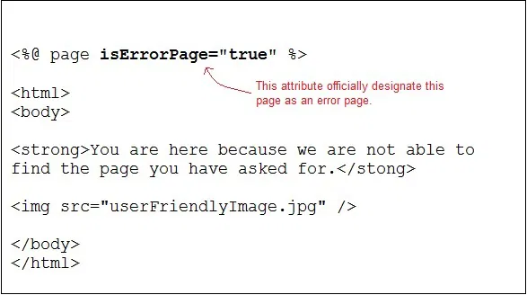
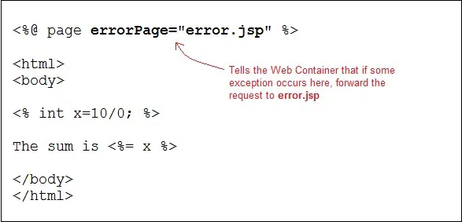

# JSP Exception Handling

Exception Handling is a process of handling exceptional condition that might occur in your application. Exception Handling in JSP is much easier than Java Technology exception handling. Although JSP Technology also uses the same exception class objects.

It is quite obvious that you dont want to show error stack trace to any random user surfing your website. You can't prevent all errors in your application but you can atleast give a user friendly error response page.

Ways to perform Exception Handling in JSP
JSP provide 3 different ways to perform exception handling:
1. Using isErrorPage and errorPage attribute of page directive.
2. Using <error-page> tag in Deployment Descriptor.
3. Using simple try...catch block.

Example of isErrorPage and errorPage attribute
> *isErrorPage* attribute in page directive officially appoints a JSP page as an error page.

error.jsp

---

---

> *errorPage* attribute in a page directive informs the Web Container that if an exception occurs in the current page, forward the request to the specified error page.

sum.jsp

---

---

Whenever an exception occurs in **sum.jsp** page the user is redirected to the **error.jsp** page, where either you can display a nice message, or you can also print the exception trace into a file/database in the background, to check later what caused the error.

## Declaring error page in Deployment Descriptor

You can also declare error pages in the DD for the entire Web Apllication. Using <error-page> tag in the Deployment Descriptor. You can even configure different error pages for different exception types, or HTTP error code type(503, 500 etc).

> Declaring an error page for all type of exception

```html
<error-page>
<exception-type>java.lang.Throwable</exception-type>
<location>/error.jsp</location>
</error-page>
```

> Declaring an error page for more detailed exception

```html
<error-page>
<exception-type>java.lang.ArithmeticException</exception-type>
<location>/error.jsp</location>
</error-page>
```
> Declaring an error page based on HTTP Status code
```html
<error-page>
<error-code>404</error-code>
<location>/error.jsp</location>
</error-page>
```
## Using the try...catch block

Using try...catch block is just like how it is used in [Core Java](https://www.studytonight.com/java/overview-of-java.php).

```html
<html>
<head>
   <title>Try...Catch Example</title>
</head>
<body>
  <%
   try{
      int i = 100;
      i = i / 0;
      out.println("The answer is " + i);
   }
   catch (Exception e){
      out.println("An exception occurred: " + e.getMessage());
   }
  %>
</body>
</html>
```

---