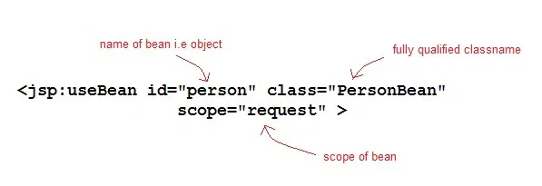
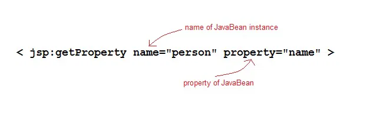

# JSP JavaBean Components

A JavaBeans component is a Java class with the following features:
1. A no-argument constructor.
2. Properties defined with accessors and mutators(getter and setter method).
3. Class must not define any public instance variables.
4. The class must implement the java.io.Serializable interface.

---

# Example of a JavaBean

Let's take a simple Java code example to understand what do we mean when we say JavaBean,

```java
import java.io.Serializable;

public class StudentBean implements Serializable
{
  private String name;
  private int roll;

  // constructor
  public StudentBean()
  {
    this.name = "";
    this.roll = "";
  }
  // getters and setters
  public void setName(String name)
  {
    this.name = name;
  }
  public String getName()
  {
    return name;
  }
  public int getRoll()
  {
    return roll;
  }
  public void setRoll(int roll)
  {
    this.roll = roll;
  }
}
```
As you can see in the code above, a JavaBean is nothing but a Java class which implements the interface Serializable.

---
Using a JavaBean in JSP page
JavaBeans can be used in any JSP page using the <jsp:useBean> tag, For example:

```jsp
<jsp:useBean id="bean name" scope="fully qualified path of bean" typeSpec/>
```

---
Using any JavaBean property in JSP page
JavaBeans can be used in any JSP page using the <jsp:useBean> tag, <jsp:setProperty> tag and <jsp:getProperty> tag , For example:

```jsp
<jsp:useBean id="id" class="bean class name" scope="fully qualified path of bean">
   <jsp:setProperty name="beans id" property="property name" value="value"/>
   <jsp:getProperty name="beans id" property="property name"/>
   ...........
</jsp:useBean>
```

---

# JSP jsp:useBean Tag

---

If you want to interact with a JavaBeans component using the Action tag in a JSP page, you must first declare a bean. The <jsp:useBean> is a way of declaring and initializing the actual bean object. By bean we mean JavaBean component object. Syntax of <jsp:useBean> tag

```jsp
<jsp:useBean id = "beanName" class = "className" 
              scope = "page | request | session | application">
```

Here the id attribute specifies the name of the bean. Scope attribute specify where the bean is stored. The class attribute specify the fully qualified classname.

---

---

Given a useBean declaration of following :

```jsp
<jsp:useBean id="myBean" class="PersonBean" scope="request" />
```

is equivalent to the following java code,

```java
PersonBean myBean = (PersonBean)request.getAttribute("myBean");
if(myBean == null)
{
   myBean = new PersonBean();
   request.setAttribute("myBean", myBean);
}
```

> If jsp:useBean tag is used with a body, the content of the body is only executed if the bean is created. If the bean already exists in the named scope, the body is skipped.

---

Time for an Example
In this example we will see how <jsp:useBean> standard tag is used to declare and initialize a bean object. We will use PersonBean class as JavaBean Component.

PersonBean.java

```java
import java.io.Serializable;

public class PersonBean implements Serializable
{
 private String name;
  
  public PersonBean()
   {
    this.name="";
   }
   public void setName(String name)
   {
    this.name = name;
   }
   public String getName()
   {
    return name;
   }
}
```

hello.jsp

```jsp
<html>
    <head>
        <title>Welcome Page</title>
    </head>
    <jsp:useBean id="person" class="PersonBean" scope="request" />
  <body>
        //Use the bean here...  
  </body>
</html>
```

Here jsp:useBean declares a "person" bean in the jsp page which can be used there. How to use it, modify it, we will study in coming lessons.

---

## JSP jsp:getProperty Tag

The getProperty tag is used to retrieve a property from a JavaBeans instance. The syntax of the getProperty tag is as follows:

```jsp
<jsp:getProperty name="beanName" property="propertyName" />
```
The name attribute represents the name of the JavaBean instance. The property attribute represents the property of the JavaBean whose value we want to get.

---

---

Example of getProperty with Java Bean
Following is our Java class.

PersonBean.java

```java
import java.io.Serializable;

public class PersonBean implements Serializable
{
  private String name;
  
  public PersonBean()
  {
    this.name="";
  }
  public void setName(String name)
  {
    this.name = name;
  }
  public String getName()
  {
    return name;
  }
}
```

hello.jsp

```jsp
<html>
    <head>
        <title>Welcome Page</title>
    </head>
    <jsp:useBean id="person" class="PersonBean" scope="request" />
  <body>
        Name of Person is : <jsp:getProperty name="person" property="name" />
  </body>
</html>
```

---

## JSP jsp:setProperty Tag

The setProperty tag is used to store data in JavaBeans instances. The syntax of setProperty tag is:

```jsp
<jsp:setProperty name="beanName" property="*">
<!-- or -->
<jsp:setProperty name="beanName" property="propertyName">
<!-- or -->
<jsp:setProperty name="beanName" property="propertyName" param="parameterName">
<!-- or -->
<jsp:setProperty name="beanName" property="propertyName" value="propertyValue">
```

The name attribute specifies the name of javaBean instances. This must match the id attribute specified in the jsp:useBean tag. The property attribute specifies which property of the bean to access.

---

## Example of setProperty with Java Bean

Following is our Java class.

PersonBean.java

```java

import java.io.Serializable;

public class PersonBean implements Serializable
{
  private String name;
  
  public PersonBean()
  {
    this.name="";
  }
  public void setName(String name)
  {
    this.name = name;
  }
  public String getName()
  {
    return name;
  }
}
```

hello.jsp

```jsp
<html>
    <head>
        <title>Welcome Page</title>
    </head>
    <jsp:useBean id="person" class="PersonBean" scope="request" />
    <jsp:setProperty name="person" property="name" value="Viraj" />
    <body>
        Name of Person is : <jsp:getProperty name="person" property="name" />
    </body>
</html>
```

---
Output will be → Name of Person is : Viraj

Similarly we can have a very complex Java Bean as well, with many properties. We can easily get and set all the properties using the jsp:useBean, jsp:setProperty, jsp:getProperty.

---