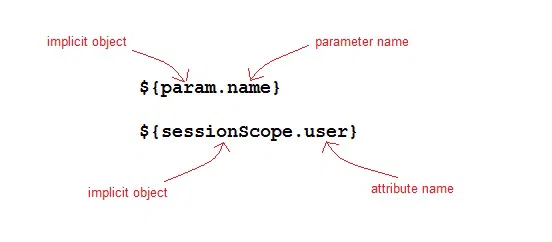

# JSP Expression Language

Expression Language(EL) was added to JSP 2.0 specification. The purpose of EL is to produce scriptless JSP pages. The syntax of EL in a JSP is as follows:

> ${expr}

Here expr is a valid EL expression. An expression can be mixed with static text/values and can also be combined with other expressions to form larger expression.

---

---

## How EL expression is used?

EL expression can be used in two ways in a JSP page

As attribute values in standard and custom tags. Example:
> <jsp:include page="${location}">
Where location variable is separately defines in the jsp page.

Expressions can also be used in jsp:setProperty to set a properties value, using other bean properties like : If we have a bean named Square with properties length, breadth and area.

> <jsp:setProperty name="square" property="area" value="${square.length*square.breadth}" />

To output in HTML tag:

> <h1>Welcome ${name}</h1>

To deactivate the evaluation of EL expressions, we specify the isELIgnored attribute of the page directive as below:

> <%@ page isELIgnored ="true|false" %>

---

## JSP EL Implicit Objects

The following are the implicit objects in EL:

| Implicit Object  | Description                                                                         |
|------------------|-------------------------------------------------------------------------------------|
| pageContext	    | It represents the PageContext object.                                               |
| pageScope	    | It is used to access the value of any variable which is set in the Page scope       |
| requestScope	    | It is used to access the value of any variable which is set in the Request scope.   |
| sessionScope	    | It is used to access the value of any variable which is set in the Session scope    |
| applicationScope | It is used to access the value of any variable which is set in the Application scope| 
| param	        | Map a request parameter name to a single value                                      |
| paramValues	    | Map a request parameter name to corresponding array of string values.               |
| header	        | Map containing header names and single string values.                               |
| headerValues	    | Map containing header names to corresponding array of string values.                |
| cookie	        | Map containing cookie names and single string values.                               |

## Example of JSP EL

Let's take a simple example for understanding the JSP expression language,

index.jsp

```html

<form method="POST" action="welcome.jsp">
    Name <input type="text" name="user" >
    <input type="submit" value="Submit">
</form>
```

welcome.jsp

```html
<html>
    <head>
        <title>Welcome Page</title>
    </head>

  	<body>
        <h1>Welcome ${param.name}</h1>
  	</body>
</html>
```

---

Arithmetic Operations available in EL
Following are the arithmetic operators avilable in EL:

|Arithmetic Operation	| Operator  |
|----------------------|-----------|
|Addition	            | +         |   
|Substraction	        | -         |      
|Multiplication	    | *         |    
|Division	            | / and div | 
|Remainder	            | % and mod |

---

## Logical and Relational Operators available in EL

Following are the logical operator and comparators avilable in EL:

| Logical and Relational Operator | Operator   |
|---------------------------------|------------|
| Equals                          | == and eq  |
| Not equals                      | != and ne  |
| Less Than                       | < and lt   |
| Greater Than                    | > and gt   |
| Greater Than or Equal           | >= and ge  |
| Less Than or Equal              | <= and le  |
| and                             | && and and |
| or                              | || and or  |
| not                             | ! and not  |

---