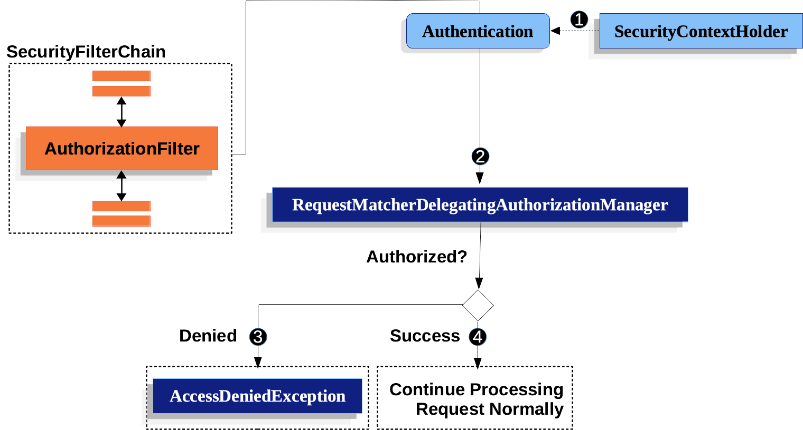

# Authorize HttpServletRequests

---
Spring Security allows you to model your authorization at the request level. For example, with Spring Security you can say that all pages under /admin require one authority while all other pages simply require authentication.

By default, Spring Security requires that every request be authenticated. That said, any time you use an HttpSecurity instance, it’s necessary to declare your authorization rules.

Whenever you have an HttpSecurity instance, you should at least do:

**Use authorizeHttpRequests**

```java
http
.authorizeHttpRequests((authorize) -> authorize
.anyRequest().authenticated()
)
```
This tells Spring Security that any endpoint in your application requires that the security context at a minimum be authenticated in order to allow it.

In many cases, your authorization rules will be more sophisticated than that, so please consider the following use cases:
  * I have an app that uses authorizeRequests and I want to migrate it to authorizeHttpRequests
  * I want to understand how the AuthorizationFilter components work
  * I want to match requests based on a pattern; specifically regex
  * I want to match request, and I map Spring MVC to something other than the default servlet
  * I want to authorize requests
  * I want to match a request programmatically
  * I want to authorize a request programmatically
  * I want to delegate request authorization to a policy agent
  * I want to customize how authorization managers are created

---

## Understanding How Request Authorization Components Work

>This section builds on Servlet Architecture and Implementation by digging deeper into how authorization works at the request level in Servlet-based applications.

---

---
1. First, the AuthorizationFilter constructs a Supplier that retrieves an Authentication from the SecurityContextHolder.
2. Second, it passes the Supplier<Authentication> and the HttpServletRequest to the AuthorizationManager. The AuthorizationManager matches the request to the patterns in authorizeHttpRequests, and runs the corresponding rule.
   3. If authorization is denied, an AuthorizationDeniedEvent is published, and an AccessDeniedException is thrown. In this case the ExceptionTranslationFilter handles the AccessDeniedException.
   4. If access is granted, an AuthorizationGrantedEvent is published and AuthorizationFilter continues with the FilterChain which allows the application to process normally.

---

## AuthorizationFilter Is Last By Default

The AuthorizationFilter is last in the Spring Security filter chain by default. This means that Spring Security’s authentication filters, exploit protections, and other filter integrations do not require authorization. If you add filters of your own before the AuthorizationFilter, they will also not require authorization; otherwise, they will.

A place where this typically becomes important is when you are adding Spring MVC endpoints. Because they are executed by the DispatcherServlet and this comes after the AuthorizationFilter, your endpoints need to be included in authorizeHttpRequests to be permitted.

---

## All Dispatches Are Authorized

The AuthorizationFilter runs not just on every request, but on every dispatch. This means that the REQUEST dispatch needs authorization, but also FORWARDs, ERRORs, and INCLUDEs.

> For example, Spring MVC can FORWARD the request to a view resolver that renders a Thymeleaf template, like so:

**Sample Forwarding Spring MVC Controller**

```java
@Controller
public class MyController {
    @GetMapping("/endpoint")
    public String endpoint() {
        return "endpoint";
    }
}
```
In this case, authorization happens twice; once for authorizing /endpoint and once for forwarding to Thymeleaf to render the "endpoint" template.

For that reason, you may want to permit all FORWARD dispatches.

Another example of this principle is how Spring Boot handles errors. If the container catches an exception, say like the following:

**Sample Erroring Spring MVC Controller**
```java
@Controller
public class MyController {
    @GetMapping("/endpoint")
    public String endpoint() {
        throw new UnsupportedOperationException("unsupported");
    }
}
```
then Boot will dispatch it to the ERROR dispatch.

In that case, authorization also happens twice; once for authorizing /endpoint and once for dispatching the error.

For that reason, you may want to permit all ERROR dispatches.

---

## Authentication Lookup is Deferred

Remember that the AuthorizationManager API uses a Supplier<Authentication>.

This matters with authorizeHttpRequests when requests are always permitted or always denied. In those cases, the Authentication is not queried, making for a faster request.

---

## Authorizing an Endpoint

You can configure Spring Security to have different rules by adding more rules in order of precedence.

If you want to require that /endpoint only be accessible by end users with the USER authority, then you can do:

**Authorize an Endpoint**

```java
@Bean
public SecurityFilterChain web(HttpSecurity http) throws Exception {
    http
        .authorizeHttpRequests((authorize) -> authorize
	    .requestMatchers("/endpoint").hasAuthority("USER")
            .anyRequest().authenticated()
        )
        // ...

    return http.build();
}
```

As you can see, the declaration can be broken up in to pattern/rule pairs.

AuthorizationFilter processes these pairs in the order listed, applying only the first match to the request. This means that even though /** would also match for /endpoint the above rules are not a problem. The way to read the above rules is "if the request is /endpoint, then require the USER authority; else, only require authentication".

Spring Security supports several patterns and several rules; you can also programmatically create your own of each.

Once authorized, you can test it using Security’s test support in the following way:

**Test Endpoint Authorization**

```java
@WithMockUser(authorities="USER")
@Test
void endpointWhenUserAuthorityThenAuthorized() {
    this.mvc.perform(get("/endpoint"))
        .andExpect(status().isOk());
}

@WithMockUser
@Test
void endpointWhenNotUserAuthorityThenForbidden() {
    this.mvc.perform(get("/endpoint"))
        .andExpect(status().isForbidden());
}

@Test
void anyWhenUnauthenticatedThenUnauthorized() {
    this.mvc.perform(get("/any"))
        .andExpect(status().isUnauthorized());
}
```
---

## Matching Requests

Above you’ve already seen two ways to match requests.

The first you saw was the simplest, which is to match any request.

The second is to match by a URI pattern. Spring Security supports two languages for URI pattern-matching: Ant (as seen above) and Regular Expressions.

---

## Matching Using Ant

Ant is the default language that Spring Security uses to match requests.

You can use it to match a single endpoint or a directory, and you can even capture placeholders for later use. You can also refine it to match a specific set of HTTP methods.

Let’s say that you instead of wanting to match the /endpoint endpoint, you want to match all endpoints under the /resource directory. In that case, you can do something like the following:

**Match with Ant**

```java
http
    .authorizeHttpRequests((authorize) -> authorize
        .requestMatchers("/resource/**").hasAuthority("USER")
        .anyRequest().authenticated()
    )
```
The way to read this is "if the request is /resource or some subdirectory, require the USER authority; otherwise, only require authentication"

You can also extract path values from the request, as seen below:

**Authorize and Extract**
```java
http
    .authorizeHttpRequests((authorize) -> authorize
        .requestMatchers("/resource/{name}").access(new WebExpressionAuthorizationManager("#name == authentication.name"))
        .anyRequest().authenticated()
    )
```
Once authorized, you can test it using Security’s test support in the following way:

**Test Directory Authorization**
```java
@WithMockUser(authorities="USER")
@Test
void endpointWhenUserAuthorityThenAuthorized() {
    this.mvc.perform(get("/endpoint/jon"))
        .andExpect(status().isOk());
}

@WithMockUser
@Test
void endpointWhenNotUserAuthorityThenForbidden() {
    this.mvc.perform(get("/endpoint/jon"))
        .andExpect(status().isForbidden());
}

@Test
void anyWhenUnauthenticatedThenUnauthorized() {
    this.mvc.perform(get("/any"))
        .andExpect(status().isUnauthorized());
}
```
> Spring Security only matches paths. If you want to match query parameters, you will need a custom request matcher.

---

## Matching Using Regular Expressions

Spring Security supports matching requests against a regular expression. This can come in handy if you want to apply more strict matching criteria than ** on a subdirectory.

For example, consider a path that contains the username and the rule that all usernames must be alphanumeric. You can use RegexRequestMatcher to respect this rule, like so:

**Match with Regex**
```java
http
    .authorizeHttpRequests((authorize) -> authorize
        .requestMatchers(RegexRequestMatcher.regexMatcher("/resource/[A-Za-z0-9]+")).hasAuthority("USER")
        .anyRequest().denyAll()
    )
```

---

## Matching By Http Method

You can also match rules by HTTP method. One place where this is handy is when authorizing by permissions granted, like being granted a read or write privilege.

To require all GETs to have the read permission and all POSTs to have the write permission, you can do something like this:

**Match by HTTP Method**
```java
http
    .authorizeHttpRequests((authorize) -> authorize
        .requestMatchers(HttpMethod.GET).hasAuthority("read")
        .requestMatchers(HttpMethod.POST).hasAuthority("write")
        .anyRequest().denyAll()
    )
```
These authorization rules should read as: "if the request is a GET, then require read permission; else, if the request is a POST, then require write permission; else, deny the request"

> Denying the request by default is a healthy security practice since it turns the set of rules into an allow list.

Once authorized, you can test it using Security’s test support in the following way:

**Test Http Method Authorization**
```java
@WithMockUser(authorities="read")
@Test
void getWhenReadAuthorityThenAuthorized() {
    this.mvc.perform(get("/any"))
        .andExpect(status().isOk());
}

@WithMockUser
@Test
void getWhenNoReadAuthorityThenForbidden() {
    this.mvc.perform(get("/any"))
        .andExpect(status().isForbidden());
}

@WithMockUser(authorities="write")
@Test
void postWhenWriteAuthorityThenAuthorized() {
    this.mvc.perform(post("/any").with(csrf()))
        .andExpect(status().isOk());
}

@WithMockUser(authorities="read")
@Test
void postWhenNoWriteAuthorityThenForbidden() {
    this.mvc.perform(get("/any").with(csrf()))
        .andExpect(status().isForbidden());
}
```
---

## Matching By Dispatcher Type

This feature is not currently supported in XML
As stated earlier, Spring Security authorizes all dispatcher types by default. And even though the security context established on the REQUEST dispatch carries over to subsequent dispatches, subtle mismatches can sometimes cause an unexpected AccessDeniedException.

To address that, you can configure Spring Security Java configuration to allow dispatcher types like FORWARD and ERROR, like so:

**Match by Dispatcher Type**
```java
http
    .authorizeHttpRequests((authorize) -> authorize
        .dispatcherTypeMatchers(DispatcherType.FORWARD, DispatcherType.ERROR).permitAll()
        .requestMatchers("/endpoint").permitAll()
        .anyRequest().denyAll()
    )
```
---

## Matching by Servlet Path

Generally speaking, you can use requestMatchers(String) as demonstrated above.

However, if you have authorization rules from multiple servlets, you need to specify those:

**Match by PathPatternRequestMatcher**
```java
import static org.springframework.security.web.servlet.util.matcher.PathPatternRequestMatcher.withDefaults;

@Bean
SecurityFilterChain appEndpoints(HttpSecurity http) {
	PathPatternRequestMatcher.Builder mvc = withDefaults().basePath("/spring-mvc");
	http
        .authorizeHttpRequests((authorize) -> authorize
            .requestMatchers(mvc.matcher("/admin/**")).hasAuthority("admin")
            .requestMatchers(mvc.matcher("/my/controller/**")).hasAuthority("controller")
            .anyRequest().authenticated()
        );

	return http.build();
}
```
This is because Spring Security requires all URIs to be absolute (minus the context path).

> There are several other components that create request matchers for you like PathRequest#toStaticResources#atCommonLocations

---

## Using a Custom Matcher

This feature is not currently supported in XML
In Java configuration, you can create your own RequestMatcher and supply it to the DSL like so:

**Authorize by Dispatcher Type**
```java
RequestMatcher printview = (request) -> request.getParameter("print") != null;
http
    .authorizeHttpRequests((authorize) -> authorize
        .requestMatchers(printview).hasAuthority("print")
        .anyRequest().authenticated()
    )
```
> Because RequestMatcher is a functional interface, you can supply it as a lambda in the DSL. However, if you want to extract values from the request, you will need to have a concrete class since that requires overriding a default method.

Once authorized, you can test it using Security’s test support in the following way:

**Test Custom Authorization**
```java
@WithMockUser(authorities="print")
@Test
void printWhenPrintAuthorityThenAuthorized() {
    this.mvc.perform(get("/any?print"))
        .andExpect(status().isOk());
}

@WithMockUser
@Test
void printWhenNoPrintAuthorityThenForbidden() {
    this.mvc.perform(get("/any?print"))
        .andExpect(status().isForbidden());
}
```
---

## Authorizing Requests
Once a request is matched, you can authorize it in several ways already seen like permitAll, denyAll, and hasAuthority.

As a quick summary, here are the authorization rules built into the DSL:
* *permitAll -* The request requires no authorization and is a public endpoint; note that in this case, the Authentication is never retrieved from the session
* *denyAll -* The request is not allowed under any circumstances; note that in this case, the Authentication is never retrieved from the session
* *hasAuthority -* The request requires that the Authentication have a GrantedAuthority that matches the given value
* *hasRole -* A shortcut for hasAuthority that prefixes ROLE_ or whatever is configured as the default prefix
* *hasAnyAuthority -* The request requires that the Authentication have a GrantedAuthority that matches any of the given values
* *hasAnyRole -* A shortcut for hasAnyAuthority that prefixes ROLE_ or whatever is configured as the default prefix* hasAnyAuthority - The request requires that the Authentication have a GrantedAuthority that matches any of the given values
* *hasAllRoles -* A shortcut for hasAllAuthorities that prefixes ROLE_ or whatever is configured as the default prefix
* *hasAllAuthorities -* The request requires that the Authentication have a GrantedAuthority that matches all of the given values
* *access -* The request uses this custom AuthorizationManager to determine access

Having now learned the patterns, rules, and how they can be paired together, you should be able to understand what is going on in this more complex example:

**Authorize Requests**
```java
import static jakarta.servlet.DispatcherType.*;

import static org.springframework.security.authorization.AuthorizationManagers.allOf;
import static org.springframework.security.authorization.AuthorityAuthorizationManager.hasAuthority;
import static org.springframework.security.authorization.AuthorityAuthorizationManager.hasRole;

@Bean
SecurityFilterChain web(HttpSecurity http) throws Exception {
	http
		// ...
		.authorizeHttpRequests((authorize) -> authorize                        (1)
            .dispatcherTypeMatchers(FORWARD, ERROR).permitAll()                (2)
			.requestMatchers("/static/**", "/signup", "/about").permitAll()    (3)
			.requestMatchers("/admin/**").hasRole("ADMIN")                     (4)
			.requestMatchers("/db/**").hasAllAuthorities("db", "ROLE_ADMIN")   (5)
			.anyRequest().denyAll()                                            (6)
		);

	return http.build();
}
```
1. There are multiple authorization rules specified. Each rule is considered in the order they were declared.
2. Dispatches FORWARD and ERROR are permitted to allow Spring MVC to render views and Spring Boot to render errors
3. We specified multiple URL patterns that any user can access. Specifically, any user can access a request if the URL starts with "/static/", equals "/signup", or equals "/about".
4. Any URL that starts with "/admin/" will be restricted to users who have the role "ROLE_ADMIN". You will notice that since we are invoking the hasRole method we do not need to specify the "ROLE_" prefix.
5. Any URL that starts with "/db/" requires the user to have both been granted the "db" permission as well as be a "ROLE_ADMIN". You will notice that since we are using the hasAllAuthorities expression we must specify the "ROLE_" prefix.
6. Any URL that has not already been matched on is denied access. This is a good strategy if you do not want to accidentally forget to update your authorization rules.

---

## Customizing Authorization Managers
When you use the authorizeHttpRequests DSL, Spring Security takes care of creating the appropriate AuthorizationManager instances for you. In certain cases, you may want to customize what is created in order to have complete control over how authorization decisions are made at the framework level.

In order to take control of creating instances of AuthorizationManager for authorizing HTTP requests, you can create a custom AuthorizationManagerFactory. For example, let’s say you want to create a convention that authenticated users must be authenticated AND have the USER role. To do this, you can create a custom implementation for HTTP requests as in the following example:

```java
@Component
public class CustomHttpRequestsAuthorizationManagerFactory
		implements AuthorizationManagerFactory<RequestAuthorizationContext> {

	private final AuthorizationManagerFactory<RequestAuthorizationContext> delegate =
			new DefaultAuthorizationManagerFactory<>();

	@Override
	public AuthorizationManager<RequestAuthorizationContext> authenticated() {
		return AuthorizationManagers.allOf(
			this.delegate.authenticated(),
			this.delegate.hasRole("USER")
		);
	}

}
```
Now, whenever you require authentication, Spring Security will automatically invoke your custom factory to create an instance of AuthorizationManager that requires authentication AND the USER role.

> We use this as a simple example of creating a custom AuthorizationManagerFactory, though it is also possible (and often simpler) to replace a specific AuthorizationManager only for a particular request. See Use an Authorization Database, Policy Agent, or Other Service for an example.

---

## Expressing Authorization with SpEL

While using a concrete AuthorizationManager is recommended, there are some cases where an expression is necessary, like with <intercept-url> or with JSP Taglibs. For that reason, this section will focus on examples from those domains.

Given that, let’s cover Spring Security’s Web Security Authorization SpEL API a bit more in depth.

Spring Security encapsulates all of its authorization fields and methods in a set of root objects. The most generic root object is called SecurityExpressionRoot and it forms the basis for WebSecurityExpressionRoot. Spring Security supplies this root object to StandardEvaluationContext when preparing to evaluate an authorization expression.

---

## Using Authorization Expression Fields and Methods

The first thing this provides is an enhanced set of authorization fields and methods to your SpEL expressions. What follows is a quick overview of the most common methods:

  * *permitAll -* The request requires no authorization to be invoked; note that in this case, the Authentication is never retrieved from the session
  * *denyAll -* The request is not allowed under any circumstances; note that in this case, the Authentication is never retrieved from the session
  * *hasAuthority -* The request requires that the Authentication have a GrantedAuthority that matches the given value
  * *hasRole -* A shortcut for hasAuthority that prefixes ROLE_ or whatever is configured as the default prefix
  * *hasAnyAuthority -* The request requires that the Authentication have a GrantedAuthority that matches any of the given values
  * *hasAnyRole -* A shortcut for hasAnyAuthority that prefixes ROLE_ or whatever is configured as the default prefix
  * *hasPermission -* A hook into your PermissionEvaluator instance for doing object-level authorization

And here is a brief look at the most common fields:
  * authentication - The Authentication instance associated with this method invocation
  * principal - The Authentication#getPrincipal associated with this method invocation

Having now learned the patterns, rules, and how they can be paired together, you should be able to understand what is going on in this more complex example:

**Authorize Requests Using SpEL**
```java
<http>
    <intercept-url pattern="/static/**" access="permitAll"/>
    <intercept-url pattern="/admin/**" access="hasRole('ADMIN')"/>
    <intercept-url pattern="/db/**" access="hasAuthority('db') and hasRole('ADMIN')"/>
    <intercept-url pattern="/**" access="denyAll"/>
</http>
```

1. We specified a URL pattern that any user can access. Specifically, any user can access a request if the URL starts with "/static/".
2. Any URL that starts with "/admin/" will be restricted to users who have the role "ROLE_ADMIN". You will notice that since we are invoking the hasRole method we do not need to specify the "ROLE_" prefix.
3. Any URL that starts with "/db/" requires the user to have both been granted the "db" permission as well as be a "ROLE_ADMIN". You will notice that since we are using the hasRole expression we do not need to specify the "ROLE_" prefix.
4. Any URL that has not already been matched on is denied access. This is a good strategy if you do not want to accidentally forget to update your authorization rules.

---

## Using Path Parameters

Additionally, Spring Security provides a mechanism for discovering path parameters so they can also be accessed in the SpEL expression as well.

For example, you can access a path parameter in your SpEL expression in the following way:

**Authorize Request using SpEL path variable**
```java
<http>
    <intercept-url pattern="/resource/{name}" access="#name == authentication.name"/>
    <intercept-url pattern="/**" access="authenticated"/>
</http>
```
This expression refers to the path variable after **/resource/** and requires that it is equal to Authentication#getName.

---

## Use an Authorization Database, Policy Agent, or Other Service

If you want to configure Spring Security to use a separate service for authorization, you can create your own AuthorizationManager and match it to anyRequest.

First, your AuthorizationManager may look something like this:

**Open Policy Agent Authorization Manager**
```java
@Component
public final class OpenPolicyAgentAuthorizationManager implements AuthorizationManager<RequestAuthorizationContext> {
    @Override
    public AuthorizationResult authorize(Supplier<Authentication> authentication, RequestAuthorizationContext context) {
        // make request to Open Policy Agent
    }
}
```
Then, you can wire it into Spring Security in the following way:

**Any Request Goes to Remote Service**
```java
@Bean
SecurityFilterChain web(HttpSecurity http, AuthorizationManager<RequestAuthorizationContext> authz) throws Exception {
	http
		// ...
		.authorizeHttpRequests((authorize) -> authorize
            .anyRequest().access(authz)
		);

	return http.build();
}
```
## Favor permitAll over ignoring

When you have static resources it can be tempting to configure the filter chain to ignore these values. A more secure approach is to permit them using permitAll like so:

**Permit Static Resources**
```java
http
    .authorizeHttpRequests((authorize) -> authorize
        .requestMatchers("/css/**").permitAll()
        .anyRequest().authenticated()
    )
```
It’s more secure because even with static resources it’s important to write secure headers, which Spring Security cannot do if the request is ignored.

In this past, this came with a performance tradeoff since the session was consulted by Spring Security on every request. As of Spring Security 6, however, the session is no longer pinged unless required by the authorization rule. Because the performance impact is now addressed, Spring Security recommends using at least permitAll for all requests.

## Migrating from authorizeRequests

> AuthorizationFilter supersedes FilterSecurityInterceptor. To remain backward compatible, FilterSecurityInterceptor remains the default. This section discusses how AuthorizationFilter works and how to override the default configuration.

The AuthorizationFilter provides authorization for HttpServletRequests. It is inserted into the FilterChainProxy as one of the Security Filters.

You can override the default when you declare a SecurityFilterChain. Instead of using authorizeRequests, use authorizeHttpRequests, like so:

**Use authorizeHttpRequests**
```java
@Bean
SecurityFilterChain web(HttpSecurity http) throws AuthenticationException {
    http
        .authorizeHttpRequests((authorize) -> authorize
            .anyRequest().authenticated();
        )
        // ...

    return http.build();
}
```
This improves on authorizeRequests in a number of ways:
   1. Uses the simplified AuthorizationManager API instead of metadata sources, config attributes, decision managers, and voters. This simplifies reuse and customization.
   2. Delays Authentication lookup. Instead of the authentication needing to be looked up for every request, it will only look it up in requests where an authorization decision requires authentication.
   3. Bean-based configuration support.

When authorizeHttpRequests is used instead of authorizeRequests, then AuthorizationFilter is used instead of FilterSecurityInterceptor.

---

## Migrating Expressions
Where possible, it is recommended that you use type-safe authorization managers instead of SpEL. For Java configuration, WebExpressionAuthorizationManager is available to help migrate legacy SpEL.

To use WebExpressionAuthorizationManager, you can construct one with the expression you are trying to migrate, like so:
```java
.requestMatchers("/test/**").access(new WebExpressionAuthorizationManager("hasRole('ADMIN') && hasRole('USER')"))
```
To migrate several, you can use WebExpressionAuthorizationManager#withDefaults:
```java
WebExpressionAuthorizationManager.Builder authz = WebExpressionAuthorizationManager.withDefaults();
.requestMatchers("/test/**").access(authz.expression("hasRole('ADMIN') && hasRole('USER')"))
.requestMatchers("/test/**").access(authz.expression("permitAll"))
```
If you are referring to a bean in your expression like so: @webSecurity.check(authentication, request), it’s recommended that you instead call the bean directly, which will look something like the following:
```java
.requestMatchers("/test/**").access((authentication, context) ->
    new AuthorizationDecision(webSecurity.check(authentication.get(), context.getRequest())))
```
For complex instructions that include bean references as well as other expressions, it is recommended that you change those to implement AuthorizationManager and refer to them by calling .access(AuthorizationManager).

If you are not able to do that, you can publish WebExpressionAuthorizationManager.Builder as a bean:
```java
@Bean
WebExpressionAuthorizationManager.Builder authz() {
	return WebExpressionAuthorizationManager.withDefaults();
}
```
Then, expressions passed to that builder will be able to refer to beans.

---

## Security Matchers

The RequestMatcher interface is used to determine if a request matches a given rule. We use securityMatchers to determine if a given HttpSecurity should be applied to a given request. The same way, we can use requestMatchers to determine the authorization rules that we should apply to a given request. Look at the following example:
```java
@Configuration
@EnableWebSecurity
public class SecurityConfig {

	@Bean
	public SecurityFilterChain securityFilterChain(HttpSecurity http) throws Exception {
		http
			.securityMatcher("/api/**")                            (1)
			.authorizeHttpRequests((authorize) -> authorize
				.requestMatchers("/api/user/**").hasRole("USER")   (2)
				.requestMatchers("/api/admin/**").hasRole("ADMIN") (3)
				.anyRequest().authenticated()                      (4)
			)
			.formLogin(withDefaults());
		return http.build();
	}
}
```
1. Configure HttpSecurity to only be applied to URLs that start with /api/
2. Allow access to URLs that start with /api/user/ to users with the USER role
3. Allow access to URLs that start with /api/admin/ to users with the ADMIN role
4. Any other request that doesn’t match the rules above, will require authentication
The securityMatcher(s) and requestMatcher(s) methods will construct RequestMatchers using a PathPatternRequestMatcher.Builder bean, if available. You can read more about the Spring MVC integration here.

If you want to use a specific RequestMatcher, just pass an implementation to the securityMatcher and/or requestMatcher methods:
```java
import static org.springframework.security.web.servlet.util.matcher.PathPatternRequestMatcher.withDefaults; (1)
import static org.springframework.security.web.util.matcher.RegexRequestMatcher.regexMatcher;

@Configuration
@EnableWebSecurity
public class SecurityConfig {

	@Bean
	public SecurityFilterChain securityFilterChain(HttpSecurity http) throws Exception {
		http
			.securityMatcher(antMatcher("/api/**"))                                                          (2)
			.authorizeHttpRequests((authorize) -> authorize
				.requestMatchers(withDefaults().matcher("/api/user/**")).hasRole("USER")                     (3)
				.requestMatchers(regexMatcher("/api/admin/.*")).hasRole("ADMIN")                             (4)
				.requestMatchers(new MyCustomRequestMatcher()).hasRole("SUPERVISOR")                         (5)
				.anyRequest().authenticated()
			)
			.formLogin(withDefaults());
		return http.build();
	}
}

public class MyCustomRequestMatcher implements RequestMatcher {

    @Override
    public boolean matches(HttpServletRequest request) {
        // ...
    }
}
```
Import the static factory methods from PathPatternRequestMatcher and RegexRequestMatcher to create RequestMatcher instances.
Configure HttpSecurity to only be applied to URLs that start with /api/, using PathPatternRequestMatcher
Allow access to URLs that start with /api/user/ to users with the USER role, using PathPatternRequestMatcher
Allow access to URLs that start with /api/admin/ to users with the ADMIN role, using RegexRequestMatcher
Allow access to URLs that match the MyCustomRequestMatcher to users with the SUPERVISOR role, using a custom RequestMatcher

---

## Further Reading

Now that you have secured your application’s requests, consider [securing its methods](https://docs.spring.io/spring-security/reference/servlet/authorization/method-security.html). You can also read further on [testing your application](https://docs.spring.io/spring-security/reference/servlet/test/index.html) or on integrating Spring Security with other aspects of you application like [the data layer](https://docs.spring.io/spring-security/reference/servlet/integrations/data.html) or [tracing and metrics](https://docs.spring.io/spring-security/reference/servlet/integrations/observability.html).

---