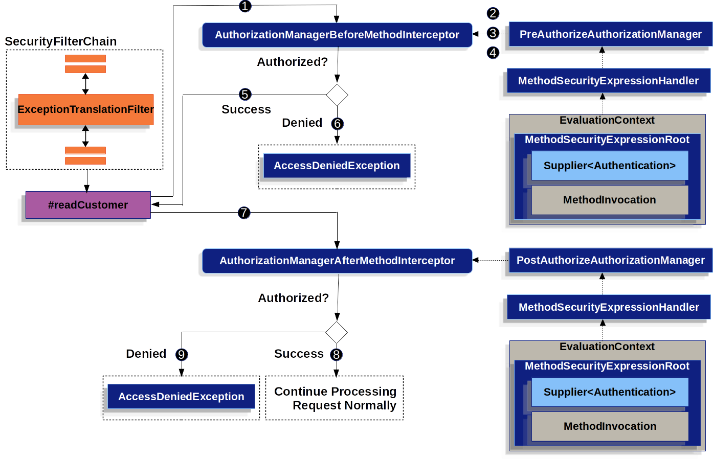

# Method Security

---

In addition to modeling authorization at the request level, Spring Security also supports modeling at the method level.

You can activate it in your application by annotating any @Configuration class with @EnableMethodSecurity or adding <method-security> to any XML configuration file, like so:
```java
@EnableMethodSecurity
```
Then, you are immediately able to annotate any Spring-managed class or method with **@PreAuthorize**, **@PostAuthorize**, **@PreFilter**, and **@PostFilter** to authorize method invocations, including the input parameters and return values.

> Spring Boot Starter Security **does not activate method-level authorization** by default.

Method Security supports many other use cases as well including AspectJ support, custom annotations, and several configuration points. Consider learning about the following use cases:
  * Migrating from @EnableGlobalMethodSecurity
  * Understanding how method security works and reasons to use it
  * Comparing request-level and method-level authorization
  * Authorizing methods with @PreAuthorize and @PostAuthorize
  * Providing fallback values when authorization is denied
  * Filtering methods with @PreFilter and @PostFilter
  * Authorizing methods with JSR-250 annotations
  * Authorizing methods with AspectJ expressions
  * Integrating with AspectJ byte-code weaving 
  * Coordinating with @Transactional and other AOP-based annotations 
  * Customizing SpEL expression handling 
  * Integrating with custom authorization systems

---

## How Method Security Works

Spring Security’s method authorization support is handy for:
  * Extracting fine-grained authorization logic; for example, when the method parameters and return values contribute to the authorization decision.
  * Enforcing security at the service layer
  * Stylistically favoring annotation-based over HttpSecurity-based configuration

And since Method Security is built using Spring AOP, you have access to all its expressive power to override Spring Security’s defaults as needed.

As already mentioned, you begin by adding @EnableMethodSecurity to a @Configuration class or <sec:method-security/> in a Spring XML configuration file.

> This annotation and XML element supercede @EnableGlobalMethodSecurity and <sec:global-method-security/>, respectively. They offer the following improvements:
   1. > Uses the simplified AuthorizationManager API instead of metadata sources, config attributes, decision managers, and voters. This simplifies reuse and customization. 
   2. > Favors direct bean-based configuration, instead of requiring extending GlobalMethodSecurityConfiguration to customize beans 
   3. > Is built using native Spring AOP, removing abstractions and allowing you to use Spring AOP building blocks to customize 
   4. > Checks for conflicting annotations to ensure an unambiguous security configuration 
   5. > Complies with **JSR-250** 
   6. > Enables **@PreAuthorize**, **@PostAuthorize**, **@PreFilter**, and **@PostFilter** by default 
> If you are using @EnableGlobalMethodSecurity or <global-method-security/>, these are now deprecated, and you are encouraged to migrate.

Method authorization is a combination of before- and after-method authorization. Consider a service bean that is annotated in the following way:

```java
@Service
public class MyCustomerService {
    @PreAuthorize("hasAuthority('permission:read')")
    @PostAuthorize("returnObject.owner == authentication.name")
    public Customer readCustomer(String id) { ... }
}
```
A given invocation to MyCustomerService#readCustomer may look something like this when Method Security is activated:

**Method level security flow diagram**
---

---

1. Spring AOP invokes its proxy method for readCustomer. Among the proxy’s other advisors, it invokes an AuthorizationManagerBeforeMethodInterceptor that matches the @PreAuthorize pointcut
2. The interceptor invokes PreAuthorizeAuthorizationManager#check
3. The authorization manager uses a MethodSecurityExpressionHandler to parse the annotation’s SpEL expression and constructs a corresponding EvaluationContext from a MethodSecurityExpressionRoot containing a Supplier<Authentication> and MethodInvocation.
4. The interceptor uses this context to evaluate the expression; specifically, it reads the Authentication from the Supplier and checks whether it has permission:read in its collection of authorities
5. If the evaluation passes, then Spring AOP proceeds to invoke the method.
6. If not, the interceptor publishes an AuthorizationDeniedEvent and throws an AccessDeniedException which the ExceptionTranslationFilter catches and returns a 403 status code to the response
7. After the method returns, Spring AOP invokes an AuthorizationManagerAfterMethodInterceptor that matches the @PostAuthorize pointcut, operating the same as above, but with PostAuthorizeAuthorizationManager
8. If the evaluation passes (in this case, the return value belongs to the logged-in user), processing continues normally
9. If not, the interceptor publishes an AuthorizationDeniedEvent and throws an AccessDeniedException, which the ExceptionTranslationFilter catches and returns a 403 status code to the response

> If the method is not being called in the context of an HTTP request, you will likely need to handle the AccessDeniedException yourself

---

## Multiple Annotations Are Computed In Series

As demonstrated above, if a method invocation involves multiple Method Security annotations, each of those is processed one at a time. This means that they can collectively be thought of as being "anded" together. In other words, for an invocation to be authorized, all annotation inspections need to pass authorization.

---

## Repeated Annotations Are Not Supported

That said, it is not supported to repeat the same annotation on the same method. For example, you cannot place @PreAuthorize twice on the same method.

Instead, use SpEL’s boolean support or its support for delegating to a separate bean.

---

## Each Annotation Has Its Own Pointcut

Each annotation has its own pointcut instance that looks for that annotation or its meta-annotation counterparts across the entire object hierarchy, starting at the method and its enclosing class.

----

## Each Annotation Has Its Own Method Interceptor

Each annotation has its own dedicated method interceptor. The reason for this is to make things more composable. For example, if needed, you can disable the Spring Security defaults and publish only the @PostAuthorize method interceptor.

The method interceptors are as follows:
  * For **@PreAuthorize**, Spring Security uses **_AuthorizationManagerBeforeMethodInterceptor#preAuthorize_**, which in turn uses PreAuthorizeAuthorizationManager
  * For **@PostAuthorize**, Spring Security uses **_AuthorizationManagerAfterMethodInterceptor#postAuthorize_**, which in turn uses PostAuthorizeAuthorizationManager
  * For **@PreFilter**, Spring Security uses **_PreFilterAuthorizationMethodInterceptor_**
  * For **@PostFilter**, Spring Security uses **_PostFilterAuthorizationMethodInterceptor_**
  * For **@Secured**, Spring Security uses **_AuthorizationManagerBeforeMethodInterceptor#secured_**, which in turn uses **_SecuredAuthorizationManager_**
  * For **JSR-250** annotations, Spring Security uses **_AuthorizationManagerBeforeMethodInterceptor#jsr250_**, which in turn uses **_Jsr250AuthorizationManager_**

Generally speaking, you can consider the following listing as representative of what interceptors Spring Security publishes when you add **@EnableMethodSecurity**:

```java
@Bean
@Role(BeanDefinition.ROLE_INFRASTRUCTURE)
static Advisor preAuthorizeMethodInterceptor() {
    return AuthorizationManagerBeforeMethodInterceptor.preAuthorize();
}

@Bean
@Role(BeanDefinition.ROLE_INFRASTRUCTURE)
static Advisor postAuthorizeMethodInterceptor() {
    return AuthorizationManagerAfterMethodInterceptor.postAuthorize();
}

@Bean
@Role(BeanDefinition.ROLE_INFRASTRUCTURE)
static Advisor preFilterMethodInterceptor() {
    return AuthorizationManagerBeforeMethodInterceptor.preFilter();
}

@Bean
@Role(BeanDefinition.ROLE_INFRASTRUCTURE)
static Advisor postFilterMethodInterceptor() {
    return AuthorizationManagerAfterMethodInterceptor.postFilter();
}
```

---

## Favor Granting Authorities Over Complicated SpEL Expressions

Quite often it can be tempting to introduce a complicated SpEL expression like the following:

```java
@PreAuthorize("hasAuthority('permission:read') || hasRole('ADMIN')")
```

However, you could instead grant permission:read to those with ROLE_ADMIN. One way to do this is with a RoleHierarchy like so:
```java
@Bean
static RoleHierarchy roleHierarchy() {
    return RoleHierarchyImpl.fromHierarchy("ROLE_ADMIN > permission:read");
}
```
and then set that in a **MethodSecurityExpressionHandler** instance. This then allows you to have a simpler **@PreAuthorize** expression like this one:

```java
@PreAuthorize("hasAuthority('permission:read')")
```
Or, where possible, adapt application-specific authorization logic into granted authorities at login time.

---

## Comparing Request-level vs Method-level Authorization

When should you favor method-level authorization over request-level authorization? Some of it comes down to taste; however, consider the following strengths list of each to help you decide.

| Aspect                    | Request-level              | Method-level                |
| ------------------------- | -------------------------- | --------------------------- |
| Authorization type        | Coarse-grained             | Fine-grained                |
| Configuration location    | Declared in a config class | Local to method declaration |
| Configuration style       | DSL                        | Annotations                 |
| Authorization definitions | Programmatic               | SpEL                        |


The main tradeoff seems to be where you want your authorization rules to live.

> It’s important to remember that when you use annotation-based Method Security, then unannotated methods are not secured. To protect against this, declare a catch-all authorization rule in your HttpSecurity instance.

---

## Authorizing with Annotations

The primary way Spring Security enables method-level authorization support is through annotations that you can add to methods, classes, and interfaces.

### Authorizing Method Invocation with **@PreAuthorize**

When Method Security is active, you can annotate a method with the @PreAuthorize annotation like so:

```java
@Component
public class BankService {
	@PreAuthorize("hasRole('ADMIN')")
	public Account readAccount(Long id) {
        // ... is only invoked if the `Authentication` has the `ROLE_ADMIN` authority
	}
}
```

This is meant to indicate that the method can only be invoked if the provided expression hasRole('ADMIN') passes.

You can then test the class to confirm it is enforcing the authorization rule like so:

```java
@Autowired
BankService bankService;

@WithMockUser(roles="ADMIN")
@Test
void readAccountWithAdminRoleThenInvokes() {
    Account account = this.bankService.readAccount("12345678");
    // ... assertions
}

@WithMockUser(roles="WRONG")
@Test
void readAccountWithWrongRoleThenAccessDenied() {
    assertThatExceptionOfType(AccessDeniedException.class).isThrownBy(
        () -> this.bankService.readAccount("12345678"));
}
```

> **@PreAuthorize** also can be a meta-annotation, be defined at the class or interface level, and use SpEL Authorization Expressions.

While **@PreAuthorize** is quite helpful for declaring needed authorities, it can also be used to evaluate more complex expressions that involve the method parameters.

---

## Authorization Method Results with @PostAuthorize

When Method Security is active, you can annotate a method with the @PostAuthorize annotation like so:

```java
@Component
public class BankService {
	@PostAuthorize("returnObject.owner == authentication.name")
	public Account readAccount(Long id) {
        // ... is only returned if the `Account` belongs to the logged in user
	}
}
```
This is meant to indicate that the method can only return the value if the provided expression returnObject.owner == authentication.name passes. returnObject represents the Account object to be returned.

You can then [test the class](https://docs.spring.io/spring-security/reference/servlet/test/method.html) to confirm it is enforcing the authorization rule:

```java
@Autowired
BankService bankService;

@WithMockUser(username="owner")
@Test
void readAccountWhenOwnedThenReturns() {
    Account account = this.bankService.readAccount("12345678");
    // ... assertions
}

@WithMockUser(username="wrong")
@Test
void readAccountWhenNotOwnedThenAccessDenied() {
    assertThatExceptionOfType(AccessDeniedException.class).isThrownBy(
        () -> this.bankService.readAccount("12345678"));
}
```

> **@PostAuthorize** also can be a meta-annotation, be defined at the class or interface level, and use SpEL Authorization Expressions.

**@PostAuthorize** is particularly helpful when defending against Insecure Direct Object Reference. In fact, it can be defined as a meta-annotation like so:

```java
@Target({ ElementType.METHOD, ElementType.TYPE })
@Retention(RetentionPolicy.RUNTIME)
@PostAuthorize("returnObject.owner == authentication.name")
public @interface RequireOwnership {}
```
Allowing you to instead annotate the service in the following way:
```java
@Component
public class BankService {
	@RequireOwnership
	public Account readAccount(Long id) {
        // ... is only returned if the `Account` belongs to the logged in user
	}
}
```
The result is that the above method will only return the Account if its owner attribute matches the logged-in user’s name. If not, Spring Security will throw an AccessDeniedException and return a 403 status code.

> Note that @PostAuthorize is not recommended for classes that perform database writes since that typically means that a database change was made before the security invariants were checked. A common example of doing this is if you have @Transactional and @PostAuthorize on the same method. Instead, read the value first, using @PostAuthorize on the read, and then perform the database write, should that read is authorized. If you must do something like this, you can ensure that @EnableTransactionManagement comes before @EnableMethodSecurity.

---

## Filtering Method Parameters with **@PreFilter**

When Method Security is active, you can annotate a method with the @PreFilter annotation like so:

```java
@Component
public class BankService {
	@PreFilter("filterObject.owner == authentication.name")
	public Collection<Account> updateAccounts(Account... accounts) {
        // ... `accounts` will only contain the accounts owned by the logged-in user
        return updated;
	}
}
```
This is meant to filter out any values from accounts where the expression filterObject.owner == authentication.name fails. filterObject represents each account in accounts and is used to test each account.

You can then test the class in the following way to confirm it is enforcing the authorization rule:

```java
@Autowired
BankService bankService;

@WithMockUser(username="owner")
@Test
void updateAccountsWhenOwnedThenReturns() {
    Account ownedBy = ...
    Account notOwnedBy = ...
    Collection<Account> updated = this.bankService.updateAccounts(ownedBy, notOwnedBy);
    assertThat(updated).containsOnly(ownedBy);
}
```

> **@PreFilter** also can be a meta-annotation, be defined at the class or interface level, and use SpEL Authorization Expressions.

**@PreFilter** supports arrays, collections, maps, and streams (so long as the stream is still open).

For example, the above **updateAccounts** declaration will function the same way as the following other four:

```java
@PreFilter("filterObject.owner == authentication.name")
public Collection<Account> updateAccounts(Account[] accounts)

@PreFilter("filterObject.owner == authentication.name")
public Collection<Account> updateAccounts(Collection<Account> accounts)

@PreFilter("filterObject.value.owner == authentication.name")
public Collection<Account> updateAccounts(Map<String, Account> accounts)

@PreFilter("filterObject.owner == authentication.name")
public Collection<Account> updateAccounts(Stream<Account> accounts)
```
The result is that the above method will only have the Account instances where their owner attribute matches the logged-in user’s name.

---

## Filtering Method Results with @PostFilter

When Method Security is active, you can annotate a method with the @PostFilter annotation like so:

```java
@Component
public class BankService {
	@PostFilter("filterObject.owner == authentication.name")
	public Collection<Account> readAccounts(String... ids) {
        // ... the return value will be filtered to only contain the accounts owned by the logged-in user
        return accounts;
	}
}
```
This is meant to filter out any values from the return value where the expression **filterObject.owner == authentication.name** fails. **filterObject** represents each account in accounts and is used to test each account.

You can then test the class like so to confirm it is enforcing the authorization rule:

```java
@Autowired
BankService bankService;

@WithMockUser(username="owner")
@Test
void readAccountsWhenOwnedThenReturns() {
    Collection<Account> accounts = this.bankService.updateAccounts("owner", "not-owner");
    assertThat(accounts).hasSize(1);
    assertThat(accounts.get(0).getOwner()).isEqualTo("owner");
}
```

> **@PostFilter** also can be a meta-annotation, be defined at the class or interface level, and use SpEL Authorization Expressions.

**@PostFilter** supports arrays, collections, maps, and streams (so long as the stream is still open).

For example, the above readAccounts declaration will function the same way as the following other three:

```java
@PostFilter("filterObject.owner == authentication.name")
public Collection<Account> readAccounts(String... ids)

@PostFilter("filterObject.owner == authentication.name")
public Account[] readAccounts(String... ids)

@PostFilter("filterObject.value.owner == authentication.name")
public Map<String, Account> readAccounts(String... ids)

@PostFilter("filterObject.owner == authentication.name")
public Stream<Account> readAccounts(String... ids)
```
The result is that the above method will return the Account instances where their owner attribute matches the logged-in user’s name.

> In-memory filtering can obviously be expensive, and so be considerate of whether it is better to filter the data in the data layer instead.

---

## Authorizing Method Invocation with **@Secured**

**@Secured** is a legacy option for authorizing invocations. @PreAuthorize supersedes it and is recommended instead.

To use the **@Secured** annotation, you should first change your Method Security declaration to enable it like so:

```java
@EnableMethodSecurity(securedEnabled = true)
```
This will cause Spring Security to publish the corresponding method interceptor that authorizes methods, classes, and interfaces annotated with **@Secured**.

## Authorizing Method Invocation with **JSR-250** Annotations

In case you would like to use [JSR-250](https://jcp.org/en/jsr/detail?id=250) annotations, Spring Security also supports that. @PreAuthorize has more expressive power and is thus recommended.

To use the **JSR-250** annotations, you should first change your Method Security declaration to enable them like so:

```java
@EnableMethodSecurity(jsr250Enabled = true)
```
This will cause Spring Security to publish the corresponding method interceptor that authorizes methods, classes, and interfaces annotated with @RolesAllowed, @PermitAll, and @DenyAll.

## Declaring Annotations at the Class or Interface Level

It’s also supported to have Method Security annotations at the class and interface level.

If it is at the class level like so:

```java
@Controller
@PreAuthorize("hasAuthority('ROLE_USER')")
public class MyController {
    @GetMapping("/endpoint")
    public String endpoint() { ... }
}
```
then all methods inherit the class-level behavior.

Or, if it’s declared like the following at both the class and method level:

```java
@Controller
@PreAuthorize("hasAuthority('ROLE_USER')")
public class MyController {
    @GetMapping("/endpoint")
    @PreAuthorize("hasAuthority('ROLE_ADMIN')")
    public String endpoint() { ... }
}
```
then methods declaring the annotation override the class-level annotation.

The same is true for interfaces, with the exception that if a class inherits the annotation from two different interfaces, then startup will fail. This is because Spring Security has no way to tell which one you want to use.

In cases like this, you can resolve the ambiguity by adding the annotation to the concrete method.

---

## Using Meta Annotations

Method Security supports meta annotations. This means that you can take any annotation and improve readability based on your application-specific use cases.

For example, you can simplify @PreAuthorize("hasRole('ADMIN')") to @IsAdmin like so:

```java
@Target({ ElementType.METHOD, ElementType.TYPE })
@Retention(RetentionPolicy.RUNTIME)
@PreAuthorize("hasRole('ADMIN')")
public @interface IsAdmin {}
```
And the result is that on your secured methods you can now do the following instead:

```java
@Component
public class BankService {
	@IsAdmin
	public Account readAccount(Long id) {
        // ... is only returned if the `Account` belongs to the logged in user
	}
}
```
This results in more readable method definitions.

---

## Templating Meta-Annotation Expressions

You can also opt into using meta-annotation templates, which allow for much more powerful annotation definitions.

First, publish the following bean:

```java
@Bean
static AnnotationTemplateExpressionDefaults templateExpressionDefaults() {
	return new AnnotationTemplateExpressionDefaults();
}
```
Now instead of **@IsAdmin**, you can create something more powerful like @HasRole like so:

```java
@Target({ ElementType.METHOD, ElementType.TYPE })
@Retention(RetentionPolicy.RUNTIME)
@PreAuthorize("hasRole('{value}')")
public @interface HasRole {
	String value();
}
```

And the result is that on your secured methods you can now do the following instead:

```java
@Component
public class BankService {
	@HasRole("ADMIN")
	public Account readAccount(Long id) {
        // ... is only returned if the `Account` belongs to the logged in user
	}
}
```

> Note that this works with method variables and all annotation types, too, though you will want to be careful to correctly take care of quotation marks so the resulting SpEL expression is correct.

For example, consider the following @HasAnyRole annotation:

```java
@Target({ ElementType.METHOD, ElementType.TYPE })
@Retention(RetentionPolicy.RUNTIME)
@PreAuthorize("hasAnyRole({roles})")
public @interface HasAnyRole {
    String[] roles();
}
```
In that case, you’ll notice that you should not use the quotation marks in the expression, but instead in the parameter value like so:

```java
@Component
public class BankService {
	@HasAnyRole(roles = { "'USER'", "'ADMIN'" })
	public Account readAccount(Long id) {
        // ... is only returned if the `Account` belongs to the logged in user
	}
}
```
so that, once replaced, the expression becomes @PreAuthorize("hasAnyRole('USER', 'ADMIN')").

---

## Enabling Certain Annotations

You can turn off @EnableMethodSecurity's pre-configuration and replace it with you own. You may choose to do this if you want to customize the AuthorizationManager or Pointcut. Or you may simply want to only enable a specific annotation, like @PostAuthorize.

You can do this in the following way:

Only **_@PostAuthorize Configuration_**
```java
@Configuration
@EnableMethodSecurity(prePostEnabled = false)
class MethodSecurityConfig {
	@Bean
	@Role(BeanDefinition.ROLE_INFRASTRUCTURE)
	Advisor postAuthorize() {
		return AuthorizationManagerAfterMethodInterceptor.postAuthorize();
	}
}
```
The above snippet achieves this by first disabling Method Security’s pre-configurations and then publishing the @PostAuthorize interceptor itself.

---

## Authorizing with <intercept-methods>

While using Spring Security’s annotation-based support is preferred for method security, you can also use XML to declare bean authorization rules.

If you need to declare it in your XML configuration instead, you can use <intercept-methods> like so:

```xml
<bean class="org.mycompany.MyController">
    <intercept-methods>
        <protect method="get*" access="hasAuthority('read')"/>
        <protect method="*" access="hasAuthority('write')"/>
    </intercept-methods>
</bean>
```
> This only supports matching method by prefix or by name. If your needs are more complex than that, use annotation support instead.

---

## Authorizing Methods Programmatically

As you’ve already seen, there are several ways that you can specify non-trivial authorization rules using Method Security SpEL expressions.

There are a number of ways that you can instead allow your logic to be Java-based instead of SpEL-based. This gives use access the entire Java language for increased testability and flow control.

----

## Using a Custom Bean in SpEL

The first way to authorize a method programmatically is a two-step process.

First, declare a bean that has a method that takes a MethodSecurityExpressionOperations instance like the following:

```java
@Component("authz")
public class AuthorizationLogic {
    public boolean decide(MethodSecurityExpressionOperations operations) {
        // ... authorization logic
    }
}
```
Then, reference that bean in your annotations in the following way:

```java
@Controller
public class MyController {
    @PreAuthorize("@authz.decide(#root)")
    @GetMapping("/endpoint")
    public String endpoint() {
        // ...
    }
}
```
Spring Security will invoke the given method on that bean for each method invocation.

What’s nice about this is all your authorization logic is in a separate class that can be independently unit tested and verified for correctness. It also has access to the full Java language.

> In addition to returning a Boolean, you can also return null to indicate that the code abstains from making a decision.

If you want to include more information about the nature of the decision, you can instead return a custom AuthorizationDecision like this:

```java
@Component("authz")
public class AuthorizationLogic {
    public AuthorizationDecision decide(MethodSecurityExpressionOperations operations) {
        // ... authorization logic
        return new MyAuthorizationDecision(false, details);
    }
}
```
Or throw a custom AuthorizationDeniedException instance. Note, though, that returning an object is preferred as this doesn’t incur the expense of generating a stacktrace.

Then, you can access the custom details when you customize how the authorization result is handled.

> Further, you can return an AuthorizationManager itself. This is helpful when unifying custom web authorization rules with method security ones since web security by default requires specifying an AuthorizationManager instance.

---

## Using a Custom Authorization Manager

The second way to authorize a method programmatically is to create a custom AuthorizationManager.

First, declare an authorization manager instance, perhaps like this one:

```java
@Component
public class MyAuthorizationManager implements AuthorizationManager<MethodInvocation>, AuthorizationManager<MethodInvocationResult> {
    @Override
    public AuthorizationResult authorize(Supplier<Authentication> authentication, MethodInvocation invocation) {
        // ... authorization logic
    }

    @Override
    public AuthorizationResult authorize(Supplier<Authentication> authentication, MethodInvocationResult invocation) {
        // ... authorization logic
    }
}
```
Then, publish the method interceptor with a pointcut that corresponds to when you want that AuthorizationManager to run. For example, you could replace how @PreAuthorize and @PostAuthorize work like so:

**Only _@PreAuthorize_ and _@PostAuthorize_ Configuration**

```java
@Configuration
@EnableMethodSecurity(prePostEnabled = false)
class MethodSecurityConfig {
    @Bean
	@Role(BeanDefinition.ROLE_INFRASTRUCTURE)
	Advisor preAuthorize(MyAuthorizationManager manager) {
		return AuthorizationManagerBeforeMethodInterceptor.preAuthorize(manager);
	}

	@Bean
	@Role(BeanDefinition.ROLE_INFRASTRUCTURE)
	Advisor postAuthorize(MyAuthorizationManager manager) {
		return AuthorizationManagerAfterMethodInterceptor.postAuthorize(manager);
	}
}
```

> You can place your interceptor in between Spring Security method interceptors using the order constants specified in AuthorizationInterceptorsOrder.

## Customizing Expression Handling

Or, third, you can customize how each SpEL expression is handled. To do that, you can expose a custom MethodSecurityExpressionHandler, like so:

**_Custom MethodSecurityExpressionHandler_**

```java
@Bean
static MethodSecurityExpressionHandler methodSecurityExpressionHandler(RoleHierarchy roleHierarchy) {
	DefaultMethodSecurityExpressionHandler handler = new DefaultMethodSecurityExpressionHandler();
	handler.setRoleHierarchy(roleHierarchy);
	return handler;
}

```
> We expose MethodSecurityExpressionHandler using a static method to ensure that Spring publishes it before it initializes Spring Security’s method security @Configuration classes

You can also subclass DefaultMessageSecurityExpressionHandler to add your own custom authorization expressions beyond the defaults.

---

## Working with AOT

Spring Security will scan all beans in the application context for methods that use @PreAuthorize or @PostAuthorize. When it finds one, it will resolve any beans used inside the security expression and register the appropriate runtime hints for that bean. If it finds a method that uses @AuthorizeReturnObject, it will recursively search inside the method’s return type for @PreAuthorize and @PostAuthorize annotations and register them accordingly.

For example, consider the following Spring Boot application:

```java
@Service
public class AccountService { (1)

    @PreAuthorize("@authz.decide()") (2)
    @AuthorizeReturnObject (3)
    public Account getAccountById(String accountId) {
        // ...
    }

}

public class Account {

    private final String accountNumber;

    // ...

    @PreAuthorize("@accountAuthz.canViewAccountNumber()") (4)
    public String getAccountNumber() {
        return this.accountNumber;
    }

    @AuthorizeReturnObject (5)
    public User getUser() {
        return new User("John Doe");
    }

}

public class User {

    private final String fullName;

    // ...

    @PostAuthorize("@myOtherAuthz.decide()") (6)
    public String getFullName() {
        return this.fullName;
    }

}
```
1. Spring Security finds the **AccountService** bean
2. Finding a method that uses **@PreAuthorize**, it will resolve any bean names used inside the expression, **authz** in that case, and register runtime hints for the bean class
3. Finding a method that uses **@AuthorizeReturnObject**, it will look into the method’s return type for any **@PreAuthorize** or **@PostAuthorize**
4. Then, it finds a **@PreAuthorize** with another bean name: **accountAuthz**; the runtime hints are registered for the bean class as well
5. Finding another **@AuthorizeReturnObject** it will look again into the method’s return type
6. Now, a **@PostAuthorize** is found with yet another bean name used: **myOtherAuthz**; the runtime hints are registered for the bean class as well

There will be many times when Spring Security cannot determine the actual return type of the method ahead of time since it may be hidden in an erased generic type.

**Consider the following service:**

```java
@Service
public class AccountService {

    @AuthorizeReturnObject
    public List<Account> getAllAccounts() {
        // ...
    }

}
```
In this case, the generic type is erased and so it isn’t apparent to Spring Security ahead-of-time that Account needs to be visited in order to check for **@PreAuthorize** and **@PostAuthorize**.

To address this, you can publish a **[PrePostAuthorizeExpressionBeanHintsRegistrar](https://docs.spring.io/spring-security/reference/api/java/org/springframework/security/aot/hint/PrePostAuthorizeExpressionBeanHintsRegistrar.html)** like so:

```java
@Bean
@Role(BeanDefinition.ROLE_INFRASTRUCTURE)
static SecurityHintsRegistrar registerTheseToo() {
    return new PrePostAuthorizeExpressionBeanHintsRegistrar(Account.class);
}
```
---

## Authorizing with AspectJ

### Matching Methods with Custom Pointcuts

Being built on Spring AOP, you can declare patterns that are not related to annotations, similar to request-level authorization. This has the potential advantage of centralizing method-level authorization rules.

For example, you can use publish your own Advisor or use <protect-pointcut> to match AOP expressions to authorization rules for your service layer like so:

```java
import static org.springframework.security.authorization.AuthorityAuthorizationManager.hasRole

@Bean
@Role(BeanDefinition.ROLE_INFRASTRUCTURE)
static Advisor protectServicePointcut() {
    AspectJExpressionPointcut pattern = new AspectJExpressionPointcut()
    pattern.setExpression("execution(* com.mycompany.*Service.*(..))")
    return new AuthorizationManagerBeforeMethodInterceptor(pattern, hasRole("USER"))
}
```

---

### Integrate with AspectJ Byte-weaving

Performance can at times be enhanced by using AspectJ to weave Spring Security advice into the byte code of your beans.

After setting up AspectJ, you can quite simply state in the @EnableMethodSecurity annotation or <method-security> element that you are using AspectJ:

```java
@EnableMethodSecurity(mode=AdviceMode.ASPECTJ)
```
And the result will be that Spring Security will publish its advisors as AspectJ advice so that they can be woven in accordingly.

---

## Specifying Order

As already noted, there is a Spring AOP method interceptor for each annotation, and each of these has a location in the Spring AOP advisor chain.

Namely, the **@PreFilter** method interceptor’s order is 100, **@PreAuthorize's** is 200, and so on.

You can use the offset parameter on @EnableMethodSecurity to move all interceptors en masse to provide their advice earlier or later in a method invocation.

---

## Expressing Authorization with SpEL

You’ve already seen several examples using SpEL, so now let’s cover the API a bit more in depth.

Spring Security encapsulates all of its authorization fields and methods in a set of root objects. The most generic root object is called SecurityExpressionRoot and it forms the basis for MethodSecurityExpressionRoot. Spring Security supplies this root object to MethodSecurityEvaluationContext when preparing to evaluate an authorization expression.

---

### Using Authorization Expression Fields and Methods

The first thing this provides is an enhanced set of authorization fields and methods to your SpEL expressions. What follows is a quick overview of the most common methods:
  * **permitAll -** The method requires no authorization to be invoked; note that in this case, the Authentication is never retrieved from the session
  * **denyAll -** The method is not allowed under any circumstances; note that in this case, the Authentication is never retrieved from the session
  * **hasAuthority -** The method requires that the Authentication have a GrantedAuthority that matches the given value
  * **hasRole -** A shortcut for hasAuthority that prefixes ROLE_ or whatever is configured as the default prefix
  * **hasAnyAuthority -** The method requires that the Authentication have a GrantedAuthority that matches any of the given values
  * **hasAnyRole -** A shortcut for hasAnyAuthority that prefixes ROLE_ or whatever is configured as the default prefix
  * **hasAllAuthorities -** The method requires that the Authentication have GrantedAuthoritys that matches all of the given values
  * **hasAllRoles -** A shortcut for hasAllAuthorities that prefixes ROLE_ or whatever is configured as the default prefix
  * **hasPermission -** A hook into your PermissionEvaluator instance for doing object-level authorization

And here is a brief look at the most common fields:
  * **authentication -** The Authentication instance associated with this method invocation
  * **principal -** The Authentication#getPrincipal associated with this method invocation

Having now learned the patterns, rules, and how they can be paired together, you should be able to understand what is going on in this more complex example:

```java
@Component
public class MyService {
    @PreAuthorize("denyAll")
    MyResource myDeprecatedMethod(...);

    @PreAuthorize("hasRole('ADMIN')")
    MyResource writeResource(...)

    @PreAuthorize("hasAuthority('db') and hasRole('ADMIN')")
    MyResource deleteResource(...)

    @PreAuthorize("principal.claims['aud'] == 'my-audience'")
    MyResource readResource(...);

	@PreAuthorize("@authz.check(authentication, #root)")
    MyResource shareResource(...);
}
```
1. This method may not be invoked by anyone for any reason
2. This method may only be invoked by **Authentications** granted the **ROLE_ADMIN** authority
3. This method may only be invoked by **Authentications** granted the db and **ROLE_ADMIN** authorities
4. This method may only be invoked by **Princpals** with an aud claim equal to **"my-audience"**
5. This method may only be invoked if the bean **authz's** check method returns true

> You can use a bean like **authz** above to add programmatic authorization.

---

## Using Method Parameters

Additionally, Spring Security provides a mechanism for discovering method parameters so they can also be accessed in the SpEL expression as well.

For a complete reference, Spring Security uses DefaultSecurityParameterNameDiscoverer to discover the parameter names. By default, the following options are tried for a method.

1. If Spring Security’s @P annotation is present on a single argument to the method, the value is used. The following example uses the @P annotation:

```java
import org.springframework.security.access.method.P;

@PreAuthorize("hasPermission(#c, 'write')")
public void updateContact(@P("c") Contact contact);
```

The intention of this expression is to require that the current **Authentication** have write permission specifically for this Contact instance.

Behind the scenes, this is implemented by using **AnnotationParameterNameDiscoverer**, which you can customize to support the value attribute of any specified annotation.

2. If Spring Data’s @Param annotation is present on at least one parameter for the method, the value is used. The following example uses the @Param annotation:

```java
import org.springframework.data.repository.query.Param;

...

@PreAuthorize("#n == authentication.name")
Contact findContactByName(@Param("n") String name);
```
The intention of this expression is to require that name be equal to **Authentication#getName** for the invocation to be authorized.

Behind the scenes, this is implemented by using **AnnotationParameterNameDiscoverer**, which you can customize to support the value attribute of any specified annotation.

3. If you compile your code with the -parameters argument, the standard JDK reflection API is used to discover the parameter names. This works on both classes and interfaces.
4. Finally, if you compile your code with debug symbols, the parameter names are discovered by using the debug symbols. This does not work for interfaces, since they do not have debug information about the parameter names. For interfaces, either annotations or the -parameters approach must be used.

---
## Customizing Authorization Managers

When you use SpEL expressions with **@PreAuthorize**, **@PostAuthorize**, **@PreFilter** and **@PostFilter**, Spring Security takes care of creating the appropriate AuthorizationManager instances for you. In certain cases, you may want to customize what is created in order to have complete control over how authorization decisions are made at the framework level.

In order to take control of creating instances of **AuthorizationManager** for pre- and post-annotations, you can create a custom AuthorizationManagerFactory. For example, let’s say you want to allow users with the ADMIN role whenever any other role is required. To do this, you can create a custom implementation for method security as in the following example:

```java
@Component
public class CustomMethodInvocationAuthorizationManagerFactory
		implements AuthorizationManagerFactory<MethodInvocation> {

	private final AuthorizationManagerFactory<MethodInvocation> delegate =
			new DefaultAuthorizationManagerFactory<>();

	@Override
	public AuthorizationManager<MethodInvocation> hasRole(String role) {
		return AuthorizationManagers.anyOf(
			this.delegate.hasRole(role),
			this.delegate.hasRole("ADMIN")
		);
	}

	@Override
	public AuthorizationManager<MethodInvocation> hasAnyRole(String... roles) {
		return AuthorizationManagers.anyOf(
			this.delegate.hasAnyRole(roles),
			this.delegate.hasRole("ADMIN")
		);
	}

}
```
Now, whenever you use the @PreAuthorize annotation with hasRole or hasAnyRole, Spring Security will automatically invoke your custom factory to create an instance of AuthorizationManager that allows access for the given role(s) OR the ADMIN role.

> We use this as a simple example of creating a custom AuthorizationManagerFactory, though the same outcome could be accomplished with a role hierarchy. Use whichever approach fits best in your situation.

---

## Authorizing Arbitrary Objects

Spring Security also supports wrapping any object that is annotated its method security annotations.

The simplest way to achieve this is to mark any method that returns the object you wish to authorize with the @AuthorizeReturnObject annotation.

**For example, consider the following User class:**

```java
public class User {
	private String name;
	private String email;

	public User(String name, String email) {
		this.name = name;
		this.email = email;
	}

	public String getName() {
		return this.name;
	}

    @PreAuthorize("hasAuthority('user:read')")
    public String getEmail() {
		return this.email;
    }
}
```

Given an interface like this one:

```java
public class UserRepository {
    @AuthorizeReturnObject
    Optional<User> findByName(String name) {
        // ...
    }
}
```
Then any User that is returned from findById will be secured like other Spring Security-protected components:

```java
@Autowired
UserRepository users;

@Test
void getEmailWhenProxiedThenAuthorizes() {
    Optional<User> securedUser = users.findByName("name");
    assertThatExceptionOfType(AccessDeniedException.class).isThrownBy(() -> securedUser.get().getEmail());
}
```

---

## Using @AuthorizeReturnObject at the class level

**@AuthorizeReturnObject** can be placed at the class level. Note, though, that this means Spring Security will attempt to proxy any return object, including String, Integer and other types. This is often not what you want to do.

If you want to use **@AuthorizeReturnObject** on a class or interface whose methods return value types, like int, String, Double or collections of those types, then you should also publish the appropriate AuthorizationAdvisorProxyFactory.TargetVisitor as follows:

```java
import org.springframework.security.authorization.method.AuthorizationAdvisorProxyFactory.TargetVisitor;

// ...

@Bean
static TargetVisitor skipValueTypes() {
    return TargetVisitor.defaultsSkipValueTypes();
}
```
> You can set your own AuthorizationAdvisorProxyFactory.TargetVisitor to customize the proxying for any set of types

---

## Programmatically Proxying

You can also programmatically proxy a given object.

To achieve this, you can autowire the provided AuthorizationProxyFactory instance, which is based on which method security interceptors you have configured. If you are using @EnableMethodSecurity, then this means that it will by default have the interceptors for @PreAuthorize, @PostAuthorize, @PreFilter, and @PostFilter.

You can proxy an instance of user in the following way:

```java
@Autowired
AuthorizationProxyFactory proxyFactory;

@Test
void getEmailWhenProxiedThenAuthorizes() {
    User user = new User("name", "email");
    assertThat(user.getEmail()).isNotNull();
    User securedUser = proxyFactory.proxy(user);
    assertThatExceptionOfType(AccessDeniedException.class).isThrownBy(securedUser::getEmail);
}
```
---

## Manual Construction

You can also define your own instance if you need something different from the Spring Security default.

For example, if you define an **AuthorizationProxyFactory** instance like so:

```java
import org.springframework.security.authorization.method.AuthorizationAdvisorProxyFactory.TargetVisitor;
import static org.springframework.security.authorization.method.AuthorizationManagerBeforeMethodInterceptor.preAuthorize;
// ...

AuthorizationProxyFactory proxyFactory = AuthorizationAdvisorProxyFactory.withDefaults();
// and if needing to skip value types
proxyFactory.setTargetVisitor(TargetVisitor.defaultsSkipValueTypes());
```
Then you can wrap any instance of User as follows:

```java
@Test
void getEmailWhenProxiedThenAuthorizes() {
	AuthorizationProxyFactory proxyFactory = AuthorizationAdvisorProxyFactory.withDefaults();
    User user = new User("name", "email");
    assertThat(user.getEmail()).isNotNull();
    User securedUser = proxyFactory.proxy(user);
    assertThatExceptionOfType(AccessDeniedException.class).isThrownBy(securedUser::getEmail);
}
```

---

## Proxying Collections

AuthorizationProxyFactory supports Java collections, streams, arrays, optionals, and iterators by proxying the element type and maps by proxying the value type.

This means that when proxying a List of objects, the following also works:

```java
@Test
void getEmailWhenProxiedThenAuthorizes() {
	AuthorizationProxyFactory proxyFactory = AuthorizationAdvisorProxyFactory.withDefaults();
    List<User> users = List.of(ada, albert, marie);
    List<User> securedUsers = proxyFactory.proxy(users);
	securedUsers.forEach((securedUser) ->
        assertThatExceptionOfType(AccessDeniedException.class).isThrownBy(securedUser::getEmail));
}
```

---

## Proxying Classes

In limited circumstances, it may be valuable to proxy a Class itself, and **AuthorizationProxyFactory** also supports this. This is roughly the equivalent of calling **ProxyFactory#getProxyClass** in Spring Framework’s support for creating proxies.

One place where this is handy is when you need to construct the proxy class ahead-of-time, like with Spring AOT.

---

## Support for All Method Security Annotations

**AuthorizationProxyFactory** supports whichever method security annotations are enabled in your application. It is based off of whatever AuthorizationAdvisor classes are published as a bean.

Since **@EnableMethodSecurity** publishes **@PreAuthorize**, **@PostAuthorize**, **@PreFilter**, and **@PostFilter** advisors by default, you will typically need to do nothing to activate the ability.

> SpEL expressions that use returnObject or filterObject sit behind the proxy and so have full access to the object.

---

## Custom Advice

If you have security advice that you also want applied, you can publish your own AuthorizationAdvisor like so:

```java
@EnableMethodSecurity
class SecurityConfig {
    @Bean
    static AuthorizationAdvisor myAuthorizationAdvisor() {
        return new AuthorizationAdvisor();
    }
}
```
And Spring Security will add that advisor into the set of advice that AuthorizationProxyFactory adds when proxying an object.

## Working with Jackson

One powerful use of this feature is to return a secured value from a controller like so:

```java
@RestController
public class UserController {
    @Autowired
    AuthorizationProxyFactory proxyFactory;

    @GetMapping
    User currentUser(@AuthenticationPrincipal User user) {
        return this.proxyFactory.proxy(user);
    }
}
```
You will need to add a MethodAuthorizationDeniedHandler like this one:

```java
@Component
public class Null implements MethodAuthorizationDeniedHandler {
    @Override
    public Object handleDeniedInvocation(MethodInvocation methodInvocation, AuthorizationResult authorizationResult) {
        return null;
    }
}

// ...

@HandleAuthorizationDenied(handlerClass = Null.class)
public class User {
	...
}
```

Then, you’ll see a different JSON serialization based on the authorization level of the user. If they don’t have the user:read authority, then they’ll see:

`{
"name" : "name",
"email" : null
}`
And if they do have that authority, they’ll see:

`{
"name" : "name",
"email" : "email"
}`

> You can also add the Spring Boot property spring.jackson.default-property-inclusion=non_null to exclude the null value from serialization, if you also don’t want to reveal the JSON key to an unauthorized user.

---

## Working with AOT

Spring Security will scan all beans in the application context for methods that use @AuthorizeReturnObject. When it finds one, it will create and register the appropriate proxy class ahead of time. It will also recursively search for other nested objects that also use @AuthorizeReturnObject and register them accordingly.

For example, consider the following Spring Boot application:

```java
@SpringBootApplication
public class MyApplication {
	@RestController
    public static class MyController { (1)
		@GetMapping
        @AuthorizeReturnObject
        Message getMessage() { (2)
			return new Message(someUser, "hello!");
        }
    }

	public static class Message { (3)
		User to;
		String text;

		// ...

        @AuthorizeReturnObject
        public User getTo() { (4)
			return this.to;
        }

		// ...
	}

	public static class User { (5)
		// ...
	}

	public static void main(String[] args) {
		SpringApplication.run(MyApplication.class);
	}
}
```
1. First, Spring Security finds the **MyController** bean
2. Finding a method that uses **@AuthorizeReturnObject**, it proxies Message, the return value, and registers that proxy class to RuntimeHints
3. Then, it traverses Message to see if it uses **@AuthorizeReturnObject**
4. Finding a method that uses **@AuthorizeReturnObject**, it proxies User, the return value, and registers that proxy class to RuntimeHints
5. Finally, it traverses User to see if it uses **@AuthorizeReturnObject**; finding nothing, the algorithm completes
  
There will be many times when Spring Security cannot determine the proxy class ahead of time since it may be hidden in an erased generic type.

Consider the following change to **MyController**:

```java
@RestController
public static class MyController {
    @GetMapping
    @AuthorizeReturnObject
    List<Message> getMessages() {
        return List.of(new Message(someUser, "hello!"));
    }
}
```
In this case, the generic type is erased and so it isn’t apparent to Spring Security ahead-of-time that Message will need to be proxied at runtime.

To address this, you can publish AuthorizeProxyFactoryHintsRegistrar like so:

```java
@Bean
@Role(BeanDefinition.ROLE_INFRASTRUCTURE)
static SecurityHintsRegsitrar registerTheseToo(AuthorizationProxyFactory proxyFactory) {
	return new AuthorizeReturnObjectHintsRegistrar(proxyFactory, Message.class);
}
```
Spring Security will register that class and then traverse its type as before.

---

## Providing Fallback Values When Authorization is Denied

There are some scenarios where you may not wish to throw an **AuthorizationDeniedException** when a method is invoked without the required permissions. Instead, you might wish to return a post-processed result, like a masked result, or a default value in cases where authorization denied happened before invoking the method.

Spring Security provides support for handling authorization denied on method invocation by using the **@HandleAuthorizationDenied**. The handler works for denied authorizations that happened in the @PreAuthorize and @PostAuthorize annotations as well as AuthorizationDeniedException thrown from the method invocation itself.

Let’s consider the example from the previous section, but instead of creating the **AccessDeniedExceptionInterceptor** to transform an **AccessDeniedException** to a null return value, we will use the handlerClass attribute from @HandleAuthorizationDenied:

```java
public class NullMethodAuthorizationDeniedHandler implements MethodAuthorizationDeniedHandler { (1)

    @Override
    public Object handleDeniedInvocation(MethodInvocation methodInvocation, AuthorizationResult authorizationResult) {
        return null;
    }

}

@Configuration
@EnableMethodSecurity
public class SecurityConfig {

    @Bean (2)
    public NullMethodAuthorizationDeniedHandler nullMethodAuthorizationDeniedHandler() {
        return new NullMethodAuthorizationDeniedHandler();
    }

}

public class User {
    // ...

    @PreAuthorize(value = "hasAuthority('user:read')")
    @HandleAuthorizationDenied(handlerClass = NullMethodAuthorizationDeniedHandler.class) (3)
    public String getEmail() {
        return this.email;
    }
}
```
1. Create an implementation of MethodAuthorizationDeniedHandler that returns a null value
2. Register the NullMethodAuthorizationDeniedHandler as a bean
3. Annotate the method with @HandleAuthorizationDenied and pass the NullMethodAuthorizationDeniedHandler to the handlerClass attribute

And then you can verify that a null value is returned instead of the AccessDeniedException:

> You can also annotate your class with @Component instead of creating a @Bean method

```java
@Autowired
UserRepository users;

@Test
void getEmailWhenProxiedThenNullEmail() {
    Optional<User> securedUser = users.findByName("name");
    assertThat(securedUser.get().getEmail()).isNull();
}
```

---

## Using the Denied Result From the Method Invocation

There are some scenarios where you might want to return a secure result derived from the denied result. For example, if a user is not authorized to see email addresses, you might want to apply some masking on the original email address, i.e. useremail@example.com would become **use******@example.com**.

For those scenarios, you can override the **handleDeniedInvocationResult** from the **MethodAuthorizationDeniedHandler**, which has the **MethodInvocationResult** as an argument. Let’s continue with the previous example, but instead of returning null, we will return a masked value of the email:

```java
public class EmailMaskingMethodAuthorizationDeniedHandler implements MethodAuthorizationDeniedHandler { (1)

    @Override
    public Object handleDeniedInvocation(MethodInvocation methodInvocation, AuthorizationResult authorizationResult) {
        return "***";
    }

    @Override
    public Object handleDeniedInvocationResult(MethodInvocationResult methodInvocationResult, AuthorizationResult authorizationResult) {
        String email = (String) methodInvocationResult.getResult();
        return email.replaceAll("(^[^@]{3}|(?!^)\\G)[^@]", "$1*");
    }

}

@Configuration
@EnableMethodSecurity
public class SecurityConfig {

    @Bean (2)
    public EmailMaskingMethodAuthorizationDeniedHandler emailMaskingMethodAuthorizationDeniedHandler() {
        return new EmailMaskingMethodAuthorizationDeniedHandler();
    }

}

public class User {
    // ...

    @PostAuthorize(value = "hasAuthority('user:read')")
    @HandleAuthorizationDenied(handlerClass = EmailMaskingMethodAuthorizationDeniedHandler.class) (3)
    public String getEmail() {
        return this.email;
    }
}
```
1. Create an implementation of MethodAuthorizationDeniedHandler that returns a masked value of the unauthorized result value
2. Register the EmailMaskingMethodAuthorizationDeniedHandler as a bean
3. Annotate the method with @HandleAuthorizationDenied and pass the EmailMaskingMethodAuthorizationDeniedHandler to the handlerClass attribute

And then you can verify that a masked email is returned instead of an AccessDeniedException:

> Since you have access to the original denied value, make sure that you correctly handle it and do not return it to the caller.

```java
@Autowired
UserRepository users;

@Test
void getEmailWhenProxiedThenMaskedEmail() {
    Optional<User> securedUser = users.findByName("name");
    // email is useremail@example.com
    assertThat(securedUser.get().getEmail()).isEqualTo("use******@example.com");
}
```
When implementing the **MethodAuthorizationDeniedHandler** you have a few options on what type you can return:

  * A null value.
  * A non-null value, respecting the method’s return type.
  * Throw an exception, usually an instance of AuthorizationDeniedException. This is the default behavior.
  * A Mono type for reactive applications.

> Note that since the handler must be registered as beans in your application context, you can inject dependencies into them if you need a more complex logic. In addition to that, you have available the MethodInvocation or the MethodInvocationResult, as well as the AuthorizationResult for more details related to the authorization decision.

---

## Deciding What to Return Based on Available Parameters

Consider a scenario where there might be multiple mask values for different methods, it would be not so productive if we had to create a handler for each of those methods, although it is perfectly fine to do that. In such cases, we can use the information passed via parameters to decide what to do. For example, we can create a custom @Mask annotation and a handler that detects that annotation to decide what mask value to return:

```java
import org.springframework.core.annotation.AnnotationUtils;

@Target({ ElementType.METHOD, ElementType.TYPE })
@Retention(RetentionPolicy.RUNTIME)
public @interface Mask {

    String value();

}

public class MaskAnnotationDeniedHandler implements MethodAuthorizationDeniedHandler {

    @Override
    public Object handleDeniedInvocation(MethodInvocation methodInvocation, AuthorizationResult authorizationResult) {
        Mask mask = AnnotationUtils.getAnnotation(methodInvocation.getMethod(), Mask.class);
        return mask.value();
    }

}

@Configuration
@EnableMethodSecurity
public class SecurityConfig {

    @Bean
    public MaskAnnotationDeniedHandler maskAnnotationDeniedHandler() {
        return new MaskAnnotationDeniedHandler();
    }

}

@Component
public class MyService {

    @PreAuthorize(value = "hasAuthority('user:read')")
    @HandleAuthorizationDenied(handlerClass = MaskAnnotationDeniedHandler.class)
    @Mask("***")
    public String foo() {
        return "foo";
    }

    @PreAuthorize(value = "hasAuthority('user:read')")
    @HandleAuthorizationDenied(handlerClass = MaskAnnotationDeniedHandler.class)
    @Mask("???")
    public String bar() {
        return "bar";
    }

}
```
Now the return values when access is denied will be decided based on the @Mask annotation:

```java
@Autowired
MyService myService;

@Test
void fooWhenDeniedThenReturnStars() {
    String value = this.myService.foo();
    assertThat(value).isEqualTo("***");
}

@Test
void barWhenDeniedThenReturnQuestionMarks() {
    String value = this.myService.foo();
    assertThat(value).isEqualTo("???");
}
```

---

## Combining with Meta Annotation Support

You can also combine the @HandleAuthorizationDenied with other annotations in order to reduce and simplify the annotations in a method. Let’s consider the example from the previous section and merge @HandleAuthorizationDenied with @Mask:

```java
@Target({ ElementType.METHOD, ElementType.TYPE })
@Retention(RetentionPolicy.RUNTIME)
@HandleAuthorizationDenied(handlerClass = MaskAnnotationDeniedHandler.class)
public @interface Mask {

    String value();

}

@Mask("***")
public String myMethod() {
    // ...
}
```

Now you do not have to remember to add both annotations when you need a mask behavior in your method. Make sure to read the Meta Annotations Support section for more details on the usage.

---

## Migrating from @EnableGlobalMethodSecurity

If you are using @EnableGlobalMethodSecurity, you should migrate to @EnableMethodSecurity.

If you cannot migrate at this time, please include the spring-security-access module as a dependency like so:

```xml
<dependency>
    <groupId>org.springframework.security</groupId>
    <artifactId>spring-security-access</artifactId>
</dependency>
```

---

## Replace global method security with method security

**@EnableGlobalMethodSecurity** and <global-method-security> are deprecated in favor of **@EnableMethodSecurity** and <method-security>, respectively. The new annotation and XML element activate Spring’s pre-post annotations by default and use AuthorizationManager internally.

This means that the following two listings are functionally equivalent:

```java
@EnableGlobalMethodSecurity(prePostEnabled = true)
```
and:

```java
@EnableMethodSecurity
```
For applications not using the pre-post annotations, make sure to turn it off to avoid activating unwanted behavior.

For example, a listing like:

```java
@EnableGlobalMethodSecurity(securedEnabled = true)
```
should change to:

```java
@EnableMethodSecurity(securedEnabled = true, prePostEnabled = false)
```

## Use a Custom @Bean instead of subclassing DefaultMethodSecurityExpressionHandler

As a performance optimization, a new method was introduced to **MethodSecurityExpressionHandler** that takes a **Supplier<Authentication>** instead of an Authentication.

This allows Spring Security to defer the lookup of the **Authentication**, and is taken advantage of automatically when you use **@EnableMethodSecurity** instead of **@EnableGlobalMethodSecurity**.

However, let’s say that your code extends **DefaultMethodSecurityExpressionHandler** and overrides **createSecurityExpressionRoot(Authentication, MethodInvocation)** to return a custom **SecurityExpressionRoot** instance. This will no longer work because the arrangement that **@EnableMethodSecurity** sets up calls **createEvaluationContext(Supplier<Authentication>, MethodInvocation)** instead.

Happily, such a level of customization is often unnecessary. Instead, you can create a custom bean with the authorization methods that you need.

For example, let’s say you are wanting a custom evaluation of **@PostAuthorize("hasAuthority('ADMIN')")**. You can create a custom @Bean like this one:

```java
class MyAuthorizer {
	boolean isAdmin(MethodSecurityExpressionOperations root) {
		boolean decision = root.hasAuthority("ADMIN");
		// custom work ...
        return decision;
	}
}
```
and then refer to it in the annotation like so:

```java
@PreAuthorize("@authz.isAdmin(#root)")
```
I’d still prefer to subclass **DefaultMethodSecurityExpressionHandler**
If you must continue subclassing **DefaultMethodSecurityExpressionHandler**, you can still do so. Instead, override the **createEvaluationContext(Supplier<Authentication>, MethodInvocation)** method like so:

```java
@Component
class MyExpressionHandler extends DefaultMethodSecurityExpressionHandler {
    @Override
    public EvaluationContext createEvaluationContext(Supplier<Authentication> authentication, MethodInvocation mi) {
		StandardEvaluationContext context = (StandardEvaluationContext) super.createEvaluationContext(authentication, mi);
        MethodSecurityExpressionOperations delegate = (MethodSecurityExpressionOperations) context.getRootObject().getValue();
        MySecurityExpressionRoot root = new MySecurityExpressionRoot(delegate);
        context.setRootObject(root);
        return context;
    }
}
```

---

## Further Reading

Now that you have secured your application’s requests, please [secure its requests](https://docs.spring.io/spring-security/reference/servlet/authorization/authorize-http-requests.html) if you haven’t already. You can also read further on [testing your application](https://docs.spring.io/spring-security/reference/servlet/test/index.html) or on integrating Spring Security with other aspects of your application like the [data layer](https://docs.spring.io/spring-security/reference/servlet/integrations/data.html) or [tracing and metrics](https://docs.spring.io/spring-security/reference/servlet/integrations/observability.html).