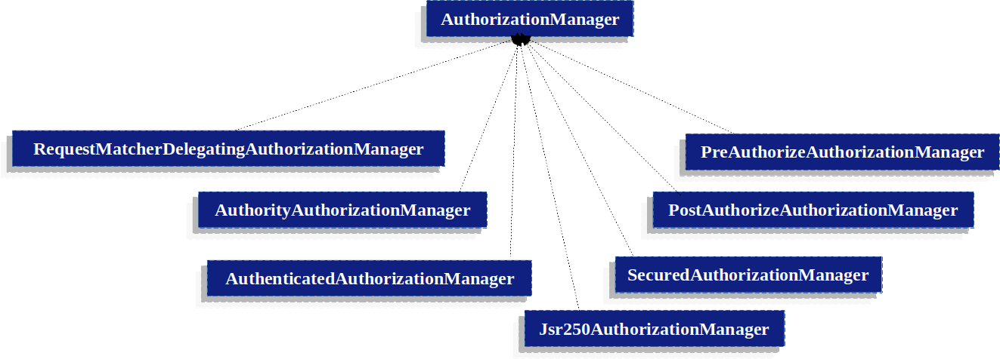
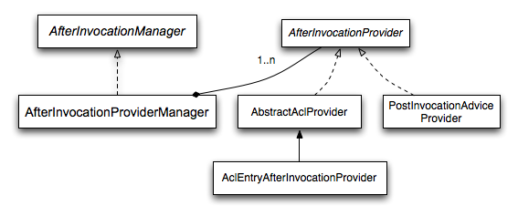

---

# 📘 How Authorization Works in Spring Security

---

## 1. Introduction

Authorization is the process by which Spring Security decides **whether a user is allowed to access a protected resource** after authentication has already occurred.

It is critical to understand that:

> **Authentication answers *who you are***
> **Authorization answers *what you are allowed to do***

In Spring Security, authorization is **not a single check**. It is a **pipeline** of checks that may run:

* At the **URL level**
* At the **method level**
* Optionally **after method execution**

In this lesson, we will:

* Identify all **authorization actors**
* Understand **how decisions are made**
* Walk through a **real debugging flow**
* Bridge **legacy (AccessDecisionManager/Voters)** with **modern (AuthorizationManager)**

---

## 2. The Authorization Actors

### 2.1 The Entry Point of Authorization

Authorization always starts when a **secure object** is accessed.

A secure object can be:

* An HTTP request
* A controller or service method
* A message (WebSocket, messaging)

Spring Security uses **interceptors** to protect these objects.

| Context     | Interceptor                   |
| ----------- | ----------------------------- |
| Web request | `FilterSecurityInterceptor`   |
| Method call | `MethodSecurityInterceptor`   |
| Messaging   | Message security interceptors |

These interceptors **do not make decisions themselves**.
They **delegate** authorization to a decision engine.

---

### 2.2 The AccessDecisionManager (Legacy Core)

Historically, Spring Security authorization revolved around the **AccessDecisionManager**.

This component acts as the **central coordinator** of authorization decisions.

#### Core API

```java
void decide(
    Authentication authentication,
    Object secureObject,
    Collection<ConfigAttribute> attributes
) throws AccessDeniedException;
```

It receives:

* The current `Authentication` (who is acting)
* The `secureObject` (what is being accessed)
* A set of `ConfigAttribute`s (required permissions)

The AccessDecisionManager **does not evaluate rules itself**.
Instead, it **delegates** the decision to **voters**.

---

### 2.3 AccessDecisionManager Implementations

Spring Security provides **three voting-based implementations**.

#### 1. AffirmativeBased (Default)

* Access is granted if **any voter votes GRANTED**
* DENY votes are ignored as long as there is at least one GRANT

> This makes authorization **permissive by default**

---

#### 2. ConsensusBased

* Access is granted if **the majority votes GRANTED**
* Abstain votes are ignored
* Tie-breaking behavior is configurable

---

#### 3. UnanimousBased

* **All voters must vote GRANTED**
* A single DENY vetoes access

---

### Default Configuration

Out of the box, Spring Security uses:

* **AffirmativeBased AccessDecisionManager**
* With:

    * `RoleVoter`
    * `AuthenticatedVoter`

This default setup explains why:

> Many applications allow access as soon as *one* rule matches.

---

## 3. AccessDecisionVoters

A **voter** is a **single authorization rule**.

Each voter evaluates the request independently and returns one of three values:

```java
ACCESS_GRANTED
ACCESS_DENIED
ACCESS_ABSTAIN
```

---

### 3.1 Core Voter Interface

```java
int vote(
    Authentication authentication,
    Object object,
    Collection<ConfigAttribute> attributes
);
```

Important:

* Voters do **not** know about each other
* They vote in isolation
* The AccessDecisionManager tallies the result

---

### 3.2 Common Voter Implementations

| Voter                                 | Purpose                    |
| ------------------------------------- | -------------------------- |
| RoleVoter                             | Checks `ROLE_` authorities |
| AuthenticatedVoter                    | Anonymous vs authenticated |
| WebExpressionVoter                    | SpEL expressions           |
| PreInvocationAuthorizationAdviceVoter | `@PreAuthorize`            |
| ACL Voter                             | Object-level permissions   |

---

### Custom Voters

You can implement custom voters for:

* Multi-tenancy
* Account suspension
* Time-based access
* Ownership checks

This flexibility is powerful—but also complex.

---

## 📌 Figure 1: Authorization Actors and Voting Model

---

---

*(Interceptor → AccessDecisionManager → Voters)*

---

## 4. Default Authorization Flow (High Level)

```
Request / Method Invocation
        |
        v
Security Interceptor
        |
        v
AccessDecisionManager
        |
        v
AccessDecisionVoters
        |
        v
Access GRANTED or DENIED
```

---

## 5. Debugging Authorization: A Real Walkthrough

We will analyze a **simple but realistic scenario**.

### Configuration Overview

* All URLs are permitted
* Method security is enabled
* Only **one method** is secured

---

### 5.1 Security Configuration

```java
@EnableMethodSecurity
@Configuration
public class SecurityConfig {

    @Bean
    SecurityFilterChain filterChain(HttpSecurity http) throws Exception {
        http
            .authorizeHttpRequests(auth -> auth
                .anyRequest().permitAll()
            )
            .formLogin();

        return http.build();
    }
}
```

This means:

* URL-level authorization always passes
* Method-level authorization drives security

---

### 5.2 Secured Method

```java
@Controller
public class UserController {

    @PreAuthorize("hasRole('ADMIN')")
    @GetMapping("/users/create")
    public String showCreateForm() {
        return "create-user";
    }
}
```

---

## 6. Runtime Authorization – Step by Step

### 6.1 First Authorization Pass: URL Level

1. HTTP request enters filter chain
2. `FilterSecurityInterceptor` executes
3. Authorization is evaluated for the **URL**
4. Secure object is:

```
FilterInvocation
```

5. Only one voter is active:

    * `WebExpressionVoter`

6. Since URLs are permitted:

    * Vote = GRANTED
    * Access is allowed

This authorization pass completes **successfully**.

---

### 6.2 Second Authorization Pass: Method Level

After URL authorization:

1. Controller method is invoked
2. `MethodSecurityInterceptor` triggers
3. Authorization runs **again**
4. Secure object is now:

```
MethodInvocation
```

This is critical:

> **Spring Security performs authorization per secure object**

---

## 📌 Figure 2: URL Authorization vs Method Authorization

---

---

*(Two separate decision cycles)*

---

## 7. Method Authorization Voting Breakdown

Active voters:

* `PreInvocationAuthorizationAdviceVoter`
* `RoleVoter`
* `AuthenticatedVoter`

---

### Voting Process

1. Expression voter evaluates:

   ```java
   hasRole('ADMIN')
   ```
2. If user has `ROLE_ADMIN` → GRANTED
3. AccessDecisionManager sees a GRANTED vote
4. Since strategy is **AffirmativeBased**:

    * Access is immediately granted

---

## 8. Authorities and GrantedAuthority

### 8.1 GrantedAuthority

```java
public interface GrantedAuthority {
    String getAuthority();
}
```

Authorities:

* Are stored in `Authentication`
* Represent roles or permissions
* Are compared during authorization

---

### 8.2 Role Prefixing

By default:

```text
hasRole("USER") → ROLE_USER
```

Spring Security enforces this prefix automatically.

---

### Custom Prefix

```java
@Bean
static GrantedAuthorityDefaults grantedAuthorityDefaults() {
    return new GrantedAuthorityDefaults("MYPREFIX_");
}
```

---

## 9. Modern Authorization: AuthorizationManager

### 9.1 Why AuthorizationManager Exists

Spring Security introduced `AuthorizationManager` to:

* Replace voters
* Simplify authorization logic
* Improve composability
* Reduce debugging complexity

---

### 9.2 Core Interface

```java
AuthorizationResult authorize(
    Supplier<Authentication> authentication,
    Object secureObject
);
```

Instead of voting:

* A **single manager** makes the decision
* Composition is explicit, not implicit

---

### Example

```java
http.authorizeHttpRequests(auth -> auth
    .requestMatchers("/admin/**")
    .hasRole("ADMIN")
);
```

Internally:

* Uses `AuthorityAuthorizationManager`
* No voters involved

---

## 📌 Figure 3: After Invocation Authorization

---

---

*(Post-execution filtering and enforcement)*

---

## 10. After Invocation Authorization

Spring Security supports **post-execution checks**.

Example:

```java
@PostAuthorize("returnObject.owner == authentication.name")
public Document getDocument(Long id) {
    return document;
}
```

Flow:

1. Method executes
2. Return value inspected
3. Authorization applied
4. Access denied if rule fails

---

## 11. Role Hierarchy

```java
@Bean
static RoleHierarchy roleHierarchy() {
    return RoleHierarchyImpl.withDefaultRolePrefix()
        .role("ADMIN").implies("STAFF")
        .role("STAFF").implies("USER")
        .role("USER").implies("GUEST")
        .build();
}
```

Meaning:

```
ADMIN > STAFF > USER > GUEST
```

A user with `ROLE_ADMIN` implicitly has all lower roles.

---

## 12. Summary and Mental Model

### Key Insights

* Authorization runs **multiple times**
* URL and method security are **independent**
* Legacy uses **voters**
* Modern uses **AuthorizationManager**
* Debugging requires knowing:

    * Which interceptor ran
    * What object was secured
    * Which decision engine was used

---

## 13. Recommended Next Steps

Next lessons to master authorization:

* Writing a **custom AuthorizationManager**
* Migrating voters to AuthorizationManager
* ACL authorization
* Multi-tenant authorization
* Debugging denied access systematically

---

