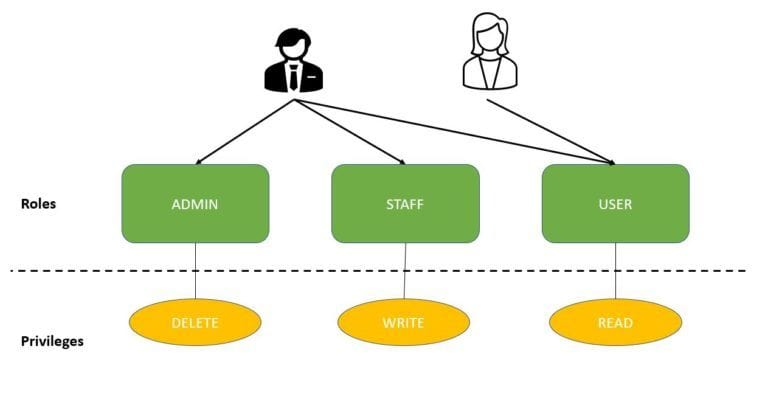
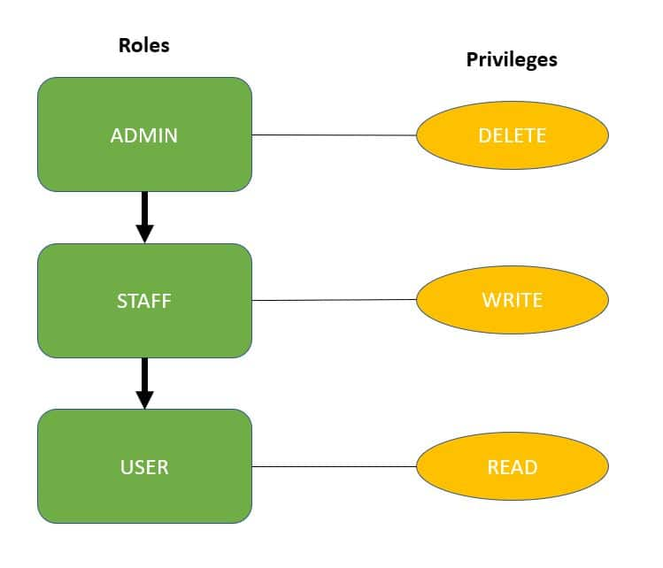

---

# **Role Hierarchy in Spring Security**

---

## 1. Why Role Hierarchy?

In real systems, permissions grow quickly:

* Users
* Staff
* Admins
* Super admins
* Managers, Auditors, etc.

Without hierarchy, you either:

* Assign **many roles** to one user, or
* Duplicate access rules everywhere

This causes **role explosion** and fragile security rules.

### Role Hierarchy solves this by defining **“includes” relationships**:

> If you have role **ADMIN**, you automatically have everything **USER** can do.

---

## 2. Conceptual Model (Roles vs Privileges)

### High-level vs Low-level

| Concept       | Meaning                                       |
| ------------- | --------------------------------------------- |
| **Role**      | Business-level grouping (ADMIN, STAFF, USER)  |
| **Privilege** | Fine-grained permission (READ, WRITE, DELETE) |
| **Authority** | What Spring Security actually checks          |

> In Spring Security, **roles and privileges both become authorities**

---

## 3. Visualizing the Hierarchy

### Diagram 1 – Roles & Privileges

---

---

* ADMIN → DELETE
* STAFF → WRITE
* USER → READ

### Diagram 2 – Hierarchical Roles

---

---

```
ADMIN
  ↓
STAFF
  ↓
USER
```

Meaning:

* ADMIN can DELETE, WRITE, READ
* STAFF can WRITE, READ
* USER can READ only

---

## 4. Domain Model (User, Role, Privilege)

### User

```java
@Entity
public class User {

    @Id
    @GeneratedValue(strategy = GenerationType.AUTO)
    private Long id;

    private String firstName;
    private String lastName;
    private String email;
    private String password;
    private boolean enabled;

    @ManyToMany
    @JoinTable(
        name = "users_roles",
        joinColumns = @JoinColumn(name = "user_id"),
        inverseJoinColumns = @JoinColumn(name = "role_id")
    )
    private Collection<Role> roles;
}
```

---

### Role

```java
@Entity
public class Role {

    @Id
    @GeneratedValue(strategy = GenerationType.AUTO)
    private Long id;

    private String role; // ROLE_ADMIN, ROLE_USER

    @ManyToMany(mappedBy = "roles")
    private Collection<User> users;

    @ManyToMany
    @JoinTable(
        name = "roles_privileges",
        joinColumns = @JoinColumn(name = "role_id"),
        inverseJoinColumns = @JoinColumn(name = "privilege_id")
    )
    private Collection<Privilege> privileges;
}
```

---

### Privilege

```java
@Entity
public class Privilege {

    @Id
    @GeneratedValue(strategy = GenerationType.AUTO)
    private Long id;

    private String privilege; // READ_PRIVILEGE, WRITE_PRIVILEGE
}
```

---

## 5. Mapping Roles & Privileges to Authorities

Spring Security only understands **GrantedAuthority**.

Your `UserDetailsService` bridges the gap:

```java
@Service
public class MyUserDetailsService implements UserDetailsService {

    @Autowired
    private StudentRepository studentRepository;

    @Override
    public UserDetails loadUserByUsername(String email) {
        Student student = studentRepository.findByEmail(email);
        if (student == null) {
            throw new UsernameNotFoundException(email);
        }

        return new User(
            student.getEmail(),
            student.getPassword(),
            student.isEnabled(),
            true, true, true,
            getAuthorities(student.getRoles())
        );
    }

    private Collection<? extends GrantedAuthority> getAuthorities(Collection<Role> roles) {
        Set<GrantedAuthority> authorities = new HashSet<>();

        for (Role role : roles) {
            authorities.add(new SimpleGrantedAuthority(role.getRole()));
            for (Privilege p : role.getPrivileges()) {
                authorities.add(new SimpleGrantedAuthority(p.getPrivilege()));
            }
        }
        return authorities;
    }
}
```

1. [x] Roles and privileges coexist
2. [x] Method security can use either
3. [x] Role hierarchy applies cleanly

---

## 6. Defining the Role Hierarchy (Modern Style)

### Recommended (Spring Security 6)

```java
@Bean
static RoleHierarchy roleHierarchy() {
    return RoleHierarchyImpl.withDefaultRolePrefix()
        .role("ADMIN").implies("STAFF")
        .role("STAFF").implies("USER")
        .build();
}
```

### Method Security Integration (Required!)

Since you **use @PreAuthorize / @PostFilter**, you must wire it:

```java
@Bean
static MethodSecurityExpressionHandler methodSecurityExpressionHandler(
        RoleHierarchy roleHierarchy) {

    DefaultMethodSecurityExpressionHandler handler =
        new DefaultMethodSecurityExpressionHandler();
    handler.setRoleHierarchy(roleHierarchy);
    return handler;
}
```

> ✅ You **do NOT** need to inject this into `SecurityFilterChain`
> if hierarchy is only used at **service method level**

---

## 7. Enabling Method Security

```java
@EnableMethodSecurity
@Configuration
public class MethodSecurityConfig {
}
```

---

## 8. CRUD Service with Role-Based Method Security

### Student Service

```java
@Service
@Transactional
public class StudentServiceImpl implements StudentService {

    @PreAuthorize("hasRole('USER')")
    @Override
    public Student registerNewStudent(StudentDTO dto) {
        Student student = dto.toEntity();
        return repository.save(student);
    }

    @PreAuthorize("hasRole('ADMIN')")
    @Override
    public Student updateExistingStudent(Student student) {
        return repository.save(student);
    }

    @PreAuthorize("hasRole('USER')")
    @Override
    public StudentDTO findById(Long id) {
        return repository.findById(id)
            .map(StudentDTO::fromEntity)
            .orElse(null);
    }

    @PostFilter("hasRole('USER') or filterObject.email == authentication.name")
    @Override
    public List<StudentDTO> findAllStudents() {
        return repository.findAll()
            .stream()
            .map(StudentDTO::fromEntity)
            .toList();
    }

    @PreAuthorize("hasRole('ADMIN')")
    @Override
    public void deleteById(Long id) {
        repository.deleteById(id);
    }
}
```

---

## 9. How Role Hierarchy Applies Here

| Method                | Required Role | Who Can Access     |
| --------------------- | ------------- | ------------------ |
| registerNewStudent    | USER          | USER, STAFF, ADMIN |
| findById              | USER          | USER, STAFF, ADMIN |
| findAllStudents       | USER          | USER, STAFF, ADMIN |
| updateExistingStudent | ADMIN         | ADMIN only         |
| deleteById            | ADMIN         | ADMIN only         |

✔ ADMIN **inherits USER permissions automatically**

---

## 10. Mini-Project Summary

### What This Project Demonstrates

* Clean separation of:

    * Users
    * Roles
    * Privileges
* Role hierarchy applied at **method level**
* No duplicated roles on users
* Modern Spring Security 6 configuration
* Flexible future expansion (STAFF, GUEST, etc.)

---

## 11. Key Takeaways

* **Use `hasRole('ADMIN')`, not `ROLE_ADMIN`**
* Role hierarchy reduces configuration complexity
* Method-level hierarchy ≠ URL hierarchy
* Roles are coarse-grained, privileges are fine-grained
* Spring treats both as authorities internally

---
