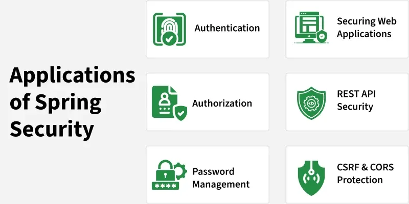
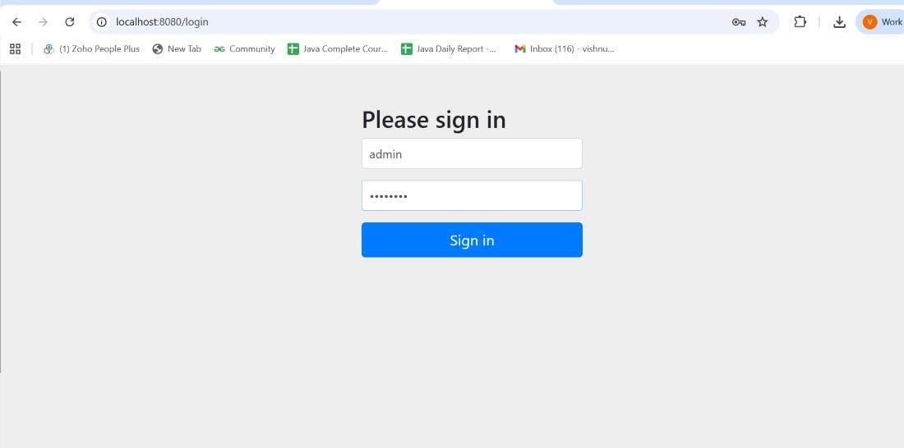

Below is the rewritten lesson **in the same structure and format**, preserving all concepts while improving clarity and readability.

---

# **Introduction to Spring Security and its Features**

**Last Updated: 11 Oct, 2025**

Spring Security is a powerful framework used to secure Java applications. It provides authentication, authorization, and protection against common vulnerabilities, and integrates smoothly with Spring Boot for effortless configuration.

---



## **Why Use Spring Security?**

In today’s software landscape, security is a necessity rather than an optional feature. Whether developing simple web apps or complex microservices, safeguarding user data and application resources is essential.

Key benefits include:

* Seamless integration with Spring Boot and Spring MVC
* Highly flexible authentication and authorization mechanisms
* Built-in support to counter common security threats
* Support for enterprise-grade standards such as LDAP, OAuth2, and JWT

---

## **Key Features of Spring Security**

Spring Security comes with a wide range of features designed to secure modern applications.

---

### **1. Authentication and Authorization**

* **Authentication:** Confirms the identity of a user (e.g., login with username/password).
* **Authorization:** Determines what an authenticated user is allowed to do (e.g., access specific pages or APIs).

---

### **2. Protection Against Common Vulnerabilities**

Spring Security provides default defenses against many well-known security threats, including:

* CSRF (Cross-Site Request Forgery)
* Session Fixation
* Clickjacking
* XSS (Cross-Site Scripting) with support for Content-Security-Policy (CSP)

---

### **3. Seamless Spring Integration**

Spring Security is deeply integrated with Spring MVC and Spring Boot.
Simply adding `spring-boot-starter-security` to your application automatically enforces basic authentication without extra setup.

---

### **4. Password Management**

* Supports modern password encoders like **bcrypt**
* Provides utilities for secure password hashing and verification

---

### **5. Method-Level Security**

Specific methods can be secured using annotations such as:

* `@PreAuthorize`
* `@PostAuthorize`
* `@Secured`

**Example:**

```java
@PreAuthorize("hasRole('ADMIN')")
public void deleteUser(Long id) {
    // only admins can delete users
}
```

---

### **6. Support for Modern Security Standards**

* **JWT** for stateless authentication
* **OAuth2** and **OpenID Connect** for Single Sign-On (SSO)
* **LDAP** for enterprise identity systems

---

# **Example: Basic Authentication in Spring Boot**

---

## **Step 1: Create a New Spring Boot Project**

Use Spring Initializr or set up manually with:

* **Project:** Maven
* **Group:** com.example
* **Artifact:** demo
* **Java:** 17 (or another LTS version)
* **Dependencies:** Spring Web, Spring Security

Download and extract the project, then import it into your IDE.

---

### **pom.xml**

```xml
<project xmlns="http://maven.apache.org/POM/4.0.0" 
    xmlns:xsi="http://www.w3.org/2001/XMLSchema-instance"
    xsi:schemaLocation="http://maven.apache.org/POM/4.0.0 
    http://maven.apache.org/xsd/maven-4.0.0.xsd">
    <modelVersion>4.0.0</modelVersion>
    <parent>
        <groupId>org.springframework.boot</groupId>
        <artifactId>spring-boot-starter-parent</artifactId>
        <version>3.2.4</version>
        <relativePath/>
    </parent>
    <groupId>com.example</groupId>
    <artifactId>demo</artifactId>
    <version>0.0.1-SNAPSHOT</version>
    <name>spring-security-basic-auth-demo</name>
    <description>Spring Boot Basic Auth Demo</description>

    <properties>
        <java.version>17</java.version>
    </properties>

    <dependencies>
        <dependency>
            <groupId>org.springframework.boot</groupId>
            <artifactId>spring-boot-starter-web</artifactId>
        </dependency>
        <dependency>
            <groupId>org.springframework.boot</groupId>
            <artifactId>spring-boot-starter-security</artifactId>
        </dependency>
        <dependency>
            <groupId>org.springframework.boot</groupId>
            <artifactId>spring-boot-starter-test</artifactId>
            <scope>test</scope>
        </dependency>
    </dependencies>

    <build>
        <plugins>
            <plugin>
                <groupId>org.springframework.boot</groupId>
                <artifactId>spring-boot-maven-plugin</artifactId>
            </plugin>
        </plugins>
    </build>
</project>
```

---

## **Step 2: Add a Simple REST Controller**

Create the class:
`src/main/java/com/example/demo/HelloController.java`

```java
package com.example.demo;

import org.springframework.web.bind.annotation.GetMapping;
import org.springframework.web.bind.annotation.RestController;

@RestController
public class HelloController {

    @GetMapping("/hello")
    public String hello() {
        return "Welcome! You are successfully authenticated.";
    }
}
```

---

## **Step 3: Configure Default Credentials**

Open `src/main/resources/application.properties` and add:

```
spring.security.user.name=admin
spring.security.user.password=admin123
```

---

## **Step 4: Run the Application**

Run the main class:

```java
package com.example.demo;

import org.springframework.boot.SpringApplication;
import org.springframework.boot.autoconfigure.SpringBootApplication;

@SpringBootApplication
public class DemoApplication {
  public static void main(String[] args) {
    SpringApplication.run(DemoApplication.class, args);
  }
}
```

---

## **Step 5: Test the Secured Endpoint**

Open your browser and navigate to:

```
http://localhost:8080/login
```


You will see a login form. Enter:

* **Username:** admin
* **Password:** admin123

After signing in, visit:

```
http://localhost:8080/hello
```


The message will display:

> **“Welcome! You are successfully authenticated.”**

---

# **Advantages of Spring Security**

Key benefits include:

* Strong protection against CSRF, session fixation, and clickjacking
* Smooth integration with Spring MVC and Spring Boot
* Supports Java-based security configuration
* Works with the standard Servlet API
* Helps prevent brute-force attacks
* Backed by an active open-source community

---

