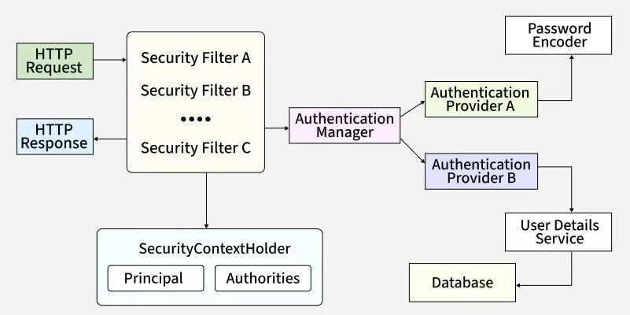

---

# **Spring Security Architecture**

**Last Updated : 12 Sep, 2025**

Spring Security is a robust framework that provides authentication, authorization, and protection against common attacks in Java applications. It is the **standard security solution** for Spring applications and integrates seamlessly with modern security approaches like **JWT**, **OAuth2**, **LDAP**, and **database-backed authentication**.

Understanding its architecture is key to designing secure applications.

---

# **Core Components of Spring Security Architecture**

Below are the essential building blocks that handle authentication, authorization, and request filtering.



---

## **1. Security Filter Chain**

The **Security Filter Chain** is the entry point for all incoming HTTP requests.

### **Key Responsibilities**

* Every request passes through a chain of security filters
* Filters perform:

    * Authentication
    * Authorization
    * CSRF protection
    * Session management
* Fully modular—individual filters can be enabled, disabled, or customized
* Defines the security workflow for the entire application

### **Example: Basic Filter Chain Configuration**

```java
@Configuration
public class SecurityConfig {

    @Bean
    public SecurityFilterChain securityFilterChain(HttpSecurity http) throws Exception {
        http
            .csrf(csrf -> csrf.disable()) // Disable CSRF for APIs
            .authorizeHttpRequests(auth -> auth
                .requestMatchers("/public/**").permitAll()
                .anyRequest().authenticated()
            )
            .httpBasic(); // Basic Authentication
        return http.build();
    }
}
```

---

## **2. Authentication Manager**

The **Authentication Manager** coordinates the authentication process.

### **What It Does**

* Central component responsible for authenticating users
* Delegates authentication to one or more **Authentication Providers**
* Uses the Strategy pattern → multiple authentication methods can be combined

    * DB authentication
    * LDAP
    * JWT
    * OAuth2

### **Example: Exposing the AuthenticationManager Bean**

```java
@Configuration
public class AuthManagerConfig {

    @Bean
    public AuthenticationManager authenticationManager(
            AuthenticationConfiguration configuration) throws Exception {
        return configuration.getAuthenticationManager();
    }
}
```

---

## **3. Authentication Providers**

Authentication Providers contain the logic that actually **validates credentials**.

### **Common Provider Examples**

* **DaoAuthenticationProvider** — uses `UserDetailsService` + `PasswordEncoder` (DB-backed)
* **JwtAuthenticationProvider** — validates JWT tokens
* **LdapAuthenticationProvider** — authenticates via LDAP server

### **Example: DaoAuthenticationProvider**

```java
@Configuration
public class ProviderConfig {

    @Bean
    public DaoAuthenticationProvider authenticationProvider(
            UserDetailsService userDetailsService,
            PasswordEncoder passwordEncoder) {
        DaoAuthenticationProvider provider = new DaoAuthenticationProvider();
        provider.setUserDetailsService(userDetailsService);
        provider.setPasswordEncoder(passwordEncoder);
        return provider;
    }
}
```

---

## **4. UserDetailsService**

`UserDetailsService` loads user data from a source such as a database or LDAP.

### **Key Responsibilities**

* Loads username, password, roles, and account status
* Returns a `UserDetails` object used by Authentication Providers
* Works closely with authentication providers like DaoAuthenticationProvider

### **Example: In-Memory UserDetailsService**

```java
@Configuration
public class UserConfig {

    @Bean
    public UserDetailsService userDetailsService(PasswordEncoder encoder) {
        return new InMemoryUserDetailsManager(
            User.withUsername("john")
                .password(encoder.encode("password"))
                .roles("USER")
                .build(),
            User.withUsername("admin")
                .password(encoder.encode("admin123"))
                .roles("ADMIN")
                .build()
        );
    }
}
```

---

## **5. Password Encoder**

Spring Security uses password encoders to **securely store and compare passwords**.

### **Why It Matters**

* Raw passwords are never stored
* Password hashing prevents credential leaks
* `BCryptPasswordEncoder` is the recommended secure hashing algorithm

### **Example: BCrypt Encoder**

```java
@Configuration
public class PasswordConfig {

    @Bean
    public PasswordEncoder passwordEncoder() {
        return new BCryptPasswordEncoder(); // Strong hashing
    }
}
```

---

## **6. SecurityContextHolder**

`SecurityContextHolder` stores the current user's **SecurityContext**.

### **What It Holds**

* **Authentication object**, which contains:

    * **Principal** (username or actual user entity)
    * **Authorities** (roles/permissions)
    * Authentication state

Spring Security uses this context throughout the request to perform authorization checks.

### **Example: Retrieve Logged-In User**

```java
@RestController
public class UserController {

    @GetMapping("/me")
    public String getCurrentUser() {
        Authentication authentication = SecurityContextHolder.getContext().getAuthentication();
        return "Logged in as: " + authentication.getName() +
               " | Roles: " + authentication.getAuthorities();
    }
}
```

---

# **How Spring Security Works Internally**

Below is the request flow inside Spring Security:


---

>### **1. Client sends an HTTP request**
>The request enters the Spring Boot application.

---

>### **2. Security Filter Chain intercepts the request**
>The request goes through filters like:
>* `UsernamePasswordAuthenticationFilter`
>* `BasicAuthenticationFilter`
>* `BearerTokenAuthenticationFilter` (JWT)
>* `CsrfFilter`

---

>### **3. Authentication Manager receives authentication request**
>It determines which authentication mechanism applies.

---

>### **4. Authentication Provider validates credentials**
>Based on the configuration, it may:
>* Query the database through `UserDetailsService`
>* Validate a JWT token
>* Authenticate against LDAP

---

>### **5. Successful authentication → save in SecurityContextHolder**
>User details are stored for the remainder of the request lifecycle.

---

>### **6. Authorization checks**
>Based on roles/permissions stored in the **Authentication** object.

---

>### **7. Request is passed to the controller**
>If authentication and authorization succeed, your controller method executes and returns a response.

---

# **Summary**

Spring Security’s architecture is composed of several interacting components:

* **Security Filter Chain** — first line of defense
* **Authentication Manager** — orchestrates authentication
* **Authentication Providers** — validate credentials
* **UserDetailsService** — loads user information
* **PasswordEncoder** — secures passwords
* **SecurityContextHolder** — stores authentication data

Together, these components provide a flexible, powerful, and extensible security model suitable for modern Spring applications.

---

