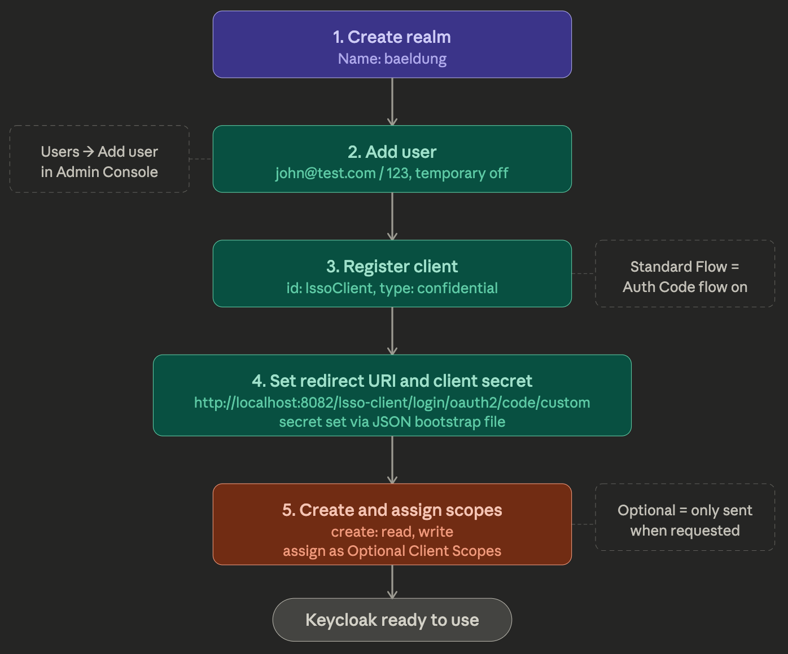

---

## The Authorization Server with Keycloak

### 1. Goal

To set up an Authorization Server using Keycloak, understand its core concepts, and manually configure everything needed to run the OAuth2 Authorization Code flow — a realm, a user, a client, and custom scopes.

---

### 2. Why Keycloak Instead of Spring?

The natural first question is: why not use Spring itself as the Authorization Server?

The legacy Spring Security OAuth project did offer Authorization Server support, but that project has been deprecated in favour of the new OAuth stack. In the new stack, the Spring team has deliberately chosen not to include Authorization Server support in the core Spring Security library, instead working on it as a separate, community-driven experimental project.

The core reason for this decision is that OAuth is an open standard, and there are already several mature, well-established Authorization Server options available — particularly in the Java ecosystem. Using one of these purpose-built solutions is generally preferable to rolling your own.

**Keycloak** is the Authorization Server chosen for this course. It is an open-source Identity and Access Management solution developed in Java by JBoss and maintained under Red Hat. Beyond OAuth2, it also supports OpenID Connect (OIDC) and SAML, making it a solid, production-ready choice.

---

### 3. Running a Keycloak Server

There are several ways to start a Keycloak instance in general:

- **Standalone server** — download and run the distribution directly, suitable for production
- **Docker image** — start the server via a Docker container

For this course, a third approach is used for simplicity: a **Spring Boot application** that embeds and starts Keycloak with a pre-defined set of initial configuration. It uses an in-memory H2 database, so every startup produces a clean, predictable state with exactly the configuration needed.

The server runs on **port 8083**. Once started, you can access the Admin Console at `http://localhost:8083/auth`.

Admin credentials are defined in the `application.yml` of the auth-server module, under the `adminUser` key. For this course they are `bael-admin / pass`.

---

### 4. Core Keycloak Concept: Realms

A **Realm** in Keycloak is an isolated unit of user and application management. Users belong to a realm and authenticate within it. Clients are registered within a realm. Everything — users, credentials, clients, scopes — is scoped to a realm.

When Keycloak first starts, it creates a **Master realm**. Admin accounts in the Master realm have permissions to create and manage other realms.

For this course a new realm called **baeldung** is created and used for all configuration.

---

### 5. Step-by-Step Manual Configuration

The following configuration is what needs to be set up. In practice for this course, it gets loaded automatically via the `baeldung-realm.json` file on startup — but walking through it manually helps you understand what each piece does.

Here is a visual summary of the full configuration:



#### Step 1: Create a Realm

Navigate to `http://localhost:8083/auth` and log in with `bael-admin / pass`. Hover the "Master" label in the top-left, click "Add realm", enter the name **baeldung**, and click "Create".

All subsequent configuration happens inside this realm.

#### Step 2: Add a User

Go to "Users" in the left sidebar and click "Add user". Set the username to `john@test.com` and save. Then open the "Credentials" tab, set the password to `123` in both fields, and **disable the Temporary option** (to prevent Keycloak from forcing a password change on first login). Click "Set Password" and confirm.

#### Step 3: Register the Client

Go to "Clients" and create a new client with the id `lssoClient`. In the Client Settings:

- Set the access type to **Confidential** — this allows a client secret to be defined.
- Verify that **Standard Flow Enabled** is on — this means the Authorization Code flow is active.
- Disable **Direct Access Grants** (Resource Owner Password flow) — it is not needed for this course.
- Disable **Consent Required** for simplicity — this skips the consent screen during authorization.

#### Step 4: Set the Redirect URI and Client Secret

In the Client Settings, set the redirect URI to:

```
http://localhost:8082/lsso-client/login/oauth2/code/custom
```

This URI follows Spring Security's default redirect URI template pattern. The `/login/oauth2/code/` segment is handled by the Spring Security framework automatically; `custom` is the provider ID used in the course.

Regarding the **client secret**: Keycloak does not allow customising the secret via the Admin Console UI. Instead, the secret `lssoSecret` is configured directly in the `baeldung-realm.json` bootstrap file that gets loaded on server startup.

#### Step 5: Create and Assign Custom Scopes

Go to "Client Scopes" and create two new scopes: **read** and **write** (name only, save each).

Then go back to "Clients", open `lssoClient`, and navigate to the "Client Scopes" tab. Here there are two types of scope assignment:

| Type | Behaviour |
|---|---|
| Default Client Scopes | Always included in every issued token |
| Optional Client Scopes | Included only when explicitly requested in the Authorization request |

Add `read` and `write` as **Optional Client Scopes**. This means they will only appear in a token when the client explicitly requests them via the `scope` parameter.

---

### 6. Simulating the Authorization Code Flow Manually

With setup complete, it is possible to simulate the full flow by hand in a browser and Postman.

**Getting an Authorization Code:**

Navigate to the authorization endpoint in a browser:

```
http://localhost:8083/auth/realms/baeldung/protocol/openid-connect/auth
  ?client_id=lssoClient
  &response_type=code
  &scope=write
```

Log in as `john@test.com / 123`. Keycloak will redirect to the `redirect_uri` with a `code` query parameter. The redirect will fail visually (since the client app isn't running), but the code value in the URL is what's needed.

**Tip:** By default the Authorization Code is only valid for 1 minute. To give yourself more time for manual testing, go to "Realm Settings" → "Tokens" tab and increase the "Client login timeout" to 5 minutes before starting.

**Exchanging the Code for an Access Token:**

Send a `POST` request to the Token Endpoint using Postman. Include:

- The `code` extracted from the URL
- The `client_secret` (`lssoSecret`) from the Credentials tab

The Authorization Server will respond with an Access Token that can be used as a Bearer token on subsequent requests.

---

### 7. Automatic Configuration for Future Lessons

Manually walking through these steps is a one-time exercise to understand Keycloak's structure. For all future lessons in the course, the entire configuration is automatically loaded from the `baeldung-realm.json` file when the authorization server Spring Boot application starts. There is no need to repeat this setup each time.

---