---

## A Quick Guide to OAuth2 with Spring Boot and Keycloak

### 1. Overview

This guide covers configuring a Spring Boot backend with OAuth2 using Keycloak as the OpenID Provider. Keycloak acts as a user-service responsible for authentication and user data (roles, profiles, contact info, etc.).

Two Spring Boot applications are configured:

- A **stateful client** using `oauth2Login` (a Thymeleaf server-side UI)
- A **stateless resource server** using `oauth2ResourceServer` (a REST API with JWT decoding)

---

### 2. Keycloak Quickstart with Docker

The easiest way to run an Authorization Server locally is via the official Keycloak Docker image.

#### Docker Compose

A `docker-compose.yml` file configures the container. Key settings include:

- Image: `quay.io/keycloak/keycloak:25.0.1`
- Runs in dev mode with `start-dev --import-realm`
- Exposed on port `8080`
- Realm configuration is loaded automatically from JSON files mounted into `/opt/keycloak/data/import/`
- Admin credentials are provided via the `KEYCLOAK_ADMIN` and `KEYCLOAK_ADMIN_PASSWORD` environment variables

#### Pre-configured Realm

The companion project includes a `baeldung-keycloak-realm.json` file that sets up everything needed automatically:

- A `baeldung-keycloak` realm
- A `baeldung-keycloak-confidential` client with secret `secret`
- A mapper that adds realm roles to both access and ID tokens
- A `NICE` realm role
- Two users: `brice` (with the `NICE` role) and `igor` (without it) — both with password `secret`

#### Starting the Container

```bash
export KEYCLOAK_ADMIN_PASSWORD=admin
docker compose up -d
```

Once started, the Admin Console is available at `http://localhost:8080` with credentials `admin / admin`.

---

### 3. Spring Security OAuth2 Concepts

Before looking at code, it is important to understand the actors and the two main Spring Security configurations.

#### The Three OAuth2 Actors

**Authorization Server** — authenticates Resource Owners and issues tokens to clients. Keycloak plays this role here.

**Client** — drives the flow to get tokens, stores them, and uses them to authorize requests to Resource Servers. For human users, clients use the Authorization Code flow. In this guide, the Spring `oauth2Login` app and Postman act as clients.

**Resource Server** — provides secured access to REST resources. It validates tokens (issuer, expiration, audience, etc.) and enforces access control based on scopes and roles. Importantly, logging users in and out is never a Resource Server concern — that belongs to the client.

#### `oauth2Login` (stateful)

- Configures the Authorization Code and Refresh Token flows.
- Stores tokens in the HTTP session by default.
- Requests are authorized via a **session cookie**.
- CSRF protection must always be enabled.
- After authorization, the `Authentication` in the security context is an `OAuth2AuthenticationToken`.
- When the provider is auto-configured via OpenID (`issuer-uri`), the principal is an `OidcUser` built from the ID token.
- Authorities are mapped using a `GrantedAuthoritiesMapper` or a custom `OAuth2UserService`.

#### `oauth2ResourceServer` (stateless)

- Configures Bearer token security.
- Offers a choice between **JWT decoding** (efficient, no extra network call) and **introspection** (opaque tokens, requires a call to the Authorization Server per request).
- Sessions can be fully disabled — user state is carried entirely in token claims.
- CSRF protection can be disabled (CSRF attacks require sessions).
- Easy to scale horizontally — no shared session state needed.
- Default `Authentication` type with JWT decoder is `JwtAuthenticationToken`; with introspection it is `BearerTokenAuthentication`.

#### Choosing Between Them

`oauth2Login` is used for server-side rendered UIs and Spring Cloud Gateway acting as a Backend For Frontend (BFF). It requires session sharing (e.g. Spring Session) when scaling horizontally.

`oauth2ResourceServer` is the preferred choice for REST APIs. REST clients (Spring's `RestClient`, `WebClient`, Postman) can manage tokens, but plain browsers cannot without a frontend framework — and this is now discouraged for security reasons.

The two must never share the same `SecurityFilterChain` bean because their authorization mechanisms, session handling, and CSRF requirements are fundamentally different. When both are needed in one application (e.g. an OAuth2 BFF), they should be in separate `SecurityFilterChain` beans distinguished by `@Order` and `securityMatcher`.

The diagram below maps this out:---

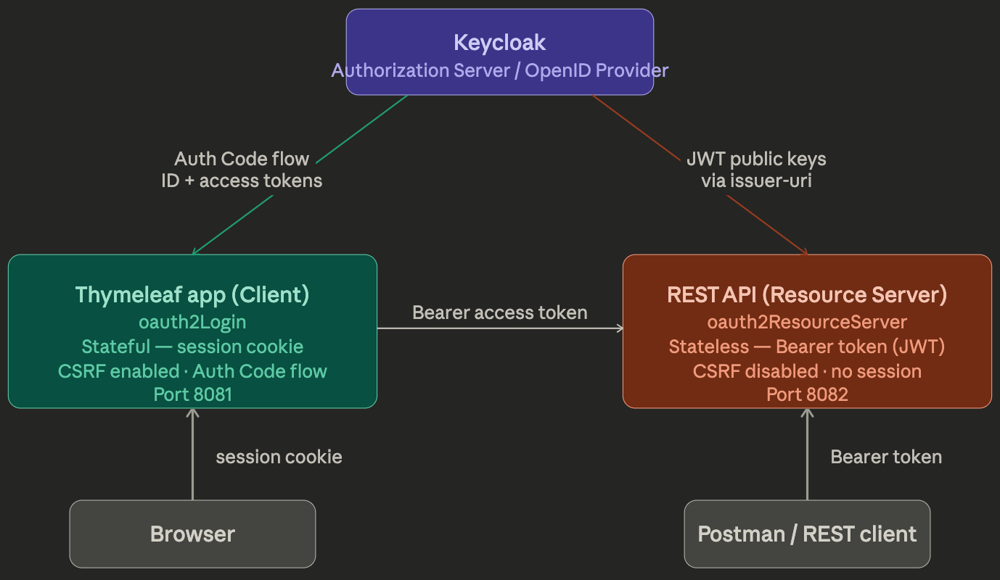

### 4. Thymeleaf Client with `oauth2Login`

#### Dependencies

```xml
<dependency>
    <groupId>org.springframework.boot</groupId>
    <artifactId>spring-boot-starter-oauth2-client</artifactId>
</dependency>
<dependency>
    <groupId>org.springframework.boot</groupId>
    <artifactId>spring-boot-starter-thymeleaf</artifactId>
</dependency>
<dependency>
    <groupId>org.springframework.boot</groupId>
    <artifactId>spring-boot-starter-web</artifactId>
</dependency>
```

For testing access control, add `spring-security-test` with test scope.

#### Provider and Registration Configuration

Because Keycloak exposes its OpenID configuration at `{issuer-uri}/.well-known/openid-configuration`, Spring Security can auto-configure the provider from a single property:

```properties
spring.security.oauth2.client.provider.baeldung-keycloak.issuer-uri=
  http://localhost:8080/realms/baeldung-keycloak

spring.security.oauth2.client.registration.keycloak.provider=baeldung-keycloak
spring.security.oauth2.client.registration.keycloak.authorization-grant-type=authorization_code
spring.security.oauth2.client.registration.keycloak.client-id=baeldung-keycloak-confidential
spring.security.oauth2.client.registration.keycloak.client-secret=secret
spring.security.oauth2.client.registration.keycloak.scope=openid
```

#### Mapping Keycloak Realm Roles to Spring Security Authorities

Keycloak stores realm roles inside the `realm_access.roles` claim. A custom `AuthoritiesConverter` extracts them:

```java
interface AuthoritiesConverter 
    extends Converter<Map<String, Object>, Collection<GrantedAuthority>> {}

@Bean
AuthoritiesConverter realmRolesAuthoritiesConverter() {
    return claims -> {
        var realmAccess = Optional.ofNullable(
            (Map<String, Object>) claims.get("realm_access"));
        var roles = realmAccess.flatMap(map ->
            Optional.ofNullable((List<String>) map.get("roles")));
        return roles.map(List::stream)
            .orElse(Stream.empty())
            .map(SimpleGrantedAuthority::new)
            .map(GrantedAuthority.class::cast)
            .toList();
    };
}
```

The custom interface avoids ambiguity when the Spring bean factory searches for a `Converter<Map<String, Object>, Collection<GrantedAuthority>>` — there can be many `Converter` beans with different type parameters, so the named interface provides a precise target.

A `GrantedAuthoritiesMapper` then wires this converter into the login flow, pulling claims from the `OidcUser`'s ID token:

```java
@Bean
GrantedAuthoritiesMapper authenticationConverter(
        AuthoritiesConverter authoritiesConverter) {
    return authorities -> authorities.stream()
        .filter(a -> a instanceof OidcUserAuthority)
        .map(OidcUserAuthority.class::cast)
        .map(OidcUserAuthority::getIdToken)
        .map(OidcIdToken::getClaims)
        .map(authoritiesConverter::convert)
        .flatMap(Collection::stream)
        .collect(Collectors.toSet());
}
```

#### SecurityFilterChain

```java
@Bean
SecurityFilterChain clientSecurityFilterChain(
        HttpSecurity http,
        ClientRegistrationRepository clientRegistrationRepository) throws Exception {
    http.oauth2Login(Customizer.withDefaults());
    http.logout(logout -> {
        var handler = new OidcClientInitiatedLogoutSuccessHandler(
            clientRegistrationRepository);
        handler.setPostLogoutRedirectUri("{baseUrl}/");
        logout.logoutSuccessHandler(handler);
    });
    http.authorizeHttpRequests(requests -> {
        requests.requestMatchers("/", "/favicon.ico").permitAll();
        requests.requestMatchers("/nice").hasAuthority("NICE");
        requests.anyRequest().denyAll();
    });
    return http.build();
}
```

Key points to understand here:

`oauth2Login()` adds `OAuth2LoginAuthenticationFilter` to the chain, which handles the Authorization Code and Refresh Token flows and stores tokens in the session.

The logout is configured using **RP-Initiated Logout** (an OpenID standard). The flow is: browser logs out of the Spring app → Spring redirects to Keycloak with the ID token hint → Keycloak closes its session → Keycloak redirects back to the post-logout URI. Without this, the Keycloak session remains open and a new login attempt will complete silently without prompting for credentials.

Access control: the index page is public so unauthenticated users can reach the login button; `/nice` requires the `NICE` authority.

#### Controller

```java
@Controller
public class UiController {
    @GetMapping("/")
    public String getIndex(Model model, Authentication auth) {
        model.addAttribute("name",
            auth instanceof OAuth2AuthenticationToken oauth
              && oauth.getPrincipal() instanceof OidcUser oidc
                ? oidc.getPreferredUsername() : "");
        model.addAttribute("isAuthenticated",
            auth != null && auth.isAuthenticated());
        model.addAttribute("isNice",
            auth != null && auth.getAuthorities().stream()
                .anyMatch(a -> "NICE".equals(a.getAuthority())));
        return "index.html";
    }
}
```

---

### 5. REST API with `oauth2ResourceServer` (JWT Decoder)

#### Dependencies

```xml
<dependency>
    <groupId>org.springframework.boot</groupId>
    <artifactId>spring-boot-starter-oauth2-resource-server</artifactId>
</dependency>
<dependency>
    <groupId>org.springframework.boot</groupId>
    <artifactId>spring-boot-starter-web</artifactId>
</dependency>
```

#### JWT Decoder Configuration

JWT decoding is far more efficient than introspection because it validates the token locally using public keys — no round-trip to the Authorization Server per request. With Spring Boot, a single property configures everything:

```properties
spring.security.oauth2.resourceserver.jwt.issuer-uri=
  http://localhost:8080/realms/baeldung-keycloak
```

#### Mapping Roles to Authorities

The same `AuthoritiesConverter` bean from the client section can be reused here. The difference is that on the resource server, **access token** claims are used rather than ID token claims:

```java
@Bean
JwtAuthenticationConverter authenticationConverter(
        AuthoritiesConverter authoritiesConverter) {
    var converter = new JwtAuthenticationConverter();
    converter.setJwtGrantedAuthoritiesConverter(
        jwt -> authoritiesConverter.convert(jwt.getClaims()));
    return converter;
}
```

#### SecurityFilterChain

```java
@Bean
SecurityFilterChain resourceServerSecurityFilterChain(
        HttpSecurity http,
        Converter<Jwt, AbstractAuthenticationToken> authenticationConverter) 
        throws Exception {
    http.oauth2ResourceServer(rs -> rs.jwt(jwt ->
        jwt.jwtAuthenticationConverter(authenticationConverter)));
    http.sessionManagement(s ->
        s.sessionCreationPolicy(SessionCreationPolicy.STATELESS));
    http.csrf(csrf -> csrf.disable());
    http.authorizeHttpRequests(requests -> {
        requests.requestMatchers("/me").authenticated();
        requests.anyRequest().denyAll();
    });
    return http.build();
}
```

Sessions are fully disabled and CSRF is turned off because there is no session state to protect. Only requests with a valid Bearer token can reach `/me`; everything else is denied.

#### REST Controller

```java
@RestController
public class MeController {
    @GetMapping("/me")
    public UserInfoDto getGreeting(JwtAuthenticationToken auth) {
        return new UserInfoDto(
            auth.getToken().getClaimAsString(
                StandardClaimNames.PREFERRED_USERNAME),
            auth.getAuthorities().stream()
                .map(GrantedAuthority::getAuthority).toList());
    }
    public record UserInfoDto(String name, List<String> roles) {}
}
```

Casting to `JwtAuthenticationToken` is safe here because access is restricted to `authenticated()` and the authentication converter always returns a `JwtAuthenticationToken`. If the route were `permitAll()`, the `AnonymousAuthenticationToken` case would also need to be handled.

---

It is safe to cast the auth to JwtAuthenticationToken because access is limited to isAuthenticated() and because JwtAuthenticationToken is what our authentication converter returns. If the route was permitAll(), we should also handle AnonymousAuthenticationToken in case of unauthorized requests – those without a Bearer token.

### Trying the REST API

Now we’re ready to try our REST API live. Like we did for the Thymeleaf app, we can run it using our favorite IDE or, from the maven parent context, execute:
`

`

Then, to get an access token from Keycloak with Postman, we should open the Authorization tab of the collection or request, select OAuth2, and fill the form with the values we already set in Keycloak (redirect URI) and Spring properties, or that we get from the OpenID configuration:

> Postman token config
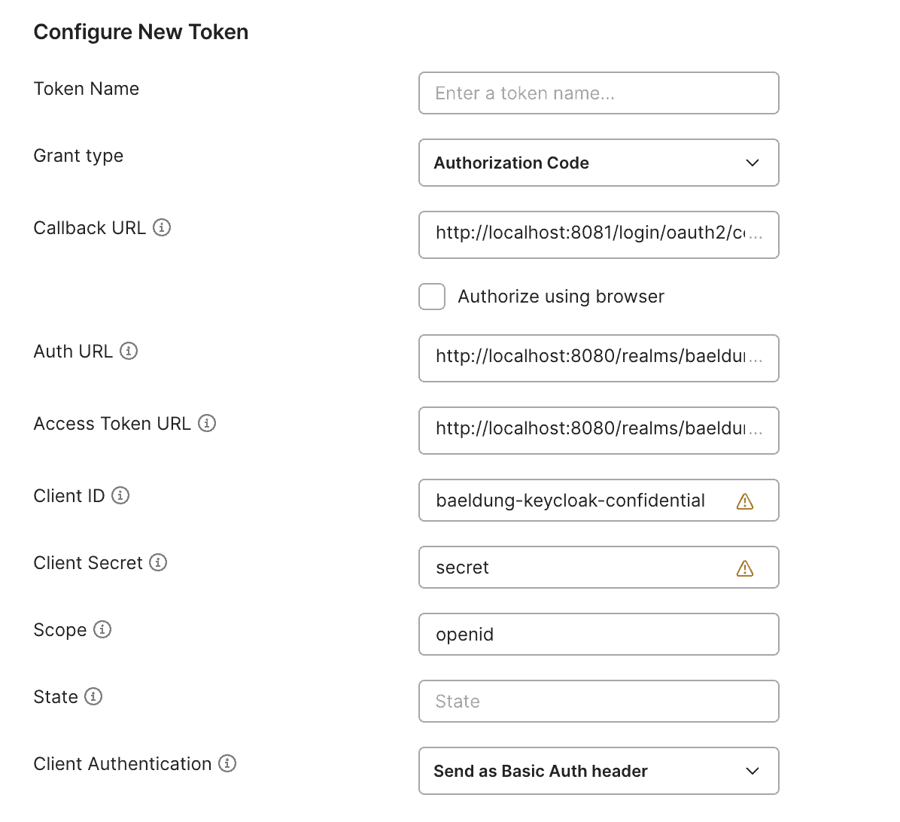

Last, we send a GET request to http://localhost:8082/me. The response should be a JSON payload with our Keycloak login and realm roles:

> Postman get me
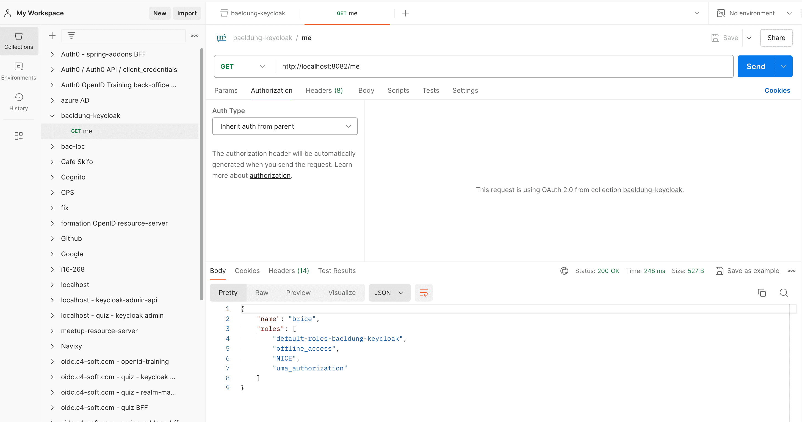

## 6. Creating a Keycloak Realm

In this tutorial, we sandboxed the Keycloak objects in a custom realm that we imported when creating the Docker container. This can be super useful when onboarding new developers in a team or experimenting with alternate configurations.

Let’s detail how these objects were initially created.

### Realm

Let’s navigate to the upper left corner to click the Create Realm button:

> Create realm button
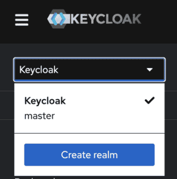

On the next screen, we name the realm baeldung-keycloak:

> Create realm form
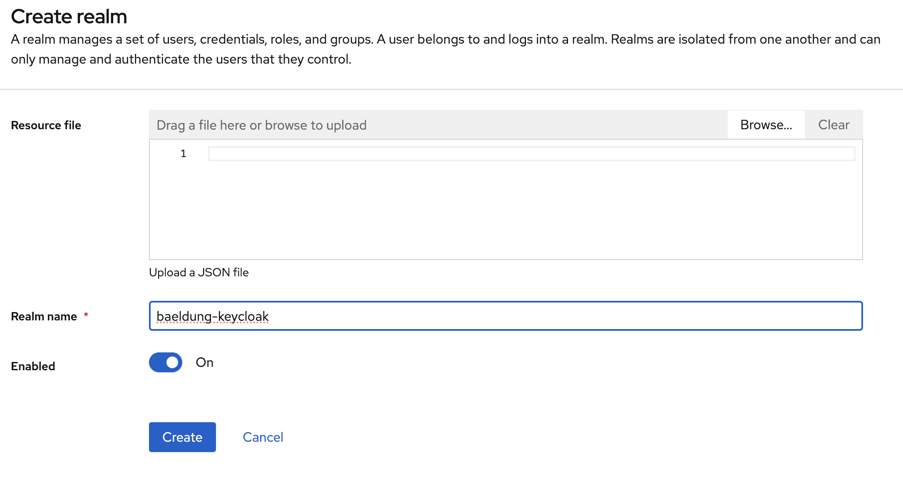

After clicking the Create button, we’re redirected to its details.

All the operations in the next sections will be boxed into this baeldung-keycloak realm.

### Confidential Client to Authenticate Users

Now we’ll navigate to the Clients page where we can create a new client named baeldung-keycloak-confidential:

> Create client 1
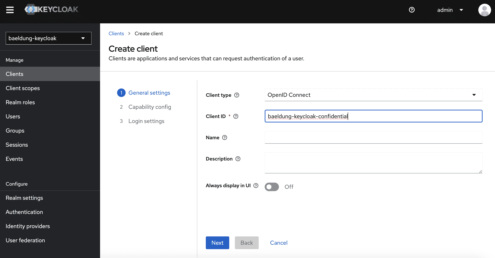

In the next screen, we’ll ensure that Client authentication is enabled – this makes the client “confidential” – and that only Standard flow is checked, which activates the authorization code and refresh token flows:

> Create client 2
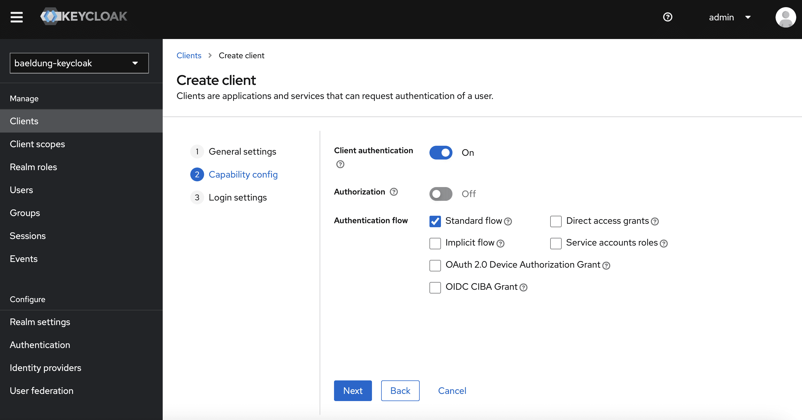

Last, we need to allow redirection URIs and origins for our client:

> Create client 3
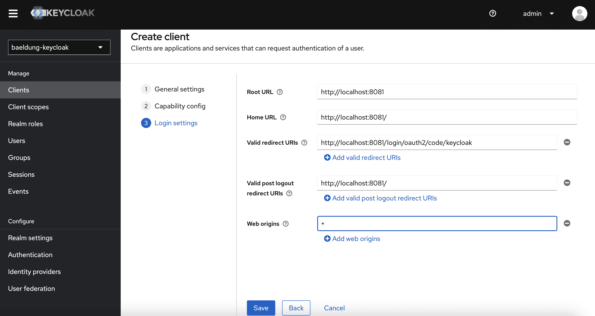

As our Spring Boot client application with oauth2Login is configured to run on port 8081, and with keycloak as registration-id, we set:

* http://localhost:8081/login/oauth2/code/keycloak as Valid redirect URIs.
* http://localhost:8081/ as Valid post-logout URIs (the Thymeleaf index page)
* +as Web origins to allow all origins from the Valid redirect URIs
  
### Configuring Which JSON Payloads Include Realm Roles

To ensure that Keycloak roles are added to the various payloads we use in Spring applications, we:

Navigate to the Client scopes tab in client details:

> Client scopes 1
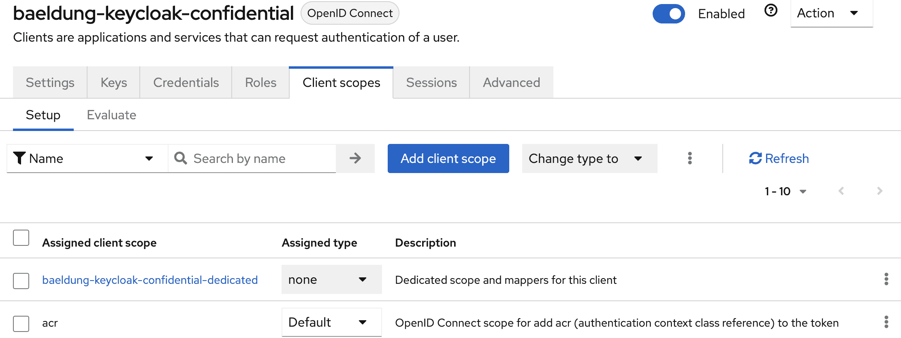

Click baeldung-keycloak-confidential-dedicated scope to access its configuration details:

> Client scope baeldung keycloak confidential dedicated
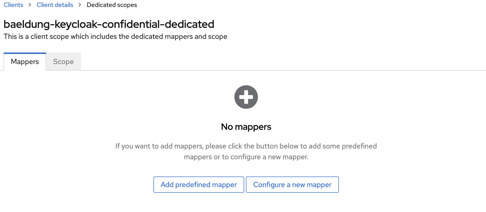

Click the Add predefined mapper button, and select the realm roles mapper:

> Client scope add predefined mapper
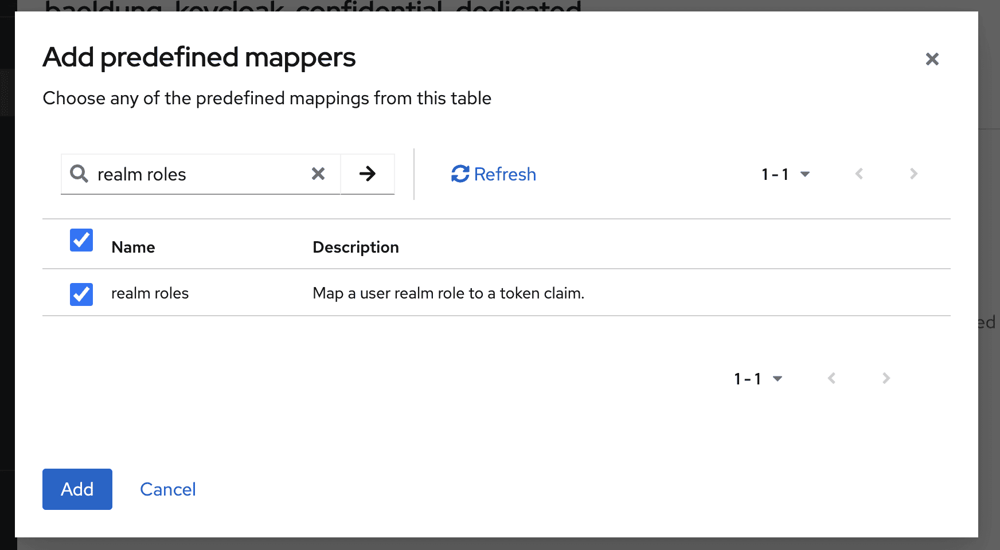

When editing it, we can choose which JSON payloads include realm roles:

1. **access tokens:** for resource servers with JWT decoder
2. **introspection:** for resource servers with token introspection (opaque token in Spring Security wording)
3. **ID tokens:** for clients with oauth2Login and OpenID (using the issuer-uri to auto-configure the provider)
4. **userinfo:** for clients with oauth2Login but without OpenID (issuer-uri left blank and other provider properties set in Spring conf)

Because we implement some Role Based Access Control (RBAC) in both an OpenID client with oauth2Login (a Thymeleaf application) and a resource server with a JWT decoder, we should ensure that realm roles are added to access and ID tokens.

> Client scope configure realm roles mapper
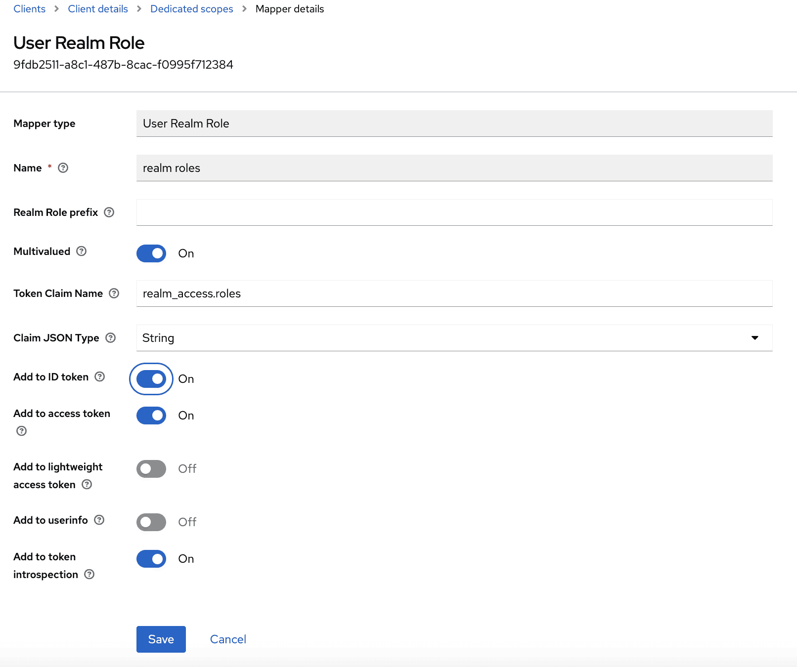

### Realm Role

Within Keycloak, we may define roles, and assign them to users, for the all realm or on a per-client basis. In this tutorial, we focus on realm roles.

Let’s navigate to the Realm roles page:

> Realm roles
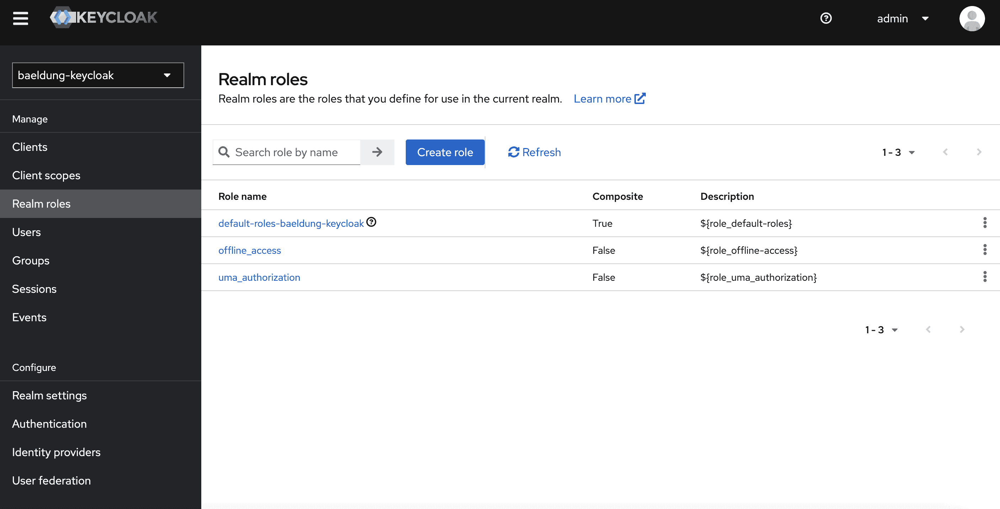

There we create the NICE role:

> Realm role create
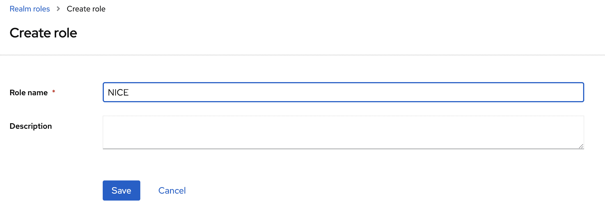

### Users and Realm Roles Assignment

Let’s go to the Users page to add two users (one named brice and granted with the NICE role, and a second one named igor and granted with no realm role):

> Users
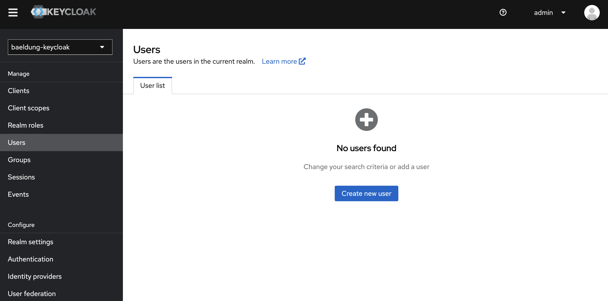

We first create a new user named brice:

> User create
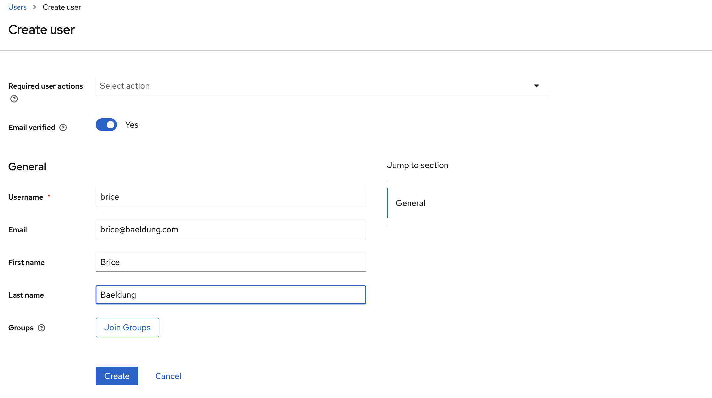

After we click the Create button, we can see user details. We should browse to the credential tab to set its password:

> User credentials
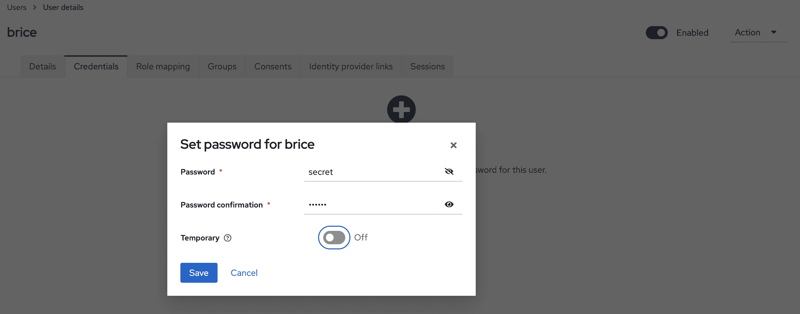

Finally, we navigate to the Role Mappings tab to assign the NICE role (mind the Filter by realm roles drop-down):

> User roles
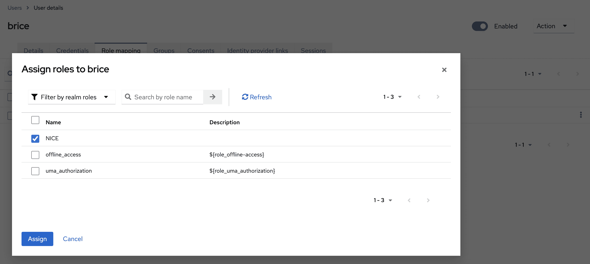

We may repeat the instruction in this section for igor, skipping the role assignment.

### Exporting Realms

After we complete the realm configuration, we can export it with the following commands (in Docker desktop, use the Exec tab for the running container):

`
cd /opt/keycloak/bin/
sh ./kc.sh export --dir /tmp/keycloak/ --users realm_file
`

We can then collect the JSON file for each realm from the Files tab.


---

### 7. Summary

| | Thymeleaf client | REST API |
|---|---|---|
| Spring Security config | `oauth2Login` | `oauth2ResourceServer` |
| Token storage | HTTP session | Stateless (claims in token) |
| Request authorization | Session cookie | Bearer JWT |
| CSRF protection | Required | Disabled |
| Scalability | Needs session sharing | Easy horizontal scale |
| Roles source | ID token claims | Access token claims |
| Port | 8081 | 8082 |

The source code for this article is available over on [GitHub](https://github.com/eugenp/tutorials/tree/master/spring-boot-modules/spring-boot-keycloak).

---