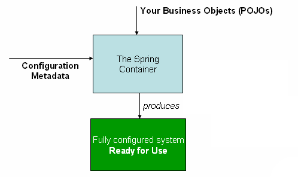

## **Lesson Notes: Spring IoC (Inversion of Control) Container**

### **1. Introduction**

The **Spring IoC Container** is at the heart of the Spring Framework. It manages the creation, configuration, and lifecycle of application objects—known as **beans**.
Instead of classes instantiating their own dependencies using `new`, Spring **injects** dependencies automatically. This approach follows the principle of **Inversion of Control (IoC)**, and a common way to implement IoC is through **Dependency Injection (DI)**.
---

---
Let’s take a simple example:
---

```java
public class MovieShop {
    private final MovieStorage storage;

    // Constructor Injection
    public MovieShop(MovieStorage storage) {
        this.storage = storage;
    }

    public void demo() {
        storage.addMovie("Matrix");
        storage.addMovie("Interstellar");
        storage.editMovie("Matrix", "Matrix Reloaded");
        storage.findMovie("Interstellar");
    }

    public static void main(String[] args) {
        // Without IoC — manual dependency creation
        MovieStorage storage = new ListMovieStorage();
        MovieShop shop = new MovieShop(storage);
        shop.demo();
    }
}
```

Here, `MovieShop` **manually creates** its dependency (`ListMovieStorage`), making the code tightly coupled and difficult to modify later.
Spring IoC container removes this manual wiring.

---

### **2. The Spring IoC Container Overview**

Spring provides two main interfaces for its IoC container:

| Interface              | Description                                                                                                                                      |
| ---------------------- | ------------------------------------------------------------------------------------------------------------------------------------------------ |
| **BeanFactory**        | Basic container providing configuration and dependency management.                                                                               |
| **ApplicationContext** | Extends `BeanFactory` with additional enterprise-level functionality such as event publishing, message sources (for i18n), and resource loading. |

In modern Spring applications, we almost always use **ApplicationContext**.

---

### **3. Defining Beans with Java Configuration**

You can define how Spring should manage your beans using a `@Configuration` class.

#### ✅ Example: Java-Based Configuration

```java
import org.springframework.context.annotation.Bean;
import org.springframework.context.annotation.Configuration;

@Configuration
public class AppConfig {

    // Define the dependency
    @Bean
    public MovieStorage movieStorage() {
        return new ListMovieStorage();
    }

    // Define the main service and inject the dependency
    @Bean
    public MovieShop movieShop() {
        return new MovieShop(movieStorage());
    }
}
```

In this example:

* `@Configuration` tells Spring that this class contains bean definitions.
* `@Bean` marks methods that produce beans to be managed by Spring.
* When the container starts, it creates `MovieStorage` first, then injects it into the `MovieShop` bean.

#### ✅ Running the Application with ApplicationContext

```java
import org.springframework.context.ApplicationContext;
import org.springframework.context.annotation.AnnotationConfigApplicationContext;

public class MovieApp {
    public static void main(String[] args) {
        ApplicationContext context = new AnnotationConfigApplicationContext(AppConfig.class);
        MovieShop shop = context.getBean(MovieShop.class);
        shop.demo();
    }
}
```

Now, **Spring handles dependency creation and injection automatically**.
If we later switch to a database-backed `MovieStorage`, we only modify `AppConfig` — not `MovieShop`.

---

### **4. XML-Based Configuration (Alternative)**

Spring also supports XML configuration for defining beans.
Here’s how you can represent the same setup as XML:

```xml
<?xml version="1.0" encoding="UTF-8"?>
<beans xmlns="http://www.springframework.org/schema/beans"
       xmlns:xsi="http://www.w3.org/2001/XMLSchema-instance"
       xsi:schemaLocation="http://www.springframework.org/schema/beans
                           https://www.springframework.org/schema/beans/spring-beans.xsd">

    <bean id="movieStorage" class="ListMovieStorage"/>

    <bean id="movieShop" class="MovieShop">
        <constructor-arg ref="movieStorage"/>
    </bean>
</beans>
```
**Note:**
```markdown
1.The id attribute is a string that identifies the individual bean definition.
2.The class attribute defines the type of the bean and uses the fully qualified class name.
3.The value of the id attribute can be used to refer to collaborating objects. 
4For instantiating a container, the location path or paths to the XML resource files need to be supplied to a ClassPathXmlApplicationContext constructor that let the container load configuration metadata from a variety of external resources, such as the local file system, the Java CLASSPATH, and so on.
```
Then you load this configuration with:

```java
import org.springframework.context.ApplicationContext;
import org.springframework.context.support.ClassPathXmlApplicationContext;

public class MovieAppXML {
    public static void main(String[] args) {
        ApplicationContext context = new ClassPathXmlApplicationContext("movies.xml");
        MovieShop shop = context.getBean("movieShop", MovieShop.class);
        shop.demo();
    }
}
```

---

### **5. Types of Dependency Injection in Spring**

Using our `MovieShop` and `MovieStorage` example, Spring allows three main injection types.

#### **a. Constructor Injection**

Dependency is passed through the constructor.

```java
@Component
public class MovieShop {
    private final MovieStorage storage;

    @Autowired
    public MovieShop(MovieStorage storage) {
        this.storage = storage;
    }
}
```

This is **recommended** for required dependencies because it ensures immutability and testability.

---

#### **b. Setter Injection**

Dependency is provided through a setter method.

```java
@Component
public class MovieShop {
    private MovieStorage storage;

    @Autowired
    public void setStorage(MovieStorage storage) {
        this.storage = storage;
    }
}
```

Useful for **optional dependencies**.

---

#### **c. Field Injection**

Dependency is injected directly into the field.

```java
@Component
public class MovieShop {
    @Autowired
    private MovieStorage storage;
}
```

It looks simpler, but is **less recommended** due to testability issues and reliance on reflection.

---

### **6. Autowiring Beans Automatically**

Spring can automatically detect and inject beans using `@Autowired`.

```java
@Component
public class ListMovieStorage implements MovieStorage {
    // Implementation of addMovie, editMovie, findMovie...
}

@Component
public class MovieShop {
    private final MovieStorage storage;

    @Autowired
    public MovieShop(MovieStorage storage) {
        this.storage = storage;
    }

    public void demo() { /* same logic as before */ }
}
```

Spring scans the package for components and wires them automatically.

```java
@Configuration
@ComponentScan(basePackages = "org.example.movieshop")
public class AppConfig {}
```

Now the container performs **auto-detection** without explicit bean definitions.

---

### **7. Lazy Initialization**

By default, Spring creates all singleton beans when the container starts.
To delay creation until needed, use `@Lazy`:

```java
@Bean
@Lazy
public MovieStorage movieStorage() {
    return new ListMovieStorage();
}
```

This can improve startup performance for large systems.

---

### **8. Summary**

| Concept                        | Description                                                                                 |
| ------------------------------ | ------------------------------------------------------------------------------------------- |
| **IoC (Inversion of Control)** | Objects delegate dependency creation to a container instead of creating them directly.      |
| **DI (Dependency Injection)**  | A form of IoC that injects required dependencies via constructor, setter, or field.         |
| **Spring IoC Container**       | Manages the lifecycle and wiring of beans defined via configuration metadata (Java or XML). |
| **ApplicationContext**         | The central interface for accessing beans and resources.                                    |
| **@Configuration / @Bean**     | Used to define beans in Java-based configuration.                                           |
| **@Component / @Autowired**    | Used for automatic detection and wiring of beans.                                           |

---
How the **Spring IoC container** wires `MovieShop` and `MovieStorage` together 
---

