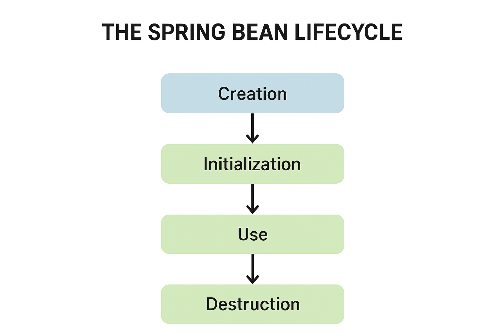

---

# 🧠 Lesson Notes: The Spring Bean Lifecycle

---

## 1️⃣ Overview

When a Spring application runs, the **Spring IoC container** takes full control of the lifecycle of each bean — from creation to destruction.

The **Bean Lifecycle** in Spring includes three main phases:

| Phase              | Description                                                     |
| :----------------- | :-------------------------------------------------------------- |
| **Initialization** | The container loads and prepares beans for use.                 |
| **Use**            | The bean performs its normal business logic.                    |
| **Destruction**    | The container cleans up and releases resources before shutdown. |

In this lesson, we’ll focus on the **initialization** and **destroy** phases — the key points where developers can hook into the lifecycle to run custom logic.

---

## 2️⃣ Bean Lifecycle Phases

The complete lifecycle can be summarized as follows:

1. **Bean Definition Loading** – Spring reads bean definitions (from annotations, XML, or configuration classes).
2. **Bean Instantiation** – Spring creates an instance of the bean.
3. **Dependency Injection** – Spring injects dependencies into the bean.
4. **Initialization Phase** – Custom initialization logic runs.
5. **Use Phase** – The bean is ready and used by the application.
6. **Destruction Phase** – Cleanup logic runs when the container is shutting down.

Let’s explore each stage with examples.

---

## 3️⃣ Initialization Phase

During this phase, Spring prepares beans for use. It:

* Loads bean definitions
* Instantiates each bean
* Injects dependencies
* Executes initialization callbacks

There are several ways to customize initialization.

---

### 🧩 Example 1: Using `@PostConstruct`

The `@PostConstruct` annotation marks a method to be called **immediately after dependency injection** and before the bean is ready for use.

```java
import jakarta.annotation.PostConstruct;
import org.springframework.stereotype.Component;

@Component
public class BeanA {

    @PostConstruct
    public void post() {
        System.out.println("@PostConstruct: BeanA has been initialized.");
    }

    public void doSomething() {
        System.out.println("BeanA is doing some work.");
    }
}
```

**Explanation:**

* The method `post()` runs **once** just after Spring finishes injecting dependencies.
* The method cannot be static and should ideally have no parameters.

**Output (on startup):**

```
@PostConstruct: BeanA has been initialized.
```

---

### 🧩 Example 2: Using `@Bean(initMethod = "methodName")`

When defining beans via Java configuration, we can specify a **custom initialization method** that Spring should call.

```java
public class BeanB {
    public void initialize() {
        System.out.println("Custom initializer is called for BeanB.");
    }
}

@Configuration
public class AppConfig {

    @Bean(initMethod = "initialize")
    public BeanB beanB() {
        return new BeanB();
    }
}
```

**Explanation:**

* The `initMethod` property lets us name any public method to run after initialization.
* Unlike `@PostConstruct`, this keeps our domain class **free from framework-specific annotations.**

---

### 🔍 When to Use Which

| Approach         | Where It’s Defined        | Framework-Dependent | Recommended For                      |
| ---------------- | ------------------------- | ------------------- | ------------------------------------ |
| `@PostConstruct` | Inside the bean class     | Yes                 | Quick setup or initialization logic  |
| `initMethod`     | In `@Configuration` class | No                  | Reusable or framework-agnostic beans |

---

## 4️⃣ The Use Phase

After initialization, the bean enters the **use phase**, where the application runs its main business logic.
For example:

```java
@Bean
public MovieShop movieShop() {
    return new MovieShop(new ListMovieStorage());
}
```

Here, the `MovieShop` bean lives in memory and is used throughout the application until shutdown.
This phase typically lasts the longest and isn’t explicitly controlled by developers — it’s where your application’s core functionality happens.

---

## 5️⃣ Destroy Phase

When the application context is closed, Spring triggers the **destroy phase**.
This is when you should release resources, close database connections, or clean up temporary files.

There are two main ways to do this.

---

### 🧩 Example 1: Using `@PreDestroy`

The `@PreDestroy` annotation marks a method that runs just before a bean is removed from the container.

```java
import jakarta.annotation.PreDestroy;
import org.springframework.stereotype.Component;

@Component
public class BeanC {

    @PreDestroy
    public void preDestroy() {
        System.out.println("@PreDestroy: BeanC is about to be destroyed.");
    }

    public void destroy() {
        System.out.println("Custom destroy method called.");
    }
}
```

To ensure this method runs, you must close the application context manually in non-Spring Boot apps:

```java
ConfigurableApplicationContext context =
    SpringApplication.run(AppConfig.class, args);
context.close(); // triggers destroy phase
```

---

### 🧩 Example 2: Using `@Bean(destroyMethod = "methodName")`

```java
public class BeanC {
    public void destroy() {
        System.out.println("Custom destroy method is called.");
    }
}

@Configuration
public class AppConfig {

    @Bean(destroyMethod = "destroy")
    public BeanC beanC() {
        return new BeanC();
    }
}
```

**Explanation:**

* The `destroyMethod` attribute tells Spring which method to invoke before removing the bean.
* This approach avoids annotation dependencies — ideal for plain Java objects.

---

## 6️⃣ @PostConstruct and @PreDestroy: Jakarta vs. Javax Packages

Since **Spring 6+** and **Spring Boot 3+**, the annotations have moved from `javax.annotation` to `jakarta.annotation`.

| Spring Version | JDK Compatibility | Annotation Package   |
| -------------- | ----------------- | -------------------- |
| 6.0.x – 6.1.x  | JDK 17–23         | `jakarta.annotation` |
| 5.3.x          | JDK 8–21          | `javax.annotation`   |

If you’re using an older Spring version, add this dependency to your `pom.xml`:

```xml
<dependency>
    <groupId>javax.annotation</groupId>
    <artifactId>javax.annotation-api</artifactId>
    <version>1.3.2</version>
</dependency>
```

---

## 7️⃣ Complete Example – Demonstrating the Lifecycle

```java
import jakarta.annotation.PostConstruct;
import jakarta.annotation.PreDestroy;
import org.springframework.context.annotation.*;

@Configuration
@ComponentScan("com.example.lifecycle")
public class AppConfig { }

@Component
class LifecycleBean {

    @PostConstruct
    public void onInit() {
        System.out.println("1️⃣ @PostConstruct: Bean initialized");
    }

    public void performTask() {
        System.out.println("2️⃣ Bean is performing its task");
    }

    @PreDestroy
    public void onDestroy() {
        System.out.println("3️⃣ @PreDestroy: Bean about to be destroyed");
    }
}

public class MainApp {
    public static void main(String[] args) {
        ConfigurableApplicationContext context =
            new AnnotationConfigApplicationContext(AppConfig.class);

        LifecycleBean bean = context.getBean(LifecycleBean.class);
        bean.performTask();

        context.close(); // triggers @PreDestroy
    }
}
```

**Output:**

```
1️⃣ @PostConstruct: Bean initialized
2️⃣ Bean is performing its task
3️⃣ @PreDestroy: Bean about to be destroyed
```

---

## 8️⃣ Summary Table

| Lifecycle Phase    | Spring Hook                  | Description                        | Example                                |
| ------------------ | ---------------------------- | ---------------------------------- | -------------------------------------- |
| **Initialization** | `@PostConstruct`             | Runs after bean properties are set | Database initialization, logging setup |
| **Initialization** | `@Bean(initMethod="...")`    | Calls a specified init method      | Externalizing setup logic              |
| **Destruction**    | `@PreDestroy`                | Runs before bean destruction       | Resource cleanup                       |
| **Destruction**    | `@Bean(destroyMethod="...")` | Custom destroy method              | Closing connections, flushing caches   |

---

## 9️⃣ Key Takeaways

* **@PostConstruct** and **@PreDestroy** let you hook into bean startup and shutdown.
* `initMethod` and `destroyMethod` are framework-agnostic ways to manage lifecycle events.
* Beans live inside the Spring container — once the context closes, all managed beans are destroyed.
* In **Spring Boot 3+**, always use the **Jakarta annotations** (`jakarta.annotation`).
* Proper lifecycle management ensures better resource handling and stability.

---

---
**The flow of the Spring Bean Lifecycle**
---



