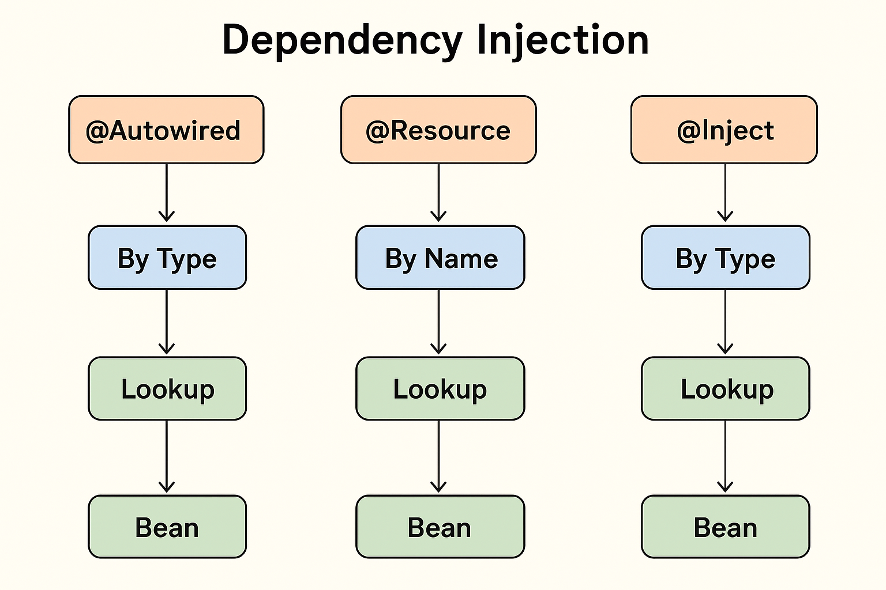

---

# 🌱 **Lesson Notes: Spring Wiring via `@Resource` and `@Inject`**

---

## 🧩 **2.1. Introduction to Wiring Annotations**

Spring provides several annotations to perform **dependency injection (DI)** — the process of letting the **Spring container** automatically provide the required dependencies to your classes.

So far, we’ve used the common `@Autowired` annotation.
However, Spring also supports **two additional standard Java EE annotations**:

* `@Resource` — from **JSR-250** (Jakarta EE)
* `@Inject` — from **JSR-330**

These annotations allow developers to write **framework-independent** DI code that can run both inside and outside of Spring (for example, in Jakarta EE environments).

Spring fully recognizes and processes both annotations, treating them equivalently to its own dependency injection mechanism.

---

## 🧠 **2.2. The `@Resource` Annotation (JSR-250)**

The `@Resource` annotation performs **dependency injection by name**.
It comes from the `jakarta.annotation.Resource` package and is commonly used in Java EE technologies like **JAX-WS** and **JSF**, but Spring also supports it.

### ✅ Key Characteristics

| Feature               | Description                                                       |
| --------------------- | ----------------------------------------------------------------- |
| Source                | JSR-250 (`jakarta.annotation.Resource`)                           |
| Injection Type        | By **name** (default)                                             |
| Applicable To         | Fields and setter methods                                         |
| Constructor Injection | ❌ Not supported                                                   |
| Default Behavior      | Matches the bean by name; if none found, falls back to type match |

---

### 🧱 Example 1 — Setter Injection using `@Resource`

```java
@Service
public class ProjectServiceResourceImpl implements IProjectService {

    private static final Logger LOG = LoggerFactory.getLogger(ProjectServiceResourceImpl.class);

    private IProjectRepository projectRepository;

    @Resource
    public void setProjectRepository(IProjectRepository projectRepository) {
        this.projectRepository = projectRepository;
        LOG.info("wired projectRepository instance: {}", projectRepository);
    }
}
```

✅ **Explanation:**

* The `@Resource` annotation on the setter method tells Spring to inject a bean named **“projectRepository”**.
* If such a bean is not found, Spring searches for a bean of matching **type**.
* Since `@Resource` injects **by name first**, make sure your bean name matches the field or method name.

---

### 🧱 Example 2 — Specifying Bean Name Explicitly

If multiple beans of the same type exist, you can avoid ambiguity by specifying the bean name explicitly:

```java
@Resource(name = "projectRepositoryImpl")
public void setProjectRepository(IProjectRepository projectRepository) {
    this.projectRepository = projectRepository;
    LOG.info("wired projectRepository instance: {}", projectRepository);
}
```

✅ Here, Spring will specifically look for a bean with the name **`projectRepositoryImpl`**.

---

### 🧠 How it Works Internally

1. Spring scans for `@Resource` annotations via the `CommonAnnotationBeanPostProcessor`.
2. It tries to inject the dependency **by name**.
3. If no bean with that name exists, it falls back to **type-based injection**.
4. If multiple candidates exist, an exception is thrown due to ambiguity.

---

### 🧱 Example 3 — Field Injection

```java
@Component
public class MovieRecommender {

    @Resource
    private CustomerPreferenceDao customerPreferenceDao;

    @Resource
    private ApplicationContext context;

    public void recommendMovies() {
        System.out.println("Using DAO: " + customerPreferenceDao);
        System.out.println("ApplicationContext ID: " + context.getId());
    }
}
```

✅ The `customerPreferenceDao` is injected **by name**,
while `context` is injected automatically because it’s a known Spring **resolvable dependency** (like `ApplicationContext`, `BeanFactory`, etc.).

---

## 💡 **2.3. The `@Inject` Annotation (JSR-330)**

The `@Inject` annotation provides **type-based** injection, very similar to Spring’s `@Autowired`.
It comes from **JSR-330** and is located in the package `jakarta.inject.Inject`.

It supports:

* Constructor injection ✅
* Field injection ✅
* Method injection ✅

Unlike `@Autowired`, `@Inject` **does not** have a `required` attribute, so if a dependency is missing, an exception will be thrown unless you use `Optional` or `@Nullable`.

---

### ⚙️ **Adding the Dependency**

To use `@Inject`, include the following in your `pom.xml`:

```xml
<dependency>
    <groupId>jakarta.inject</groupId>
    <artifactId>jakarta.inject-api</artifactId>
    <version>2.0.0</version>
</dependency>
```

---

### 🧱 Example 1 — Constructor Injection using `@Inject`

```java
@Service
public class ProjectServiceInjectImpl implements IProjectService {

    private static final Logger LOG = LoggerFactory.getLogger(ProjectServiceInjectImpl.class);
    private final IProjectRepository projectRepository;

    @Inject
    public ProjectServiceInjectImpl(IProjectRepository projectRepository) {
        this.projectRepository = projectRepository;
        LOG.info("wired projectRepository instance: {}", projectRepository);
    }
}
```

✅ **Explanation:**

* The `@Inject` annotation marks the constructor for dependency injection.
* Spring automatically finds a compatible `IProjectRepository` bean and injects it.

---

### 🧱 Example 2 — Field Injection

```java
@Component
public class SimpleMovieLister {

    @Inject
    private MovieFinder movieFinder;

    public void listMovies() {
        movieFinder.findMovies();
    }
}
```

This works just like `@Autowired`.

---

### 🧱 Example 3 — Setter Injection

```java
@Component
public class SimpleMovieLister {

    private MovieFinder movieFinder;

    @Inject
    public void setMovieFinder(MovieFinder movieFinder) {
        this.movieFinder = movieFinder;
    }
}
```

---

### 🧱 Example 4 — Using `@Named` to Resolve Ambiguity

If multiple beans of the same type exist, use `@Named` (the JSR-330 equivalent of Spring’s `@Qualifier`):

```java
@Inject
@Named("projectRepositoryImpl")
private IProjectRepository projectRepository;
```

✅ This ensures that Spring injects the correct bean based on the provided name.

---

### 🧱 Example 5 — Using `Provider<T>` for Lazy Injection

`@Inject` can be combined with `Provider<T>` to perform **on-demand** or **lazy** dependency resolution.

```java
import jakarta.inject.Inject;
import jakarta.inject.Provider;

@Component
public class SimpleMovieLister {

    @Inject
    private Provider<MovieFinder> movieFinder;

    public void listMovies() {
        movieFinder.get().findMovies(); // Bean instantiated only when get() is called
    }
}
```

✅ `Provider.get()` allows you to request a bean instance only when needed — useful for expensive or prototype-scoped beans.

---

### 🧱 Example 6 — Optional or Nullable Injection

Since `@Inject` doesn’t have a `required` flag, you can handle optional dependencies using `Optional` or `@Nullable`:

```java
@Inject
public void setMovieFinder(Optional<MovieFinder> movieFinder) {
    movieFinder.ifPresent(MovieFinder::findMovies);
}
```

or

```java
@Inject
public void setMovieFinder(@Nullable MovieFinder movieFinder) {
    if (movieFinder != null) {
        movieFinder.findMovies();
    }
}
```

---

## 🧠 **2.4. `@Named` and `@ManagedBean`: Standard Equivalents of `@Component`**

Instead of using Spring’s `@Component`, you can use:

* `@Named` (from `jakarta.inject.Named`)
* `@ManagedBean` (from `jakarta.annotation.ManagedBean`)

### Example:

```java
import jakarta.inject.Named;

@Named("movieLister") // Same as @Component("movieLister")
public class SimpleMovieLister {

    @Inject
    private MovieFinder movieFinder;

    public void listMovies() {
        movieFinder.findMovies();
    }
}
```

If you omit the name, Spring automatically assigns the default name based on the class name (like `simpleMovieLister`).

---

## ⚙️ **2.5. Component Scanning for Standard Annotations**

Spring can also detect and register beans annotated with `@Named` or `@ManagedBean` using component scanning:

```java
@Configuration
@ComponentScan(basePackages = "org.example")
public class AppConfig {
    // ...
}
```

✅ These annotations are treated just like `@Component` by the Spring container.

---

## ⚠️ **2.6. Limitations of JSR-250 and JSR-330 Annotations**

| Spring Annotation     | JSR Equivalent           | Limitations                                                            |
| --------------------- | ------------------------ | ---------------------------------------------------------------------- |
| `@Autowired`          | `@Inject`                | No `required` attribute; use `Optional` or `@Nullable` instead.        |
| `@Component`          | `@Named`, `@ManagedBean` | No composable model (cannot create meta-annotations).                  |
| `@Scope("singleton")` | `@Singleton`             | JSR default is *prototype*; Spring enforces singleton for consistency. |
| `@Qualifier`          | `@Named` or `@Qualifier` | Only supports String-based qualifiers.                                 |
| `@Value`              | —                        | No equivalent in JSR-330.                                              |
| `@Lazy`               | —                        | No equivalent in JSR-330.                                              |
| `ObjectFactory`       | `Provider`               | Equivalent, but shorter method name (`get()`).                         |

---

## 🧩 **2.7. Summary Comparison**

| Feature                         | `@Autowired` (Spring)        | `@Resource` (JSR-250) | `@Inject` (JSR-330) |
| ------------------------------- | ---------------------------- | --------------------- | ------------------- |
| Injection Type                  | By **type** (default)        | By **name** (default) | By **type**         |
| Supports Constructor Injection  | ✅ Yes                        | ❌ No                  | ✅ Yes               |
| Supports Field/Setter Injection | ✅ Yes                        | ✅ Yes                 | ✅ Yes               |
| Requires Spring?                | ✅ Yes                        | ❌ No                  | ❌ No                |
| Fallback Strategy               | By type if not found by name | By type               | By type             |
| Equivalent Qualifier            | `@Qualifier`                 | `name` attribute      | `@Named`            |

---

## 💡 **2.8. Practical Example Summary**

### 🧱 Example — `@Resource` Wiring

```java
@Resource(name = "projectRepositoryImpl")
private IProjectRepository projectRepository;
```

### 🧱 Example — `@Inject` Wiring

```java
@Inject
@Named("projectRepositoryImpl")
private IProjectRepository projectRepository;
```

Both achieve the same goal — injecting dependencies into Spring-managed beans,
but through different Java specifications (JSR-250 and JSR-330).

---

## ✅ **2.9. Key Takeaways**

* `@Resource` injects **by name**, defined by JSR-250.
* `@Inject` injects **by type**, defined by JSR-330 (same as `@Autowired`).
* Both can be used interchangeably in Spring-managed beans.
* Use `@Named` to resolve ambiguity when multiple beans of the same type exist.
* `@Inject` is framework-neutral — ideal when you want DI code compatible with both **Spring** and **Jakarta EE** environments.

---

## ** How Spring processes `@Autowired`, `@Resource`, and `@Inject` during dependency injection 

