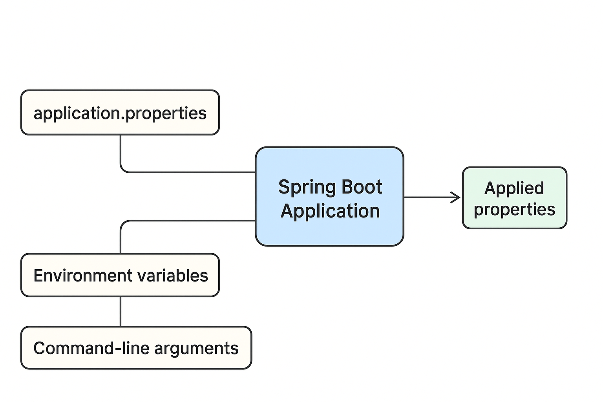

---

## 🧭 Lesson 7: Spring Boot Default Properties

### **Lesson Objectives**

By the end of this lesson, learners should be able to:

1. Understand what Spring Boot default properties are and why they exist.
2. Identify where and how to define custom properties in Spring Boot.
3. Modify key default configurations such as the server port and startup banner.
4. Access property metadata and documentation for customization.

---

## **2.1. Spring Boot and Application Properties**

Spring Boot allows developers to configure applications **externally** through property files, command-line arguments, or environment variables — without modifying the Java code.

The **`application.properties`** (or **`application.yml`**) file, typically located in:

```
src/main/resources/
```

is the central location where most custom configurations are defined.

**Key purpose:**

* To provide flexibility between environments (development, testing, production).
* To override **Spring Boot’s default behavior** without changing the source code.

Spring Boot follows the principle of **convention over configuration**, meaning it provides reasonable defaults so developers can start quickly and only override what’s necessary.

---

## **2.2. Default Boot Properties: Port Number**

By default, when we start a Spring Boot web application, it runs an **embedded Tomcat server** on port **8080**.

### ✅ Example: Default Behavior

Run the application and observe in the console:

```
[main] o.s.b.w.embedded.tomcat.TomcatWebServer : Tomcat initialized with port(s): 8080 (http)
```

This confirms that the server runs on port 8080, even though we didn’t specify it anywhere.

---

### 🧩 Customizing the Port Number

To override this default, open `src/main/resources/application.properties` and define:

```properties
server.port=8081
```

Restart the application, and now the console shows:

```
[main] o.s.b.w.embedded.tomcat.TomcatWebServer : Tomcat initialized with port(s): 8081 (http)
```

---

### 🧠 Explanation

Spring Boot automatically maps this property to the internal configuration of the embedded Tomcat server.
This property comes from the **Server Properties** section of the official documentation called **Common Application Properties**.

It defines:

* **Property name:** `server.port`
* **Default value:** `8080`
* **Description:** Port where the embedded web server listens.

---

## **2.3. Default Boot Properties: The Banner**

When starting a Spring Boot application, you’ll notice an ASCII art banner in the console:

```
  .   ____          _            __ _ _
 /\\ / ___'_ __ _ _(_)_ __  __ _ \ \ \ \
( ( )\___ | '_ | '_| | '_ \/ _` | \ \ \ \
 \\/  ___)| |_)| | | | | || (_| |  ) ) ) )
  '  |____| .__|_| |_|_| |_\__, | / / / /
 =========|_|==============|___/=/_/_/_/
 :: Spring Boot ::               (v3.x.x)
```

This is Spring Boot’s startup **banner**, showing the framework version and confirming the application started successfully.

---

### 🧩 Customizing or Disabling the Banner

To **disable** the banner, add this line to `application.properties`:

```properties
spring.main.banner-mode=off
```

Restart the app — the banner disappears.

Alternatively, you can **replace it with a custom banner**:

1. Create a file named `banner.txt` inside `src/main/resources`.
2. Add your custom text or ASCII art, e.g.:

```
Welcome to My Custom Spring Boot Application!
```

Spring Boot will automatically detect and display it at startup.

---

## **2.4. Boot Default Properties’ Metadata**

Spring Boot’s default properties include **metadata** that helps IDEs provide features like:

* **Auto-completion** for property names
* **Property descriptions** and default values
* **Suggestions** for allowed values

For example, in Spring Tool Suite (STS) or IntelliJ IDEA, typing:

```
server.
```

...automatically shows suggestions like:

* `server.port`
* `server.address`
* `server.servlet.context-path`

### 🧩 Benefit

This makes configuration faster and less error-prone since you don’t need to memorize property names.

---

## **2.5. Common Application Properties**

Spring Boot provides an extensive list of configurable properties — documented in the **Common Application Properties** reference guide.

This official document includes:

* Property names
* Default values
* Description and expected types
* Grouped sections such as:

    * **Server** (e.g., `server.port`, `server.servlet.context-path`)
    * **Spring Data** (e.g., `spring.datasource.url`)
    * **Logging** (e.g., `logging.level.org.springframework`)
    * **Security** (e.g., `spring.security.user.name`)
    * **Mail**, **Actuator**, **Web**, and more

📘 **Reference:**
[Spring Boot Common Application Properties (Official Docs)](https://docs.spring.io/spring-boot/docs/current/reference/html/application-properties.html)

---

## **2.6. Example: Multiple Property Overrides**

You can define multiple properties in one file:

```properties
server.port=9090
spring.main.banner-mode=off
spring.datasource.url=jdbc:mysql://localhost:3306/mydb
spring.datasource.username=root
spring.datasource.password=pass123
logging.level.org.springframework=INFO
```

This file demonstrates:

* Changing the server port
* Disabling the banner
* Setting up database connection properties
* Adjusting the logging level

---

## **2.7. Using YAML Instead of Properties**

You can use `application.yml` as an alternative format.
YAML supports hierarchical configuration, making it more readable:

```yaml
server:
  port: 8082

spring:
  main:
    banner-mode: off
  datasource:
    url: jdbc:mysql://localhost:3306/mydb
    username: root
    password: pass123
```

Spring Boot automatically detects whether the configuration file is `.properties` or `.yml`.

---

## **2.8. Summary Table**

| **Feature**          | **Property**                  | **Default** | **Example Value** | **Purpose**                   |
| -------------------- | ----------------------------- | ----------- | ----------------- | ----------------------------- |
| Server Port          | `server.port`                 | 8080        | 8081              | Changes web server port       |
| Banner Mode          | `spring.main.banner-mode`     | console     | off               | Disables or customizes banner |
| Data Source URL      | `spring.datasource.url`       | none        | jdbc:mysql://...  | Configures database URL       |
| Logging Level        | `logging.level.<package>`     | INFO        | DEBUG             | Sets logging verbosity        |
| Servlet Context Path | `server.servlet.context-path` | `/`         | `/app`            | Changes base URL context path |

---

## **2.9. Key Takeaways**

* Spring Boot automatically provides **default values** for many settings.
* Developers can override these defaults in `application.properties` or `application.yml`.
* Property metadata helps IDEs with autocompletion and validation.
* The **Common Application Properties** documentation is the primary reference for available settings.
* Configuration files allow easy customization across environments — **without changing code**.

---

## **Sample Exercise**

1. Create a Spring Boot project using Spring Initializr.
2. In `application.properties`:

   ```properties
   server.port=8085
   spring.main.banner-mode=off
   logging.level.org.springframework.web=DEBUG
   ```
3. Run the app and verify:

    * Port changed to 8085
    * Banner hidden
    * Logs now show detailed web info

---

How Spring Boot reads and applies default and custom properties (from `application.properties`, environment variables, and command-line arguments)

