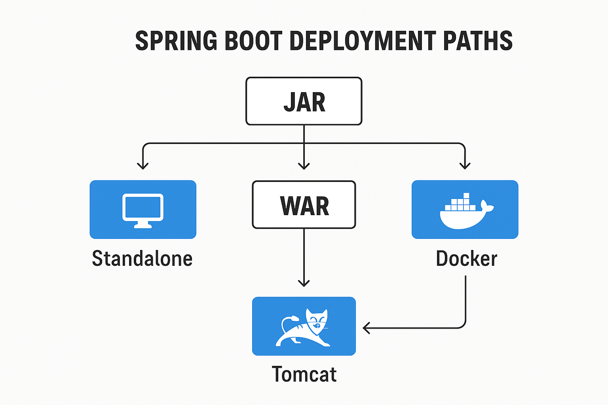

---

# 🌱 **Lesson Notes: Deploying the Spring Boot Application**

---

## **1. Introduction**

**Spring Boot** is a *convention-over-configuration* framework that allows developers to create **production-ready Spring applications** with minimal setup. It provides **auto-configuration**, **embedded servers**, and **ready-to-use defaults** to simplify Java web development.

### **Why Deploy a Spring Boot Application?**

By default, Spring Boot builds a **standalone Java application** — it can:

* Run as a **desktop or background service**
* Include an **embedded web server** like Tomcat, Jetty, or Undertow
* Be executed simply using `java -jar app.jar`

However, in enterprise environments, deployment might need to occur on:

* **Managed servlet containers** (like Apache Tomcat)
* **Cloud platforms** (like AWS, Azure, or Heroku)
* **Container systems** (like Docker or Kubernetes)

---

## **2. Setting up a Spring Boot Application**

Before deployment, let’s create a simple **Spring Boot Web Application**.

### **Step 1 — Maven Setup**

Add the following to your `pom.xml`:

```xml
<parent>
    <groupId>org.springframework.boot</groupId>
    <artifactId>spring-boot-starter-parent</artifactId> 
    <version>3.1.5</version> 
    <relativePath/> 
</parent> 

<dependencies>
    <dependency> 
        <groupId>org.springframework.boot</groupId> 
        <artifactId>spring-boot-starter-web</artifactId> 
    </dependency> 
</dependencies>
```

This configuration includes:

* The **Spring Boot parent POM** (provides dependency management)
* The **Web Starter** (includes Spring MVC and an embedded Tomcat server)

---

### **Step 2 — Create a REST Controller**

Create a simple REST endpoint:

```java
@RestController
public class TomcatController {

    @GetMapping("/hello")
    public Collection<String> sayHello() {
        return IntStream.range(0, 10)
          .mapToObj(i -> "Hello number " + i)
          .collect(Collectors.toList());
    }
}
```

Now, run:

```bash
mvn spring-boot:run
```

Visit: **[http://localhost:8080/hello](http://localhost:8080/hello)**

✅ You should see a JSON response:

```json
["Hello number 0", "Hello number 1", ..., "Hello number 9"]
```

---

## **3. Creating a Spring Boot WAR for Tomcat Deployment**

By default, Spring Boot builds a **JAR** file for standalone execution.
However, when deploying to an external Tomcat, we must build a **WAR** file.

### **Step 1 — Change Packaging**

In your `pom.xml`:

```xml
<packaging>war</packaging>
```

### **Step 2 — Rename the Final WAR**

```xml
<build>
    <finalName>${artifactId}</finalName>
</build>
```

### **Step 3 — Add Tomcat Dependency**

Mark Tomcat as *provided* since the external server already supplies it:

```xml
<dependency>
   <groupId>org.springframework.boot</groupId>
   <artifactId>spring-boot-starter-tomcat</artifactId>
   <scope>provided</scope>
</dependency>
```

### **Step 4 — Extend SpringBootServletInitializer**

```java
@SpringBootApplication
public class SpringBootTomcatApplication extends SpringBootServletInitializer {
}
```

### **Step 5 — Build the WAR**

Run:

```bash
mvn clean package
```

Output:

```
target/spring-boot-deployment.war
```

---

## **4. Deploying the WAR to Apache Tomcat**

To deploy the WAR file to **Tomcat**:

1. Download and extract [Apache Tomcat](https://tomcat.apache.org/).
2. Copy the WAR file:

   ```
   target/spring-boot-deployment.war → tomcat/webapps/
   ```
3. Start Tomcat:

    * Windows: `catalina.bat run`
    * macOS/Linux: `./catalina.sh run`
4. Open the browser and go to:

   ```
   http://localhost:8080/spring-boot-deployment/hello
   ```

✅ You should see the same REST response as before.

> 🧠 Note:
> This setup makes your Spring Boot app a **non-standalone web application**.
> To revert to a self-contained executable JAR, remove the `provided` scope from the Tomcat dependency.

---

## **5. The Spring Boot Maven Plugin**

The **Spring Boot Maven Plugin** simplifies building, packaging, and running your app.

### **Basic Configuration**

```xml
<build>
    <plugins>
        <plugin>
            <groupId>org.springframework.boot</groupId>
            <artifactId>spring-boot-maven-plugin</artifactId>
        </plugin>
    </plugins>
</build>
```

### **Run Your App**

```bash
mvn spring-boot:run
```

### **Package Executable JAR**

```bash
mvn package
```

Run it:

```bash
java -jar target/myapp.jar
```

---

## **6. Deploying the Boot Application to the Cloud**

Spring Boot applications can be deployed seamlessly to multiple **cloud platforms**, including **Cloud Foundry**, **Kubernetes**, **Heroku**, **AWS**, **Azure**, and **Google Cloud**.

---

### **6.1. Deploying to Cloud Foundry**

Cloud Foundry automatically detects Spring Boot apps using a **Java buildpack**.

**Steps:**

1. Build your app:

   ```bash
   mvn clean package
   ```
2. Deploy using the `cf` CLI:

   ```bash
   cf push myapp -p target/demo-0.0.1-SNAPSHOT.jar
   ```
3. Check status:

   ```bash
   cf apps
   ```

   Example output:

   ```
   name          state     instances   memory   urls
   myapp         started   1/1         512M     myapp.cfapps.io
   ```

Cloud Foundry injects environment variables like `VCAP_SERVICES`, which Spring Boot can access via:

```java
@Component
public class MyBean implements EnvironmentAware {
    @Override
    public void setEnvironment(Environment env) {
        System.out.println(env.getProperty("vcap.application.instance_id"));
    }
}
```

---

### **6.2. Deploying to Kubernetes**

Spring Boot detects Kubernetes environments automatically using the presence of environment variables such as:

```
*_SERVICE_HOST
*_SERVICE_PORT
```

You can configure **graceful shutdown** behavior in the pod spec:

```yaml
spec:
  containers:
  - name: example-container
    image: example-image
    lifecycle:
      preStop:
        exec:
          command: ["sh", "-c", "sleep 10"]
```

This ensures in-flight requests complete before shutdown.

---

### **6.3. Deploying to Heroku**

Heroku uses a **Procfile** to define how the app starts.

**Procfile:**

```
web: java -Dserver.port=$PORT -jar target/demo-0.0.1-SNAPSHOT.jar
```

**Deployment:**

```bash
git push heroku main
```

Heroku automatically:

* Detects your Java app
* Installs JDK + Maven
* Builds and runs your application
* Makes it accessible at a public URL (e.g., [https://myapp.herokuapp.com](https://myapp.herokuapp.com))

---

### **6.4. Deploying to AWS Elastic Beanstalk**

AWS Elastic Beanstalk supports both **WAR** and **JAR** deployments.

**Option 1 — WAR File:**
Deploy directly using Tomcat platform.

**Option 2 — JAR File (Java SE Platform):**
Set the port in `application.properties`:

```properties
server.port=5000
```

To upload binaries instead of source:

```yaml
deploy:
  artifact: target/demo-0.0.1-SNAPSHOT.jar
```

For a single instance (to save costs):

```bash
eb create -s
```

---

### **6.5. Deploying to Azure**

You can deploy to:

* **Azure Spring Cloud**
* **Azure App Service**

Both platforms natively support Spring Boot applications packaged as JARs or WARs.

---

### **6.6. Deploying to Google Cloud**

Google Cloud supports Spring Boot via **App Engine** or **Compute Engine**.

**App Engine Flexible Example (`app.yaml`):**

```yaml
service: "default"
runtime: "java17"
env: "flex"

handlers:
- url: "/.*"
  script: "this field is required, but ignored"
```

**Deploy using Maven Plugin:**

```xml
<plugin>
	<groupId>com.google.cloud.tools</groupId>
	<artifactId>appengine-maven-plugin</artifactId>
	<version>2.4.4</version>
	<configuration>
		<project>myproject</project>
	</configuration>
</plugin>
```

Run:

```bash
mvn appengine:deploy
```

---

## **7. Conclusion**

In this lesson, you learned to:

* Build and package Spring Boot applications as **JAR** or **WAR**.
* Deploy applications to **Tomcat**, **Cloud Foundry**, **Heroku**, **AWS**, **Azure**, and **Google Cloud**.
* Configure runtime arguments, profiles, and debugging.
* Use the **Spring Boot Maven Plugin** for efficient builds and deployments.

✅ **Key Takeaway:**

> Spring Boot’s flexibility allows deployment across nearly any platform — from local servers to enterprise clouds — using the same application codebase.

---
 **Spring Boot deployment paths** 
 