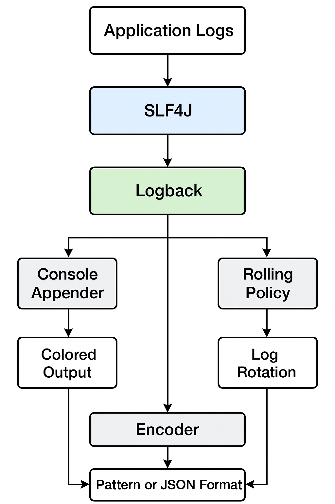

---

# 🌟 **Lesson Notes: Logging in Spring Boot**

---

## 🧭 **Learning Objectives**

By the end of this lesson, learners should be able to:

- ✅ Explain how logging works in Spring Boot and its default behavior.
- ✅ Identify the role of Commons Logging, SLF4J, Logback, and Log4j2.
- ✅ Configure custom logging patterns, file outputs, and log rotation.
- ✅ Adjust logging levels per package or globally using properties.
- ✅ Implement structured JSON logging for monitoring tools.
- ✅ Use Lombok annotations to reduce boilerplate code.
- ✅ Understand profile-based logging, shutdown hooks, and advanced configurations.

---

## 🧩 **1. Introduction to Logging in Spring Boot**

Logging is the **backbone of observability** in any enterprise-grade Spring Boot application.
It helps developers and system administrators:

* Monitor application state
* Trace errors and warnings
* Audit user activities
* Debug complex production issues

Spring Boot provides **out-of-the-box logging** via **Spring Boot Starter Logging**, which includes:

* **Commons Logging (JCL)** – Spring’s logging abstraction
* **SLF4J** – Simple Logging Facade for Java
* **Logback** – The default logging implementation

---

## ⚙️ **2. Default Logging Setup**

### 🔹 The Default Logging Stack

When you use a starter like `spring-boot-starter-web`, Spring Boot automatically includes:

```xml
<dependency>
    <groupId>org.springframework.boot</groupId>
    <artifactId>spring-boot-starter-logging</artifactId>
</dependency>
```

This brings:

* `spring-jcl` (Spring’s Commons Logging bridge)
* `slf4j-api`
* `logback-classic`
* `logback-core`

Thus, without any additional configuration, you have a **working logging system**.

---

### 🔹 Zero Configuration Example

#### `LoggingController.java`

```java
package com.example.demo.controller;

import org.slf4j.Logger;
import org.slf4j.LoggerFactory;
import org.springframework.web.bind.annotation.GetMapping;
import org.springframework.web.bind.annotation.RestController;

@RestController
public class LoggingController {

    private static final Logger logger = LoggerFactory.getLogger(LoggingController.class);

    @GetMapping("/")
    public String index() {
        logger.trace("This is a TRACE log");
        logger.debug("This is a DEBUG log");
        logger.info("This is an INFO log");
        logger.warn("This is a WARN log");
        logger.error("This is an ERROR log");
        return "Check the console for logs!";
    }
}
```

---

## 🧾 **3. Default Log Format Explained**

Sample log output when you start a Spring Boot app:

```
2025-10-21T14:10:03.255Z  INFO 10054 --- [myapp] [main] 
o.s.boot.SpringApplication : Starting Application using Java 17.0.6
```

### Breakdown:

| Part                 | Meaning                                   |
| -------------------- | ----------------------------------------- |
| **Timestamp**        | ISO-8601 timestamp (sortable)             |
| **Level**            | `TRACE`, `DEBUG`, `INFO`, `WARN`, `ERROR` |
| **PID**              | Process ID of the running JVM             |
| **Application Name** | From `spring.application.name` (if set)   |
| **Thread Name**      | Thread executing the log                  |
| **Logger Name**      | Usually class name                        |
| **Message**          | Log text                                  |

> 🧠 **Note:** Logback does not have a `FATAL` level — Spring maps it to `ERROR`.

---

## 🧰 **4. Enabling Debug or Trace Mode**

Spring Boot offers quick debugging options without editing config files.

### 🔸 Option 1: Command-line flags

```bash
java -jar app.jar --debug
# or
java -jar app.jar --trace
```

### 🔸 Option 2: In `application.properties`

```properties
debug=true
# or
trace=true
```

### 🔸 Option 3: Via VM Arguments

```bash
-Ddebug
```

When enabled:

* `DEBUG` or `TRACE` messages from Spring Core, Hibernate, and Tomcat are logged.
* This helps diagnose startup or bean configuration issues.

---

## 🧮 **5. Setting Log Levels per Package or Class**

You can control logging verbosity in `application.properties`:

```properties
logging.level.root=WARN
logging.level.org.springframework.web=DEBUG
logging.level.com.example.demo=TRACE
```

### Explanation:

| Logger                    | Level | Effect                               |
| ------------------------- | ----- | ------------------------------------ |
| `root`                    | WARN  | Global threshold (default is INFO)   |
| `org.springframework.web` | DEBUG | More detailed HTTP lifecycle logs    |
| `com.example.demo`        | TRACE | Shows internal logs for your package |

To apply via **environment variables**:

```bash
LOGGING_LEVEL_COM_EXAMPLE_DEMO=TRACE
```

---

## 🗂 **6. Logging to File**

By default, Spring Boot logs to the console only.
To also log to a file, set:

```properties
# Option 1: Specify file name (creates file automatically)
logging.file.name=logs/myapp.log

# Option 2: Specify directory (creates spring.log by default)
logging.file.path=logs/
```

✅ Both console and file logging are active simultaneously.

---

### 📁 File Rotation

Logback automatically rotates files at 10MB.
You can fine-tune this behavior:

```properties
logging.logback.rollingpolicy.max-file-size=10MB
logging.logback.rollingpolicy.max-history=7
logging.logback.rollingpolicy.total-size-cap=1GB
```

Each rotation will create files like:

```
myapp.log.2025-10-21.0.gz
myapp.log.2025-10-22.0.gz
```

---

## 🌈 **7. Color-Coded Console Logging**

If your terminal supports ANSI:

| Level | Color        |
| ----- | ------------ |
| ERROR | 🔴 Red       |
| WARN  | 🟡 Yellow    |
| INFO  | 🟢 Green     |
| DEBUG | 🟦 Cyan/Blue |
| TRACE | ⚪ Faint gray |

To force-enable ANSI colors:

```properties
spring.output.ansi.enabled=always
```

---

## 📜 **8. Customizing Logback via `logback-spring.xml`**

Spring Boot automatically detects any of these files in `src/main/resources`:

* `logback-spring.xml` ✅ (recommended)
* `logback.xml`

### Example: `logback-spring.xml`

```xml
<?xml version="1.0" encoding="UTF-8"?>
<configuration>

    <property name="LOGS" value="./logs"/>

    <!-- Console Appender -->
    <appender name="Console" class="ch.qos.logback.core.ConsoleAppender">
        <encoder>
            <pattern>%d{HH:mm:ss.SSS} [%thread] %-5level %logger{36} - %msg%n</pattern>
        </encoder>
    </appender>

    <!-- Rolling File Appender -->
    <appender name="RollingFile" class="ch.qos.logback.core.rolling.RollingFileAppender">
        <file>${LOGS}/spring-boot-app.log</file>
        <encoder>
            <pattern>%d %p [%t] %c{1} - %m%n</pattern>
        </encoder>
        <rollingPolicy class="ch.qos.logback.core.rolling.TimeBasedRollingPolicy">
            <fileNamePattern>${LOGS}/archive/app-%d{yyyy-MM-dd}.%i.log</fileNamePattern>
            <maxHistory>10</maxHistory>
        </rollingPolicy>
    </appender>

    <!-- Root Logger -->
    <root level="info">
        <appender-ref ref="Console"/>
        <appender-ref ref="RollingFile"/>
    </root>

</configuration>
```

This configuration:

* Prints colored console logs
* Stores file logs with daily rotation
* Keeps a rolling history of 10 days

---

## ⚡ **9. Using Log4j2 Instead of Logback**

To use Log4j2:

1. Exclude the default starter:

```xml
<exclusion>
    <groupId>org.springframework.boot</groupId>
    <artifactId>spring-boot-starter-logging</artifactId>
</exclusion>
```

2. Add:

```xml
<dependency>
    <groupId>org.springframework.boot</groupId>
    <artifactId>spring-boot-starter-log4j2</artifactId>
</dependency>
```

3. Create `log4j2-spring.xml`:

```xml
<?xml version="1.0" encoding="UTF-8"?>
<Configuration>
    <Appenders>
        <Console name="Console">
            <PatternLayout pattern="%d{HH:mm:ss} %-5p [%t] %c{1} - %m%n"/>
        </Console>
        <File name="File" fileName="logs/app.log">
            <PatternLayout pattern="%d{HH:mm:ss} %-5p [%t] %c{1} - %m%n"/>
        </File>
    </Appenders>

    <Loggers>
        <Root level="info">
            <AppenderRef ref="Console"/>
            <AppenderRef ref="File"/>
        </Root>
    </Loggers>
</Configuration>
```

---

## 🧾 **10. Structured (JSON) Logging**

Spring Boot supports JSON log formats like:

* **ECS (Elastic Common Schema)**
* **Logstash**
* **GELF (Graylog)**

### Example Configuration

```properties
logging.structured.format.console=ecs
logging.structured.format.file=logstash
```

### ECS JSON Output Example

```json
{
  "@timestamp": "2025-10-21T09:00:00Z",
  "log": {"level": "INFO"},
  "service": {"name": "demo-app"},
  "message": "Application started successfully"
}
```

Structured logs are ideal for cloud-based observability tools such as **Elastic Stack**, **Datadog**, or **Splunk**.

---

## 🧱 **11. Logging Groups**

You can simplify related loggers into **groups**:

```properties
logging.group.tomcat=org.apache.catalina, org.apache.coyote
logging.group.database=org.hibernate.SQL, org.springframework.jdbc
logging.level.tomcat=debug
```

Predefined groups:

* `web` → all web-related packages
* `sql` → all SQL logs

---

## 🧠 **12. Lombok Logging Annotations**

Using Lombok eliminates manual logger declarations.

### Example with `@Slf4j`

```java
@RestController
@Slf4j
public class LombokLoggingController {

    @GetMapping("/lombok")
    public String testLogs() {
        log.info("Lombok makes logging easy!");
        log.warn("This is a Lombok WARN message");
        return "Logging with Lombok";
    }
}
```

| Lombok Annotation | Logging Framework                 |
| ----------------- | --------------------------------- |
| `@Slf4j`          | SLF4J (Logback/Log4j2 compatible) |
| `@Log4j2`         | Log4j2                            |
| `@CommonsLog`     | Apache Commons Logging            |

---

## 🧰 **13. Custom Shutdown Hook**

Spring Boot registers a log shutdown hook automatically.
You can disable it if needed:

```properties
logging.register-shutdown-hook=false
```

This may be useful in applications with complex **context hierarchies**.

---

## 🧩 **14. Profile-Specific Logging**

You can use profile-specific logging configurations with Logback:

```xml
<springProfile name="dev">
    <root level="debug">
        <appender-ref ref="Console" />
    </root>
</springProfile>

<springProfile name="prod">
    <root level="info">
        <appender-ref ref="RollingFile" />
    </root>
</springProfile>
```

This allows different log levels per environment.

---

## 💡 **15. Logging Best Practices**

| Practice                        | Description                                        |
| ------------------------------- | -------------------------------------------------- |
| ✅ Use SLF4J API                 | Keeps logging abstraction flexible                 |
| ⚙️ Use `logback-spring.xml`     | Allows Spring profile integration                  |
| 🧾 Log Exceptions Properly      | Always include `e` in `logger.error("Error: ", e)` |
| 💾 Rotate Logs                  | Prevent disk saturation                            |
| 🧱 Use JSON Logs                | Easier parsing by monitoring tools                 |
| 🚀 Avoid `System.out.println()` | It bypasses logging infrastructure                 |

---

## 🧮 **16. Example: End-to-End Setup**

### File: `application.properties`

```properties
spring.application.name=DemoLoggingApp
logging.file.name=logs/app.log
logging.level.root=info
logging.level.com.example.demo=debug
logging.structured.format.console=ecs
```

### File: `LoggingController.java`

```java
@RestController
@Slf4j
public class LoggingController {

    @GetMapping("/api/test")
    public String logExample() {
        log.info("INFO log message");
        log.debug("DEBUG log message");
        log.error("ERROR log message with exception", new RuntimeException("Sample error"));
        return "Logging completed!";
    }
}
```

**Output:**

* Console → JSON format (ECS)
* File → Rotating plain-text log at `/logs/app.log`

---

## 🧭 **17. Summary Table**

| Feature           | Default Behavior | Customizable? | Example Property                                  |
| ----------------- | ---------------- | ------------- | ------------------------------------------------- |
| Logging Framework | Logback          | ✅             | `logging.config=logback-spring.xml`               |
| Log Destination   | Console          | ✅             | `logging.file.name=logs/app.log`                  |
| Default Level     | INFO             | ✅             | `logging.level.root=DEBUG`                        |
| File Rotation     | 10MB             | ✅             | `logging.logback.rollingpolicy.max-file-size=5MB` |
| JSON Format       | Disabled         | ✅             | `logging.structured.format.console=ecs`           |
| Color Output      | Auto-detect      | ✅             | `spring.output.ansi.enabled=always`               |

---

## 🎨 **18. Visual Summary (Optional Diagram)**

**Flow of Logging in Spring Boot:**

```
Application Logs → SLF4J → Logback Implementation
                       │
                       ├── ConsoleAppender → Colored Output
                       ├── FileAppender → app.log
                       ├── RollingPolicy → Log Rotation
                       └── Encoder → Pattern or JSON Format
```

---

## 🧾 **19. Final Notes**

* Use **structured JSON logs** for modern distributed systems.
* Avoid `System.out` and always rely on the logger.
* Leverage **Lombok** for clean, concise log statements.
* Fine-tune **log levels and rotation** in production for performance.

---

“Spring Boot Logging Architecture” 

