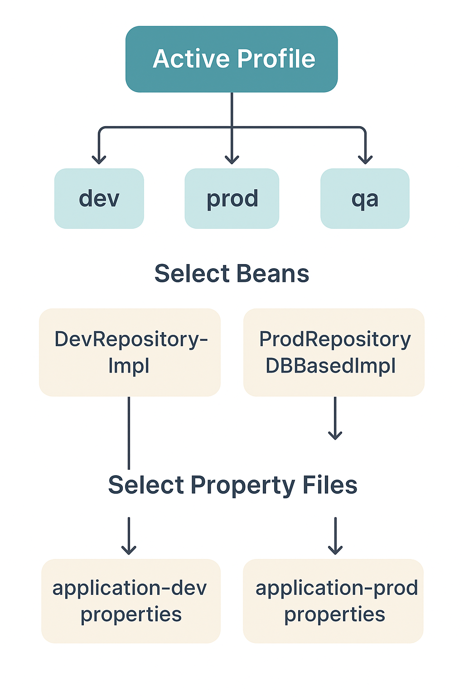

---

# 🌱 **Lesson 2: Spring Profiles**

---

## 1️⃣ Lesson Goals

Spring Profiles allow developers to **separate configuration and bean definitions** for different environments such as development, testing, and production.

By the end of this lesson, you’ll be able to:

✅ Understand what Spring Profiles are and why they’re useful
✅ Create profile-specific beans using `@Profile`
✅ Activate profiles via configuration, system properties, or code
✅ Use profile-specific property files
✅ Retrieve active profiles programmatically using `Environment`

---

## 2️⃣ What Are Spring Profiles?

In real-world applications, configurations differ between **development**, **testing**, and **production** environments.

For example:

* In **development**, you might use an **in-memory database (H2)**.
* In **production**, you’d connect to a **MySQL or PostgreSQL** database.

Spring Profiles provide a mechanism to **group beans and configurations** so that only those matching the **active profile(s)** are loaded.

---

## 3️⃣ Defining Profile-Specific Beans

You can use the `@Profile` annotation on any class or bean to specify which environment it belongs to.

Let’s look at an example where we have two repository implementations:

* One for **development**
* Another for **production**

---

### 🧩 Development Repository

```java
@Profile("dev")
@Repository
public class ProjectRepositoryImpl implements IProjectRepository {

    @Override
    public Optional<Project> findById(Long id) {
        System.out.println("Retrieving project using ProjectRepositoryImpl (DEV)");
        return Optional.empty();
    }
}
```

### 🧩 Production Repository

```java
@Profile("prod")
@Repository
public class ProjectRepositoryDBBasedImpl implements IProjectRepository {

    @Override
    public Optional<Project> findById(Long id) {
        System.out.println("Retrieving project using ProjectRepositoryDBBasedImpl (PROD)");
        return Optional.empty();
    }
}
```

---

🔹 **How It Works**
Only one of these beans will be loaded depending on the **active profile**.
If no profile is active, both will be ignored, and the app will fail because no `IProjectRepository` bean is available.

---

## 4️⃣ The Default Profile

If you don’t specify any profile, Spring automatically activates a profile named **“default”**.

You’ll see this message in the logs:

```
No active profile set, falling back to default profiles: default
```

However, since neither of our beans belongs to the “default” profile, Spring cannot find a matching bean.

---

## 5️⃣ Activating Profiles

You can activate a profile in **three ways**:

---

### 🧠 1. Through `application.properties`

Add this line to your `src/main/resources/application.properties`:

```properties
spring.profiles.active=dev
```

When you run the app, only beans marked with `@Profile("dev")` will load.

You can also activate multiple profiles:

```properties
spring.profiles.active=dev,qa
```

---

### 🧠 2. Via Command Line

You can activate a profile directly when running the app:

```bash
java -jar app.jar --spring.profiles.active=prod
```

---

### 🧠 3. Programmatically

You can also set the active profile in your `main` class:

```java
@SpringBootApplication
public class LsApp {

    public static void main(String[] args) {
        SpringApplication app = new SpringApplication(LsApp.class);
        app.setAdditionalProfiles("dev");
        app.run(args);
    }
}
```

---

## 6️⃣ Using `@Profile` with `@Bean`

You can also annotate **methods** (not just classes) with `@Profile` to load beans conditionally.

### Example

```java
@Configuration
public class AppConfig {

    @Bean("beanA")
    @Profile("prod")
    public BeanA prodBeanA() {
        System.out.println("Returning prodBeanA for PROD profile");
        return new BeanA("prod");
    }

    @Bean("beanA")
    @Profile("dev")
    public BeanA devBeanA() {
        System.out.println("Returning devBeanA for DEV profile");
        return new BeanA("dev");
    }
}
```

✅ When the “dev” profile is active, `devBeanA()` will be created.
✅ When “prod” is active, `prodBeanA()` will be created.

---

## 7️⃣ Accessing Active Profiles Programmatically

You can use the **`Environment`** interface to check which profiles are active or default.

### Example

```java
@Configuration
public class AppConfig {

    @Autowired
    private Environment environment;

    @PostConstruct
    public void printProfiles() {
        System.out.println("Active Profiles: " + Arrays.toString(environment.getActiveProfiles()));
        System.out.println("Default Profiles: " + Arrays.toString(environment.getDefaultProfiles()));
    }
}
```

When you run the app, you’ll see:

```
Active Profiles: [dev]
Default Profiles: [default]
```

---

## 8️⃣ Example: Separate DataSource Configurations Using Profiles

Let’s create a scenario where we have **two data sources**:

* **H2 Database** for development
* **MySQL** for production

---

### Step 1: Create a Common Interface

```java
public interface DatasourceConfig {
    void setup();
}
```

---

### Step 2: Define Profile-Specific Beans

#### 🧩 Dev Datasource

```java
@Component
@Profile("dev")
public class DevDatasourceConfig implements DatasourceConfig {

    @Override
    public void setup() {
        System.out.println("Setting up datasource for DEV environment.");
    }
}
```

#### 🧩 Production Datasource

```java
@Component
@Profile("prod")
public class ProductionDatasourceConfig implements DatasourceConfig {

    @Override
    public void setup() {
        System.out.println("Setting up datasource for PROD environment.");
    }
}
```

---

### Step 3: Use in Main Application

```java
@SpringBootApplication
public class LsApp {

    @Autowired
    private DatasourceConfig datasourceConfig;

    @PostConstruct
    public void init() {
        datasourceConfig.setup();
    }

    public static void main(String[] args) {
        SpringApplication.run(LsApp.class, args);
    }
}
```

When you run this with `spring.profiles.active=dev`, output will be:

```
Setting up datasource for DEV environment.
```

When switched to `prod`:

```
Setting up datasource for PROD environment.
```

---

## 9️⃣ Combining Multiple Profiles

You can combine profiles using logical operators:

| Operator | Description              | Example                      |
| -------- | ------------------------ | ---------------------------- |
| `&`      | AND — all must be active | `@Profile("mysql & tomcat")` |
| `!`      | NOT — exclude profile    | `@Profile("!dev")`           |

### Example

```java
@Component
@Profile("tomcat & mysql")
public class TomcatMySQLDatasource implements DatasourceConfig {
    @Override
    public void setup() {
        System.out.println("Setting up MySQL datasource on Tomcat.");
    }
}
```

This bean is only loaded if both **tomcat** and **mysql** profiles are active.

---

## 🔟 Profile-Specific Property Files

Spring Boot supports **profile-based properties** automatically.
You can define separate property files like:

```
application.properties
application-dev.properties
application-prod.properties
```

### Example

**application-dev.properties**

```properties
spring.datasource.url=jdbc:h2:mem:devdb
spring.datasource.username=sa
spring.datasource.password=
```

**application-prod.properties**

```properties
spring.datasource.url=jdbc:mysql://localhost:3306/appdb
spring.datasource.username=root
spring.datasource.password=secret
```

When you activate `spring.profiles.active=prod`, Spring Boot loads both:

* `application.properties` (base config)
* `application-prod.properties` (profile config)

---

## 1️⃣1️⃣ Multi-Document Properties (Spring Boot 2.4+)

You can store multiple environments in a **single `application.properties`** file using the `spring.config.activate.on-profile` property.

```properties
spring.application.name=MyApp
#---
spring.config.activate.on-profile=dev
app.message=Hello from DEV!
#---
spring.config.activate.on-profile=prod
app.message=Hello from PROD!
```

✅ Spring Boot reads this top-to-bottom and activates the section matching your active profile.

---

## 1️⃣2️⃣ Profile Groups

You can define **profile groups** to activate several profiles at once:

```properties
spring.profiles.group.production=proddb,prodquartz
```

Activating `production` will automatically activate both `proddb` and `prodquartz`.

---

## 1️⃣3️⃣ Retrieving Active Profiles in Code

You can also get the active profile as a property:

```java
@Value("${spring.profiles.active:default}")
private String activeProfile;
```

The `:default` ensures your code runs even when no profile is active.

---

## 1️⃣4️⃣ Summary Table

| Feature                             | Description                      | Example                                        |
| ----------------------------------- | -------------------------------- | ---------------------------------------------- |
| `@Profile("dev")`                   | Activate bean for “dev”          | `@Component @Profile("dev")`                   |
| `spring.profiles.active`            | Activate via property file       | `spring.profiles.active=dev`                   |
| `Environment`                       | Access profiles programmatically | `env.getActiveProfiles()`                      |
| `application-{profile}.properties`  | Profile-based config             | `application-prod.properties`                  |
| `spring.config.activate.on-profile` | Multi-document file sections     | `#---` separator                               |
| `spring.profiles.group.*`           | Group profiles                   | `spring.profiles.group.prod=proddb,prodquartz` |

---

## 1️⃣5️⃣ Key Takeaways

- 🔹 Use `@Profile` to define environment-specific beans.
- 🔹 Activate profiles using property files, code, or environment variables.
- 🔹 Each environment (dev, test, prod) can have its own configuration files.
- 🔹 Use logical operators like `&` and `!` for combined conditions.
- 🔹 The `Environment` interface helps inspect active profiles dynamically.
- 🔹 Profile groups simplify multi-environment configurations.

---

How **Spring Boot selects beans and property files** based on the **active profile** (e.g., `dev`, `prod`, `qa`)

