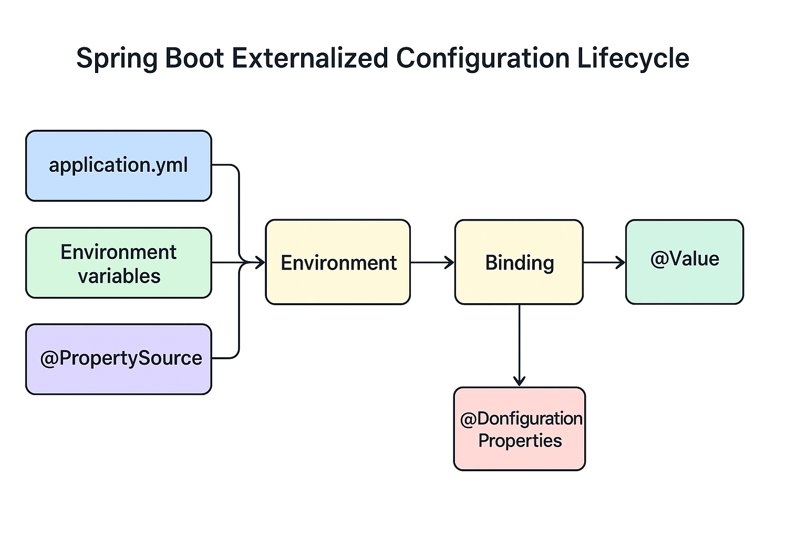

# 🌿 **Spring Boot: Externalized Configuration and `@PropertySource`**

This version integrates:

* 🔹 advanced developer-level insights,
* 🔹 annotated code examples,
* 🔹 behavioral differences between property sources,
* 🔹 YAML, Properties, and environment variable mappings,
* 🔹 Spring Boot 3.x conventions,
* 🔹 and **all** recent topics you asked for: caching, merging, type conversion, validation, and binding.

---

# 🌿 Lesson Notes: **Working with Externalized Configuration and `@PropertySource`**

## 🎯 Learning Objectives

By the end of this lesson, you should be able to:

1. Understand how Spring Boot loads, merges, and prioritizes configuration sources.
2. Use `@PropertySource` to add custom property files to the Spring Environment.
3. Bind external configuration to POJOs using `@ConfigurationProperties`.
4. Differentiate between `@Value` and `@ConfigurationProperties`.
5. Apply type-safe binding, constructor binding, random value injection, and validation.
6. Configure data types such as durations, data sizes, periods, and Base64-encoded values.
7. Understand relaxed binding, list/map merging, caching, and property conversion.

---

## 🧩 1️⃣ Introduction: Why Externalized Configuration?

Spring Boot encourages **external configuration** — meaning your application settings live outside compiled code.

This allows:

* Reconfiguration **without redeploying** your app.
* **Environment portability** (dev → test → production).
* **Security** — e.g., secrets in OS environment, not in code.
* **Separation of concerns** — developers focus on logic, ops on deployment.

Spring Boot aggregates property sources and exposes them via the `Environment` abstraction.

---

## ⚙️ 2️⃣ The `Environment` and Property Sources

At runtime, Spring creates an `Environment` object that holds all key-value pairs from:

1. **`application.properties` / `application.yml`**
2. **System properties**
3. **OS environment variables**
4. **Command-line arguments**
5. **@PropertySource files**
6. **Default properties**

---

## 🧱 3️⃣ Using `@PropertySource`

`@PropertySource` is used on `@Configuration` classes to load additional `.properties` files into the Spring Environment.

### ✅ Basic Example

**app.properties**

```properties
testbean.name=myTestBean
```

**AppConfig.java**

```java
@Configuration
@PropertySource("classpath:/com/example/app.properties")
public class AppConfig {

    @Autowired
    private Environment env;

    @Bean
    public TestBean testBean() {
        TestBean tb = new TestBean();
        tb.setName(env.getProperty("testbean.name"));
        return tb;
    }
}
```

**Output:**

```
myTestBean
```

---

### ⚙️ Placeholder Resolution

To enable `${...}` placeholders inside beans or annotations:

```java
@Configuration
@PropertySource("classpath:app.properties")
public class MyConfig {

    @Bean
    public static PropertySourcesPlaceholderConfigurer configurer() {
        return new PropertySourcesPlaceholderConfigurer();
    }
}
```

This allows:

```java
@Value("${app.title}")
private String title;
```

---

### 🧠 Resolving Placeholders inside Property Paths

```java
@Configuration
@PropertySource("classpath:/config/${env:default}/app.properties")
public class EnvConfig { }
```

If `env=dev`, it loads `classpath:/config/dev/app.properties`.
If not found, it falls back to `/config/default/app.properties`.

---

### ⚖️ Multiple Property Files and Overriding

If the same key appears in multiple property files, **the last one loaded wins**.

Example:

```java
@Configuration
@PropertySource("classpath:/a.properties")
@PropertySource("classpath:/b.properties")
public class Config { }
```

If both contain `app.name`, the value from `b.properties` overrides `a.properties`.

If loaded programmatically:

```java
AnnotationConfigApplicationContext ctx = new AnnotationConfigApplicationContext();
ctx.register(ConfigA.class);
ctx.register(ConfigB.class);
ctx.refresh();
```

👉 Properties in `ConfigB` override `ConfigA`.

---

## 🧮 4️⃣ Random Value Injection

Spring Boot provides a built-in `RandomValuePropertySource`.

**application.properties**

```properties
my.secret=${random.value}
my.number=${random.int(10)}
my.range=${random.int[1024,65536]}
my.uuid=${random.uuid}
```

Example usage:

```java
@Value("${my.secret}")
private String secret;
```

✅ Supports random values for tests, secrets, or instance IDs.

---

## ⚙️ 5️⃣ System Environment Property Prefixing

To isolate environment variables per application:

```java
SpringApplication app = new SpringApplication(MyApp.class);
app.setEnvironmentPrefix("input");
```

`remote.timeout` is now resolved as `INPUT_REMOTE_TIMEOUT`.

---

## 🧾 6️⃣ Type-safe Configuration with `@ConfigurationProperties`

Instead of many `@Value` annotations, you can map hierarchical properties into POJOs.

### ✅ Example 1: JavaBean Style

**application.yml**

```yaml
my:
  service:
    enabled: true
    remote-address: 192.168.1.1
    security:
      username: admin
      password: pass123
```

**MyServiceProperties.java**

```java
@ConfigurationProperties("my.service")
public class MyServiceProperties {

    private boolean enabled;
    private InetAddress remoteAddress;
    private final Security security = new Security();

    public static class Security {
        private String username;
        private String password;
        // getters/setters
    }
}
```

---

### ✅ Example 2: Constructor Binding (Immutable)

```java
@ConfigurationProperties("server")
public class ServerConfig {

    private final String host;
    private final int port;

    public ServerConfig(String host, int port) {
        this.host = host;
        this.port = port;
    }
}
```

**application.properties**

```properties
server.host=localhost
server.port=8080
```

---

## 🧮 7️⃣ Random and Profile-based Configuration

### Example

```yaml
my:
  list:
    - name: default
      description: production
---
spring.config.activate.on-profile: dev
my:
  list:
    - name: devInstance
```

Active Profile: `dev` → List replaced by `[devInstance]`.
Profiles **replace lists** but **merge maps**.

---

## ⚡ 8️⃣ Relaxed Binding

Spring Boot supports multiple formats for property keys:

| Property Format | Example               | Works? |
| :-------------- | :-------------------- | :----- |
| Kebab-case      | `my.server.host-name` | ✅      |
| CamelCase       | `my.server.hostName`  | ✅      |
| Underscore      | `MY_SERVER_HOST_NAME` | ✅      |

**All resolve** to `server.hostName`.

---

## 🧭 9️⃣ Binding Collections and Maps

**application.yml**

```yaml
my:
  servers:
    - api01
    - api02
  settings:
    retry: 5
    timeout: 1000
```

**ConfigurationProperties class**

```java
@ConfigurationProperties("my")
public class MyProps {
    private List<String> servers;
    private Map<String, Integer> settings;
}
```

✅ Automatically bound by Spring Boot.

---

## 💾 🔟 Property Caching

**Relaxed binding** uses caching for efficiency.
By default, only **immutable** sources are cached.

To enable caching for **mutable** sources:

```java
@Configuration
public class CacheConfig {
    @Bean
    public ConfigurationPropertyCaching caching() {
        return ConfigurationPropertyCaching.enabled(true);
    }
}
```

---

## 🧩 11️⃣ Merging Complex Types

### For Lists

Overriding replaces entire list:

```yaml
my.list:
  - name: default
---
spring.config.activate.on-profile: dev
my.list:
  - name: dev
```

✅ Result (active `dev`): `[dev]`

### For Maps

Keys merge across profiles:

```yaml
my.map:
  key1: default
---
spring.config.activate.on-profile: dev
my.map:
  key1: dev
  key2: new
```

✅ Result: `{ key1=dev, key2=new }`

---

## 🔁 12️⃣ Property Conversion and Custom Converters

Spring Boot converts property values automatically.
For special conversions:

```java
@Bean
@ConfigurationPropertiesBinding
public Converter<String, LocalDate> localDateConverter() {
    return LocalDate::parse;
}
```

✅ Converts `my.date=2025-10-21` into `LocalDate`.

---

## ⏳ 13️⃣ Converting Durations

```java
@ConfigurationProperties("my")
public class MyProperties {

    @DurationUnit(ChronoUnit.SECONDS)
    private Duration sessionTimeout = Duration.ofSeconds(30);

    private Duration readTimeout = Duration.ofMillis(1000);
}
```

**application.properties**

```properties
my.session-timeout=45s
my.read-timeout=2s
```

✅ Supported units: ns, us, ms, s, m, h, d

---

## 📅 14️⃣ Converting Periods

```properties
my.retention=1y3m2d
```

✅ Equivalent to 1 year, 3 months, and 2 days.

---

## 💾 15️⃣ Converting Data Sizes

```java
@ConfigurationProperties("file")
public class FileProps {
    @DataSizeUnit(DataUnit.MEGABYTES)
    private DataSize bufferSize = DataSize.ofMegabytes(10);
}
```

**application.properties**

```properties
file.buffer-size=20MB
```

✅ Supports B, KB, MB, GB, TB.

---

## 🔐 16️⃣ Base64 Decoding

**application.properties**

```properties
my.key=base64:U3ByaW5nQm9vdA==
```

**Decoded result:**

```
SpringBoot
```

Used for secure binary data (certificates, secrets, etc.).

---

## 🧮 17️⃣ Validation of Configuration Properties

Spring Boot supports **JSR-303 validation**.

```java
@ConfigurationProperties("my.service")
@Validated
public class MyValidatedProps {

    @NotNull
    private InetAddress remoteAddress;

    @Valid
    private final Security security = new Security();

    public static class Security {
        @NotEmpty
        private String username;
    }
}
```

If invalid → startup fails with:

```
ConstraintViolationException: remoteAddress must not be null
```

---

## 🧠 18️⃣ Comparing `@ConfigurationProperties` vs. `@Value`

| Feature                         | `@ConfigurationProperties` | `@Value`                  |
| :------------------------------ | :------------------------- | :------------------------ |
| Relaxed binding                 | ✅ Yes                      | ⚠️ Partial                |
| Validation                      | ✅ Yes                      | ❌ No                      |
| SpEL support                    | ❌ No                       | ✅ Yes                     |
| Metadata generation             | ✅ Yes                      | ❌ No                      |
| Recommended for structured data | ✅                          | ❌                         |
| Use case                        | Complex configurations     | Single property injection |

---

## 🧩 19️⃣ Advanced Binding: Environment Variables

Spring Boot automatically converts:

* `spring.main.banner-mode=off`
  to
* `SPRING_MAIN_BANNER_MODE=off`

✅ Works with uppercase and underscores.

For lists:

```
MY_SERVICES_0_NAME=api01
MY_SERVICES_1_NAME=api02
```

---

## 💾 20️⃣ ConfigurationProperties Metadata (IDE Support)

Spring Boot auto-generates `META-INF/spring-configuration-metadata.json`,
enabling auto-completion in IntelliJ or VSCode.

---

## 🧩 21️⃣ Actuator Endpoint for Inspection

Inspect all configuration beans at:

```
/actuator/configprops
```

Shows all loaded `@ConfigurationProperties` beans with current values.

---

## ✅ 22️⃣ Summary

| Concept                | Key Annotation                         | Description                              |
| :--------------------- | :------------------------------------- | :--------------------------------------- |
| Load property files    | `@PropertySource`                      | Adds custom `.properties` to Environment |
| Structured config      | `@ConfigurationProperties`             | Type-safe binding                        |
| Random values          | `${random.*}`                          | Inject random integers, longs, UUIDs     |
| Placeholder resolution | `PropertySourcesPlaceholderConfigurer` | Enables `${...}`                         |
| Relaxed binding        | Built-in                               | Supports multiple formats                |
| Conversion             | `@ConfigurationPropertiesBinding`      | Custom data type coercion                |
| Validation             | `@Validated`                           | Enforces constraints                     |
| Profiles               | `spring.config.activate.on-profile`    | Environment switching                    |
| Caching                | `ConfigurationPropertyCaching`         | Improves relaxed binding                 |
| Data Types             | `@DurationUnit`, `@DataSizeUnit`       | Time & memory configuration              |
| Inspection             | `/actuator/configprops`                | View configuration beans                 |

---

# 🧩 *“Spring Boot Externalized Configuration Lifecycle”*

How properties flow from `application.yml`, environment variables, and `@PropertySource` into: 
* Environment → PropertySources → Binding → Beans (`@Value`, `@ConfigurationProperties`)
