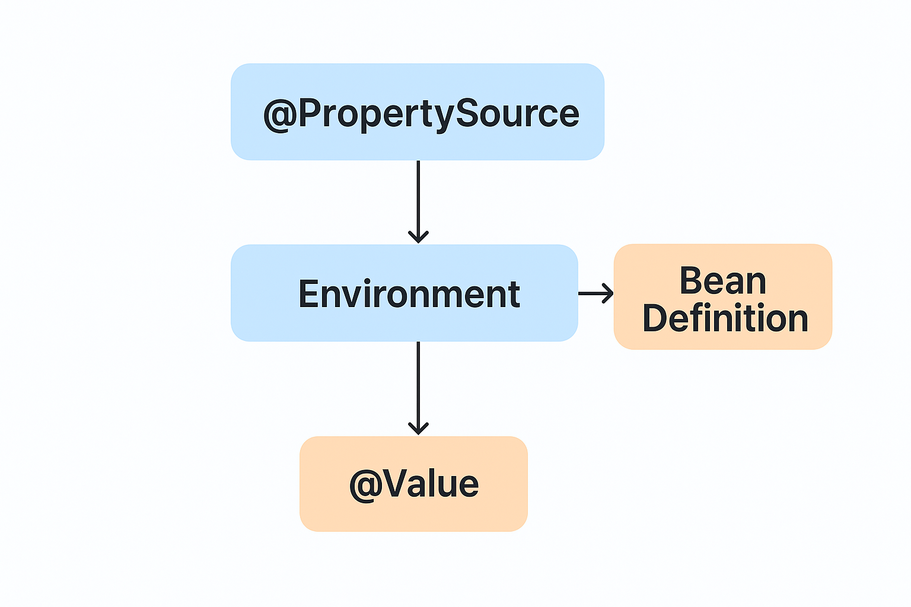

---

# 📚 Spring Framework: Working with `@PropertySource`

The **`@PropertySource` annotation** in Spring provides a **declarative mechanism** for loading properties files into the **Spring Environment**. It allows you to externalize configuration so that values can be easily managed outside the source code.

`@PropertySource` is commonly used together with **`@Configuration`** classes to define beans that use environment-dependent values.

---

## 🌟 Key Features of `@PropertySource`

1. **Purpose**

    * `@PropertySource` adds a `.properties` or `.xml` file as a **PropertySource** to the Spring **Environment**.
    * It enables Spring to **read configuration values** (like URLs, usernames, or environment variables) from external files.

2. **Usage Context**

    * Used **within a `@Configuration` class**.
    * Often combined with the **`Environment`** interface or the **`@Value`** annotation to inject property values.

3. **File Types Supported**

    * Supports both **`.properties`** and **XML-based** properties files (e.g., `file:/config/app.xml`).

4. **Wildcard Support (Spring 6.1+)**

    * Supports **resource wildcards**, e.g.:

      ```java
      @PropertySource("classpath*:/config/*.properties")
      ```

---

## 🛠️ Basic Syntax

```java
@PropertySource("classpath:application.properties")
public class AppConfig { }
```

### Required Element:

| Element          | Description                                                                                   |
| :--------------- | :-------------------------------------------------------------------------------------------- |
| `String[] value` | Defines the **path(s)** to the properties file(s) to be loaded (e.g., `classpath:`, `file:`). |

### Optional Elements:

| Element                  | Type                                     | Default                        | Description                                                                                    |
| :----------------------- | :--------------------------------------- | :----------------------------- | :--------------------------------------------------------------------------------------------- |
| `name`                   | `String`                                 | `""`                           | Optional name for the property source (useful for debugging and ordering).                     |
| `ignoreResourceNotFound` | `boolean`                                | `false`                        | Set to `true` if the file is **optional** and missing files should **not throw an exception**. |
| `encoding`               | `String`                                 | `""`                           | Specifies file encoding (e.g., `"UTF-8"`).                                                     |
| `factory`                | `Class<? extends PropertySourceFactory>` | `DefaultPropertySourceFactory` | Allows defining a **custom factory** for loading property files.                               |

---

## 💡 Example 1: Basic Property Loading

Let’s start with a simple example that reads from a file named `app.properties`.

### 🔹 Step 1 — Define `app.properties`

```properties
# app.properties
testbean.name=MyTestBean
```

### 🔹 Step 2 — Load Properties Using `@PropertySource`

```java
import org.springframework.beans.factory.annotation.Autowired;
import org.springframework.context.annotation.*;
import org.springframework.core.env.Environment;

@Configuration
@PropertySource("classpath:app.properties")
public class AppConfig {

    @Autowired
    private Environment env; // Inject Spring Environment

    @Bean
    public TestBean testBean() {
        TestBean testBean = new TestBean();
        testBean.setName(env.getProperty("testbean.name"));
        return testBean;
    }
}
```

### 🔹 Step 3 — Access the Property

```java
public class TestBean {
    private String name;
    public void setName(String name) { this.name = name; }
    public String getName() { return name; }
}

public class MainApp {
    public static void main(String[] args) {
        AnnotationConfigApplicationContext context =
                new AnnotationConfigApplicationContext(AppConfig.class);
        TestBean testBean = context.getBean(TestBean.class);
        System.out.println("Bean Name: " + testBean.getName());
        context.close();
    }
}
```

**Output:**

```
Bean Name: MyTestBean
```

✅ The `Environment` interface reads the key `testbean.name` from the `app.properties` file and injects it into the bean.

---

## 💬 Example 2: Using `${...}` Placeholders in `@Value`

You can inject property values directly into bean fields using the **`@Value`** annotation.

### app.properties

```properties
app.name=CipherCrypto
app.version=1.0
```

### Configuration Class

```java
@Configuration
@PropertySource("classpath:app.properties")
public class PropertyExample {

    @Value("${app.name}")
    private String appName;

    @Value("${app.version}")
    private String appVersion;

    @Bean
    public void displayAppInfo() {
        System.out.println("Application: " + appName);
        System.out.println("Version: " + appVersion);
    }
}
```

**Output:**

```
Application: CipherCrypto
Version: 1.0
```

> ⚠️ **Note:**
> To resolve `${...}` placeholders in `@Value`, Spring automatically registers a `PropertySourcesPlaceholderConfigurer`.
> If you customize placeholder behavior, you can declare it manually as a `@Bean`.

---

## ⚙️ Advanced Configuration Options

### 1. Ignoring Missing Files

If the property file might not exist (e.g., different environments), use:

```java
@PropertySource(value = "classpath:optional.properties", ignoreResourceNotFound = true)
```

✅ This prevents Spring from throwing an exception if the file is missing.

---

### 2. Custom Encoding

You can specify the file encoding for non-ASCII text:

```java
@PropertySource(value = "classpath:app.properties", encoding = "UTF-8")
```

---

### 3. Custom PropertySourceFactory

Spring’s default factory supports `.properties` and `.xml` files.
You can define a custom factory if you want to load from **YAML**, **JSON**, or another format:

```java
@PropertySource(value = "classpath:custom.yaml", factory = MyYamlPropertySourceFactory.class)
```

---

## 💡 Example 3: Using Placeholders in File Path

You can include environment placeholders inside the file path.

```java
@Configuration
@PropertySource("classpath:/config/${env:default}/app.properties")
public class EnvConfig {
    @Autowired
    Environment env;
}
```

* If `env` is defined as a system property or environment variable, its value will be used.
* Otherwise, the default folder `default` will be used.

Example:

```
-Denv=production
```

➡ Spring loads `classpath:/config/production/app.properties`

---

## ⚔️ Property Overriding Rules

When multiple property files define the same key, **the last loaded file takes precedence**.

### Example:

```java
@Configuration
@PropertySource("classpath:a.properties")
public class ConfigA { }

@Configuration
@PropertySource("classpath:b.properties")
public class ConfigB { }
```

```java
AnnotationConfigApplicationContext ctx = new AnnotationConfigApplicationContext();
ctx.register(ConfigA.class);
ctx.register(ConfigB.class);
ctx.refresh();
```

✅ Properties in **`b.properties`** override those in **`a.properties`**, since `ConfigB` was registered last.

> 🔸 If the configuration classes are scanned automatically, the order might vary.
> In such cases, use the **programmatic API** (`ConfigurableEnvironment` and `MutablePropertySources`) for fine-grained control.

---

## 🧠 Summary Table

| Feature                  | Description                         | Example                                       |
| :----------------------- | :---------------------------------- | :-------------------------------------------- |
| Load properties          | Adds file to Spring Environment     | `@PropertySource("classpath:app.properties")` |
| Ignore missing file      | Avoid exception if file not found   | `ignoreResourceNotFound = true`               |
| Use encoding             | Define file charset                 | `encoding = "UTF-8"`                          |
| Use placeholders in path | Resolve `${...}` expressions        | `"classpath:/config/${env}/app.properties"`   |
| Override order           | Last processed wins                 | `ConfigB` overrides `ConfigA`                 |
| Custom factory           | Load YAML/JSON using custom factory | `factory = MyYamlPropertySourceFactory.class` |

---

## 🧩 Real-World Use Case

In multi-environment applications (e.g., **dev**, **test**, **prod**), you can use multiple property files:

```java
@Configuration
@PropertySource("classpath:application.properties")
@PropertySource("classpath:application-${spring.profiles.active}.properties")
public class MultiEnvConfig { }
```

Then set:

```
-Dspring.profiles.active=prod
```

✅ Spring automatically loads `application.properties` and `application-prod.properties`.

---

## ✅ Summary

* `@PropertySource` allows **externalized configuration** in Spring.
* It integrates with `Environment` and `@Value` for property access.
* It supports **placeholders**, **overriding**, and **multiple sources**.
* For complex scenarios (like YAML or JSON), you can implement a **custom PropertySourceFactory**.

---

How `@PropertySource` loads values → injects them into `Environment` → and finally into `@Value` or bean definitions

