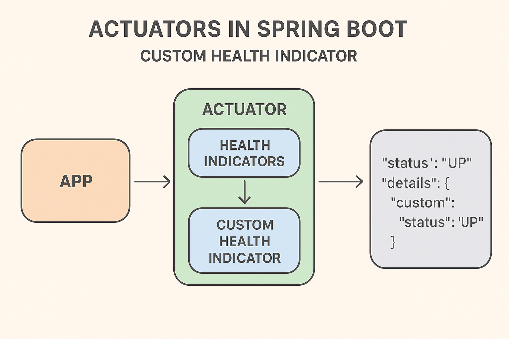

---

# 🧠 **Lesson Notes: Actuators in Spring Boot – Custom Health Indicator**

---

## **1. Introduction**

Spring Boot **Actuator** provides production-ready features that help monitor and manage your application. One of its core features is the **Health Endpoint** (`/actuator/health`), which reports the health of your running application.

By default, Spring Boot provides built-in **Health Indicators** (like database, disk space, mail server, Redis, etc.). However, we can easily **create custom indicators** to report the health of specific services in our system — e.g., a custom API, cache, message broker, or internal microservice.

---

## **2. Default Health Endpoint Output**

When you include the Spring Boot Actuator dependency and run your application:

```xml
<dependency>
    <groupId>org.springframework.boot</groupId>
    <artifactId>spring-boot-starter-actuator</artifactId>
</dependency>
```

Access the `/actuator/health` endpoint in a browser or using `curl`:

```bash
curl http://localhost:8080/actuator/health
```

By default, you’ll see:

```json
{
    "status": "UP"
}
```

To see more details, enable detailed output in your `application.properties`:

```properties
management.endpoint.health.show-details=ALWAYS
```

Now, the `/health` output becomes more informative:

```json
{
    "status": "UP",
    "details": {
        "diskSpace": {
            "status": "UP",
            "details": {
                "total": 107373129728,
                "free": 52361125888,
                "threshold": 10485760
            }
        }
    }
}
```

---

## **3. Creating a Custom Health Indicator**

We can **extend Actuator’s functionality** by creating a **custom health indicator**.

All we need to do is:

* Create a class that implements `HealthIndicator`
* Override the `health()` method to define the custom check
* Return a `Health` object (`up()`, `down()`, etc.)

### 🧩 **Example: Database Health Indicator**

Let’s create a fake database health check.

```java
package com.example.demo.health;

import org.springframework.boot.actuate.health.Health;
import org.springframework.boot.actuate.health.HealthIndicator;
import org.springframework.stereotype.Component;

@Component
public class DBHealthIndicator implements HealthIndicator {

    @Override
    public Health health() {
        if (isDbUp()) {
            return Health.up()
                    .withDetail("Database", "Available")
                    .withDetail("ResponseTime", "15ms")
                    .build();
        } else {
            return Health.down()
                    .withDetail("Database", "Not reachable")
                    .withDetail("Error Code", 503)
                    .build();
        }
    }

    private boolean isDbUp() {
        // Simulated check: return false to test the DOWN state
        return false;
    }
}
```

### 🧾 **Output**

After running the app and visiting `/actuator/health`:

```json
{
    "status": "DOWN",
    "details": {
        "db": {
            "status": "DOWN",
            "details": {
                "Database": "Not reachable",
                "Error Code": 503
            }
        },
        "diskSpace": {
            "status": "UP",
            "details": {
                "total": 107373129728,
                "free": 59248070656,
                "threshold": 10485760
            }
        }
    }
}
```

> 🟢 Note: The node name (`"db"`) is derived automatically by removing the `HealthIndicator` suffix from the class name (`DBHealthIndicator → db`).

---

## **4. Health Indicator Status Types**

Spring Boot defines four built-in health statuses:

| Status             | Description                                |
| ------------------ | ------------------------------------------ |
| **UP**             | System or service is working fine          |
| **DOWN**           | System or service is unavailable or failed |
| **OUT_OF_SERVICE** | The system is temporarily out of service   |
| **UNKNOWN**        | Health status cannot be determined         |

You can customize the order in which these statuses are evaluated:

```properties
management.endpoint.health.status.order=down,out-of-service,unknown,up
```

Or define **custom statuses** like:

```properties
management.endpoint.health.status.order=fatal,down,out-of-service,unknown,up
```

---

## **5. Realistic Example: Checking an External REST API**

Suppose your app depends on an external API. You can use `RestTemplate` to verify its availability.

```java
package com.example.demo.health;

import org.springframework.boot.actuate.health.Health;
import org.springframework.boot.actuate.health.HealthIndicator;
import org.springframework.stereotype.Component;
import org.springframework.web.client.RestTemplate;

@Component
public class ExternalAPIHealthIndicator implements HealthIndicator {

    private static final String API_URL = "https://jsonplaceholder.typicode.com/posts/1";
    private final RestTemplate restTemplate = new RestTemplate();

    @Override
    public Health health() {
        try {
            restTemplate.getForObject(API_URL, String.class);
            return Health.up()
                    .withDetail("External API", "Reachable")
                    .withDetail("URL", API_URL)
                    .build();
        } catch (Exception ex) {
            return Health.down()
                    .withDetail("External API", "Unreachable")
                    .withDetail("Error", ex.getMessage())
                    .build();
        }
    }
}
```

✅ Output when API is reachable:

```json
{
  "status": "UP",
  "details": {
    "externalAPI": {
      "status": "UP",
      "details": {
        "External API": "Reachable",
        "URL": "https://jsonplaceholder.typicode.com/posts/1"
      }
    }
  }
}
```

---

## **6. Custom Status Mapping (Optional)**

If you define new statuses (like `FATAL`), you can map them to HTTP response codes:

```properties
management.endpoint.health.status.http-mapping.down=503
management.endpoint.health.status.http-mapping.fatal=503
management.endpoint.health.status.http-mapping.out-of-service=503
```

---

## **7. Reactive Health Indicators (For WebFlux Apps)**

If your app uses **Spring WebFlux**, use the non-blocking `ReactiveHealthIndicator`:

```java
import org.springframework.boot.actuate.health.Health;
import org.springframework.boot.actuate.health.ReactiveHealthIndicator;
import org.springframework.stereotype.Component;
import reactor.core.publisher.Mono;

@Component
public class ReactiveDBHealthIndicator implements ReactiveHealthIndicator {

    @Override
    public Mono<Health> health() {
        return checkDatabase()
                .onErrorResume(ex -> Mono.just(Health.down().withDetail("Error", ex.getMessage()).build()));
    }

    private Mono<Health> checkDatabase() {
        // Simulate a check with reactive Mono
        return Mono.just(Health.up().withDetail("Reactive DB", "Available").build());
    }
}
```

---

## **8. Health Groups**

You can **group indicators** into logical categories using configuration properties:

```properties
management.endpoint.health.group.database.include=db
management.endpoint.health.group.external.include=externalAPI
```

Now, you can query:

```bash
curl http://localhost:8080/actuator/health/database
curl http://localhost:8080/actuator/health/external
```

Each group aggregates its included indicators.

---

## **9. Summary**

| Concept                   | Description                                                 |
| ------------------------- | ----------------------------------------------------------- |
| **Health Indicator**      | Reports the status of a component                           |
| **Default Statuses**      | UP, DOWN, OUT_OF_SERVICE, UNKNOWN                           |
| **Custom Indicators**     | Implement `HealthIndicator` or `ReactiveHealthIndicator`    |
| **Show Details**          | `management.endpoint.health.show-details=ALWAYS`            |
| **Custom Groups**         | Group indicators using `management.endpoint.health.group.*` |
| **Custom Status Mapping** | Map new statuses to HTTP codes                              |

---

## ✅ **Practical Exercise**

1. Add the Spring Boot Actuator dependency.
2. Enable health details in `application.properties`.
3. Implement a custom indicator to check an API or file system.
4. Test it by running:

   ```bash
   curl http://localhost:8080/actuator/health
   ```

---

