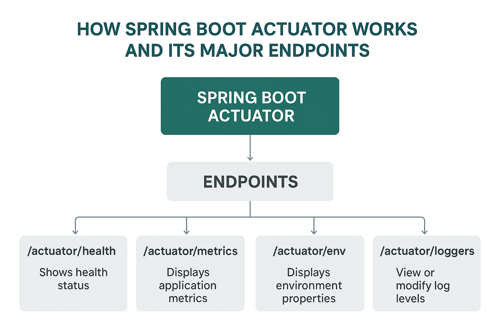

---

# 🌿 Lesson Notes: Spring Boot Actuator

## **1. Overview**

Spring Boot **Actuator** is a powerful submodule of Spring Boot that provides **production-ready features** for monitoring and managing your application.

It helps developers understand and control the runtime behavior of Spring Boot applications through **built-in endpoints** that expose metrics, health status, environment data, configuration properties, and more.

- ✅ Introduced in **April 2014** (Spring Boot 1.0)
- ✅ Redesigned in **Spring Boot 2.x** for modularity and flexibility
- ✅ Enhanced in **Spring Boot 3.x** with SBOM and SSL metrics support

---

## **2. What Is an Actuator?**

An **actuator** in general means something that activates or controls a mechanism.
In Spring Boot, the **Actuator module** exposes runtime operational information about your application via:

* **HTTP endpoints** (e.g., `/actuator/health`)
* **JMX beans**

This allows developers to:

* Monitor application health
* View metrics and environment properties
* Manage logs and threads
* Gracefully shut down or restart services

---

## **3. Getting Started**

### **Add Dependency**

To use the Actuator, add the following dependency:

```xml
<dependency>
    <groupId>org.springframework.boot</groupId>
    <artifactId>spring-boot-starter-actuator</artifactId>
</dependency>
```

That’s it! Spring Boot will automatically configure default actuator endpoints.

---

## **4. Default Endpoints**

Once you add the dependency and start your app, you can access endpoints like:

| Endpoint                   | Description                                  |
| -------------------------- | -------------------------------------------- |
| `/actuator/health`         | Shows the health status of the app           |
| `/actuator/info`           | Displays custom info (e.g., version, author) |
| `/actuator/beans`          | Lists all Spring beans                       |
| `/actuator/metrics`        | Shows app metrics like memory, GC, threads   |
| `/actuator/loggers`        | View or modify log levels                    |
| `/actuator/env`            | View environment properties                  |
| `/actuator/scheduledtasks` | View running scheduled tasks                 |
| `/actuator/threaddump`     | View thread dump for debugging               |

> ⚠️ By default, **only `/health` and `/info`** are exposed.
> You can enable more endpoints in `application.properties`:

```properties
management.endpoints.web.exposure.include=*
```

---

## **5. Example Project: “Hello World Actuator Service”**

### **Step 1: Application Class**

```java
package com.example.actuatorservice;

import org.springframework.boot.SpringApplication;
import org.springframework.boot.autoconfigure.SpringBootApplication;

@SpringBootApplication
public class ActuatorServiceApplication {
    public static void main(String[] args) {
        SpringApplication.run(ActuatorServiceApplication.class, args);
    }
}
```

---

### **Step 2: REST Controller**

```java
package com.example.actuatorservice;

import java.util.concurrent.atomic.AtomicLong;
import org.springframework.web.bind.annotation.*;

@RestController
public class HelloWorldController {

    private static final String template = "Hello, %s!";
    private final AtomicLong counter = new AtomicLong();

    @GetMapping("/hello-world")
    public Greeting sayHello(@RequestParam(value = "name", defaultValue = "Stranger") String name) {
        return new Greeting(counter.incrementAndGet(), String.format(template, name));
    }
}
```

### **Step 3: Greeting Model**

```java
package com.example.actuatorservice;

public class Greeting {
    private final long id;
    private final String content;

    public Greeting(long id, String content) {
        this.id = id;
        this.content = content;
    }

    public long getId() { return id; }
    public String getContent() { return content; }
}
```

---

### **Step 4: Run and Test**

Run the app and test:

```bash
$ curl localhost:8080/hello-world
{"id":1,"content":"Hello, Stranger!"}

$ curl localhost:8080/actuator/health
{"status":"UP"}
```

---

## **6. Customizing Actuator Configuration**

### Change Port and Restrict Access

```properties
server.port=9000
management.server.port=9001
management.server.address=127.0.0.1
```

Now:

* App runs on port **9000**
* Actuator endpoints run on **9001**
* Accessible only from localhost

---

## **7. Adding Custom Information**

You can add metadata in `application.properties`:

```properties
info.app.name=Actuator Demo
info.app.description=Spring Boot Actuator example
info.app.version=1.0.0
```

Access via:

```bash
curl localhost:9001/actuator/info
```

Output:

```json
{
  "app": {
    "name": "Actuator Demo",
    "description": "Spring Boot Actuator example",
    "version": "1.0.0"
  }
}
```

---

## **8. Creating a Custom Endpoint**

### **Code Example**

```java
package com.example.actuatorservice;

import org.springframework.boot.actuate.endpoint.annotation.*;
import org.springframework.stereotype.Component;
import java.util.concurrent.ConcurrentHashMap;
import java.util.Map;

@Component
@Endpoint(id = "features")
public class FeaturesEndpoint {

    private final Map<String, Boolean> features = new ConcurrentHashMap<>();

    @ReadOperation
    public Map<String, Boolean> features() {
        return features;
    }

    @WriteOperation
    public void configureFeature(@Selector String name, Boolean enabled) {
        features.put(name, enabled);
    }

    @DeleteOperation
    public void deleteFeature(@Selector String name) {
        features.remove(name);
    }
}
```

**Now you can:**

```bash
GET     /actuator/features          → view all
POST    /actuator/features/foo      → enable “foo”
DELETE  /actuator/features/foo      → delete “foo”
```

---

## **9. Health Indicators**

### Built-in Examples

* `db` → database connection
* `diskSpace` → free disk space
* `ping` → basic health

### Custom Health Indicator Example

```java
@Component
public class CustomHealthIndicator implements HealthIndicator {
    @Override
    public Health health() {
        boolean isHealthy = checkCustomService();
        if (isHealthy) {
            return Health.up().withDetail("service", "running").build();
        } else {
            return Health.down().withDetail("service", "failed").build();
        }
    }

    private boolean checkCustomService() {
        // Simulate service check
        return true;
    }
}
```

---

## **10. Metrics and Monitoring**

Spring Boot Actuator integrates with **Micrometer**, which supports many monitoring systems (Prometheus, Datadog, etc.).

```bash
curl localhost:9001/actuator/metrics
```

Output:

```json
{
  "names": [
    "jvm.memory.used",
    "system.cpu.usage",
    "process.uptime"
  ]
}
```

---

## **11. Security Configuration Example**

If Spring Security is used, you can allow public access to actuator endpoints:

```java
@Bean
public SecurityFilterChain securityWebFilterChain(HttpSecurity http) throws Exception {
    return http
      .authorizeHttpRequests(auth -> auth
        .requestMatchers("/actuator/**").permitAll()
        .anyRequest().authenticated())
      .build();
}
```

---

## **12. SBOM Endpoint (Spring Boot 3.3+)**

A **Software Bill of Materials (SBOM)** lists all dependencies used in your app.
Enable it in `application.properties`:

```properties
management.endpoints.web.exposure.include=sbom
```

Access:

```bash
curl localhost:9001/actuator/sbom
```

---

## **13. SSL Bundle Metrics (Spring Boot 3.5+)**

Monitors SSL certificate validity:

```properties
spring.ssl.bundle.jks.server.keystore.location=classpath:ssl/demo.p12
spring.ssl.bundle.jks.server.keystore.password=password
server.ssl.bundle=server
```

Check expiry:

```bash
curl localhost:9001/actuator/metrics/ssl.chain.expiry
```

---

## **14. Key Takeaways**

| Concept                  | Description                                    |
| ------------------------ | ---------------------------------------------- |
| **Actuator**             | Adds production-ready endpoints                |
| **Endpoints**            | Provide runtime info (/health, /metrics, etc.) |
| **Micrometer**           | Provides metrics collection                    |
| **Custom Endpoints**     | Extend Actuator functionality                  |
| **SBOM & SSL Metrics**   | New features in Spring Boot 3+                 |
| **Security Integration** | Works with Spring Security rules               |

---

## **15. Practice Exercise**

**Task:**
Add a custom `/actuator/status` endpoint that:

* Checks database connection
* Checks available memory
* Returns JSON summary of health indicators

---
