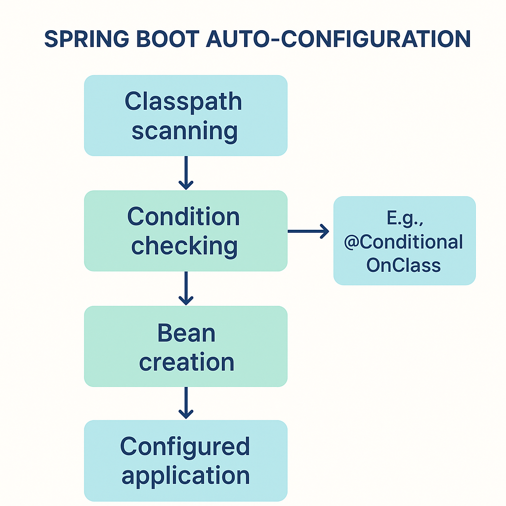

---

# ⚙️ **Spring Boot Auto-Configuration**

## 🧭 1. Introduction

**Auto-configuration** is one of the most powerful features of Spring Boot.
It **automatically configures beans and settings** in your application **based on the dependencies present on the classpath**.

This saves developers from writing repetitive configuration code — for example, when using databases, security, or web servers.

> 🧩 Example:
> If `HSQLDB` is on your classpath and you haven’t manually configured a data source,
> Spring Boot **auto-configures an in-memory HSQLDB** for you.

---

## 🌱 2. Enabling Auto-Configuration

To enable auto-configuration, add **one of the following annotations** to your main configuration class:

```java
@EnableAutoConfiguration
```

or more commonly:

```java
@SpringBootApplication
```

> ✅ **Best Practice:**
> Use only **one** `@SpringBootApplication` annotation in your project — usually on your main class.

---

### **Example: Default Auto-Configuration**

```java
package com.example.autoconfigdemo;

import org.springframework.boot.SpringApplication;
import org.springframework.boot.autoconfigure.SpringBootApplication;

@SpringBootApplication // Includes @EnableAutoConfiguration
public class AutoConfigDemoApplication {
    public static void main(String[] args) {
        SpringApplication.run(AutoConfigDemoApplication.class, args);
    }
}
```

When this runs, Spring Boot scans the classpath and automatically configures components like:

* `DispatcherServlet` (for web)
* `DataSource` (for DB)
* `Jackson` (for JSON)
* `Tomcat` (embedded server)

---

## 🧩 3. How Auto-Configuration Works

When Spring Boot starts:

1. It reads all entries from
   `META-INF/spring/org.springframework.boot.autoconfigure.AutoConfiguration.imports`
   — a file that lists all auto-configuration classes.
2. Each class is loaded **conditionally** based on:

    * What’s on the classpath (`@ConditionalOnClass`)
    * Whether certain beans exist or not (`@ConditionalOnBean`, `@ConditionalOnMissingBean`)
    * Application properties (`@ConditionalOnProperty`)
    * Environment (`@ConditionalOnWebApplication`)

If a condition fails, the corresponding auto-configuration is **skipped**.

---

### **Example: Understanding Auto-Configuration**

If you include this dependency:

```xml
<dependency>
    <groupId>org.springframework.boot</groupId>
    <artifactId>spring-boot-starter-data-jpa</artifactId>
</dependency>
```

Spring Boot will auto-configure:

* A **JPA EntityManagerFactory**
* A **DataSource**
* A **TransactionManager**

Unless you explicitly define them yourself — in which case, Boot backs off.

---

## 🧠 4. Gradually Replacing Auto-Configuration

Auto-configuration is **non-invasive**.

You can override it at any time:

```java
@Bean
public DataSource myCustomDataSource() {
    return new HikariDataSource();
}
```

When you define this bean, Spring Boot will **stop auto-configuring** the default DataSource.

---

## 🔍 5. Inspecting Auto-Configuration

You can check which auto-configurations are active by running your app with:

```
--debug
```

Example:

```
mvn spring-boot:run -Dspring-boot.run.arguments="--debug"
```

This prints a **Condition Evaluation Report** showing which configurations were applied and which were skipped.

---

## ❌ 6. Disabling Specific Auto-Configuration

You can exclude certain auto-configurations if they interfere with your setup.

### Example 1: Excluding via Annotation

```java
import org.springframework.boot.autoconfigure.SpringBootApplication;
import org.springframework.boot.autoconfigure.jdbc.DataSourceAutoConfiguration;

@SpringBootApplication(exclude = { DataSourceAutoConfiguration.class })
public class MyApp { }
```

### Example 2: Excluding via `application.properties`

```properties
spring.autoconfigure.exclude=org.springframework.boot.autoconfigure.jdbc.DataSourceAutoConfiguration
```

---

## 📦 7. Auto-Configuration Packages

When you annotate your main class with `@SpringBootApplication`,
Spring Boot automatically registers the **base package** for scanning components, entities, and repositories.

You can extend it with:

```java
@AutoConfigurationPackage
```

to include additional packages for scanning.

---

## 🏗️ 8. Creating a **Custom Auto-Configuration**

Let’s build a simple custom auto-configuration for a **MySQL database**.

---

### Step 1: Dependencies

```xml
<dependency>
    <groupId>org.springframework.boot</groupId>
    <artifactId>spring-boot-starter-data-jpa</artifactId>
</dependency>
<dependency>
    <groupId>com.mysql</groupId>
    <artifactId>mysql-connector-j</artifactId>
</dependency>
```

---

### Step 2: Create Configuration Class

```java
package com.example.autoconfigdemo.config;

import org.springframework.context.annotation.*;
import org.springframework.jdbc.datasource.DriverManagerDataSource;
import javax.sql.DataSource;

@Configuration
@ConditionalOnClass(DataSource.class) // Only load if DataSource is available
public class MySQLAutoConfiguration {

    @Bean
    @ConditionalOnMissingBean
    @ConditionalOnProperty(name = "usemysql", havingValue = "local", matchIfMissing = true)
    public DataSource dataSource() {
        DriverManagerDataSource ds = new DriverManagerDataSource();
        ds.setDriverClassName("com.mysql.cj.jdbc.Driver");
        ds.setUrl("jdbc:mysql://localhost:3306/myDb?createDatabaseIfNotExist=true");
        ds.setUsername("root");
        ds.setPassword("password");
        return ds;
    }
}
```

---

### Step 3: Register Auto-Configuration

Create file:

```
src/main/resources/META-INF/spring/org.springframework.boot.autoconfigure.AutoConfiguration.imports
```

Content:

```
com.example.autoconfigdemo.config.MySQLAutoConfiguration
```

This tells Spring Boot to load your class as part of auto-configuration.

---

### Step 4: Add Property

In `application.properties`:

```properties
usemysql=local
```

Now, your MySQL data source will **auto-configure** only when this property matches.

---

## ⚙️ 9. Using Conditional Annotations

| Annotation                     | Description                              |
| ------------------------------ | ---------------------------------------- |
| `@ConditionalOnClass`          | Load config if class exists on classpath |
| `@ConditionalOnMissingClass`   | Load config if class **not** present     |
| `@ConditionalOnBean`           | Load config if bean exists               |
| `@ConditionalOnMissingBean`    | Load config if bean **not** defined      |
| `@ConditionalOnProperty`       | Load config if specific property is set  |
| `@ConditionalOnResource`       | Load config if resource file exists      |
| `@ConditionalOnWebApplication` | Load config only in web apps             |

---

### **Example: Combining Conditions**

```java
@Bean
@ConditionalOnBean(name = "dataSource")
@ConditionalOnMissingBean
public LocalContainerEntityManagerFactoryBean entityManagerFactory(DataSource dataSource) {
    LocalContainerEntityManagerFactoryBean emf = new LocalContainerEntityManagerFactoryBean();
    emf.setDataSource(dataSource);
    emf.setPackagesToScan("com.example.entities");
    emf.setJpaVendorAdapter(new HibernateJpaVendorAdapter());
    return emf;
}
```

---

## 🧪 10. Testing Auto-Configuration

```java
@SpringBootApplication
public class AutoConfigApplication {
    public static void main(String[] args) {
        SpringApplication.run(AutoConfigApplication.class, args);
    }
}
```

### Test Class

```java
@SpringBootTest
public class AutoConfigurationTest {

    @Autowired
    private DataSource dataSource;

    @Test
    void testDataSourceAutoConfigured() {
        assertNotNull(dataSource);
        System.out.println("Auto-configured DataSource: " + dataSource);
    }
}
```

If no manual DataSource is defined, your custom MySQL auto-configuration will automatically provide one.

---

## 🚫 11. Disabling Custom Auto-Configuration

You can disable your custom configuration:

```java
@Configuration
@EnableAutoConfiguration(exclude = { MySQLAutoConfiguration.class })
public class AppConfig { }
```

Or using `application.properties`:

```properties
spring.autoconfigure.exclude=com.example.autoconfigdemo.config.MySQLAutoConfiguration
```

---

## 🧠 12. Key Takeaways

| Concept                       | Description                                               |
| ----------------------------- | --------------------------------------------------------- |
| **Auto-Configuration**        | Automatically configures beans based on classpath         |
| **@SpringBootApplication**    | Enables component scanning + auto-configuration           |
| **Conditional Annotations**   | Allow selective loading of beans/configurations           |
| **Custom Auto-Configuration** | Developers can extend Boot with custom conditions         |
| **Exclusion Options**         | Disable unwanted configurations by annotation or property |

---

## 💡 Summary

Spring Boot’s auto-configuration:

* Simplifies development by **reducing boilerplate configuration**
* Is **smart and conditional**, activating only when needed
* Can be **overridden** at any time
* Is **extendable**, allowing you to create your own auto-config logic

---

How **Spring Boot auto-configuration works** 
