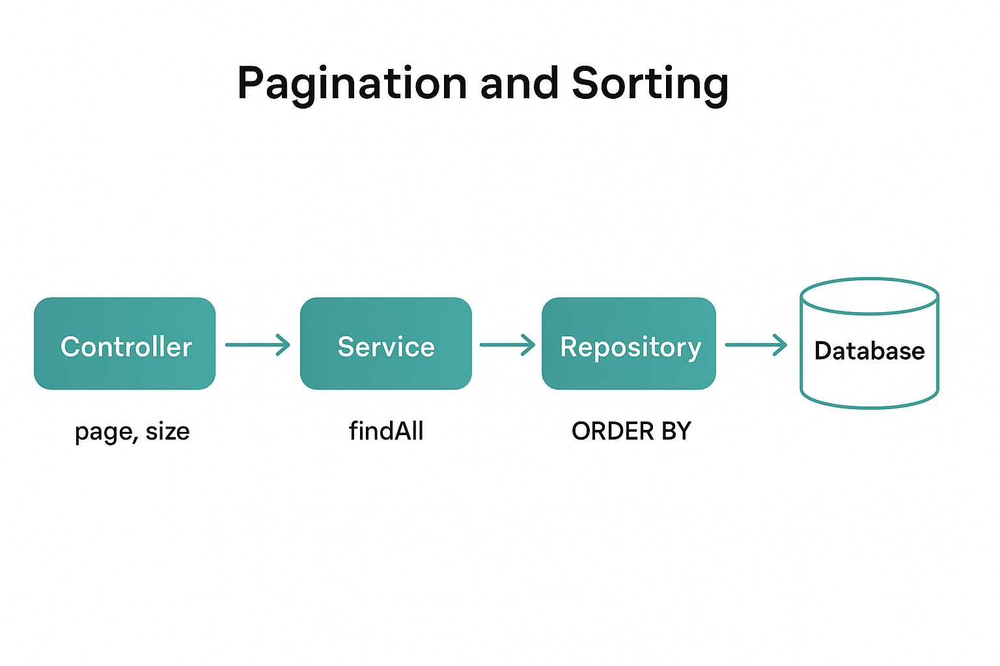

# 📘 Lesson Notes: Spring Data Pagination and Sorting

---

## 🎯 Learning Goals

By the end of this lesson, learners should be able to:

* Understand how **pagination** and **sorting** work in Spring Data JPA.
* Use the `Pageable`, `PageRequest`, `Sort`, and `Page<T>` classes effectively.
* Implement RESTful endpoints that return paginated and sorted results.
* Customize sorting behavior using `Sort` objects.

---

## 1. Overview

**Spring Data JPA**, through the `JpaRepository` interface, provides a built-in way to handle **pagination** and **sorting** without writing boilerplate SQL or custom logic. These features come from the `PagingAndSortingRepository` interface, which `JpaRepository` extends.

### 🔹 Core Components

| Component       | Description                                                                                               |
| --------------- | --------------------------------------------------------------------------------------------------------- |
| **Pageable**    | Interface that carries pagination information like page number, size, and sorting.                        |
| **PageRequest** | A concrete implementation of `Pageable` used to create pagination requests.                               |
| **Sort**        | Represents sorting criteria such as properties and direction (`ASC` or `DESC`).                           |
| **Page<T>**     | Represents a paginated response containing a list of entities and metadata (total pages, elements, etc.). |

---

## 2. Implementation Steps

### Step 1: Define the Entity and Repository

Let’s start with a simple entity and a repository that extends `JpaRepository`.

**Book.java**

```java
import jakarta.persistence.*;

@Entity
public class Book {
    @Id
    @GeneratedValue(strategy = GenerationType.IDENTITY)
    private Long id;
    private String title;
    private String author;

    // Getters and Setters
    public Long getId() { return id; }
    public void setId(Long id) { this.id = id; }
    public String getTitle() { return title; }
    public void setTitle(String title) { this.title = title; }
    public String getAuthor() { return author; }
    public void setAuthor(String author) { this.author = author; }
}
```

**BookRepository.java**

```java
import org.springframework.data.jpa.repository.JpaRepository;
import org.springframework.stereotype.Repository;
import java.util.*;
import org.springframework.data.domain.*;

@Repository
public interface BookRepository extends JpaRepository<Book, Long> {
    Page<Book> findByTitleContaining(String title, Pageable pageable);
}
```

---

### Step 2: Create the Service Layer

It’s best practice to handle business logic in a service class.

**BookService.java**

```java
import org.springframework.beans.factory.annotation.Autowired;
import org.springframework.data.domain.Page;
import org.springframework.data.domain.Pageable;
import org.springframework.stereotype.Service;

@Service
public class BookService {

    @Autowired
    private BookRepository bookRepository;

    // Get all books with pagination and sorting
    public Page<Book> getAllBooks(Pageable pageable) {
        return bookRepository.findAll(pageable);
    }

    // Custom search method using pagination
    public Page<Book> findByTitleContaining(String title, Pageable pageable) {
        return bookRepository.findByTitleContaining(title, pageable);
    }
}
```

---

### Step 3: Create the Controller

Expose the functionality as a REST endpoint. Spring Boot automatically maps query parameters to `Pageable`.

**BookController.java**

```java
import org.springframework.beans.factory.annotation.Autowired;
import org.springframework.data.domain.Page;
import org.springframework.data.domain.Pageable;
import org.springframework.web.bind.annotation.*;

@RestController
@RequestMapping("/api/books")
public class BookController {

    @Autowired
    private BookService bookService;

    @GetMapping
    public Page<Book> getBooks(Pageable pageable) {
        return bookService.getAllBooks(pageable);
    }
}
```

---

## 3. Making Requests

You can make HTTP GET requests with pagination and sorting parameters.

| Use Case                                   | Example Request                                  |
| ------------------------------------------ | ------------------------------------------------ |
| Default page (first page, default size 20) | `GET /api/books`                                 |
| Second page (index 1) with size 5          | `GET /api/books?page=1&size=5`                   |
| Sort by title ascending                    | `GET /api/books?sort=title`                      |
| Sort by title descending                   | `GET /api/books?sort=title,desc`                 |
| Sort by multiple properties                | `GET /api/books?sort=author,asc&sort=title,desc` |
| Combine pagination & sorting               | `GET /api/books?page=2&size=10&sort=title,desc`  |

The endpoint will return a **Page** object, containing both the current page’s data and metadata:

* Total elements
* Total pages
* Current page number
* Page size

---

## 4. Using `Sort` Explicitly

If you need more fine-grained control over sorting, use the `Sort` class manually.

**Example:**

```java
import org.springframework.data.domain.Page;
import org.springframework.data.domain.PageRequest;
import org.springframework.data.domain.Sort;

// Define sorting criteria
Sort sort = Sort.by(
    Sort.Order.asc("author"),
    Sort.Order.desc("title")
);

// Create Pageable with sort
Pageable pageable = PageRequest.of(0, 10, sort);

// Fetch sorted and paginated data
Page<Book> books = bookRepository.findAll(pageable);
```

---

## 5. Understanding the Page Object

The `Page<T>` object returned by Spring Data JPA provides both the **data** and **metadata**:

| Method                        | Description                                       |
| ----------------------------- | ------------------------------------------------- |
| `getContent()`                | Returns the list of entities for the current page |
| `getTotalElements()`          | Total number of records in the database           |
| `getTotalPages()`             | Total number of pages available                   |
| `getNumber()`                 | Current page number                               |
| `getSize()`                   | Page size                                         |
| `hasNext()` / `hasPrevious()` | Boolean flags for navigation                      |

Example:

```java
Page<Book> books = bookService.getAllBooks(PageRequest.of(0, 5));
System.out.println("Total pages: " + books.getTotalPages());
System.out.println("Books on this page: " + books.getContent());
```

---

## 6. Summary

| Concept         | Description                                  |
| --------------- | -------------------------------------------- |
| `Pageable`      | Describes pagination and sorting information |
| `PageRequest`   | Concrete implementation of `Pageable`        |
| `Sort`          | Defines sorting logic and order              |
| `Page<T>`       | Paginated response wrapper                   |
| `JpaRepository` | Extends CRUD and Paging capabilities         |


✅ **Teaching Tip:** Have learners create a REST endpoint for paginated and sorted data retrieval using their own entity, such as `Student` or `Employee`. Then, challenge them to implement multi-field sorting and explore different `Sort.Order` configurations.
