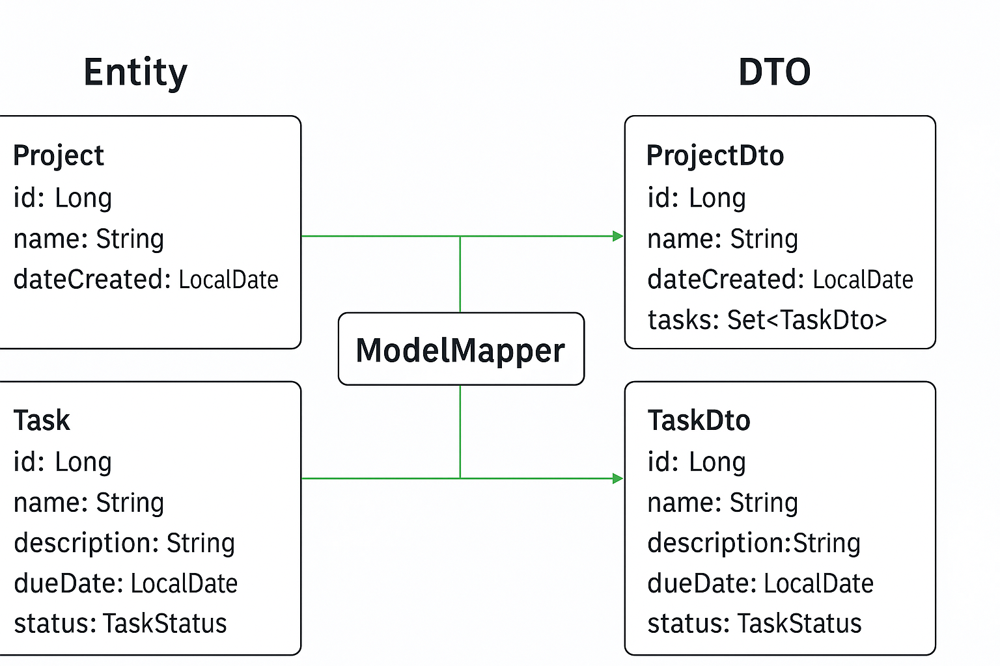

Here’s a **beginner-friendly, detailed lesson note on ModelMapper**, tailored for your `Project` and `Task` entities and their corresponding DTOs (as Records). I’ve structured it to help you understand the purpose, setup, and practical usage with examples.

---

# **Lesson Notes: ModelMapper in Spring Boot**

## **1. What is ModelMapper?**

* **ModelMapper** is a Java library used for **mapping between objects**.
* Its main use in Spring Boot projects is **converting between Entities and DTOs**.
* **Why use it?**

    1. Simplifies conversion code – no manual copying of fields.
    2. Intelligent – it automatically detects matching fields.
    3. Refactoring-safe – uses actual properties, not strings.
    4. Extensible – works with nested objects, collections, etc.

---

## **2. DTOs vs Entities**

* **Entity**: Represents the database model (`Project`, `Task`), usually contains all fields and persistence annotations.
* **DTO**: Represents what is exposed to the client. Only contains necessary fields.

**Example DTOs using Java Records:**

```java
// ProjectDTO.java
public record ProjectDto(
    Long id,
    String name,
    LocalDate dateCreated,
    Set<TaskDto> tasks
) {}
```

```java
// TaskDTO.java
public record TaskDto(
    Long id,
    String name,
    String description,
    LocalDate dueDate,
    TaskStatus status
) {}
```

---

## **3. Setting up ModelMapper**

1. **Add dependency in `pom.xml`:**

```xml
<dependency>
    <groupId>org.modelmapper</groupId>
    <artifactId>modelmapper</artifactId>
    <version>3.2.4</version>
</dependency>
```

2. **Define a ModelMapper bean in Spring configuration:**

```java
@Configuration
public class AppConfig {

    @Bean
    public ModelMapper modelMapper() {
        return new ModelMapper();
    }
}
```

3. **Inject ModelMapper in your service/controller:**

```java
@Autowired
private ModelMapper modelMapper;
```

---

## **4. Converting Entities to DTOs**

**Manual conversion is possible, but ModelMapper makes it automatic:**

```java
// Example in ProjectService or Controller
ProjectDto convertToDto(Project project) {
    return modelMapper.map(project, ProjectDto.class);
}

TaskDto convertTaskToDto(Task task) {
    return modelMapper.map(task, TaskDto.class);
}
```

**Example usage in Controller:**

```java
@GetMapping("/projects/{id}")
public ProjectDto getProject(@PathVariable Long id) {
    Project project = projectService.findById(id)
        .orElseThrow(() -> new ResponseStatusException(HttpStatus.NOT_FOUND));
    return convertToDto(project); // ModelMapper handles conversion
}
```

---

## **5. Converting DTOs to Entities**

```java
Project convertToEntity(ProjectDto projectDto) {
    return modelMapper.map(projectDto, Project.class);
}

Task convertTaskToEntity(TaskDto taskDto) {
    return modelMapper.map(taskDto, Task.class);
}
```

**Example in POST endpoint:**

```java
@PostMapping("/projects")
public ProjectDto createProject(@RequestBody ProjectDto projectDto) {
    Project project = convertToEntity(projectDto);
    projectService.save(project);
    return convertToDto(project);
}
```

---

## **6. Handling Nested Objects (Tasks in Project)**

ModelMapper automatically maps collections and nested objects **if field names match**.

```java
ProjectDto projectDto = modelMapper.map(project, ProjectDto.class);
// 'tasks' in Project entity maps automatically to 'tasks' in ProjectDto
```

**If field names differ**, you can customize mapping:

```java
modelMapper.typeMap(Project.class, ProjectDto.class).addMappings(mapper -> {
    mapper.map(Project::getTasks, ProjectDto::tasks);
});
```

---

## **7. Custom Conversion (e.g., Date Formatting)**

If you need to format fields differently (like date strings), you can add a **custom mapping**:

```java
modelMapper.typeMap(Task.class, TaskDto.class).addMappings(mapper -> {
    mapper.map(src -> src.getDueDate(), TaskDto::dueDate);
});
```

---

## **8. Benefits of Using ModelMapper**

1. **Reduces Boilerplate** – no repetitive field assignments.
2. **Handles nested objects & collections** – e.g., `Set<Task>` inside `Project`.
3. **Refactoring-safe** – if you rename fields, ModelMapper updates automatically.
4. **Easy testing** – simpler unit tests for DTO conversion.

---

## **9. Example: Full Controller Using ModelMapper**

```java
@RestController
@RequestMapping("/projects")
public class ProjectController {

    @Autowired
    private ProjectService projectService;

    @Autowired
    private ModelMapper modelMapper;

    @GetMapping("/{id}")
    public ProjectDto getProject(@PathVariable Long id) {
        Project project = projectService.findById(id)
            .orElseThrow(() -> new ResponseStatusException(HttpStatus.NOT_FOUND));
        return modelMapper.map(project, ProjectDto.class);
    }

    @PostMapping
    public ProjectDto createProject(@RequestBody ProjectDto projectDto) {
        Project project = modelMapper.map(projectDto, Project.class);
        projectService.save(project);
        return modelMapper.map(project, ProjectDto.class);
    }

    @PutMapping("/{id}")
    public ProjectDto updateProject(@PathVariable Long id, @RequestBody ProjectDto projectDto) {
        Project project = modelMapper.map(projectDto, Project.class);
        project.setId(id);
        projectService.save(project);
        return modelMapper.map(project, ProjectDto.class);
    }
}
```

---

## **10. Tips for Beginners**

* Always map **Entities ↔ DTOs at the controller level**.
* Use **Records for DTOs** for immutable, simple data carriers.
* Keep **Entity fields private** and expose only through DTOs.
* Use ModelMapper for **nested collections** like `Set<Task>` inside `Project`.
* Use **custom mappings** if field names or types differ.

---

This approach makes your code:

* Cleaner
* Safer (no sensitive data exposed)
* Easier to maintain and refactor

---

