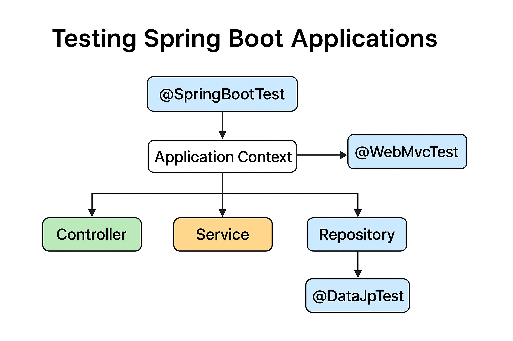

---

# **Lesson Notes: Testing Spring Boot Applications**

## **1. Lesson Overview**

Testing is an essential part of software development that ensures an application functions correctly and maintains reliability through changes. Spring Boot provides powerful built-in support for writing both **unit** and **integration tests**. This lesson introduces the testing ecosystem within Spring Boot, emphasizing how to configure, structure, and execute different kinds of tests using the **@SpringBootTest** and other specialized annotations.

Spring Boot builds on the standard **Spring Testing Framework**, enhancing it with additional features such as automatic configuration, embedded servers for web tests, and an extensive collection of test utilities.

---

## **2. Learning Objectives**

By the end of this lesson, learners should be able to:

1. Explain the importance of testing in Spring Boot applications.
2. Identify the dependencies required to enable testing support in Spring Boot.
3. Distinguish between unit testing and integration testing.
4. Use the **@SpringBootTest** annotation to load the application context.
5. Configure different testing environments using the `webEnvironment` attribute.
6. Write tests using **JUnit 5** and **Mockito**.
7. Apply specialized annotations such as **@WebMvcTest**, **@DataJpaTest**, and **@MockBean** to test specific application layers.
8. Understand the role of auto-configured tests in Spring Boot.

---

## **3. Concepts of Testing in Spring Boot**

### **3.1. Unit Testing**

* **Purpose:** To verify that individual components (classes, methods, or services) function correctly in isolation.
* **Characteristics:**

    * Fast execution
    * Uses mocks for dependencies
    * Focused on logic correctness

### **3.2. Integration Testing**

* **Purpose:** To test how different layers of the application interact — for example, Controller → Service → Repository.
* **Characteristics:**

    * Uses the real Spring context
    * Can involve real or in-memory databases (e.g., **H2**)
    * Ensures that configurations and bean wiring are correct

---

## **4. Dependencies**

To enable testing in Spring Boot, include the following dependencies in the **pom.xml** file:

```xml
<dependency>
    <groupId>org.springframework.boot</groupId>
    <artifactId>spring-boot-starter-test</artifactId>
    <scope>test</scope>
</dependency>

<dependency>
    <groupId>com.h2database</groupId>
    <artifactId>h2</artifactId>
    <scope>test</scope>
</dependency>
```

The `spring-boot-starter-test` dependency brings in essential testing libraries such as:

* **JUnit 5** – testing framework
* **Mockito** – mocking framework
* **AssertJ** and **Hamcrest** – assertion libraries
* **JSONassert** and **Spring Test** – for JSON and integration tests

---

## **5. The @SpringBootTest Annotation**

### **5.1. Purpose**

`@SpringBootTest` is the primary annotation for integration testing in Spring Boot. It loads the complete **application context**, allowing tests to run with full dependency injection, similar to the actual runtime environment.

### **5.2. Syntax Example**

```java
@SpringBootTest
class ProjectRepositoryIntegrationTest {

    @Autowired
    private ProjectRepository projectRepository;

    @Test
    void givenNewProject_whenSaved_thenSuccess() {
        Project newProject = new Project("AI Research", LocalDate.now());
        assertNotNull(projectRepository.save(newProject));
    }
}
```

### **5.3. Automatic Configuration**

Unlike older annotations such as `@SpringJUnitConfig`, `@SpringBootTest` automatically discovers the application’s configuration class annotated with `@SpringBootApplication` or `@SpringBootConfiguration`.

---

## **6. The webEnvironment Attribute**

`@SpringBootTest` allows developers to define how much of the web layer to load through the **webEnvironment** attribute.

```java
@SpringBootTest(webEnvironment = WebEnvironment.MOCK)
```

### **Available Options**

| Option           | Description                                                            |
| ---------------- | ---------------------------------------------------------------------- |
| `MOCK` (default) | Loads a mock servlet environment for quick tests.                      |
| `RANDOM_PORT`    | Starts a real web server on a random port.                             |
| `DEFINED_PORT`   | Starts a real web server on the default (8080) or defined port.        |
| `NONE`           | Disables the web environment, useful for persistence or service tests. |

### **Example**

```java
@SpringBootTest(webEnvironment = SpringBootTest.WebEnvironment.RANDOM_PORT)
class ProjectControllerIntegrationTest {

    @LocalServerPort
    private int port;

    @Test
    void whenServerStarts_thenPortAssigned() {
        assertTrue(port > 0);
    }
}
```

---

## **7. Testing the Web Layer with @WebMvcTest**

When testing only the **Controller** layer, a full application context is unnecessary.
`@WebMvcTest` loads only the web layer and automatically configures the **MockMvc** object for testing HTTP requests.

```java
@WebMvcTest(ProjectController.class)
class ProjectControllerTest {

    @Autowired
    private MockMvc mockMvc;

    @MockBean
    private ProjectService projectService;

    @Test
    void whenGetProjectById_thenReturnsJson() throws Exception {
        Project project = new Project("AI Research", LocalDate.now());
        Mockito.when(projectService.getProjectById(1L)).thenReturn(project);

        mockMvc.perform(get("/projects/1"))
               .andExpect(status().isOk())
               .andExpect(jsonPath("$.name").value("AI Research"));
    }
}
```

---

## **8. Testing the Persistence Layer with @DataJpaTest**

`@DataJpaTest` is used to test **repositories** and JPA operations. It configures an **H2 in-memory database**, **Hibernate**, and **Spring Data JPA** automatically.

```java
@DataJpaTest
class EmployeeRepositoryIntegrationTest {

    @Autowired
    private TestEntityManager entityManager;

    @Autowired
    private EmployeeRepository repository;

    @Test
    void whenFindByName_thenReturnEmployee() {
        Employee alex = new Employee("Alex");
        entityManager.persist(alex);
        entityManager.flush();

        Employee found = repository.findByName("Alex");
        assertThat(found.getName()).isEqualTo("Alex");
    }
}
```

---

## **9. Using @MockBean for Unit Tests**

When testing the **Service** layer independently from the database, dependencies can be mocked using **@MockBean**.

```java
@SpringBootTest
class EmployeeServiceTest {

    @MockBean
    private EmployeeRepository repository;

    @Autowired
    private EmployeeService service;

    @BeforeEach
    void setup() {
        Employee alex = new Employee("Alex");
        Mockito.when(repository.findByName("Alex")).thenReturn(alex);
    }

    @Test
    void whenValidName_thenEmployeeFound() {
        Employee found = service.getEmployeeByName("Alex");
        assertEquals("Alex", found.getName());
    }
}
```

---

## **10. Test Configuration with @TestConfiguration**

When special beans are required only for testing, we can use **@TestConfiguration** to define them without affecting the main application configuration.

```java
@TestConfiguration
static class TestConfig {
    @Bean
    public EmployeeService employeeService() {
        return new EmployeeServiceImpl();
    }
}
```

This configuration can be imported into a test class using `@Import(TestConfig.class)`.

---

## **11. Auto-Configured Test Annotations**

Spring Boot provides specialized annotations to automatically configure tests for specific technologies:

| Annotation        | Purpose                                         |
| ----------------- | ----------------------------------------------- |
| `@DataJpaTest`    | For testing JPA repositories.                   |
| `@WebMvcTest`     | For testing web controllers.                    |
| `@JdbcTest`       | For testing JDBC components.                    |
| `@JsonTest`       | For testing JSON serialization/deserialization. |
| `@RestClientTest` | For testing REST clients.                       |
| `@DataMongoTest`  | For MongoDB tests.                              |

These annotations allow developers to test particular layers without bootstrapping the entire application, improving performance and focus.

---

## **12. Advantages of Spring Boot Testing**

* Automatic configuration of the test environment
* Integration with JUnit 5 and Mockito
* In-memory database support for persistence testing
* Clear separation between unit and integration testing
* Reduced boilerplate through annotations

---

## **13. Common Pitfalls**

* Using `@SpringBootTest` unnecessarily for unit tests can slow execution.
* Misconfigured profiles can lead to test failures.
* Not resetting mocked data between tests may cause inconsistent results.

---

## **14. Summary**

Spring Boot’s testing framework simplifies the process of verifying application functionality.
By combining **JUnit 5**, **Mockito**, and **Spring Boot test annotations**, developers can perform comprehensive tests across all layers — from controllers to repositories.

The key to effective testing lies in choosing the right annotation and configuration for the scope of the test, thereby balancing accuracy with performance.

---

## **15. Exercises**

1. Create a simple Spring Boot application with a Controller, Service, and Repository.
2. Write a **@DataJpaTest** for your Repository to verify that entities are persisted correctly.
3. Create a **@WebMvcTest** for your Controller and use **MockMvc** to simulate HTTP requests.
4. Write a **@SpringBootTest** that performs an end-to-end test of your API using an in-memory H2 database.
5. Refactor your test to use **@MockBean** for dependencies to see the difference in execution time.

---
## **How Spring Boot loads test contexts across the Controller, Service, and Repository layers**
