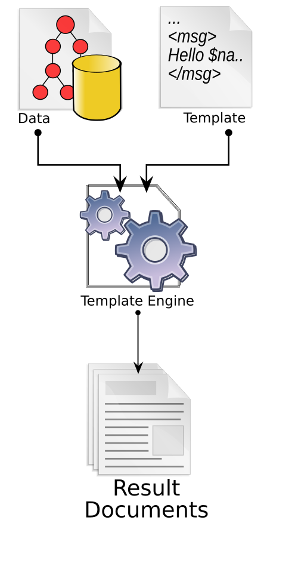
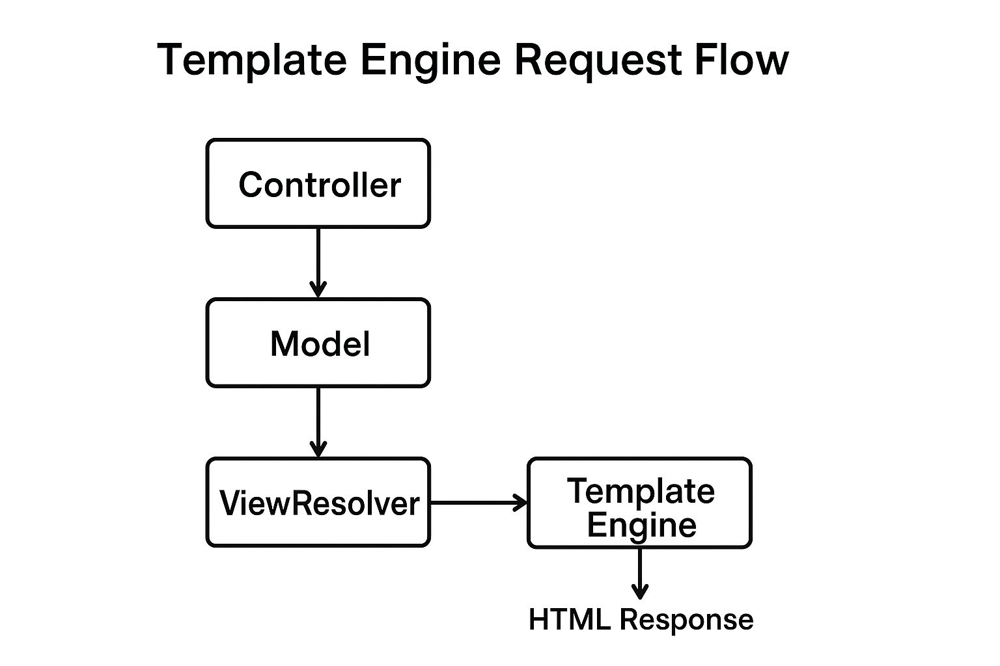

---

## 🧩 LESSON NOTES: Template Engines and Template Processors in Java (Spring Framework)

### **1. Introduction**

A **template engine** (or **template processor**) is a software component designed to combine templates with data (defined by a data model) to generate dynamic content such as web pages, documents, or code.
In the context of **web development**, template engines are crucial in the **MVC (Model-View-Controller)** architecture, separating presentation (View) from business logic (Model and Controller).

📘 **Definition:**
A **template engine** is software that merges a static template (HTML or text with placeholders) with dynamic data to produce a final document or webpage.

---

### **2. Core Concepts of Template Processing Systems**

Every template engine consists of the following **four system elements**:

| Element                         | Description                                                                            |
| ------------------------------- | -------------------------------------------------------------------------------------- |
| **Data Model**                  | Represents the source data (from a database, file, or API) used to populate templates. |
| **Source Template**             | Defines the layout or structure using placeholders and expressions.                    |
| **Template Engine (Processor)** | The component that reads templates, injects data, and generates final output.          |
| **Result Document**             | The rendered output (e.g., HTML webpage, report, or generated source code).            |

#### 🔄 **Basic Flow of Template Processing**

```
Data Model → Template Engine → Template File → Rendered Output
```

🧠 **Diagram Suggestion:**
Create a labeled diagram showing:

```
[Data Model] → [Template Engine] → [Template File] → [Rendered Document]
```

---

### **3. Features of Template Engines**

Most template engines include programming constructs such as:

* Variables and expressions
* Conditional logic (`if`, `else`)
* Loops (`for`, `each`)
* Functions or macros
* File inclusion (`include`, `import`)

These allow the generation of dynamic, reusable, and maintainable UI layers.

---

### **4. Template Engines in Spring Framework**

Spring MVC allows integration with multiple **view technologies**, including:

* **JSP (Java Server Pages)**
* **Thymeleaf**
* **FreeMarker**
* **Groovy Templates**
* **Jade4j**
* **JTE (Java Template Engine)**

---

## ⚙️ 5. Template Engine Implementations with Examples

---

### **5.1 Java Server Pages (JSP)**

JSP is the oldest and most common view technology supported natively by Spring MVC.

#### **Configuration Example:**

```java
@EnableWebMvc
@Configuration
public class AppConfig implements WebMvcConfigurer {
    @Bean
    public ViewResolver jspViewResolver() {
        InternalResourceViewResolver resolver = new InternalResourceViewResolver();
        resolver.setPrefix("/WEB-INF/views/");
        resolver.setSuffix(".jsp");
        return resolver;
    }
}
```

#### **JSP Template Example:**

```jsp
<html>
  <body>
    <form:form method="POST" modelAttribute="user">
        <form:label path="email">Email:</form:label>
        <form:input path="email"/>
        <form:label path="password">Password:</form:label>
        <form:input path="password" type="password"/>
        <input type="submit" value="Register"/>
    </form:form>
  </body>
</html>
```

---

### **5.2 Thymeleaf**

Thymeleaf is a **modern, HTML5-based template engine** that allows templates to be viewed as normal HTML files.

#### **Dependencies:**

```xml
<dependency>
    <groupId>org.thymeleaf</groupId>
    <artifactId>thymeleaf-spring5</artifactId>
    <version>3.1.2.RELEASE</version>
</dependency>
```

#### **Spring Configuration:**

```java
@Configuration
public class ThymeleafConfig {
    @Bean
    public SpringResourceTemplateResolver templateResolver() {
        SpringResourceTemplateResolver resolver = new SpringResourceTemplateResolver();
        resolver.setPrefix("/WEB-INF/views/");
        resolver.setSuffix(".html");
        resolver.setTemplateMode("HTML");
        return resolver;
    }

    @Bean
    public SpringTemplateEngine templateEngine() {
        SpringTemplateEngine engine = new SpringTemplateEngine();
        engine.setTemplateResolver(templateResolver());
        return engine;
    }
}
```

#### **HTML Template Example:**

```html
<form th:action="@{/register}" th:object="${user}" method="post">
    <label>Email:</label>
    <input type="text" th:field="*{email}"/>
    <label>Password:</label>
    <input type="password" th:field="*{password}"/>
    <input type="submit" value="Submit"/>
</form>
```

---

### **5.3 FreeMarker**

FreeMarker is a **powerful text-generating engine** maintained by Apache, often used for generating web pages or configuration files.

#### **Configuration Example:**

```java
@Configuration
@EnableWebMvc
public class FreemarkerConfig {
    @Bean
    public FreeMarkerConfigurer freemarkerConfigurer() {
        FreeMarkerConfigurer configurer = new FreeMarkerConfigurer();
        configurer.setTemplateLoaderPath("/WEB-INF/views/");
        return configurer;
    }

    @Bean
    public FreeMarkerViewResolver viewResolver() {
        FreeMarkerViewResolver resolver = new FreeMarkerViewResolver();
        resolver.setSuffix(".ftl");
        return resolver;
    }
}
```

#### **FreeMarker Template (.ftl):**

```ftl
<html>
  <body>
    <form action="register" method="post">
        Email: <input type="text" name="email" value="${user.email}">
        Password: <input type="password" name="password" value="${user.password}">
        <input type="submit" value="Submit">
    </form>
  </body>
</html>
```

---

### **5.4 Groovy Template Engine**

Groovy templates use a **builder-like syntax** to define dynamic markup.

#### **Configuration Example:**

```java
@Configuration
public class GroovyConfig {
    @Bean
    public GroovyMarkupConfigurer configurer() {
        GroovyMarkupConfigurer config = new GroovyMarkupConfigurer();
        config.setResourceLoaderPath("/WEB-INF/views/");
        return config;
    }

    @Bean
    public GroovyMarkupViewResolver viewResolver() {
        GroovyMarkupViewResolver resolver = new GroovyMarkupViewResolver();
        resolver.setSuffix(".tpl");
        return resolver;
    }
}
```

#### **Groovy Template Example:**

```groovy
html {
  head {
    title('User Registration')
  }
  body {
    form(action:'register', method:'post') {
      label(for:'email', 'Email')
      input(name:'email', type:'text', value:user.email)
      label(for:'password', 'Password')
      input(name:'password', type:'password')
      input(type:'submit', value:'Submit')
    }
  }
}
```

---

### **5.5 Jade4j**

Jade4j is a Java implementation of the Pug (Jade) templating syntax.

#### **Template Example (.jade):**

```jade
doctype html
html
  head
    title User Registration
  body
    form(action="register", method="post")
      label(for="email") Email:
      input(type="text", name="email")
      label(for="password") Password:
      input(type="password", name="password")
      input(type="submit", value="Submit")
```

---

### **5.6 Java Template Engine (JTE)**

JTE is a **modern, lightweight** Java/Kotlin template engine that compiles templates into Java bytecode.

#### **Configuration Example:**

```java
@Configuration
@EnableWebMvc
public class JteConfig {
    @Bean
    TemplateEngine templateEngine(ServletContext context) {
        String root = context.getRealPath("/WEB-INF/views/");
        DirectoryCodeResolver resolver = new DirectoryCodeResolver(Path.of(root));
        return TemplateEngine.create(resolver, Path.of("/WEB-INF/classes/"), ContentType.Html);
    }
}
```

#### **Template Example (.jte):**

```jte
@param User user
<html>
  <body>
    <form action="/register" method="post">
      Name: <input type="text" name="name" value="${user.name}">
      Password: <input type="password" name="password">
      <input type="submit" value="Submit">
    </form>
  </body>
</html>
```

---

## 🧩 6. Benefits of Using Template Engines

1. **Separation of Concerns** – Encourages MVC structure.
2. **Improved Maintainability** – HTML and logic are decoupled.
3. **Reusable Layouts** – Supports fragments and template inheritance.
4. **Enhanced Collaboration** – Designers and developers can work independently.
5. **Faster Development** – Auto-updating templates in development mode.

---

## 🧠 7. Conclusion

Template engines are central to **web development frameworks like Spring MVC**, as they transform static layouts into dynamic, data-driven user interfaces.
Whether using **JSP**, **Thymeleaf**, **FreeMarker**, or **JTE**, the principles remain consistent — **inject data into templates to render complete, dynamic documents**.

---

**Spring Template Engine Request Flow** 

